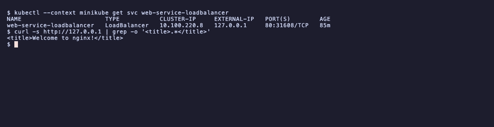
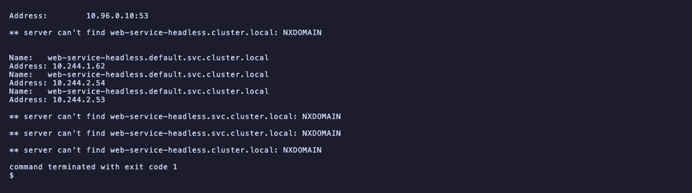
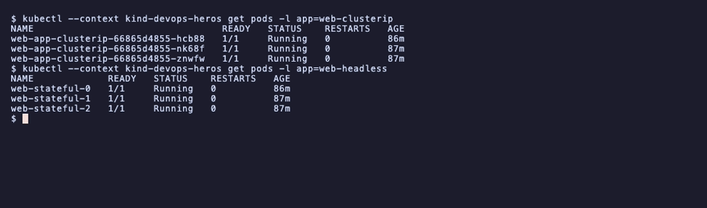

# Session 11: Kubernetes Networking and Services

- Name: Aditya Singhi
- Enrollment number: 24BCS10177

Two clusters were used on purpose. Tasks 2, 5, 6, 7, 8 and 9 run on a 3 node kind
cluster (Kubernetes v1.37.0), because two workers are needed to show traffic
crossing nodes. Tasks 3, 4 and 12 run on minikube with the Docker driver, because
those tasks are about minikube's own port behaviour and `minikube tunnel`.

The manifests are the ones already in `session-11-kubernetes-services/`. Output
blocks are copied from the terminal.

## Task 1: the four ports

```
Client ──► nodePort 30080          opened on every node's IP
              │
              ▼
           port 80                 the Service's own port on its cluster IP
              │
              ▼
           targetPort 80           where the Service sends traffic on the pod
              │
              ▼
           containerPort 80        the port the process listens on
```

| Field | Declared on | Scope | Real effect |
|---|---|---|---|
| `containerPort` | Pod spec | Inside the pod | None. Documentation only. Nothing binds because of it. |
| `targetPort` | Service spec | Pod network | Where traffic actually lands. Must match the listening port. |
| `port` | Service spec | Cluster IP | What in-cluster callers connect to. |
| `nodePort` | Service spec | Every node's IP | 30000 to 32767. NodePort and LoadBalancer only. |

```bash
kubectl explain service.spec.ports.targetPort | head -6
```

```
KIND:       Service
VERSION:    v1

FIELD: targetPort <IntOrString>
```

`IntOrString` is why `targetPort` can be a port name instead of a number, which
is the one good reason to declare `containerPort` with a `name`.

The trap is that `containerPort` does nothing. Delete it and traffic still flows,
because `targetPort` alone decides the destination. Get `targetPort` wrong and
the Service has healthy endpoints that refuse connections, which looks like a
network fault and is not.

## Task 2: ClusterIP

```bash
kubectl apply -f 01-clusterip/app-deployment.yaml -f 01-clusterip/service.yaml
kubectl get svc,endpointslices -l kubernetes.io/service-name=web-clusterip
```

To make load balancing visible I needed each pod to answer differently, so the
supporting deployment writes its own pod name into `index.html` at startup.
Without that every reply is identical and you cannot tell whether traffic spread
at all.

Six requests through the Service name alone:

```
served by web-856b7c7479-kkb6j
served by web-856b7c7479-dvdbz
served by web-856b7c7479-dvdbz
served by web-856b7c7479-7n4mv
served by web-856b7c7479-7n4mv
served by web-856b7c7479-7n4mv
```

All three pods answered, so the Service is spreading traffic. It is not round
robin: kkb6j got one and 7n4mv got three. kube-proxy in iptables mode picks a
backend at random per connection, so an even split only appears over many
requests. Task 12 of session 10 measured the same effect on a canary split.

### How the Service finds the pods

```bash
kubectl get endpointslices -l kubernetes.io/service-name=web-clusterip \
  -o custom-columns='NAME:.metadata.name,ENDPOINTS:.endpoints[*].addresses,PORTS:.ports[*].port'
```

```
NAME                  ENDPOINTS                                   PORTS
web-clusterip-2xqcr   [10.244.2.12],[10.244.1.15],[10.244.1.14]   80
```

The Service holds a label selector, not a pod list. The endpoint controller
watches pods, matches the selector, and keeps this address list in step. The
cluster IP itself is not a listener anywhere, it only exists as packet rules that
kube-proxy programs on every node.

## Task 3: NodePort

Run on minikube, node port pinned to 30080.

```bash
kubectl apply -f 02-nodeport/app-deployment.yaml -f 02-nodeport/service.yaml
kubectl get svc web-service-nodeport
```

```
NAME                   TYPE       CLUSTER-IP       EXTERNAL-IP   PORT(S)        AGE
web-service-nodeport   NodePort   10.100.230.224   <none>        80:30080/TCP   19s
```

`80:30080/TCP` is the whole story of the type: port 80 on the cluster IP, port
30080 on every node.

On the kind cluster, where `kind-cluster.yaml` maps host port 30080 through, it
answers straight from the Mac:

```bash
curl -s http://localhost:30080
curl -s http://localhost:30080
```

```
served by web-856b7c7479-dvdbz
served by web-856b7c7479-7n4mv
```

Two different pods, and the second was on the other worker. The port is open on
every node whether or not that node runs a pod, and kube-proxy forwards across
nodes when needed.

On minikube the same thing fails, which is Task 12.

## Task 4: LoadBalancer

```bash
kubectl apply -f 03-loadbalancer/app-deployment.yaml -f 03-loadbalancer/service.yaml
kubectl get svc web-service-loadbalancer
```

Before the tunnel:

```
NAME                       TYPE           CLUSTER-IP     EXTERNAL-IP   PORT(S)        AGE
web-service-loadbalancer   LoadBalancer   10.100.220.8   <pending>     80:31608/TCP   19s
```

`<pending>` is not a bug. A LoadBalancer Service asks the cloud provider's
controller for an external IP, and a local cluster has no such controller. On EKS
or GKE this fills in within a minute or two. It stays pending forever otherwise.

`minikube tunnel` plays that missing controller. It needs sudo, because it binds
privileged port 80 on the host:

```bash
minikube tunnel      # in a second terminal, must stay open
```

```
Tunnel successfully started
The service/ingress web-service-loadbalancer requires privileged ports to be exposed: [80]
sudo permission will be asked for it.
Starting tunnel for service web-service-loadbalancer.
```

After it starts:

```
NAME                       TYPE           CLUSTER-IP     EXTERNAL-IP   PORT(S)        AGE
web-service-loadbalancer   LoadBalancer   10.100.220.8   127.0.0.1     80:31608/TCP   78m
```

```bash
curl -s http://127.0.0.1 | grep -o '<title>.*</title>'
```

```
HTTP 200
<title>Welcome to nginx!</title>
```



Port 80, no high port. That is the difference a LoadBalancer buys.

### It builds on the other two types

```bash
kubectl get svc web-service-loadbalancer -o jsonpath='{.spec.clusterIP} {.spec.ports[0].nodePort} {.status.loadBalancer.ingress[0].ip}'
```

```
clusterIP=10.100.220.8
nodePort=31608
externalIP=127.0.0.1
```

Three layers from one manifest. Kubernetes allocated a cluster IP, then a node
port on top of it, then asked for an external IP on top of that. A LoadBalancer
is a NodePort with an external address in front, which is why the cloud load
balancer's backends are the node ports.

## Task 5: ExternalName

```bash
kubectl apply -f 04-externalname/service.yaml
kubectl exec dns-test-client -- nslookup external-dns.default.svc.cluster.local
```

```
NAME           TYPE           CLUSTER-IP   EXTERNAL-IP   PORT(S)   AGE
external-dns   ExternalName   <none>       dns.google    <none>    11s
```

```
external-dns.homework-services.svc.cluster.local	canonical name = dns.google
Name:	dns.google
Address: 8.8.8.8
Name:	dns.google
Address: 8.8.4.4
```

`CLUSTER-IP` is `<none>`, not a value, because this Service never handles a
packet. CoreDNS answers with a CNAME and the client resolves that itself and
connects directly. No selector, no endpoints, no kube-proxy rules.

The point is indirection. In-cluster code keeps using one name while the thing
behind it moves between an external managed database and a real in-cluster
Service, and only the Service definition changes.

## Task 6: headless Service

```bash
kubectl apply -f 05-headless/service.yaml -f 05-headless/app-statefulset.yaml -f 05-headless/client-pod.yaml
kubectl rollout status statefulset/web-stateful
kubectl exec headless-dns-client -- nslookup web-service-headless
```

```
Name:	web-service-headless.default.svc.cluster.local
Address: 10.244.1.62
Name:	web-service-headless.default.svc.cluster.local
Address: 10.244.2.53
Name:	web-service-headless.default.svc.cluster.local
Address: 10.244.2.52
```



One name, three A records, every one a pod IP. Compare the ClusterIP lookup in
Task 2, which returned the single virtual IP `10.96.139.202`.

With `clusterIP: None` there is no virtual IP, so no packet rules and no load
balancing. The client gets the whole list and chooses.

### Addressing one specific pod

This is the part that matters for StatefulSets:

```bash
kubectl exec headless-dns-client -- nslookup web-stateful-0.web-service-headless.default.svc.cluster.local
kubectl exec headless-dns-client -- curl -s -o /dev/null -w 'HTTP %{http_code}\n' web-stateful-0.web-service-headless
```

```
Name:	web-stateful-0.web-service-headless.default.svc.cluster.local
Address: 10.244.2.52
```

```
HTTP 200
```

`<pod>.<service>` resolves to one named pod. A database replica cannot use a
load balanced name, because "connect me to the primary" has to mean a specific
member. That per pod DNS name is what the `serviceName` field on a StatefulSet
buys, and it only works against a headless Service.

## Task 7: Service with no selector

```bash
kubectl apply -f -   # Service with ports but no selector
kubectl get endpoints external-legacy-db
```

```
service/external-legacy-db created
selector: ''  (empty = none)
```

```
Error from server (NotFound): endpoints "external-legacy-db" not found
```

Worth pausing on. There is no empty Endpoints object, there is no object at all.
With no selector, no controller takes ownership, so nothing is created to manage.
Compare the broken selector case below, where the controller does take ownership
and produces an empty list.

Binding it by hand to an external address:

```bash
kubectl apply -f -   # Endpoints named identically to the Service
kubectl get endpoints external-legacy-db
```

```
Warning: v1 Endpoints is deprecated in v1.33+; use discovery.k8s.io/v1 EndpointSlice
endpoints/external-legacy-db created
```

```
NAME                 ENDPOINTS            AGE
external-legacy-db   192.168.1.150:3306   0s
```

The link between them is only the name. An Endpoints object with the same name as
a selectorless Service becomes that Service's backend list, which is why the
match has to be exact.

```bash
kubectl exec headless-dns-client -- nslookup external-legacy-db.default.svc.cluster.local
```

```
Name:	external-legacy-db.default.svc.cluster.local
Address: 10.96.51.138
```

In-cluster code connects to a normal cluster IP and never learns it is talking to
a machine outside the cluster. That is how a legacy database gets migrated in
without touching application config.

The deprecation warning is real and printed on every command: `v1 Endpoints` is
deprecated from v1.33, and this cluster is v1.37. New work should write an
`EndpointSlice` instead, though hand written Endpoints still function.

### The broken selector, for contrast

```bash
kubectl apply -f troubleshooting/empty-endpoints.yaml
kubectl get endpoints broken-backend-service
```

```
NAME                     ENDPOINTS   AGE
broken-backend-service   <none>      0s
```

Here the selector exists and matches nothing, so the controller creates the
object and leaves it empty. `<none>` means "managed, nothing matched", while the
`NotFound` above means "nobody is managing this". A connection attempt against
this one fails with curl exit 7, which reads like a network problem and is a
label typo.

## Task 8: FQDN and CoreDNS

```bash
kubectl get pods -n kube-system -l k8s-app=kube-dns
kubectl exec headless-dns-client -- cat /etc/resolv.conf
```

```
search default.svc.cluster.local svc.cluster.local cluster.local
nameserver 10.96.0.10
options ndots:5
```

FQDN structure, read right to left:

```
web-service-clusterip . default   . svc          . cluster.local
└─ service name         └─ namespace └─ resource   └─ cluster domain
```

A short name resolves through the `search` list:

```bash
kubectl exec headless-dns-client -- nslookup web-clusterip
```

```
Server:		10.96.0.10
Address:	10.96.0.10:53

Name:	web-clusterip.homework-services.svc.cluster.local
Address: 10.96.139.202

** server can't find web-clusterip.cluster.local: NXDOMAIN
** server can't find web-clusterip.svc.cluster.local: NXDOMAIN
```

The lookup succeeded on the first search domain. The NXDOMAIN lines below are
busybox `nslookup` continuing through the rest of the list and reporting misses,
and it then exits 1 despite having resolved the name. Do not gate a script on
that exit code.

### Why ndots:5 costs latency

`ndots:5` means any name with fewer than five dots is treated as partial and tried
against every search domain first. `api.github.com` has two dots, so it does not
qualify:

```
api.github.com.default.svc.cluster.local   NXDOMAIN
api.github.com.svc.cluster.local           NXDOMAIN
api.github.com.cluster.local               NXDOMAIN
api.github.com                             resolves
```

Four queries to CoreDNS for one external hostname, three of them guaranteed
failures, on every call that is not cached. For a service making many outbound
API calls this shows up as real latency and real CoreDNS load. The fixes are a
trailing dot (`api.github.com.`, which is already absolute) or lowering `ndots`
per pod with `dnsConfig`.

## Task 9: Deployment vs StatefulSet identity

Both controllers, then delete one pod from each.

```bash
kubectl get pods -l app=web-clusterip
kubectl get pods -l app=web-headless
```

```
  deploy:  web-app-clusterip-66865d4855-f4mfp
  deploy:  web-app-clusterip-66865d4855-nk68f
  deploy:  web-app-clusterip-66865d4855-znwfw
  sts:     web-stateful-0
  sts:     web-stateful-1
  sts:     web-stateful-2
```

The Deployment names carry two suffixes: `66865d4855` is the pod template hash,
shared by all three, then a random string per pod. The StatefulSet just counts
from zero.

```bash
kubectl delete pod web-app-clusterip-66865d4855-f4mfp
kubectl delete pod web-stateful-0
```

```
before: deployment pod = web-app-clusterip-66865d4855-f4mfp
before: statefulset pod = web-stateful-0 (IP 10.244.2.52)

after:
  deploy:  web-app-clusterip-66865d4855-hcb88
  deploy:  web-app-clusterip-66865d4855-nk68f
  deploy:  web-app-clusterip-66865d4855-znwfw
  sts:     web-stateful-0
  sts:     web-stateful-1
  sts:     web-stateful-2
  web-stateful-0 new IP: 10.244.2.54
```



`f4mfp` is gone and `hcb88` took its place. The StatefulSet pod came back as
`web-stateful-0`, the same name.

One correction to the usual claim that a StatefulSet pod keeps its identity. The
IP changed, `10.244.2.52` to `10.244.2.54`. The name and the DNS record are
stable, the IP is not. That is exactly why clients must use
`web-stateful-0.web-service-headless` and never a cached address.

## Task 10: Deployment vs StatefulSet vs DaemonSet

| Metric | Deployment | StatefulSet | DaemonSet |
|---|---|---|---|
| Workload | Stateless services, web APIs | Clustered databases, queues | Node level agents |
| Naming | `<name>-<template hash>-<random>` | `<name>-0`, `-1`, `-2` | `<name>-<random>`, pinned to a node |
| Identity across restarts | New name, new IP | Same name, same PVC, new IP | Tied to its node |
| Start and stop order | Parallel, unordered | Sequential `0→1→2`, reversed to stop | Parallel across nodes |
| Storage | Shared or ephemeral | One PV per ordinal via `volumeClaimTemplates` | Usually hostPath |
| Service type | ClusterIP, NodePort, LoadBalancer | Headless, for per pod DNS | Often none |
| Scaling | Any count, anywhere | Adds and removes at the tail | Follows the node count |
| Replica count | You set it | You set it | Computed from eligible nodes |
| Examples | nginx, Flask, Go APIs | Kafka, MongoDB, Postgres | Fluentd, node-exporter, Cilium |

Three rows are backed by output from these sessions rather than docs. Sequential
startup: session 10 showed `mysql-0` at 2m3s, `mysql-1` at 53s, `mysql-2` at 10s,
and a stuck ordinal 0 blocked the other two forever. Replica count computed:
session 10's DaemonSet reported `DESIRED 2` on a 3 node cluster, because the
control plane taint made one node ineligible. Identity: Task 9 above.

## Task 11: cost and choosing a Service type

```
ANTI-PATTERN, one cloud load balancer per service:
  service A ──► LB 1  ($18 to $25/mo)
  service B ──► LB 2  ($18 to $25/mo)
  service C ──► LB 3  ($18 to $25/mo)
  50 services  =>  about $1,250/mo

PRODUCTION PATTERN, one load balancer in front of an Ingress:
  internet ──► 1 cloud LB ($25/mo)
                   │
                   ▼
           NGINX Ingress Controller     (host and path routing)
              │        │        │
              ▼        ▼        ▼
         ClusterIP  ClusterIP  ClusterIP
  50 services  =>  about $25/mo
```

The saving is not the point on its own. Each LoadBalancer is also its own IP to
whitelist, its own TLS certificate to attach and renew, and its own set of health
check settings. An Ingress collapses all of that to one place, which is what
session 12 builds.

```
Does anything outside the cluster need to reach it?
│
├── No ──► Do clients need to reach one specific pod? (Kafka, a database)
│            ├── Yes ──► headless Service, clusterIP: None
│            └── No  ──► ClusterIP
│
└── Yes ─► Is the target a third party domain? (RDS, Stripe)
             ├── Yes ──► ExternalName
             └── No  ──► On a public cloud?
                          ├── Yes, HTTP or HTTPS ──► one Ingress behind one LoadBalancer,
                          │                          every app a ClusterIP
                          ├── Yes, raw TCP or UDP ──► LoadBalancer directly
                          └── No, local or on-prem ──► NodePort
```

ClusterIP is the default for a reason: most services only ever talk to other
services. The mistake this tree prevents is reaching for LoadBalancer because it
is the one that obviously works from outside.

## Task 12: the minikube docker driver gotcha

Run on minikube, with the NodePort Service from Task 3 live and working inside the
cluster.

```bash
NODE_IP=$(minikube ip)          # 192.168.49.2
curl --connect-timeout 5 http://${NODE_IP}:30080
```

```
  node IP: 192.168.49.2
  HTTP 000
  FAILED after 5s
```

Five seconds, then nothing. `HTTP 000` means curl never got a response at all.

The Service is not broken. The identical request works from inside the node:

```bash
minikube ssh "curl -s -o /dev/null -w 'HTTP %{http_code}\n' http://localhost:30080"
```

```
    HTTP 200
```

### Root cause

`192.168.49.2` lives on a Docker bridge network created inside the Docker Desktop
VM. On Linux with a bare metal cluster the node IP sits on a real interface the
host can route to. On macOS and Windows the Docker driver puts the node inside a
container in a VM, and the host kernel has no route into that bridge.

The Mac's own routing table shows it guessing:

```bash
route get 192.168.49.2
```

```
    interface: en0
```

macOS has no route for that subnet, so it falls through to the default gateway
and tries to send the packet out over wifi. It goes to the local network looking
for a host that is not there, and times out. That is the timeout above, not a
firewall and not a Kubernetes fault.

### Workaround 1: minikube service --url, no sudo

```bash
minikube service web-service-nodeport --url
```

```
minikube service --url gave: http://127.0.0.1:52756
curl that URL => HTTP 200
```

minikube opens a loopback port on the host and forwards it into the node's port
30080. Note the port is 52756, not 30080: it is an ephemeral local port chosen at
run time, so it changes on every invocation and cannot be hardcoded. The process
must stay running for the forward to live.

### Workaround 2: minikube tunnel, needs sudo

Used in Task 4. It adds host routes and binds privileged ports, so it can serve
the real port 80 and populate `EXTERNAL-IP`, at the cost of a sudo password and a
terminal that has to stay open.

Pick `--url` for a quick NodePort check, and `tunnel` when a LoadBalancer needs a
genuine external IP.

## Summary

| Type | Cluster IP | Reached from | Load balances | Cost |
|---|---|---|---|---|
| ClusterIP | Yes | Inside the cluster only | Yes, random per connection | Free |
| NodePort | Yes | Any node IP, ports 30000 to 32767 | Yes | Free |
| LoadBalancer | Yes | An external IP from the provider | Yes | Per service, per month |
| ExternalName | No | Resolves to an external name | No, DNS only | Free |
| Headless | None | Clients pick a pod themselves | No | Free |

## Cleanup

```bash
kubectl delete -f 01-clusterip/ -f 05-headless/ -f troubleshooting/empty-endpoints.yaml
kubectl delete svc external-legacy-db && kubectl delete endpoints external-legacy-db
kubectl --context minikube delete -f 02-nodeport/ -f 03-loadbalancer/
# then stop the minikube tunnel terminal with ctrl-c
```
