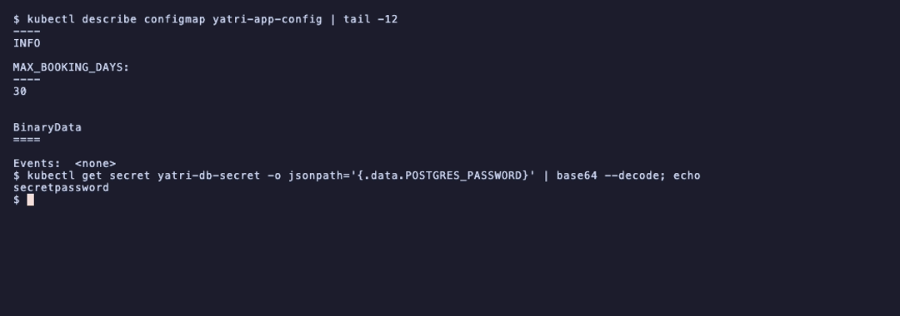
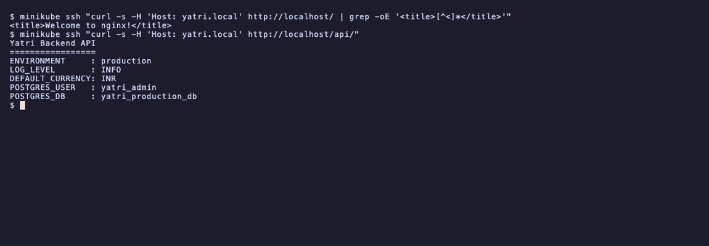

# Session 12: Ingress, ConfigMaps and Secrets

- Name: Aditya Singhi
- Enrollment number: 24BCS10177

Run on minikube with the Docker driver (Kubernetes v1.37.0), because Task 8 and
`run-demo.sh` both use `minikube addons enable ingress`. The manifests are the
ones already in `session-12-ingress-configmaps-secrets/`, unedited.

Because the minikube node IP is not routable from macOS (session 11 Task 12),
every HTTP test below runs from inside the node with `minikube ssh` and a `Host`
header. That is the same request the controller would see from a browser after
the `/etc/hosts` entry in Task 9.

The TLS private key generated in Task 13 is deliberately not committed.

## Task 1: ConfigMap

```bash
kubectl apply -f 01-configmap/app-config.yaml
kubectl describe configmap yatri-app-config
kubectl get configmap yatri-app-config -o jsonpath='{.data.ENVIRONMENT}'
```

```
NAME               DATA   AGE
yatri-app-config   5      0s
```

All five keys: `ENVIRONMENT=production`, `LOG_LEVEL=INFO`, `PORT=5000`,
`DEFAULT_CURRENCY=INR`, `MAX_BOOKING_DAYS=30`.



`DATA 5` counts keys, not bytes. These are the values that would otherwise be
baked into the image or passed as flags, and pulling them out is what lets the
same image run in staging and production.

## Task 2: a live ConfigMap update does not reach running pods

```bash
kubectl patch configmap yatri-app-config --type merge -p '{"data":{"ENVIRONMENT":"staging"}}'
kubectl exec deploy/yatri-backend -- env | grep ENVIRONMENT
```

```
configmap/yatri-app-config patched
  configmap now says: staging
  running pod still says: ENVIRONMENT=production
```

The API agrees, still serving the old value:

```
ENVIRONMENT     : production
```

Environment variables are read once, when the container starts. The kubelet
copies the ConfigMap values into the container's environment at that moment and
never revisits them. Patching the ConfigMap changes the stored object and nothing
else.

```bash
kubectl rollout restart deployment/yatri-backend
kubectl rollout status deployment/yatri-backend
kubectl exec deploy/yatri-backend -- env | grep ENVIRONMENT
```

```
deployment.apps/yatri-backend restarted
deployment "yatri-backend" successfully rolled out
  new pod says: ENVIRONMENT=staging
```

`rollout restart` replaces pods through the normal rolling update, so the new
pods read the new values with no downtime.

One honest wrinkle: immediately after the rollout reported success, the API still
answered `production` while `kubectl exec` on the deployment already said
`staging`. There are two replicas, `exec` picks one pod, and the Service was
still sending some requests to a pod that had not finished terminating. Checking
a rollout through one pod can disagree with checking it through the Service for a
second or two.

A mounted ConfigMap behaves differently from an environment variable. The kubelet
refreshes mounted files roughly every minute, so a config file read on each
request would pick up changes without a restart. Environment variables cannot.

## Task 3: Secrets and base64

```bash
kubectl apply -f 02-secret/db-secret.yaml
kubectl describe secret yatri-db-secret
kubectl get secret yatri-db-secret -o jsonpath='{.data.POSTGRES_PASSWORD}' | base64 --decode
```

```
NAME              TYPE     DATA   AGE
yatri-db-secret   Opaque   3      0s
```

```
secretpassword
```

`describe` masks the values and shows byte counts, which is only a convenience.
Anyone who can read the Secret can decode it in one command, as above. Base64 is
encoding, not encryption: it exists so a Secret can carry binary data such as a
TLS key inside YAML, and it provides no protection at all.

What actually protects a Secret is RBAC on the `secrets` resource, and encryption
at rest configured on etcd. By default etcd stores Secret data base64 encoded and
otherwise in the clear.

`type: Opaque` means arbitrary key value data. Task 13 uses
`kubernetes.io/tls`, a typed Secret the controller understands, which is why it
requires the keys `tls.crt` and `tls.key`.

## Task 4: the trailing newline gotcha

```bash
echo "secretpassword" | xxd | tail -1
echo -n "secretpassword" | xxd | tail -1
```

```
00000000: 7365 6372 6574 7061 7373 776f 7264 0a    secretpassword.
00000000: 7365 6372 6574 7061 7373 776f 7264       secretpassword
```

```
wrong (with newline): c2VjcmV0cGFzc3dvcmQK
right (no newline):   c2VjcmV0cGFzc3dvcmQ=
```


The `0a` at the end of the first line is the whole bug. `echo` appends a newline,
so the encoded value is a 15 byte password ending in `\n`, not a 14 byte one. The
two base64 strings even differ visibly, ending `K` versus `Q=`.

Nothing warns you. The Secret is created, the pod starts, the env var is set, and
the database rejects the login because the password really does have a newline in
it. The symptom is an authentication failure that looks like a wrong password,
while the YAML looks correct.

The repo manifest gets this right:

```bash
kubectl get secret yatri-db-secret -o jsonpath='{.data.POSTGRES_PASSWORD}'
```

```
c2VjcmV0cGFzc3dvcmQ=
```

Ends in `Q=`, so it was encoded with `echo -n`. The safer habit is to skip manual
encoding: `kubectl create secret generic --from-literal=KEY=value` handles the
bytes, and `stringData` in a manifest takes plain text and encodes it for you.

## Task 5: how secrets are handled in real pipelines

### The problem with committing Secret YAML

A `Secret` manifest in Git is a plaintext credential in Git, since base64 is
trivially reversible. Three consequences:

1. It is in history forever. Deleting the file in a later commit does not remove
   it from earlier commits, so rotating the credential is the only real fix.
2. Everyone with repo read access has the credential, which is a much larger
   group than everyone with cluster RBAC on `secrets`.
3. It leaks outward through forks, CI logs, and local clones on laptops.

### External secret managers

The pattern is to keep the real credential in a dedicated store and let the
cluster fetch it:

```
AWS Secrets Manager / Azure Key Vault / HashiCorp Vault
        │
        │  (operator authenticates with a cluster identity,
        │   IRSA on EKS or workload identity on GKE)
        ▼
External Secrets Operator  ── watches an ExternalSecret CR
        │
        ▼
Kubernetes Secret  (created in-cluster, never in Git)
        │
        ▼
Pod  (envFrom / secretKeyRef / volume mount, exactly as in Task 6)
```

What goes in Git is an `ExternalSecret` that names *where* the value lives, never
the value. The pod spec does not change, which is the point: the application
still reads an ordinary Secret.

Vault's Agent Injector takes a different route, mutating the pod to add a sidecar
that writes secrets to a shared in-memory volume, so no Kubernetes Secret object
is created at all.

Rotation is the real payoff. The operator re-syncs on an interval, so rotating in
the store updates the cluster without a commit.

```bash
kubectl get crds | grep -i secret || echo "Standard native secrets in use"
```

```
Standard native secrets in use
```

This cluster has no such operator, so the labs use native Secrets.

### CI/CD

GitHub Actions secrets and Azure DevOps variable groups inject values as
environment variables at deploy time. The manifest in the repo carries a
placeholder that the pipeline substitutes, so the repository never holds the
credential and the pipeline log masks it.

## Task 6: ConfigMap and Secret injected together

`04-full-demo/backend.yaml` uses both styles at once: `envFrom.configMapRef` for
the whole ConfigMap, and `env.valueFrom.secretKeyRef` for each credential.

```bash
kubectl exec deploy/yatri-backend -- env | grep -E 'ENVIRONMENT|LOG_LEVEL|DEFAULT_CURRENCY|MAX_BOOKING|POSTGRES'
```

```
DEFAULT_CURRENCY=INR
ENVIRONMENT=production
LOG_LEVEL=INFO
MAX_BOOKING_DAYS=30
POSTGRES_DB=yatri_production_db
POSTGRES_PASSWORD=secretpassword
POSTGRES_USER=yatri_admin
```

Both sources land in one flat environment, and the application cannot tell which
came from where.

The two styles differ in ways that matter. `envFrom` is bulk: every key becomes a
variable, so adding a key to the ConfigMap adds a variable on the next restart,
and a key that is not a valid variable name is skipped silently. `secretKeyRef`
is explicit per key, which is what you want for credentials, because it is
visible in the manifest exactly which secrets a workload can read.

Note that `POSTGRES_PASSWORD=secretpassword` is readable in plain text from
inside the container. A Secret protects the value on the way in, not once it has
arrived.

## Task 7: Ingress resource vs Ingress controller

| | Ingress resource | Ingress controller |
|---|---|---|
| What it is | A Kubernetes API object | A pod running a reverse proxy |
| Contains | Hosts, paths, TLS secret names, backend services | nginx, or Traefik, HAProxy, Envoy |
| Does on its own | Nothing | Watches the API and moves traffic |
| Created by | You, as YAML | Installed once per cluster |
| How many | Many, one per app or team | Usually one, or one per class |

An Ingress resource is a request, not an implementation. Apply one to a cluster
with no controller and it is accepted, stored, and ignored: `ADDRESS` stays empty
and nothing serves it.

The controller is the part that acts. Its loop is: watch the API server for
Ingress, Service and Endpoint changes, render a proxy configuration from them,
then reload. I read that generated file directly while debugging Task 10:

```bash
kubectl exec -n ingress-nginx <controller-pod> -- cat /etc/nginx/nginx.conf | grep -n 'location'
```

```
350:		location ~* "^/api(/|$)(.*)" {
448:		location ~* "^/" {
```

That is my Ingress YAML compiled into nginx locations, in priority order. Seeing
it is the fastest way to answer "why did my route not match", because it shows
what the proxy is actually doing rather than what the YAML intended.

The controller log shows the same loop reacting:

```
NGINX reload triggered due to a change in configuration
```

```bash
kubectl api-resources | grep -i ingress
```

Both `ingresses` and `ingressclasses` are built into the API, while the
controller is not. That split is why `ingressClassName: nginx` exists, naming
which controller should pick the resource up.

## Task 8: activating the NGINX Ingress controller

```bash
minikube addons enable ingress
kubectl get pods -n ingress-nginx
kubectl wait --namespace ingress-nginx --for=condition=ready pod \
  --selector=app.kubernetes.io/component=controller --timeout=120s
```

```
pod/ingress-nginx-controller-d7cd8c989-2z8nf condition met
[INFO] Ingress Controller is Ready.
```

```
NAME                                 TYPE        CLUSTER-IP      EXTERNAL-IP   PORT(S)                      AGE
ingress-nginx-controller             NodePort    10.99.18.171    <none>        80:31912/TCP,443:31979/TCP   3m49s
ingress-nginx-controller-admission   ClusterIP   10.104.208.225  <none>        443/TCP                      3m49s
```

Two Services, and the second one explains a thing worth knowing. The admission
Service backs a validating webhook that checks Ingress objects as they are
submitted, which is why a malformed path regex is rejected at `kubectl apply`
rather than quietly breaking the proxy.

The controller also claims host ports on the node:

```bash
kubectl get pods -n ingress-nginx -l app.kubernetes.io/component=controller \
  -o jsonpath='{range .items[0].spec.containers[0].ports[*]}{.name}:{.containerPort} hostPort={.hostPort}{"\n"}{end}'
```

```
http:80 hostPort=80
https:443 hostPort=443
```

`hostPort: 80` is how `http://yatri.local` works without a port number. It also
means only one thing can hold port 80 on that node, which caused a real problem
in Task 10 below.

## Task 9: local DNS for yatri.local

```bash
MINIKUBE_IP=$(minikube ip)          # 192.168.49.2
echo "${MINIKUBE_IP}  yatri.local" | sudo tee -a /etc/hosts
grep yatri.local /etc/hosts
```

This step needs an interactive sudo password, so `run-demo.sh` stopped here when
run non-interactively:

```
[INFO] Step 9: Adding yatri.local to /etc/hosts (requires sudo)...
[INFO] Minikube IP detected: 192.168.49.2
sudo: a terminal is required to read the password
sudo: a password is required
```

Worth being clear about what this does and does not achieve. It only teaches this
Mac to resolve `yatri.local` to `192.168.49.2`. It is not DNS, nothing else on
the network learns the name, and the Ingress does not care how the client
resolved anything, it only reads the `Host` header.

On macOS with the Docker driver there is a second problem: even with the entry in
place, `192.168.49.2` is not routable from the host, so the browser still cannot
connect without `minikube tunnel`. That is session 11 Task 12 in full.

The equivalent that needs no sudo and no DNS is to send the header directly,
which is what every test below does:

```bash
curl -H 'Host: yatri.local' http://<reachable-address>/
```

For HTTPS, `--resolve host:443:address` is the same trick, and it keeps SNI
correct so the right certificate is served. That matters in Task 13.

## Task 10: path-based routing

```bash
kubectl apply -f 04-full-demo/ingress.yaml
kubectl describe ingress yatri-ingress
```

```
Rules:
  Host         Path  Backends
  ----         ----  --------
  yatri.local  
               /api(/|$)(.*)   yatri-backend-service:80 (10.244.0.13:5000,10.244.0.14:5000)
               /               yatri-frontend-service:80 (10.244.0.12:80,10.244.0.11:80)
Annotations:   nginx.ingress.kubernetes.io/rewrite-target: /$2
```

```bash
curl -H 'Host: yatri.local' http://yatri.local/
curl -H 'Host: yatri.local' http://yatri.local/api/
```

```
HTTP/1.1 200 OK
<title>Welcome to nginx!</title>
```

```
HTTP/1.1 200 OK
Yatri Backend API
=================
ENVIRONMENT     : production
LOG_LEVEL       : INFO
DEFAULT_CURRENCY: INR
POSTGRES_USER   : yatri_admin
POSTGRES_DB     : yatri_production_db
```



One hostname, two applications, split on path. The backend response is also the
end to end proof for Task 6: those values came from the ConfigMap and the Secret,
through environment variables, out of a pod reached through the Ingress.

A host with no rule gets nothing:

```bash
curl -H 'Host: nope.local' http://localhost/
```

```
HTTP 404
```

### The rewrite

`/api(/|$)(.*)` with `rewrite-target: /$2` strips the prefix. For `/api/bookings`
the capture groups are `/` and `bookings`, so the backend receives `/bookings`.
The backend has no idea it is mounted under `/api`, which is what lets the same
service be mounted somewhere else without code changes. `use-regex: "true"` is
required for the capture groups to work at all.

### Where this went wrong for me

My first test returned the frontend's 404 page for `/api/`, and the natural
conclusion was that the regex rule was broken. It was not. Checking response
headers instead of bodies found the real cause:

```bash
curl -D - -H 'Host: nope.local' http://localhost/
```

```
HTTP/1.1 200 OK
Server: nginx/1.25.5
```

A host with no Ingress rule should 404. Getting a 200 meant I was not talking to
the Ingress controller at all. Port 80 on that node was held by a leftover
`LoadBalancer` Service from the session 11 lab, whose image was `nginx:1.25-alpine`,
while the controller reports `nginx/1.27.1`. The version string in the `Server`
header was the giveaway.

Deleting the session 11 services freed port 80 and every route worked first try.
The lesson is to test a negative case early: if a request that should fail
succeeds, the problem is upstream of the rules you are reading.

## Task 11: host-based routing

`03-ingress/ingress-tls.yaml` maps two hostnames onto the same IP.

```bash
kubectl apply -f 03-ingress/ingress-tls.yaml
kubectl describe ingress campus-ingress-tls
```

```
Rules:
  Host                 Path  Backends
  ----                 ----  --------
  portal.campus.local  
                       /()(.*)   yatri-frontend-service:80 (10.244.0.12:80,10.244.0.11:80)
  api.campus.local     
                       /api(/|$)(.*)   yatri-backend-service:80 (10.244.0.19:5000,10.244.0.20:5000)
```

Over HTTPS, since this Ingress terminates TLS:

```bash
curl -k --resolve portal.campus.local:443:127.0.0.1 https://portal.campus.local/
curl -k --resolve api.campus.local:443:127.0.0.1    https://api.campus.local/api/
```

```
portal.campus.local => HTTP 200
```

```
Yatri Backend API
=================
ENVIRONMENT     : production
LOG_LEVEL       : INFO
DEFAULT_CURRENCY: INR
```

Two hostnames, one IP, one controller, different applications. This is what
Task 11 of session 11 costed out: each of these would otherwise be its own cloud
load balancer.

Over plain HTTP the same hosts redirect:

```bash
curl -H 'Host: portal.campus.local' http://localhost/
```

```
HTTP 308 Permanent Redirect
```

That is not a misconfiguration. ingress-nginx redirects HTTP to HTTPS by default
for any host listed under `spec.tls`. The `yatri-ingress` in Task 10 sets
`nginx.ingress.kubernetes.io/ssl-redirect: "false"`, which is why it serves plain
HTTP happily while this one does not.

## Task 12: hybrid host and path routing

The same manifest is already the hybrid case, which is easy to miss. It routes on
host *and* path together:

| Host | Path | Goes to |
|---|---|---|
| `yatri.local` | `/` | frontend |
| `yatri.local` | `/api/*` | backend |
| `portal.campus.local` | `/*` | frontend |
| `api.campus.local` | `/api/*` | backend |
| `api.campus.local` | `/` | no rule, 404 |

Verified by the last row, where the host matches but the path does not:

```bash
curl -H 'Host: api.campus.local' http://localhost/
```

```
HTTP 308    # redirect to HTTPS first, then 404 on the path
```

Matching is host first, then path within that host. `portal.campus.local` has no
`/api` rule at all, so `/api/` there falls to its `/()(.*)`  rule and reaches the
frontend, while the identical path on `api.campus.local` reaches the backend. The
path alone does not determine the destination.

## Task 13: TLS termination

```bash
openssl req -x509 -nodes -days 365 -newkey rsa:2048 \
  -keyout tls.key -out tls.crt \
  -subj "/CN=campus.local/O=CampusDevOps"
kubectl create secret tls campus-tls-cert --cert=tls.crt --key=tls.key
```

```
subject=CN=campus.local, O=CampusDevOps
notBefore=Sep 17 20:55:56 2026 GMT
notAfter=Sep 17 20:55:56 2027 GMT
```

```
NAME              TYPE                DATA   AGE
campus-tls-cert   kubernetes.io/tls   2      0s
```

```
TLS:
  campus-tls-cert terminates portal.campus.local,api.campus.local
```

HTTPS answered, but with the wrong certificate:

```bash
echo | openssl s_client -connect localhost:443 -servername portal.campus.local | openssl x509 -noout -subject
```

```
subject=O = Acme Co, CN = Kubernetes Ingress Controller Fake Certificate
```

That is the controller's built-in placeholder, not mine. The controller log says
why:

```
Unexpected error validating SSL certificate "default/campus-tls-cert" for server "api.campus.local": x509: certificate is not valid for any names, but wanted to match api.campus.local
SSL certificate "default/campus-tls-cert" does not contain a Common Name or Subject Alternative Name for server "api.campus.local"
Using default certificate
```

```bash
openssl x509 -in tls.crt -noout -text | grep -A 2 'Subject Alternative Name'
```

Nothing. The certificate has no SAN extension at all.

The `openssl` command as written sets only a Common Name. Go has ignored CN for
hostname verification since 1.15, so to Go this certificate is valid for no names
whatsoever, which is exactly what the log says. The controller rejects it and
falls back to its placeholder. TLS still completes, so a quick `curl -k` looks
like success, and `-k` is what hides the problem.

Adding SANs fixes it:

```bash
openssl req -x509 -nodes -days 365 -newkey rsa:2048 \
  -keyout tls.key -out tls.crt \
  -subj "/CN=campus.local/O=CampusDevOps" \
  -addext "subjectAltName=DNS:campus.local,DNS:portal.campus.local,DNS:api.campus.local"
kubectl create secret tls campus-tls-cert --cert=tls.crt --key=tls.key --dry-run=client -o yaml | kubectl apply -f -
```

```
  DNS:campus.local, DNS:portal.campus.local, DNS:api.campus.local
```

```
subject=CN = campus.local, O = CampusDevOps
issuer=CN = campus.local, O = CampusDevOps
```

Now the server presents my certificate. Subject and issuer are identical because
it is self-signed, which is also why `-k` is still needed: the browser has no
reason to trust it. In production cert-manager would replace all of this,
requesting a real certificate from Let's Encrypt and writing it into a Secret of
this same type, which the Ingress consumes unchanged.

Termination means the controller decrypts, then talks plain HTTP to the pods
inside the cluster. The backend never sees TLS, and the certificate lives in one
place rather than in every service.

## Task 14: the automation script

```bash
bash 04-full-demo/run-demo.sh
```

Steps 1 to 8 completed:

```
[INFO] Step 2: Applying ConfigMap (plain-text configuration)...
configmap/yatri-app-config created
[INFO] Step 3: Applying Secret (sensitive database credentials)...
secret/yatri-db-secret created
[INFO] Step 4: Deploying Frontend (Nginx) + ClusterIP Service...
deployment.apps/yatri-frontend created
service/yatri-frontend-service created
[INFO] Step 5: Deploying Backend (Python HTTP server) + ClusterIP Service...
deployment.apps/yatri-backend created
service/yatri-backend-service created
[INFO] Step 6: Waiting for all pods to reach Running state...
deployment "yatri-frontend" successfully rolled out
deployment "yatri-backend" successfully rolled out
[INFO] Step 7: Applying Ingress routing rules...
ingress.networking.k8s.io/yatri-ingress created
[INFO] Step 8: Summary of deployed resources...
NAME            CLASS   HOSTS         ADDRESS   PORTS   AGE
yatri-ingress   nginx   yatri.local             80      1s
```

Step 9 is the `/etc/hosts` write from Task 9 and needs an interactive password,
so the script exited 1 there. Everything the cluster needs was already applied.

Two things in the script are worth reading rather than just running. It uses
`set -euo pipefail`, so any failing command aborts the whole thing, which is why
one sudo prompt ended it. And `kubectl rollout status` between steps makes it
wait for readiness instead of racing ahead, which matters because Step 7's
Ingress needs Services that already have endpoints.

`ADDRESS` is empty in that summary because the Ingress was one second old. It
filled in shortly after:

```
"updating Ingress status" ingress="yatri-ingress" currentValue=null newValue=[{"ip":"192.168.49.2"}]
```

Multi document YAML is the other thing to notice. `backend.yaml` and
`frontend.yaml` each hold a Deployment and its Service separated by `---`, so one
`kubectl apply -f` creates both. Keeping a Service next to the Deployment it
exposes is the normal convention, since neither is much use alone.

```bash
bash 04-full-demo/cleanup.sh
```

## Summary

| Concern | Object | Updates running pods? |
|---|---|---|
| Non-sensitive config | ConfigMap via `envFrom` | No, needs `rollout restart` |
| Non-sensitive config | ConfigMap via volume | Yes, within about a minute |
| Credentials | Secret via `secretKeyRef` | No, needs `rollout restart` |
| TLS certificate | Secret, `kubernetes.io/tls` | Yes, controller reloads |
| HTTP routing | Ingress plus a controller | Yes, controller reloads |

## Cleanup

```bash
bash 04-full-demo/cleanup.sh
kubectl delete -f 03-ingress/ingress-tls.yaml
kubectl delete secret campus-tls-cert
minikube stop
```
