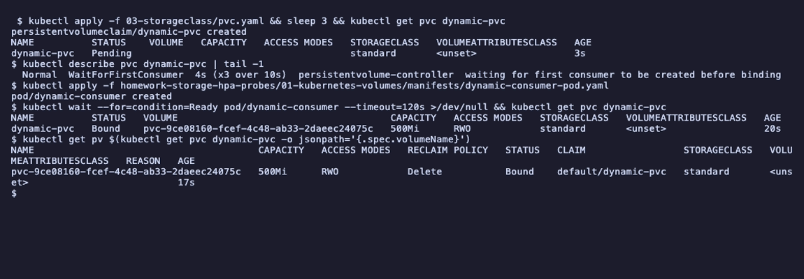

# Task 1: Kubernetes volumes

- Name: Aditya Singhi
- Enrollment number: 24BCS10177

Everything below ran on a single node kind cluster (`hw13`, Kubernetes v1.37.0).
kind ships one StorageClass, `standard`, backed by Rancher's `local-path`
provisioner. That matters twice in this file, because the instructor notes were
written for minikube, whose `standard` class behaves differently.

The manifests are the ones in `01-volumes/`, `02-persistent-storage/` and
`03-storageclass/`, run unedited first. Where one did not do what the notes
said, my fixed copy is in [`manifests/`](manifests/).

## The problem volumes solve

A container's filesystem lives and dies with the container. Restart the container
and anything it wrote outside the image is gone. A volume is a directory that
Kubernetes mounts into the container from somewhere else, so data can outlive the
container, or the pod, depending on which kind of volume it is.

The useful way to compare volume types is to ask what the data survives:

| Type | Container restart | Pod deleted | Node gone |
|---|---|---|---|
| Container filesystem | lost | lost | lost |
| `emptyDir` | kept | lost | lost |
| `hostPath` | kept | kept, if the new pod lands on the same node | lost |
| PV through a PVC | kept | kept | depends on the backend |

Each row of that table is something I tested below, except the last column, since
a single node cluster has no second node to fail over to.

## emptyDir

An empty directory created when the pod is scheduled. Every container in the pod
can mount it, which makes it the normal way for a sidecar to share files with the
main container, or for scratch space.

```bash
kubectl apply -f 01-volumes/emptydir-pod.yaml
kubectl wait --for=condition=Ready pod/emptydir-demo
kubectl exec emptydir-demo -- sh -c 'echo "Hello Kubernetes" > /data/message.txt; cat /data/message.txt'
kubectl exec emptydir-demo -- df -h /data
```

```
pod/emptydir-demo created
pod/emptydir-demo condition met
Hello Kubernetes
Filesystem      Size  Used Avail Use% Mounted on
/dev/vda1       911G   21G  844G   3% /data
```

`/dev/vda1` is the node's own disk. An `emptyDir` is just a folder on the node,
and `df` shows the whole node disk because there is no size limit unless
`sizeLimit` is set.

The instructor notes only test deleting the pod. I also killed the container
without touching the pod, because that is the case `emptyDir` is actually for:

```bash
kubectl exec emptydir-demo -- sh -c 'kill 1'
kubectl get pod emptydir-demo
kubectl exec emptydir-demo -- cat /data/message.txt
```

```
NAME            READY   STATUS    RESTARTS     AGE
emptydir-demo   1/1     Running   1 (8s ago)   81s
Hello Kubernetes
```

`RESTARTS 1`, and the file is still there. The kubelet restarted nginx inside the
same pod, so the pod's `emptyDir` stayed. Now deleting the pod:

```bash
kubectl delete pod emptydir-demo
kubectl apply -f 01-volumes/emptydir-pod.yaml
kubectl wait --for=condition=Ready pod/emptydir-demo
kubectl exec emptydir-demo -- cat /data/message.txt
```

```
pod "emptydir-demo" deleted from default namespace
pod/emptydir-demo created
pod/emptydir-demo condition met
cat: /data/message.txt: No such file or directory
command terminated with exit code 1
```

Same name, same YAML, but a new pod with a new UID, so a new empty directory. I
found where it lives on the node by the pod UID:

```bash
UID_=$(kubectl get pod emptydir-demo -o jsonpath='{.metadata.uid}')
docker exec hw13-control-plane ls /var/lib/kubelet/pods/$UID_/volumes/kubernetes.io~empty-dir/app-storage
```

```
x.txt
```

The path has the pod UID in it. That is why the data cannot survive pod deletion:
the kubelet removes `/var/lib/kubelet/pods/<uid>/` along with the pod.

## hostPath

Mounts a directory from the node's filesystem into the pod.

```bash
kubectl apply -f 01-volumes/hostpath-pod.yaml
kubectl exec hostpath-demo -- sh -c 'echo "written from the pod" > /data/note.txt'
docker exec hw13-control-plane cat /tmp/hostpath-data/note.txt
ls /tmp/hostpath-data
```

```
written from the pod
"/tmp/hostpath-data": No such file or directory (os error 2)
```

The file is in `/tmp/hostpath-data` on the node, and not on my Mac. With kind the
"host" is the `hw13-control-plane` Docker container, not the laptop. Same idea on
minikube. `hostPath` means the Kubernetes node, whatever that is.

Deleting and recreating the pod keeps the data, unlike `emptyDir`:

```bash
kubectl delete pod hostpath-demo
kubectl apply -f 01-volumes/hostpath-pod.yaml
kubectl wait --for=condition=Ready pod/hostpath-demo
kubectl exec hostpath-demo -- cat /data/note.txt
```

```
pod "hostpath-demo" deleted from default namespace
pod/hostpath-demo created
pod/hostpath-demo condition met
written from the pod
```

This only worked because there is one node. On a real cluster the new pod could
be scheduled anywhere, and it would see that node's empty `/tmp/hostpath-data`.
`hostPath` also hands the pod a piece of the node's filesystem, which is a
security problem if the path is something like `/` or `/var/run`. It is fine for
node level daemons such as log collectors, and for labs. It is not application storage.

`type: DirectoryOrCreate` in the manifest is why the first run worked at all: the
kubelet created the missing directory. With `type: Directory` the pod would fail
to start until someone made it.

## PersistentVolume and PersistentVolumeClaim

These split storage into two objects with two owners:

- A **PersistentVolume (PV)** is a piece of storage that exists in the cluster.
  It is cluster scoped, usually created by an admin or a provisioner.
- A **PersistentVolumeClaim (PVC)** is a request for storage: a size and an
  access mode. It is namespaced and belongs to the application.

The pod only names the claim. It never knows whether the storage is a node
folder, an EBS volume or an NFS share, so the same pod YAML works on any cluster.

### What happened when I ran the instructor manifests

```bash
kubectl apply -f 02-persistent-storage/pv.yaml
kubectl get pv
kubectl apply -f 02-persistent-storage/pvc.yaml
kubectl get pvc
kubectl get pvc student-pvc -o jsonpath='{.spec.storageClassName}'
```

```
persistentvolume/student-pv created
NAME         CAPACITY   ACCESS MODES   RECLAIM POLICY   STATUS      CLAIM   STORAGECLASS   VOLUMEATTRIBUTESCLASS   REASON   AGE
student-pv   1Gi        RWO            Retain           Available                          <unset>                          0s
persistentvolumeclaim/student-pvc created
NAME          STATUS    VOLUME   CAPACITY   ACCESS MODES   STORAGECLASS   VOLUMEATTRIBUTESCLASS   AGE
student-pvc   Pending                                      standard       <unset>                 3s
standard
```

The notes expect `student-pvc   Bound    student-pv`. I got `Pending`, with
`STORAGECLASS standard`, even though `pvc.yaml` never mentions a class.

Then I created the pod:

```bash
kubectl apply -f 02-persistent-storage/pod.yaml
kubectl get pvc
kubectl get pv
```

```
NAME          STATUS   VOLUME                                     CAPACITY   ACCESS MODES   STORAGECLASS   VOLUMEATTRIBUTESCLASS   AGE
student-pvc   Bound    pvc-21a4d58a-ae19-456b-894f-326992bcbd42   500Mi      RWO            standard       <unset>                 7s
NAME                                       CAPACITY   ACCESS MODES   RECLAIM POLICY   STATUS      CLAIM                 STORAGECLASS   VOLUMEATTRIBUTESCLASS   REASON   AGE
pvc-21a4d58a-ae19-456b-894f-326992bcbd42   500Mi      RWO            Delete           Bound       default/student-pvc   standard       <unset>                          2s
student-pv                                 1Gi        RWO            Retain           Available                                        <unset>                          7s
```

The claim bound, but not to `student-pv`. The provisioner made a brand new
`pvc-21a4d58a...` volume for it, and the PV I created by hand is still sitting
there `Available`, unused.

The reason is the `DefaultStorageClass` admission plugin. A PVC with no
`storageClassName` field gets the cluster's default class written into it when it
is created. `student-pv` has no class, and a claim only binds to a PV of the same
class, so the two can never match. The persistence test from the notes still
passes on the dynamic volume, which is exactly why this is easy to miss:

```
pod "storage-demo" deleted from default namespace
pod/storage-demo created
pod/storage-demo condition met
Kubernetes Storage
```

The file came from `/var/local-path-provisioner/pvc-21a4d58a-..._default_student-pvc`
on the node, not from `/tmp/student-data`. Any cluster with a default
StorageClass does this, minikube included.

### The fix

[`manifests/pvc-static.yaml`](manifests/pvc-static.yaml) adds one line:

```yaml
spec:
  storageClassName: ""
```

An empty string is different from a missing field. It means "no class", so the
admission plugin leaves it alone and the claim can only bind to a PV without a
class.

```bash
kubectl delete pod storage-demo; kubectl delete pvc student-pvc
kubectl apply -f manifests/pvc-static.yaml
kubectl get pvc student-pvc
kubectl get pv student-pv
```

```
persistentvolumeclaim/student-pvc created
NAME          STATUS   VOLUME       CAPACITY   ACCESS MODES   STORAGECLASS   VOLUMEATTRIBUTESCLASS   AGE
student-pvc   Bound    student-pv   1Gi        RWO                           <unset>                 3s
NAME         CAPACITY   ACCESS MODES   RECLAIM POLICY   STATUS   CLAIM                 STORAGECLASS   VOLUMEATTRIBUTESCLASS   REASON   AGE
student-pv   1Gi        RWO            Retain           Bound    default/student-pvc                  <unset>                          25s
```

Bound to `student-pv` in three seconds, without waiting for a pod. Note
`CAPACITY 1Gi`: I asked for 500Mi and got the whole 1Gi PV. A PV binds to one
claim, all or nothing, so the extra 524Mi is wasted. That is one reason people
prefer dynamic provisioning, which makes volumes the exact requested size.

Persistence through pod deletion, this time on the real `hostPath` behind the PV:

```bash
kubectl exec storage-demo -- sh -c 'echo "Kubernetes Storage" > /data/message.txt'
kubectl delete pod storage-demo
kubectl apply -f 02-persistent-storage/pod.yaml
kubectl wait --for=condition=Ready pod/storage-demo
kubectl exec storage-demo -- cat /data/message.txt
docker exec hw13-control-plane cat /tmp/student-data/message.txt
```

```
pod "storage-demo" deleted from default namespace
pod/storage-demo created
pod/storage-demo condition met
Kubernetes Storage
Kubernetes Storage
```

### Reclaim policy: what Retain actually means

`student-pv` has `persistentVolumeReclaimPolicy: Retain`. I deleted the claim to
see it:

```bash
kubectl delete pod storage-demo; kubectl delete pvc student-pvc
kubectl get pv student-pv
docker exec hw13-control-plane cat /tmp/student-data/message.txt
```

```
NAME         CAPACITY   ACCESS MODES   RECLAIM POLICY   STATUS     CLAIM                 STORAGECLASS   VOLUMEATTRIBUTESCLASS   REASON   AGE
student-pv   1Gi        RWO            Retain           Released   default/student-pvc                  <unset>                          36s
Kubernetes Storage
```

The data is kept, as promised. But the PV is `Released`, not `Available`, and it
still remembers the old claim. Creating the same claim again does not get it back:

```bash
kubectl apply -f manifests/pvc-static.yaml
kubectl get pvc student-pvc
kubectl describe pvc student-pvc | tail -1
```

```
NAME          STATUS    VOLUME   CAPACITY   ACCESS MODES   STORAGECLASS   VOLUMEATTRIBUTESCLASS   AGE
student-pvc   Pending                                                     <unset>                 3s
  Normal  FailedBinding  4s (x2 over 7s)  persistentvolume-controller  no persistent volumes available for this claim and no storage class is set
```

Kubernetes will not hand a released volume, possibly full of someone else's data,
to a new claim on its own. An admin has to decide. Removing the stale `claimRef`
is that decision:

```bash
kubectl patch pv student-pv --type json -p '[{"op":"remove","path":"/spec/claimRef"}]'
kubectl get pvc student-pvc
kubectl get pv student-pv
```

```
persistentvolume/student-pv patched
NAME          STATUS   VOLUME       CAPACITY   ACCESS MODES   STORAGECLASS   VOLUMEATTRIBUTESCLASS   AGE
student-pvc   Bound    student-pv   1Gi        RWO                           <unset>                 29s
NAME         CAPACITY   ACCESS MODES   RECLAIM POLICY   STATUS   CLAIM                 STORAGECLASS   VOLUMEATTRIBUTESCLASS   REASON   AGE
student-pv   1Gi        RWO            Retain           Bound    default/student-pvc                  <unset>                          66s
```

It went `Available` straight after the patch and the waiting claim bound on the
controller's next pass, about 15 seconds later.

The other policy is `Delete`, used by the dynamic volumes in the next section:
deleting the claim deletes the PV and the data behind it.

### Access modes

| Mode | Short | Meaning |
|---|---|---|
| ReadWriteOnce | RWO | read write, mounted by one **node** at a time |
| ReadOnlyMany | ROX | read only, many nodes |
| ReadWriteMany | RWX | read write, many nodes (needs NFS, CephFS, EFS and similar) |
| ReadWriteOncePod | RWOP | read write, exactly one **pod** |

RWO is per node, not per pod. Two pods on the same node can both mount an RWO
volume. The mini project depends on that, because it runs 2 to 5 replicas on one
RWO claim. It only works because kind has one node.

## StorageClass and dynamic provisioning

A StorageClass describes a kind of storage and names the provisioner that can
create it. With a class in place nobody has to make PVs by hand: a claim names the
class, and the provisioner creates a PV to fit it.

```bash
kubectl get sc
kubectl describe storageclass standard
```

```
NAME                 PROVISIONER             RECLAIMPOLICY   VOLUMEBINDINGMODE      ALLOWVOLUMEEXPANSION   AGE
standard (default)   rancher.io/local-path   Delete          WaitForFirstConsumer   false                  17s
```

```
Name:            standard
IsDefaultClass:  Yes
Provisioner:           rancher.io/local-path
Parameters:            <none>
ReclaimPolicy:         Delete
VolumeBindingMode:     WaitForFirstConsumer
```

The notes show minikube's `k8s.io/minikube-hostpath` provisioner. kind's
differs in one way that changes what you see:
`VolumeBindingMode: WaitForFirstConsumer`.

```bash
kubectl apply -f 03-storageclass/pvc.yaml
kubectl get pvc dynamic-pvc
kubectl describe pvc dynamic-pvc | tail -1
kubectl get pv | grep dynamic || echo "no PV yet"
```

```
persistentvolumeclaim/dynamic-pvc created
NAME          STATUS    VOLUME   CAPACITY   ACCESS MODES   STORAGECLASS   VOLUMEATTRIBUTESCLASS   AGE
dynamic-pvc   Pending                                      standard       <unset>                 5s
  Normal  WaitForFirstConsumer  5s (x2 over 5s)  persistentvolume-controller  waiting for first consumer to be created before binding
no PV yet
```

The notes expect `Bound` straight away. On kind the claim stays `Pending` on
purpose, and nothing is broken. A local path volume is a folder on one specific
node, so the provisioner waits until a pod using the claim has been scheduled and
then creates the folder on that pod's node. If it created the volume first, the
scheduler could end up placing the pod on a node that cannot reach it. Cloud
classes such as EBS use the same mode, to pick the right availability zone.

The notes have no pod for this claim, so I wrote one,
[`manifests/dynamic-consumer-pod.yaml`](manifests/dynamic-consumer-pod.yaml):

```bash
kubectl apply -f manifests/dynamic-consumer-pod.yaml
kubectl wait --for=condition=Ready pod/dynamic-consumer
kubectl get pvc dynamic-pvc
kubectl get pv | grep -E "NAME|dynamic"
kubectl describe pvc dynamic-pvc | grep -E "Provisioning|ProvisioningSucceeded|ExternalProvisioning"
```

```
pod/dynamic-consumer created
pod/dynamic-consumer condition met
NAME          STATUS   VOLUME                                     CAPACITY   ACCESS MODES   STORAGECLASS   VOLUMEATTRIBUTESCLASS   AGE
dynamic-pvc   Bound    pvc-89d29258-114a-44ec-b6d3-2bda121d51b4   500Mi      RWO            standard       <unset>                 17s
NAME                                       CAPACITY   ACCESS MODES   RECLAIM POLICY   STATUS   CLAIM                 STORAGECLASS   VOLUMEATTRIBUTESCLASS   REASON   AGE
pvc-89d29258-114a-44ec-b6d3-2bda121d51b4   500Mi      RWO            Delete           Bound    default/dynamic-pvc   standard       <unset>                          2s
```

```
  Normal  Provisioning           5s                 rancher.io/local-path_local-path-provisioner-75f7fc7dc5-ddl8t_7d57e0e0-096d-4bb8-9b46-58d50b625c62  External provisioner is provisioning volume for claim "default/dynamic-pvc"
  Normal  ExternalProvisioning   2s (x2 over 5s)    persistentvolume-controller                                                                         Waiting for a volume to be created either by the external provisioner 'rancher.io/local-path' or manually by the system administrator. If volume creation is delayed, please verify that the provisioner is running and correctly registered.
  Normal  ProvisioningSucceeded  2s                 rancher.io/local-path_local-path-provisioner-75f7fc7dc5-ddl8t_7d57e0e0-096d-4bb8-9b46-58d50b625c62  Successfully provisioned volume pvc-89d29258-114a-44ec-b6d3-2bda121d51b4
```

The events show the whole chain. The PV controller sees the claim is waiting on
an external provisioner. The `local-path-provisioner` pod in the
`local-path-storage` namespace creates the folder and a matching PV, named
`pvc-<claim uid>`, exactly 500Mi this time. Then the claim binds.



The screenshot is a second run of the same steps, so the volume name differs.

Deleting the claim shows the `Delete` reclaim policy:

```bash
kubectl delete pod dynamic-consumer; kubectl delete pvc dynamic-pvc
kubectl get pv pvc-89d29258-114a-44ec-b6d3-2bda121d51b4
docker exec hw13-control-plane ls /var/local-path-provisioner/
```

```
pod "dynamic-consumer" deleted from default namespace
persistentvolumeclaim "dynamic-pvc" deleted from default namespace
Error from server (NotFound): persistentvolumes "pvc-89d29258-114a-44ec-b6d3-2bda121d51b4" not found
```

The PV is gone and the provisioner's folder on the node is empty. With `Delete`,
the claim owns the data. Dynamic provisioning makes storage easy to create and
just as easy to throw away, so for a database you would use a class with
`reclaimPolicy: Retain` or take backups.

### Default StorageClass

The `(default)` marker comes from the annotation
`storageclass.kubernetes.io/is-default-class: "true"`. A claim with no
`storageClassName` gets that class. The PV section above showed the side effect:
a claim written for a hand made PV quietly went to the default class instead.

## Summary

| Need | Use |
|---|---|
| Scratch space, or files shared between containers in one pod | `emptyDir` |
| A node level daemon reading node files, such as logs | `hostPath` |
| Data that must outlive the pod | PVC |
| PVCs without a ticket to an admin for each PV | StorageClass, dynamic provisioning |
| Binding a PVC to one specific hand made PV | `storageClassName: ""` on the PVC |

## References

- https://kubernetes.io/docs/concepts/storage/volumes/
- https://kubernetes.io/docs/concepts/storage/persistent-volumes/
- https://kubernetes.io/docs/concepts/storage/storage-classes/
