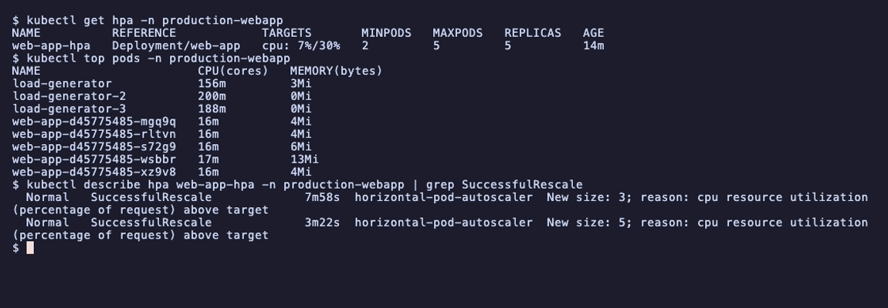
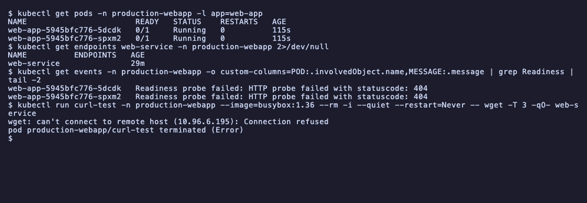
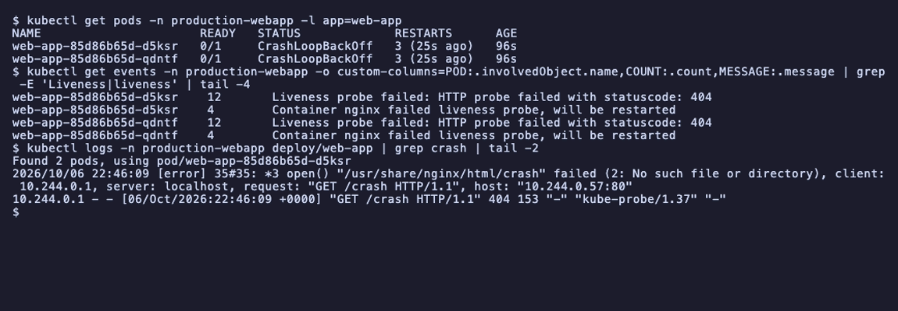

# Session 13: Kubernetes storage, HPA and probes

- Name: Aditya Singhi
- Enrollment number: 24BCS10177

Run on a single node kind cluster (`kind v0.33.0`, Kubernetes v1.37.0). I used
kind instead of minikube because it ships a dynamic provisioner out of the box
(`rancher.io/local-path`, StorageClass `standard`), so Task 1 could show dynamic
provisioning with nothing extra installed. The instructor notes were written for
minikube, and the differences that showed up are called out where they happened.

The HPA needs metrics-server, which kind does not include. I installed the
upstream release, and on kind it needs `--kubelet-insecure-tls`. Details are in
[Setup](#setup-metrics-server-on-kind).

Manifests were run unedited from the session folder. Where one did not work as
written, my fixed copy is in this folder and the failure is shown.

| Task | Where |
|---|---|
| Task 1: volumes documentation | [`01-kubernetes-volumes/README.md`](01-kubernetes-volumes/README.md) |
| Task 2: HPA hands-on | below |
| Task 3: mini project | below |
| Probes demo | below |

## Task 1: Kubernetes volumes

The full write-up, with every command and its output, is in
[`01-kubernetes-volumes/README.md`](01-kubernetes-volumes/README.md). It covers
`emptyDir`, `hostPath`, PV, PVC, StorageClass and dynamic provisioning, all run
on this cluster. The three things that did not match the notes:

- `02-persistent-storage/pvc.yaml` never binds to `student-pv`. With a default
  StorageClass present, a PVC with no `storageClassName` gets `standard` written
  into it and is dynamically provisioned instead. The fix is
  `storageClassName: ""`, in
  [`01-kubernetes-volumes/manifests/pvc-static.yaml`](01-kubernetes-volumes/manifests/pvc-static.yaml).
- A `Retain` PV goes to `Released` when its claim is deleted and will not bind
  again until its `claimRef` is removed by hand.
- On kind, `03-storageclass/pvc.yaml` stays `Pending` until a pod uses it,
  because the class is `WaitForFirstConsumer`. That is by design.


## Setup: metrics-server on kind

```bash
kind create cluster --name hw13
curl -sSLo metrics-server.yaml https://github.com/kubernetes-sigs/metrics-server/releases/latest/download/components.yaml
kubectl apply -f metrics-server.yaml
kubectl top nodes
```

```
service/metrics-server created
deployment.apps/metrics-server created
apiservice.apiregistration.k8s.io/v1beta1.metrics.k8s.io created
error: Metrics API not available
```

The release was v0.9.0. Its first pod sat in `ImagePullBackOff` because Docker
Desktop had only just started and DNS inside the node was not answering yet
(`lookup asia-south1-docker.pkg.dev on 192.168.65.254:53: server misbehaving`).
Pulling the image again inside the node a minute later worked. After that the pod
ran but never became ready. Its log says why:

```bash
kubectl logs -n kube-system deploy/metrics-server
```

```
E1006 21:16:35.797998       1 scraper.go:149] "Failed to scrape node" err="Get \"https://172.26.0.2:10250/metrics/resource\": tls: failed to verify certificate: x509: cannot validate certificate for 172.26.0.2 because it doesn't contain any IP SANs" node="hw13-control-plane"
```

metrics-server reads CPU and memory from each kubelet over HTTPS on port 10250.
kind's kubelets use a self-signed serving certificate with no IP address in it,
so metrics-server refuses to talk to them. minikube's addon passes the flag for
you, which is why the notes never mention it. On kind you add it yourself:

```bash
kubectl patch deployment metrics-server -n kube-system --type=json \
  -p='[{"op":"add","path":"/spec/template/spec/containers/0/args/-","value":"--kubelet-insecure-tls"}]'
kubectl top nodes
```

```
deployment.apps/metrics-server patched
deployment "metrics-server" successfully rolled out
NAME                 CPU(cores)   CPU(%)   MEMORY(bytes)   MEMORY(%)   
hw13-control-plane   190m         4%       801Mi           20%         
```

`--kubelet-insecure-tls` skips certificate checking for the kubelet connection
only. Fine for a local cluster. On a real cluster the fix is kubelet serving
certificates signed by the cluster CA.

There was one more problem, which showed up later in Task 2 and is explained
there: under heavy CPU load metrics-server's own 1 second probe timeout made it
crash loop, and I raised it to 5 seconds.

## Task 2: HPA hands-on

The assignment says to use `hpa.yml`. The session folder has two HPA setups.
`hpa/` holds `hpa-backend.yaml`, `backend-service.yaml` and `load_generator.sh`
for the Yatri backend from session 12. `04-hpa/` and the mini project hold the
same idea for plain nginx. I did the full Task 2 walkthrough on `hpa/` with its
load generator script, and the nginx version is the mini project in Task 3.

### 1. Deploy the application

`hpa-backend.yaml` scales a Deployment called `yatri-backend` that is not in this
session's folder. It is session 12's backend, which reads a ConfigMap and a
Secret, so all three come from there:

```bash
P12=../session-12-ingress-configmaps-secrets/04-full-demo
kubectl apply -f $P12/configmap.yaml -f $P12/secret.yaml -f $P12/backend.yaml
kubectl apply -f hpa/backend-service.yaml
kubectl rollout status deployment/yatri-backend
```

```
configmap/yatri-app-config created
secret/yatri-db-secret created
deployment.apps/yatri-backend created
service/yatri-backend-service created
service/yatri-backend-service configured
deployment "yatri-backend" successfully rolled out
```

`configured` on the second Service line is expected. `hpa/backend-service.yaml`
is the same Service session 12 already created, so apply just updates it.

The backend container sets `requests.cpu: 50m` and `limits.cpu: 200m`. The
request is the number that matters for the HPA, because CPU utilization is
measured as a percentage of the request, not of the limit or of the node.

### 2 and 3. Configure and verify the HPA

```bash
kubectl apply -f hpa/hpa-backend.yaml
kubectl get hpa
```

```
horizontalpodautoscaler.autoscaling/yatri-backend-hpa created
NAME                REFERENCE                  TARGETS              MINPODS   MAXPODS   REPLICAS   AGE
yatri-backend-hpa   Deployment/yatri-backend   cpu: <unknown>/50%   2         10        0          0s
```

`<unknown>` for the first few seconds is normal. The HPA had not fetched a metric
yet. Forty-five seconds later:

```
NAME                REFERENCE                  TARGETS       MINPODS   MAXPODS   REPLICAS   AGE
yatri-backend-hpa   Deployment/yatri-backend   cpu: 8%/50%   2         10        2          47s
```

```bash
kubectl top pods -l app=yatri-backend
```

```
NAME                             CPU(cores)   MEMORY(bytes)   
yatri-backend-6c58cb99c7-crth5   2m           11Mi            
yatri-backend-6c58cb99c7-j9wpp   3m           10Mi            
```

Idle, as expected: 2 to 3 millicores out of a 50m request is 4 to 6 percent.

### 4 and 5. The load generator script, and why it did not scale anything

`hpa/load_generator.sh` starts 10 background `curl` loops against
`http://localhost:5000/healthz`. If that URL does not answer, it starts
`kubectl port-forward svc/yatri-backend-service 5000:80` first.

Before running it I checked what was on port 5000, because the default target
looked risky on a Mac:

```bash
lsof -nP -iTCP:5000 -sTCP:LISTEN
curl -s -o /dev/null -w "%{http_code} %{header_json}\n" http://localhost:5000/healthz
```

```
COMMAND   PID   USER   FD   TYPE             DEVICE SIZE/OFF NODE NAME
ControlCe 580 zingzy   11u  IPv4 0x41e86d4a638880b9      0t0  TCP *:5000 (LISTEN)
ControlCe 580 zingzy   12u  IPv6 0x4ba24b250dc9ec61      0t0  TCP *:5000 (LISTEN)
403 {"content-length":["0"],
"server":["AirTunes/940.23.1"],
"x-apple-processingtime":["3"],
"x-apple-requestreceivedtimestamp":["695812016"]
}
```

Port 5000 belongs to macOS Control Center, the AirPlay Receiver. Run as is, the
script would get a 403 from AirPlay, decide the backend was not reachable, try a
port-forward onto port 5000, fail to bind (its output goes to `/dev/null`, so you
never see the error), and then spend its time hitting AirPlay. The HPA would
never move and nothing would say why.

The script takes the URL as its first argument, so I ran my own port-forward on a
free port and pointed the script at it. With the URL answering, the script skips
its own port-forward:

```bash
kubectl port-forward svc/yatri-backend-service 18130:80 &
bash hpa/load_generator.sh http://localhost:18130/healthz
```

```
==================================================
      KUBERNETES HPA TRAFFIC LOAD GENERATOR       
==================================================
Pounding target endpoint: http://localhost:18130/healthz
Simulating traffic spike. Press Ctrl+C to stop.

Traffic load active! In another terminal, run: kubectl get hpa -w
```

Sampling `kubectl get hpa` and `kubectl top pods` every 15 seconds (three of the samples):

```
=== t+51s 02:55:11
yatri-backend-hpa   Deployment/yatri-backend   cpu: 5%/50%   2     10    2     112s
yatri-backend-6c58cb99c7-crth5   17m   12Mi   
yatri-backend-6c58cb99c7-j9wpp   3m    10Mi   
=== t+71s 02:55:31
yatri-backend-hpa   Deployment/yatri-backend   cpu: 20%/50%   2     10    2     2m11s
yatri-backend-6c58cb99c7-crth5   17m   11Mi   
yatri-backend-6c58cb99c7-j9wpp   2m    10Mi   
=== t+141s 02:56:41
yatri-backend-hpa   Deployment/yatri-backend   cpu: 2%/50%   2     10    2     3m19s
yatri-backend-6c58cb99c7-crth5   0m    11Mi   
yatri-backend-6c58cb99c7-j9wpp   2m    10Mi   
```

Two things are wrong here. Only one pod, `crth5`, ever gets load. And it peaks at
17m, which is not even its own 50 percent, then drops to zero.

The first line of the port-forward log explains the first:

```
Forwarding from 127.0.0.1:18130 -> 5000
```

`kubectl port-forward svc/...` does not load balance. It looks up the Service,
picks one pod behind it, and tunnels to that pod's port 5000. Every request from
the script goes to the same pod, and new replicas the HPA might add would get
nothing.

The rest of the log explains the second (two of the timeouts, and the last line):

```
E1007 02:56:38.300091   52531 portforward.go:501] "Error creating forwarding stream" err="Timeout occurred" localPort=18130 remotePort=5000
E1007 02:57:08.405213   52531 portforward.go:476] "Error creating error stream" err="Timeout occurred" localPort=18130 remotePort=5000
error: lost connection to pod
```

```bash
grep -c "Timeout occurred" pf.log
grep -c "Handling connection" pf.log
```

```
33
1380
```

Ten `curl` loops each open a new connection per request, and each one becomes a
new stream through the API server to the kubelet. 1380 connections in about five
minutes, 33 timeouts, then the tunnel died. The bottleneck was `kubectl` on my
laptop, not the backend. The backend was barely working.

So `load_generator.sh` is useful for poking an app by hand, but it cannot test
an autoscaler. Load for an HPA has to come through the Service, from inside the
cluster.

### 4 and 5 again: load from inside the cluster

This is the generator from `04-hpa/readme1.md`, pointed at the backend Service:

```bash
kubectl run load-generator --image=busybox:1.36 --restart=Never -- /bin/sh -c \
  "while true; do wget -q -O- http://yatri-backend-service/healthz > /dev/null; done"
```

Going through the ClusterIP means kube-proxy spreads the requests across every
ready backend pod, including new ones.

### 6 and 7. CPU and pod scaling

`kubectl get hpa -w`, from the moment the load started:

```
NAME                REFERENCE                  TARGETS        MINPODS   MAXPODS   REPLICAS   AGE
yatri-backend-hpa   Deployment/yatri-backend   cpu: 4%/50%    2         10        2          7m9s
yatri-backend-hpa   Deployment/yatri-backend   cpu: 6%/50%    2         10        2          7m28s
yatri-backend-hpa   Deployment/yatri-backend   cpu: 29%/50%   2         10        2          7m43s
yatri-backend-hpa   Deployment/yatri-backend   cpu: 39%/50%   2         10        2          8m
yatri-backend-hpa   Deployment/yatri-backend   cpu: 74%/50%   2         10        2          8m21s
yatri-backend-hpa   Deployment/yatri-backend   cpu: 61%/50%   2         10        3          8m36s
yatri-backend-hpa   Deployment/yatri-backend   cpu: 48%/50%   2         10        3          8m52s
yatri-backend-hpa   Deployment/yatri-backend   cpu: 71%/50%   2         10        3          9m7s
yatri-backend-hpa   Deployment/yatri-backend   cpu: 64%/50%   2         10        5          9m23s
yatri-backend-hpa   Deployment/yatri-backend   cpu: 57%/50%   2         10        5          9m38s
yatri-backend-hpa   Deployment/yatri-backend   cpu: 51%/50%   2         10        5          9m55s
yatri-backend-hpa   Deployment/yatri-backend   cpu: 47%/50%   2         10        5          10m
```

Both pods now share the load. `kubectl top pods` at t+67s showed 35m and 39m,
where the port-forward run had 17m and 2m.

The replica counts follow the HPA formula,
`desired = ceil(current replicas * current utilization / target)`:

- At 74 percent with 2 pods: `ceil(2 * 74 / 50) = ceil(2.96) = 3`.
- At 71 percent with 3 pods: `ceil(3 * 71 / 50) = ceil(4.26) = 5`.

It jumped from 3 to 5 in one step, not one pod at a time. The HPA computes a
target, it does not count up.

`kubectl get pods -w` shows the new pods arriving (repeated status lines removed):

```
NAME                             READY   STATUS    RESTARTS   AGE
yatri-backend-6c58cb99c7-crth5   1/1     Running   0          7m33s
yatri-backend-6c58cb99c7-j9wpp   1/1     Running   0          7m33s
yatri-backend-6c58cb99c7-4r6fj   0/1     Pending   0          0s
yatri-backend-6c58cb99c7-4r6fj   0/1     ContainerCreating   0          1s
yatri-backend-6c58cb99c7-4r6fj   1/1     Running             0          5s
yatri-backend-6c58cb99c7-5fv2f   0/1     Pending             0          0s
yatri-backend-6c58cb99c7-t77lw   0/1     Pending             0          0s
yatri-backend-6c58cb99c7-5fv2f   0/1     ContainerCreating   0          0s
yatri-backend-6c58cb99c7-t77lw   0/1     ContainerCreating   0          0s
yatri-backend-6c58cb99c7-5fv2f   1/1     Running             0          2s
yatri-backend-6c58cb99c7-t77lw   1/1     Running             0          2s
```

### 8. The captured output at 5 replicas

```bash
kubectl get hpa
kubectl get pods -o wide -l app=yatri-backend
kubectl top pods
kubectl describe hpa yatri-backend-hpa
```

```
NAME                REFERENCE                  TARGETS        MINPODS   MAXPODS   REPLICAS   AGE
yatri-backend-hpa   Deployment/yatri-backend   cpu: 47%/50%   2         10        5          10m
```

```
NAME                             READY   STATUS    RESTARTS   AGE    IP            NODE                 NOMINATED NODE   READINESS GATES
yatri-backend-6c58cb99c7-4r6fj   1/1     Running   0          2m3s   10.244.0.30   hw13-control-plane   <none>           <none>
yatri-backend-6c58cb99c7-5fv2f   1/1     Running   0          78s    10.244.0.32   hw13-control-plane   <none>           <none>
yatri-backend-6c58cb99c7-crth5   1/1     Running   0          10m    10.244.0.27   hw13-control-plane   <none>           <none>
yatri-backend-6c58cb99c7-j9wpp   1/1     Running   0          10m    10.244.0.28   hw13-control-plane   <none>           <none>
yatri-backend-6c58cb99c7-t77lw   1/1     Running   0          78s    10.244.0.31   hw13-control-plane   <none>           <none>
```

```
NAME                             CPU(cores)   MEMORY(bytes)   
load-generator                   373m         1Mi             
yatri-backend-6c58cb99c7-4r6fj   21m          10Mi            
yatri-backend-6c58cb99c7-5fv2f   24m          10Mi            
yatri-backend-6c58cb99c7-crth5   25m          11Mi            
yatri-backend-6c58cb99c7-j9wpp   24m          10Mi            
yatri-backend-6c58cb99c7-t77lw   25m          11Mi            
```

```
Name:                                                  yatri-backend-hpa
Namespace:                                             default
Labels:                                                app=yatri-backend
Annotations:                                           <none>
CreationTimestamp:                                     Wed, 07 Oct 2026 02:53:22 +0530
Reference:                                             Deployment/yatri-backend
Metrics:                                               ( current / target )
  resource cpu on pods  (as a percentage of request):  47% (23m) / 50%
Min replicas:                                          2
Max replicas:                                          10
Deployment pods:                                       5 current / 5 desired
Conditions:
  Type            Status  Reason              Message
  ----            ------  ------              -------
  AbleToScale     True    ReadyForNewScale    recommended size matches current size
  ScalingActive   True    ValidMetricFound    the HPA was able to successfully calculate a replica count from cpu resource utilization (percentage of request)
  ScalingLimited  False   DesiredWithinRange  the desired count is within the acceptable range
  ScaledToZero    False   NotScaledToZero     the HPA controller did not scale the workload to zero
Events:
  Type     Reason                        Age   From                       Message
  ----     ------                        ----  ----                       -------
  Warning  FailedGetResourceMetric       10m   horizontal-pod-autoscaler  failed to get cpu utilization: unable to get metrics for resource cpu: no metrics returned from resource metrics API
  Warning  FailedComputeMetricsReplicas  10m   horizontal-pod-autoscaler  invalid metrics (1 invalid out of 1), first error is: failed to get cpu resource metric value: failed to get cpu utilization: unable to get metrics for resource cpu: no metrics returned from resource metrics API
  Warning  FailedGetResourceMetric       10m   horizontal-pod-autoscaler  failed to get cpu utilization: did not receive metrics for targeted pods (pods might be unready)
  Warning  FailedComputeMetricsReplicas  10m   horizontal-pod-autoscaler  invalid metrics (1 invalid out of 1), first error is: failed to get cpu resource metric value: failed to get cpu utilization: did not receive metrics for targeted pods (pods might be unready)
  Normal   SuccessfulRescale             2m8s  horizontal-pod-autoscaler  New size: 3; reason: cpu resource utilization (percentage of request) above target
  Normal   SuccessfulRescale             81s   horizontal-pod-autoscaler  New size: 5; reason: cpu resource utilization (percentage of request) above target
```

What the output says:

- `47% (23m) / 50%` gives both numbers. 23m average per pod against a 50m
  request. The HPA settled just under target, which is where it should sit.
- The four warnings at `10m` are from the first seconds after creating the HPA,
  before metrics-server had a sample for the new pods. They are harmless and
  they never go away from `describe`, which confuses people reading it later.
- The load generator used 373m of CPU to make the five backends use about 120m
  between them. A shell loop that forks `wget` for every request costs more than
  the Python server answering it. When an HPA test does not scale, check the
  client before the server.

### Scale down, and what happens when metrics disappear

I deleted the load generator at 03:12. The scale down should take about five
minutes, because the HPA keeps the highest recommendation of the last five
minutes before shrinking (`behavior.scaleDown.stabilizationWindowSeconds`
defaults to 300). It took 32 minutes, and the reason is worth recording.

Docker Desktop was capped at 4 CPUs and 3.8 GB of RAM, and other containers
were running on it. The node's load average reached 150 and it was swapping:

```bash
docker exec hw13-control-plane sh -c 'cat /proc/loadavg; free -m'
```

```
150.29 157.19 104.06 202/1831 55837
               total        used        free      shared  buff/cache   available
Mem:            3918        3136          70           3         898         782
Swap:           1023         585         438
```

metrics-server could not answer its own liveness probe within 1 second. The
upstream manifest sets no `timeoutSeconds`, so the 1 second default applies. The
kubelet kept restarting it:

```
  Warning  Unhealthy  21m (x2 over 24m)    kubelet            spec.containers{metrics-server}: Liveness probe failed: Get "https://10.244.0.11:10250/livez": net/http: request canceled (Client.Timeout exceeded while awaiting headers)
  Normal   Killing    7m11s (x9 over 21m)   kubelet            spec.containers{metrics-server}: Container metrics-server failed liveness probe, will be restarted
```

Each restart then crashed, because the API server was not answering either. On
the node, `kube-apiserver` had restarted once and `kube-controller-manager` five
times under the same load:

```
panic: unable to load configmap based request-header-client-ca-file: Get "https://10.96.0.1:443/api/v1/namespaces/kube-system/configmaps/extension-apiserver-authentication": dial tcp 10.96.0.1:443: connect: connection refused
```

This is the probes lesson from below, happening to a real system component. A
liveness probe with a tight timeout turned "slow" into "restarted", and the
restart made things worse. I raised both probe timeouts to 5 seconds:

```bash
kubectl patch deployment metrics-server -n kube-system --type=json -p='[
  {"op":"replace","path":"/spec/template/spec/containers/0/livenessProbe/timeoutSeconds","value":5},
  {"op":"replace","path":"/spec/template/spec/containers/0/readinessProbe/timeoutSeconds","value":5}]'
```

```
deployment.apps/metrics-server patched
Waiting for deployment spec update to be observed...
Waiting for deployment spec update to be observed...
Waiting for deployment "metrics-server" rollout to finish: 0 out of 1 new replicas have been updated...
Waiting for deployment "metrics-server" rollout to finish: 1 old replicas are pending termination...
error: timed out waiting for the condition
```

Even that rollout took longer than `rollout status`'s 5 minute timeout on the
starved node. It finished a few minutes later.

While metrics were missing, the HPA did nothing:

```
=== t+727s 03:33:33
yatri-backend-hpa   Deployment/yatri-backend   cpu: <unknown>/50%   2     10    5     40m
```

Five replicas with no load, and it stayed there. That is the right behaviour. An
autoscaler that cannot see the load should not guess, and scaling down blind is
the dangerous direction. Metrics came back at 03:39:29, and five minutes later:

```
=== t+1359s 03:44:04
yatri-backend-hpa   Deployment/yatri-backend   cpu: 3%/50%   2     10    5     50m
=== t+1390s 03:44:35
yatri-backend-hpa   Deployment/yatri-backend   cpu: 4%/50%   2     10    2     51m
```

```
  Normal   SuccessfulRescale             39s                horizontal-pod-autoscaler  New size: 2; reason: All metrics below target
```

Straight from 5 to `minReplicas: 2` in one step, exactly one stabilization window
after valid metrics returned.

### Cleanup for Task 2

```bash
kubectl delete -f hpa/hpa-backend.yaml -f $P12/backend.yaml -f $P12/configmap.yaml -f $P12/secret.yaml
```

```
horizontalpodautoscaler.autoscaling "yatri-backend-hpa" deleted from default namespace
deployment.apps "yatri-backend" deleted from default namespace
service "yatri-backend-service" deleted from default namespace
configmap "yatri-app-config" deleted from default namespace
secret "yatri-db-secret" deleted from default namespace
```

### Files for Task 2

- [`task2-hpa/hpa-backend.yaml`](task2-hpa/hpa-backend.yaml) is the HPA I used,
  an unchanged copy of `hpa/hpa-backend.yaml`.
- [`task2-hpa/load-generator.yaml`](task2-hpa/load-generator.yaml) is the
  in-cluster load generator that actually scaled the backend. I ran it with
  `kubectl run` as shown above. The YAML is the same pod written as a file,
  checked with `kubectl apply --dry-run=server`.
- `hpa/load_generator.sh` stays in the session folder. It works, but only with a
  URL argument on macOS, and it cannot drive an HPA for the port-forward reasons
  above.

## Probes demo

The three pods from `05-probes/`, applied together and watched:

```bash
kubectl apply -f 05-probes/liveness.yaml -f 05-probes/readiness.yaml -f 05-probes/startup.yaml
kubectl get pods -w
```

The lines where each pod went `Running` and then ready:

```
readiness-demo   0/1     Running             0          2s
liveness-demo    1/1     Running             0          2s
startup-demo     0/1     Running             0          1s
startup-demo     0/1     Running             0          3s
startup-demo     1/1     Running             0          3s
readiness-demo   1/1     Running             0          7s
```

The timing is the lesson. `liveness-demo` has no readiness probe, so it counts as
ready the moment nginx starts, at 2 seconds. `readiness-demo` sits at `0/1` until
7 seconds, because `initialDelaySeconds: 5` holds the first check back.
`startup-demo` is ready at 3 seconds: its startup probe passed on the first try,
and only then did the readiness and liveness probes begin.

```bash
kubectl describe pod startup-demo | grep -E "Liveness|Readiness|Startup"
```

```
    Liveness:       http-get http://:80/ delay=0s timeout=1s period=5s successThreshold=1 failureThreshold=3
    Readiness:      http-get http://:80/ delay=0s timeout=1s period=5s successThreshold=1 failureThreshold=3
    Startup:        http-get http://:80/ delay=0s timeout=1s period=2s successThreshold=1 failureThreshold=30
```

Startup allows `30 * 2s = 60` seconds for the app to come up before the kubelet
gives up, while liveness alone would kill a slow starter after 15 seconds. That is
the whole reason the startup probe exists.

### Breaking readiness, and a step the notes get wrong

The notes say to change the path to `/wrong-path` and run `kubectl apply` again.
That fails:

```bash
kubectl expose pod readiness-demo --name=readiness-service --port=80
sed 's#path: /$#path: /wrong-path#' 05-probes/readiness.yaml | kubectl apply -f -
```

```
service/readiness-service exposed
The Pod "readiness-demo" is invalid: spec: Forbidden: pod updates may not change fields other than `spec.containers[*].image`,`spec.initContainers[*].image`,`spec.activeDeadlineSeconds`,`spec.tolerations` (only additions
```

(The first line, which I cut at 220 characters. The rest of the message is a
diff of the pod spec showing `"Path": "/"` becoming `"Path": "/wrong-path"`.)

A bare Pod's spec is almost entirely immutable. Probes cannot change on a
running pod. This is one more reason real workloads use Deployments, where
changing the template makes new pods. For a bare pod you delete it first:

```bash
kubectl delete pod readiness-demo
sed 's#path: /$#path: /wrong-path#' 05-probes/readiness.yaml | kubectl apply -f -
kubectl get pod readiness-demo
kubectl get endpoints readiness-service
kubectl get endpointslices -l kubernetes.io/service-name=readiness-service \
  -o jsonpath='{range .items[*].endpoints[*]}{.addresses[0]} ready={.conditions.ready}{"\n"}{end}'
kubectl describe pod readiness-demo | grep Unhealthy | tail -1
```

```
NAME             READY   STATUS    RESTARTS   AGE
readiness-demo   0/1     Running   0          25s
Warning: v1 Endpoints is deprecated in v1.33+; use discovery.k8s.io/v1 EndpointSlice
NAME                ENDPOINTS   AGE
readiness-service               30s
10.244.0.24 ready=false
```

```
  Warning  Unhealthy  5s (x4 over 20s)  kubelet            spec.containers{nginx}: Readiness probe failed: HTTP probe failed with statuscode: 404
```

`Running` with `0/1`, `RESTARTS 0`, and no endpoints. nginx is fine, it just
answers 404 for a path that does not exist, so the pod is pulled out of the
Service. The EndpointSlice still lists the IP but marks it `ready=false`, which
is how kube-proxy knows to skip it.

The warning is new: the `kubectl get endpoints` command from the notes still
works on 1.37 but the `Endpoints` API is deprecated. EndpointSlices are what
kube-proxy reads now, and they carry the `ready` condition that `Endpoints` can
only express by leaving the address out.

### Breaking liveness

```bash
kubectl delete pod liveness-demo
sed 's#path: /$#path: /wrong-path#' 05-probes/liveness.yaml | kubectl apply -f -
kubectl get pod liveness-demo
kubectl describe pod liveness-demo | grep -E "Unhealthy|Killing" | tail -2
```

```
NAME            READY   STATUS             RESTARTS      AGE
liveness-demo   0/1     CrashLoopBackOff   3 (10s ago)   75s
```

```
  Warning  Unhealthy  11s (x12 over 71s)  kubelet            spec.containers{nginx}: Liveness probe failed: HTTP probe failed with statuscode: 404
  Normal   Killing    11s (x4 over 61s)   kubelet            spec.containers{nginx}: Container nginx failed liveness probe, will be restarted
```

Three restarts in 75 seconds, then `CrashLoopBackOff`. nginx never crashed. The
status says crash loop because the kubelet's restart backoff does not care why
the container stopped. A wrong liveness path looks exactly like a crashing app
from `kubectl get pods`, and `describe` is where you see the difference.

The probes are visible in nginx's own access log, which is a quick way to check
what the kubelet is actually requesting:

```bash
kubectl logs liveness-demo | grep wrong-path | tail -2
```

```
2026/10/06 21:22:24 [error] 35#35: *3 open() "/usr/share/nginx/html/wrong-path" failed (2: No such file or directory), client: 10.244.0.1, server: localhost, request: "GET /wrong-path HTTP/1.1", host: "10.244.0.26:80"
10.244.0.1 - - [06/Oct/2026:21:22:24 +0000] "GET /wrong-path HTTP/1.1" 404 153 "-" "kube-probe/1.37" "-"
```

User agent `kube-probe/1.37`, from `10.244.0.1`, which is the node itself. The
kubelet runs probes from the node, not from inside the pod.

```bash
kubectl delete pod liveness-demo readiness-demo startup-demo
kubectl delete svc readiness-service
```

## Task 3: Mini project

Everything from `mini-project/`, unedited: a namespace, a 500Mi RWO claim, a
2 replica nginx Deployment with all three probes and CPU requests, a ClusterIP
Service and an HPA from 2 to 5 replicas at 50 percent CPU.

### Deploy

```bash
kubectl apply -f mini-project/namespace.yaml
kubectl apply -f mini-project/pvc.yaml
kubectl get pvc -n production-webapp
```

```
namespace/production-webapp created
persistentvolumeclaim/web-data created
NAME       STATUS    VOLUME   CAPACITY   ACCESS MODES   STORAGECLASS   VOLUMEATTRIBUTESCLASS   AGE
web-data   Pending                                      standard       <unset>                 0s
```

`Pending` instead of the `Bound` in the project README, for the
`WaitForFirstConsumer` reason in Task 1. It binds once the Deployment's pods
exist:

```bash
kubectl apply -f mini-project/deployment.yaml -f mini-project/service.yaml
kubectl rollout status deploy/web-app -n production-webapp
kubectl get pods -n production-webapp -o wide
kubectl get pvc -n production-webapp
```

```
deployment.apps/web-app created
service/web-service created
deployment "web-app" successfully rolled out
NAME                      READY   STATUS    RESTARTS   AGE   IP            NODE                 NOMINATED NODE   READINESS GATES
web-app-d45775485-brchm   1/1     Running   0          14s   10.244.0.35   hw13-control-plane   <none>           <none>
web-app-d45775485-mgq9q   1/1     Running   0          14s   10.244.0.36   hw13-control-plane   <none>           <none>
NAME       STATUS   VOLUME                                     CAPACITY   ACCESS MODES   STORAGECLASS   VOLUMEATTRIBUTESCLASS   AGE
web-data   Bound    pvc-9b3dcca6-9e07-424b-886c-33b9ab53fbef   500Mi      RWO            standard       <unset>                 14s
```

```bash
kubectl apply -f mini-project/hpa.yaml
kubectl describe pod -n production-webapp -l app=web-app | grep -E "^Name:|Requests|Limits|cpu|memory|Liveness|Readiness|Startup|ClaimName"
```

Output for the first pod. The second is identical.

```
horizontalpodautoscaler.autoscaling/web-app-hpa created
Name:             web-app-d45775485-brchm
    Limits:
      cpu:     200m
      memory:  128Mi
    Requests:
      cpu:        100m
      memory:     64Mi
    Liveness:     http-get http://:80/ delay=5s timeout=2s period=5s successThreshold=1 failureThreshold=3
    Readiness:    http-get http://:80/ delay=5s timeout=2s period=5s successThreshold=1 failureThreshold=2
    Startup:      http-get http://:80/ delay=0s timeout=1s period=2s successThreshold=1 failureThreshold=30
    ClaimName:  web-data
```

### Verification task 1: storage persistence

```bash
POD_NAME=$(kubectl get pods -n production-webapp -l app=web-app -o jsonpath='{.items[0].metadata.name}')
kubectl exec -n production-webapp "$POD_NAME" -- sh -c 'echo "Student: Aditya Singhi" > /data/student.txt'
kubectl exec -n production-webapp "$POD_NAME" -- cat /data/student.txt
```

```
Student: Aditya Singhi
```

Before deleting anything I read the file from the *other* replica, which the
project does not ask for:

```bash
kubectl exec -n production-webapp web-app-d45775485-mgq9q -- cat /data/student.txt
```

```
Student: Aditya Singhi
```

Both replicas mount the same RWO volume and see each other's writes. RWO limits
a volume to one node, not one pod, and kind has one node. On a multi node
cluster this breaks. A `local-path` volume is pinned to one node, so extra
replicas could only run there or stay `Pending`. With a cloud disk such as EBS,
replicas on other nodes would hang in `ContainerCreating` with a
`Multi-Attach error`. A Deployment that scales should
use RWX storage, or each replica should get its own volume through a
StatefulSet's `volumeClaimTemplates`.

```bash
kubectl delete pod -n production-webapp "$POD_NAME"
kubectl rollout status deploy/web-app -n production-webapp
kubectl get pods -n production-webapp
NEW_POD=$(kubectl get pods -n production-webapp -l app=web-app --sort-by=.metadata.creationTimestamp -o jsonpath='{.items[-1].metadata.name}')
echo "new pod $NEW_POD:"
kubectl exec -n production-webapp "$NEW_POD" -- cat /data/student.txt
```

```
pod "web-app-d45775485-brchm" deleted from production-webapp namespace
Waiting for deployment "web-app" rollout to finish: 1 of 2 updated replicas are available...
deployment "web-app" successfully rolled out
NAME                      READY   STATUS    RESTARTS   AGE
web-app-d45775485-mgq9q   1/1     Running   0          30s
web-app-d45775485-xz9v8   1/1     Running   0          9s
new pod web-app-d45775485-xz9v8:
Student: Aditya Singhi
```

I picked the newest pod on purpose. The project's own command uses
`.items[0]`, which can return the old surviving replica, and then the test
passes without ever checking a new pod.

### Verification task 2: the Service

The project README uses local port 8080. I used 18131, from the port range I
kept free for this lab:

```bash
kubectl port-forward -n production-webapp svc/web-service 18131:80 &
curl -s http://localhost:18131 | head -5
```

```
Forwarding from 127.0.0.1:18131 -> 80
<!DOCTYPE html>
<html>
<head>
<title>Welcome to nginx!</title>
<style>
```

```bash
kubectl get endpointslices -n production-webapp -l kubernetes.io/service-name=web-service \
  -o jsonpath='{range .items[*].endpoints[*]}{.addresses[0]} ready={.conditions.ready} pod={.targetRef.name}{"\n"}{end}'
```

```
10.244.0.36 ready=true pod=web-app-d45775485-mgq9q
10.244.0.37 ready=true pod=web-app-d45775485-xz9v8
```

### Verification task 3: HPA scaling

The project's load generator, unedited:

```bash
kubectl run load-generator -n production-webapp --image=busybox:1.36 --restart=Never \
  -- /bin/sh -c "while true; do wget -q -O- http://web-service; done"
kubectl get hpa -n production-webapp -w
```

```
NAME          REFERENCE            TARGETS       MINPODS   MAXPODS   REPLICAS   AGE
web-app-hpa   Deployment/web-app   cpu: 1%/50%   2         5         2          83s
web-app-hpa   Deployment/web-app   cpu: 2%/50%   2         5         2          95s
web-app-hpa   Deployment/web-app   cpu: 1%/50%   2         5         2          111s
web-app-hpa   Deployment/web-app   cpu: 12%/50%   2         5         2          2m6s
web-app-hpa   Deployment/web-app   cpu: 15%/50%   2         5         2          2m21s
web-app-hpa   Deployment/web-app   cpu: 23%/50%   2         5         2          2m36s
web-app-hpa   Deployment/web-app   cpu: 29%/50%   2         5         2          2m51s
web-app-hpa   Deployment/web-app   cpu: 21%/50%   2         5         2          3m7s
web-app-hpa   Deployment/web-app   cpu: 19%/50%   2         5         2          3m24s
web-app-hpa   Deployment/web-app   cpu: 24%/50%   2         5         2          3m41s
web-app-hpa   Deployment/web-app   cpu: 18%/50%   2         5         2          3m56s
web-app-hpa   Deployment/web-app   cpu: 24%/50%   2         5         2          4m11s
web-app-hpa   Deployment/web-app   cpu: 34%/50%   2         5         2          4m26s
web-app-hpa   Deployment/web-app   cpu: 37%/50%   2         5         2          4m41s
web-app-hpa   Deployment/web-app   cpu: 32%/50%   2         5         2          4m56s
web-app-hpa   Deployment/web-app   cpu: 23%/50%   2         5         2          5m11s
web-app-hpa   Deployment/web-app   cpu: 29%/50%   2         5         2          5m26s
web-app-hpa   Deployment/web-app   cpu: 34%/50%   2         5         2          5m42s
```

Four minutes of load and no scaling. The project README expects `110%/50%`.

```bash
kubectl top pods -n production-webapp
```

```
NAME                      CPU(cores)   MEMORY(bytes)   
load-generator            485m         4Mi             
web-app-d45775485-mgq9q   29m          4Mi             
web-app-d45775485-xz9v8   26m          4Mi             
```

Same lesson as Task 2, more extreme. The load generator burns 485m to keep two
nginx pods at 26 to 29m. Serving a static page is cheap for nginx, and one shell
loop that forks `wget` each time cannot send requests fast enough. On a
4 CPU Docker VM that was already busy, one client was simply not enough load.

So I increased the load, which is step 5 of Task 2 anyway, by starting two more
generators:

```bash
kubectl run load-generator-2 -n production-webapp --image=busybox:1.36 --restart=Never -- /bin/sh -c "while true; do wget -q -O- http://web-service; done"
kubectl run load-generator-3 -n production-webapp --image=busybox:1.36 --restart=Never -- /bin/sh -c "while true; do wget -q -O- http://web-service; done"
```

```
web-app-hpa   Deployment/web-app   cpu: 31%/50%   2         5         2          5m57s
web-app-hpa   Deployment/web-app   cpu: 27%/50%   2         5         2          6m12s
web-app-hpa   Deployment/web-app   cpu: 41%/50%   2         5         2          6m27s
web-app-hpa   Deployment/web-app   cpu: 68%/50%   2         5         2          6m42s
web-app-hpa   Deployment/web-app   cpu: 60%/50%   2         5         3          6m58s
web-app-hpa   Deployment/web-app   cpu: 36%/50%   2         5         3          7m13s
web-app-hpa   Deployment/web-app   cpu: 33%/50%   2         5         3          7m28s
web-app-hpa   Deployment/web-app   cpu: 31%/50%   2         5         3          7m43s
web-app-hpa   Deployment/web-app   cpu: 15%/50%   2         5         3          7m58s
web-app-hpa   Deployment/web-app   cpu: 13%/50%   2         5         3          8m13s
web-app-hpa   Deployment/web-app   cpu: 17%/50%   2         5         3          8m34s
web-app-hpa   Deployment/web-app   cpu: 11%/50%   2         5         3          9m1s
web-app-hpa   Deployment/web-app   cpu: 41%/50%   2         5         3          9m17s
web-app-hpa   Deployment/web-app   cpu: 38%/50%   2         5         3          9m32s
web-app-hpa   Deployment/web-app   cpu: 31%/50%   2         5         3          9m47s
web-app-hpa   Deployment/web-app   cpu: 42%/50%   2         5         3          10m
web-app-hpa   Deployment/web-app   cpu: 15%/50%   2         5         3          10m
web-app-hpa   Deployment/web-app   cpu: 30%/50%   2         5         3          10m
web-app-hpa   Deployment/web-app   cpu: 33%/50%   2         5         3          10m
web-app-hpa   Deployment/web-app   cpu: 12%/50%   2         5         3          11m
```

`ceil(2 * 68 / 50) = 3`. Then it stayed at 3, because three generators could
not push three nginx pods back over 50 percent:

```
NAME                      CPU(cores)   MEMORY(bytes)   
load-generator            337m         3Mi             
load-generator-2          366m         1Mi             
load-generator-3          389m         0Mi             
web-app-d45775485-mgq9q   43m          4Mi             
web-app-d45775485-wsbbr   41m          13Mi            
web-app-d45775485-xz9v8   44m          4Mi             
```

Over a full CPU core of client to produce 128m of server work.

### Bonus challenge 1: lowering the target to 30 percent

```bash
kubectl patch hpa web-app-hpa -n production-webapp --type=json \
  -p='[{"op":"replace","path":"/spec/metrics/0/resource/target/averageUtilization","value":30}]'
```

```
web-app-hpa   Deployment/web-app   cpu: 42%/50%   2         5         3          11m
web-app-hpa   Deployment/web-app   cpu: 42%/30%   2         5         3          11m
web-app-hpa   Deployment/web-app   cpu: 42%/30%   2         5         3          11m
web-app-hpa   Deployment/web-app   cpu: 19%/30%   2         5         5          11m
```

Same 42 percent, new target, and it went straight to the 5 replica maximum:
`ceil(3 * 42 / 30) = ceil(4.2) = 5`. A lower target scales earlier and further
for the same load. You pay for more idle headroom in exchange for less time
spent overloaded.



```bash
kubectl describe hpa web-app-hpa -n production-webapp
```

```
Metrics:                                               ( current / target )
  resource cpu on pods  (as a percentage of request):  17% (17m) / 30%
Min replicas:                                          2
Max replicas:                                          5
Deployment pods:                                       5 current / 5 desired
Conditions:
  Type            Status  Reason               Message
  ----            ------  ------               -------
  AbleToScale     True    ScaleDownStabilized  recent recommendations were higher than current one, applying the highest recent recommendation
  ScalingActive   True    ValidMetricFound     the HPA was able to successfully calculate a replica count from cpu resource utilization (percentage of request)
  ScalingLimited  False   DesiredWithinRange   the desired count is within the acceptable range
  ScaledToZero    False   NotScaledToZero      the HPA controller did not scale the workload to zero
Events:
  Type     Reason                        Age    From                       Message
  ----     ------                        ----   ----                       -------
  Normal   SuccessfulRescale             5m37s  horizontal-pod-autoscaler  New size: 3; reason: cpu resource utilization (percentage of request) above target
  Normal   SuccessfulRescale             61s    horizontal-pod-autoscaler  New size: 5; reason: cpu resource utilization (percentage of request) above target
```

`ScaleDownStabilized` is the five minute window, visible as a condition. 17
percent is under target, so the HPA would like fewer pods, but it is holding the
highest recommendation from the last five minutes.

### Scale down

I deleted the three generators at 03:58:49.

```
  Normal   SuccessfulRescale             5m55s  horizontal-pod-autoscaler  New size: 3; reason: All metrics below target
  Normal   SuccessfulRescale             5m40s  horizontal-pod-autoscaler  New size: 2; reason: All metrics below target
```

This time it went 5, 3, 2 in two steps 15 seconds apart, unlike the backend's
single 5 to 2 step. The window holds the *highest* recommendation of the last
five minutes. My reading of the two steps: five minutes after the load stopped, one reading
still inside the window, taken while the generators were shutting down,
recommended 3. Fifteen seconds later it aged out and the highest left was 2.

### Bonus challenge 2: readiness gating

```bash
kubectl patch deployment web-app -n production-webapp --type=json \
  -p='[{"op":"replace","path":"/spec/template/spec/containers/0/readinessProbe/httpGet/path","value":"/does-not-exist"}]'
kubectl get pods -n production-webapp -l app=web-app
kubectl get endpoints web-service -n production-webapp
kubectl run curl-test -n production-webapp --image=busybox:1.36 --rm -i --quiet --restart=Never -- wget -T 3 -qO- web-service
```

```
NAME                       READY   STATUS    RESTARTS   AGE
web-app-5945bfc776-5dcdk   0/1     Running   0          40s
web-app-5945bfc776-spxm2   0/1     Running   0          40s
NAME          ENDPOINTS   AGE
web-service               28m
wget: can't connect to remote host (10.96.6.195): Connection refused
```



As the project predicts: running, `0/1`, no endpoints, and the Service refuses
connections.

What the project does not mention is that this was a full outage, and the
Deployment's strategy caused it. `strategy: type: Recreate` deletes every old pod
before starting any new one. The old pods were healthy, but they were already
gone by the time the new ones failed readiness. With the default
`RollingUpdate`, the rollout would have stalled with the old pods still serving,
because a new pod has to become ready before an old one is removed. The probe
protected nothing here. Recreate makes sense for an RWO volume on a multi node
cluster, where two pods cannot mount it at once, but it removes the safety net
that readiness probes give a rollout.

### Bonus challenge 3: liveness restart loop

Readiness back to `/`, liveness pointed at `/crash`:

```bash
kubectl patch deployment web-app -n production-webapp --type=json -p='[
  {"op":"replace","path":"/spec/template/spec/containers/0/readinessProbe/httpGet/path","value":"/"},
  {"op":"replace","path":"/spec/template/spec/containers/0/livenessProbe/httpGet/path","value":"/crash"}]'
kubectl get pods -n production-webapp -l app=web-app -w
```

```
web-app-85d86b65d-qdntf    1/1     Running             0          10s
web-app-85d86b65d-qdntf    0/1     Running             1 (1s ago)   22s
web-app-85d86b65d-qdntf    1/1     Running             1 (9s ago)   30s
web-app-85d86b65d-qdntf    0/1     Running             2 (0s ago)   41s
web-app-85d86b65d-qdntf    1/1     Running             2 (9s ago)   50s
web-app-85d86b65d-qdntf    0/1     Running             3 (0s ago)   56s
web-app-85d86b65d-qdntf    1/1     Running             3 (8s ago)   64s
web-app-85d86b65d-qdntf    0/1     CrashLoopBackOff    3 (1s ago)   72s
```

(Only the lines where this pod's READY or RESTARTS changed. The other replica,
`d5ksr`, did the same thing at the same moments.)

The first restart came at 22 seconds: a 5 second `initialDelaySeconds` plus three
failures 5 seconds apart, about 20. After that roughly every 15 seconds, as the
challenge says, until the kubelet's backoff kicks in at 72 seconds.



The `READY` column flips between `1/1` and `0/1`. Readiness still passes on `/`,
so each fresh container joins the Service for about 10 seconds, then gets killed.
Users would see intermittent errors rather than a clean outage, which is harder
to diagnose than either probe failing alone.

### Back to normal

```bash
kubectl apply -f mini-project/deployment.yaml
kubectl apply -f mini-project/hpa.yaml
kubectl get pods -n production-webapp
kubectl get endpoints web-service -n production-webapp
kubectl exec -n production-webapp web-app-d45775485-jzn24 -- cat /data/student.txt
```

```
deployment.apps/web-app configured
deployment "web-app" successfully rolled out
horizontalpodautoscaler.autoscaling/web-app-hpa configured
NAME                      READY   STATUS    RESTARTS   AGE
web-app-d45775485-jzn24   1/1     Running   0          9s
web-app-d45775485-nhhqn   1/1     Running   0          9s
NAME          ENDPOINTS                       AGE
web-service   10.244.0.58:80,10.244.0.59:80   33m
Student: Aditya Singhi
```

The file written at the start survived two broken rollouts and a dozen container
kills, all through the PVC. The pod hash is back to `d45775485`: re-applying the
original template brought back the original ReplicaSet rather than making a new
one.

### Troubleshooting I actually hit

| Symptom | Cause | Fix |
|---|---|---|
| `kubectl top`: `Metrics API not available` | metrics-server rejects kind's kubelet certificate | `--kubelet-insecure-tls` |
| PVC `Pending` with `WaitForFirstConsumer` | kind's `local-path` class binds on first pod | Create the pod. Not a fault |
| PVC bound to a new volume, not the PV I made | Default StorageClass written into a classless PVC | `storageClassName: ""` |
| PVC `Pending` after recreating it, PV `Released` | `Retain` keeps the old `claimRef` | Remove `spec.claimRef` from the PV |
| `load_generator.sh` hits AirPlay | macOS Control Center owns port 5000 | Pass a URL on another port |
| HPA never scales with `load_generator.sh` | port-forward pins one pod and drops under load | Generate load inside the cluster |
| HPA stuck, `<unknown>` target | metrics-server killed by its own 1s liveness probe on an overloaded node | Probe timeout 5s |
| HPA does not reach the expected replicas | The load generator, not the app, is CPU bound | More generator pods |
| `kubectl apply` on a changed probe fails | Pod spec is immutable | Delete the pod, or use a Deployment |

## Summary

| Concept | One line I would keep |
|---|---|
| `emptyDir` | Survives container restarts, dies with the pod |
| `hostPath` | Node local, so only safe with one node or a pinned pod |
| PV and PVC | Pod names the claim, the claim finds the storage |
| StorageClass | Makes PVs on demand, and becomes every classless PVC's default |
| HPA | Percent of *request*, `ceil(replicas * current / target)`, 5 minute scale down window |
| Readiness | Out of the Service, never restarted |
| Liveness | Restarted, so a wrong path or tight timeout causes outages |
| Startup | Gives a slow app time before liveness starts counting |

## Cleanup

```bash
kubectl delete namespace production-webapp
kubectl delete pod storage-demo; kubectl delete pvc student-pvc; kubectl delete pv student-pv
kind delete cluster --name hw13
```
