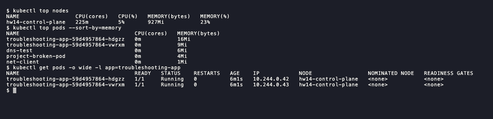
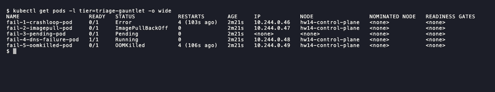
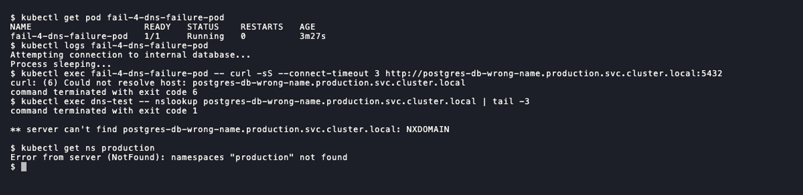
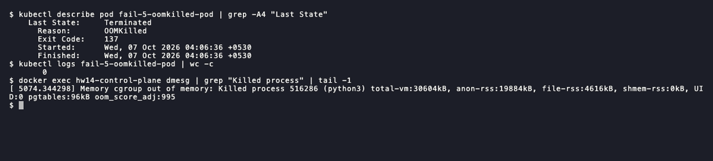
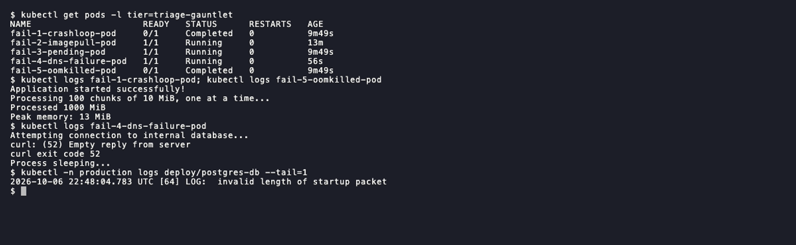

# Session 14: Kubernetes troubleshooting

- Name: Aditya Singhi
- Enrollment number: 24BCS10177

Everything below ran on a single node kind cluster named `hw14` (kind v0.33.0,
Kubernetes v1.37.0, containerd 2.3.4, kubectl v1.37.0). One node is enough
because none of these problems need traffic to cross nodes, and the Docker
Desktop VM (4 CPUs, 3.8 GiB) was shared with other clusters at the same time.
`kubectl top` needs metrics-server, so I installed v0.9.0 with
`--kubelet-insecure-tls`. Task 1 shows why that flag is needed on kind.

I ran the instructor's manifests from the session folder unedited. Three of them
are broken in ways the READMEs do not mention, and my fixed copies live in
`manifests/`. The broken manifests for issues that had no instructor example
(ErrImagePull by registry typo, ContainerCreating, configuration issues and pod
networking) are also in `manifests/`.

The shared VM turned out to matter. Under memory pressure my own control plane
broke several times during the session: the scheduler and controller-manager
lost leader election, and kube-proxy missed an update. Those were real incidents,
not planned ones, and I wrote them up where they happened because they were the
hardest things to diagnose all day.

## Task 1: troubleshooting commands

### kubectl get

```bash
kubectl apply -f 01-kubectl-get/pod.yaml
kubectl get pods
kubectl get nodes
```

```
NAME            READY   STATUS    RESTARTS   AGE
describe-demo   1/1     Running   0          109s
events-demo     1/1     Running   0          109s
exec-demo       1/1     Running   0          109s
get-demo        1/1     Running   0          109s
logs-demo       1/1     Running   0          109s

NAME                 STATUS   ROLES           AGE     VERSION
hw14-control-plane   Ready    control-plane   3m23s   v1.37.0
```

The columns to read first are `READY`, `STATUS` and `RESTARTS`. A pod can be
`Running` and still be `0/1` ready, so `STATUS` alone is not enough.

Labels and a single field with jsonpath:

```bash
kubectl get pods --show-labels
kubectl get pod get-demo -o jsonpath='{.status.podIP}{"  "}{.spec.nodeName}{"  "}{.status.qosClass}{"\n"}'
```

```
NAME            READY   STATUS    RESTARTS   AGE    LABELS
describe-demo   1/1     Running   0          114s   app=describe-demo
events-demo     1/1     Running   0          114s   <none>
exec-demo       1/1     Running   0          114s   <none>
get-demo        1/1     Running   0          114s   app=get-demo
logs-demo       1/1     Running   0          114s   <none>

10.244.0.7  hw14-control-plane  BestEffort
```

`--show-labels` is the command that solves most Service problems later in this
homework. Three of these demo pods have no labels at all, so no Service could
ever select them.

Watching a delete:

```bash
kubectl get pods -w &
kubectl delete pod get-demo
```

```
get-demo        1/1     Running   0          5s
get-demo        1/1     Terminating   0          7s
get-demo        1/1     Terminating   0          7s
get-demo        0/1     Completed     0          7s
get-demo        0/1     Completed     0          8s
get-demo        0/1     Completed     0          8s
```

The pod shows `Completed` on its way out because nginx exits 0 when it gets
SIGTERM. `-w` prints one line per change the API server sends, which is why the
same state repeats.

### kubectl describe

The folder README says `kubectl apply -f pod.yaml`, but the file in
`02-kubectl-describe/` is called `demo-pod.yaml`:

```
error: the path "pod.yaml" does not exist
pod/describe-demo created
```

```bash
kubectl describe pod describe-demo
```

```
Name:             describe-demo
Namespace:        default
Node:             hw14-control-plane/172.26.0.3
Labels:           app=describe-demo
Status:           Running
IP:               10.244.0.8
Containers:
  nginx:
    Image:          nginx:1.27
    State:          Running
      Started:      Wed, 07 Oct 2026 02:46:50 +0530
    Ready:          True
    Restart Count:  0
Conditions:
  Type                        Status
  PodReadyToStartContainers   True
  Initialized                 True
  Ready                       True
  ContainersReady             True
  PodScheduled                True
QoS Class:                   BestEffort
Events:
  Type     Reason     Age    From               Message
  ----     ------     ----   ----               -------
  Normal   Scheduled  2m13s  default-scheduler  Successfully assigned default/describe-demo to hw14-control-plane
  Normal   Pulling    2m13s  kubelet            spec.containers{nginx}: Pulling image "nginx:1.27"
  Warning  Failed     38s    kubelet            spec.containers{nginx}: Failed to pull image "nginx:1.27": failed to pull and unpack image "docker.io/library/nginx:1.27": failed to resolve reference "docker.io/library/nginx:1.27": failed to do request: Head "https://registry-1.docker.io/v2/library/nginx/manifests/1.27": dial tcp: lookup registry-1.docker.io on 192.168.65.254:53: server misbehaving
  Warning  Failed     38s    kubelet            spec.containers{nginx}: Error: ErrImagePull
  Normal   Pulled     37s    kubelet            spec.containers{nginx}: Container image "nginx:1.27" already present on machine and can be accessed by the pod
  Normal   Created    37s    kubelet            spec.containers{nginx}: Container created
  Normal   Started    37s    kubelet            spec.containers{nginx}: Container started
```

This was a "healthy" pod, and its events still hold a failure. The DNS lookup
for Docker Hub failed once inside the Docker VM (`server misbehaving`), so this
pod's pull failed with `ErrImagePull`. One second later another pod finished
pulling the same `nginx:1.27`, and this pod started with the image that was
already on the node. If I had only looked at `kubectl get` I would never have
known. It is also a good reminder that an `ErrImagePull` can be a network blip
and not a wrong image name.

`describe node` shows the conditions the scheduler cares about:

```bash
kubectl describe node hw14-control-plane
```

```
Conditions:
  Type             Status  Reason                       Message
  MemoryPressure   False   KubeletHasSufficientMemory   kubelet has sufficient memory available
  DiskPressure     False   KubeletHasNoDiskPressure     kubelet has no disk pressure
  PIDPressure      False   KubeletHasSufficientPID      kubelet has sufficient PID available
  Ready            True    KubeletReady                 kubelet is posting ready status
Allocated resources:
  Resource           Requests     Limits
  --------           --------     ------
  cpu                1050m (26%)  0 (0%)
  memory             490Mi (12%)  340Mi (8%)
```

### kubectl logs

```bash
kubectl apply -f 03-kubectl-logs/pod.yaml
kubectl logs logs-demo | head -8
kubectl logs logs-demo --tail=2 --timestamps
kubectl logs logs-demo -c app --tail=1
```

```
Application started
Connecting to database...
Database connection successful
Application is running
Application is healthy
Application is healthy
Application is healthy
Application is healthy

2026-10-06T21:17:28.472744793Z Application is healthy
2026-10-06T21:17:33.473408379Z Application is healthy

Application is healthy
```

The timestamps are 5 seconds apart, which matches the `sleep 5` in the loop.
Two errors worth knowing:

```bash
kubectl logs logs-demo --previous
kubectl logs logs-demo -c nginx
```

```
Error from server (BadRequest): previous terminated container "app" in pod "logs-demo" not found
error: container nginx is not valid for pod logs-demo out of: app
```

`--previous` only works once a container has restarted at least once. The
second error lists the real container names, which is handy for multi container
pods.

### kubectl exec

```bash
kubectl apply -f 04-kubectl-exec/pod.yaml
kubectl exec exec-demo -- hostname
kubectl exec exec-demo -- ls /usr/share/nginx/html
kubectl exec exec-demo -- curl -s localhost | head -4
kubectl exec exec-demo -- nginx -T 2>/dev/null | grep -E "listen|root" | head -3
```

```
exec-demo

50x.html
index.html

<!DOCTYPE html>
<html>
<head>
<title>Welcome to nginx!</title>

    listen       80;
    listen  [::]:80;
        root   /usr/share/nginx/html;
```

`curl localhost` from inside the pod proves nginx works, so if a Service fails
the problem is outside the container.

Not every tool is in every image:

```bash
kubectl exec exec-demo -- ps aux
```

```
error: Internal error occurred: ... exec: "ps": executable file not found in $PATH
```

The nginx image has no `ps`. An ephemeral debug container that shares the
process namespace gets around that without changing the pod:

```bash
kubectl debug exec-demo --image=busybox:1.36 --target=nginx -c debugger --profile=general -- ps aux
kubectl logs exec-demo -c debugger
```

```
PID   USER     TIME  COMMAND
    1 root      0:00 nginx: master process nginx -g daemon off;
   33 101       0:00 nginx: worker process
   34 101       0:00 nginx: worker process
   35 101       0:00 nginx: worker process
   36 101       0:00 nginx: worker process
   79 root      0:00 ps aux
```

Four workers because nginx defaults to one per CPU and the node has 4.

### kubectl events

```bash
kubectl apply -f 05-events/pod.yaml
kubectl events --for pod/events-demo
```

```
LAST SEEN   TYPE     REASON      OBJECT            MESSAGE
2m39s       Normal   Scheduled   Pod/events-demo   Successfully assigned default/events-demo to hw14-control-plane
2m38s       Normal   Pulling     Pod/events-demo   Pulling image "nginx:1.27"
52s         Normal   Pulled      Pod/events-demo   Successfully pulled image "nginx:1.27" in 3.137s (1m46.431s including waiting). Image size: 68857691 bytes.
52s         Normal   Created     Pod/events-demo   Container created
52s         Normal   Started     Pod/events-demo   Container started
```

"3.137s (1m46.431s including waiting)" means the pull itself was quick but the
kubelet spent almost two minutes waiting in line behind the other pulls.

Filtering for warnings is the fastest way through a noisy namespace:

```bash
kubectl events --types=Warning
kubectl get events --field-selector type=Warning,involvedObject.name=describe-demo
```

```
LAST SEEN   TYPE      REASON   OBJECT              MESSAGE
64s         Warning   Failed   Pod/describe-demo   Failed to pull image "nginx:1.27": ... lookup registry-1.docker.io on 192.168.65.254:53: server misbehaving
64s         Warning   Failed   Pod/describe-demo   Error: ErrImagePull
```

That is the same hidden failure from the describe section, found in one command.

```bash
kubectl get events --sort-by=.lastTimestamp
```

Four lines from the middle of that output:

```
29s         Normal    Started                   pod/get-demo              Container started
29s         Normal    Created                   pod/get-demo              Container created
29s         Normal    Pulled                    pod/get-demo              Container image "nginx:1.27" already present on machine and can be accessed by the pod
29s         Normal    Scheduled                 pod/get-demo              Successfully assigned default/get-demo to hw14-control-plane
```

Sorting by `lastTimestamp` puts `Started` before `Created` here because all four
events share the same second. Within one second the order is not reliable.

### kubectl explain

```bash
kubectl explain pod.spec.containers.imagePullPolicy
```

```
FIELD: imagePullPolicy <string>
ENUM:
    Always
    IfNotPresent
    Never

DESCRIPTION:
    Image pull policy. One of Always, Never, IfNotPresent. Defaults to Always if
    :latest tag is specified, or IfNotPresent otherwise. Cannot be updated.
```

```bash
kubectl explain service.spec.selector | head -12
kubectl explain pod.spec.containers.resources --recursive | head -20
kubectl explain pod.spec.containerz
```

```
FIELD: selector <map[string]string>

DESCRIPTION:
    Route service traffic to pods with label keys and values matching this
    selector. If empty or not present, the service is assumed to have an
    external process managing its endpoints, which Kubernetes will not modify.

FIELDS:
  claims	<[]ResourceClaim>
    name	<string> -required-
    request	<string>
  limits	<map[string]Quantity>
  requests	<map[string]Quantity>

error: field "containerz" does not exist
```

`explain` reads the schema from the live API server, so it matches the cluster
version and catches typos in field paths before they reach a manifest.

### kubectl top

Before metrics-server was ready:

```
error: Metrics API not available
```

After:

```bash
kubectl top nodes
kubectl top pods
kubectl top pods -A --sort-by=memory | head -5
kubectl top pod logs-demo --containers
```

```
NAME                 CPU(cores)   CPU(%)   MEMORY(bytes)   MEMORY(%)
hw14-control-plane   260m         6%       743Mi           18%

NAME            CPU(cores)   MEMORY(bytes)
describe-demo   0m           4Mi
events-demo     0m           4Mi
exec-demo       4m           11Mi
get-demo        0m           5Mi
logs-demo       1m           0Mi

NAMESPACE     NAME                                         CPU(cores)   MEMORY(bytes)
kube-system   kube-apiserver-hw14-control-plane            58m          228Mi
kube-system   kube-controller-manager-hw14-control-plane   17m          56Mi
kube-system   etcd-hw14-control-plane                      24m          38Mi
kube-system   kube-scheduler-hw14-control-plane            10m          27Mi

POD         NAME   CPU(cores)   MEMORY(bytes)
logs-demo   app    1m           0Mi
```



To see why kind needs `--kubelet-insecure-tls`, I removed the flag from the
running deployment:

```bash
kubectl -n kube-system patch deployment metrics-server --type=json \
  -p='[{"op":"remove","path":"/spec/template/spec/containers/0/args/5"}]'
kubectl -n kube-system logs -l k8s-app=metrics-server --tail=3
```

```
E1006 21:18:40.350014       1 scraper.go:149] "Failed to scrape node" err="Get \"https://172.26.0.3:10250/metrics/resource\": tls: failed to verify certificate: x509: cannot validate certificate for 172.26.0.3 because it doesn't contain any IP SANs" node="hw14-control-plane"
I1006 21:18:40.481787       1 server.go:192] "Failed probe" probe="metric-storage-ready" err="no metrics to serve"
```

The kubelet on kind serves a self-signed certificate with no IP SAN, so
metrics-server refuses it. The odd part was that `kubectl top nodes` kept
working the whole time. The new pod never became ready, so the rolling update
left the old, working pod in place:

```
NAME                              READY   STATUS    RESTARTS   AGE
metrics-server-6bcd67b6cf-lwv6r   0/1     Running   0          45s
metrics-server-84c99cb944-zfqrt   1/1     Running   0          3m47s
```

A readiness probe protected me from my own bad change. I put the flag back with
`kubectl -n kube-system rollout undo deployment/metrics-server`.

### kubectl get -o wide

```bash
kubectl get pods -o wide
kubectl get nodes -o wide
```

```
NAME            READY   STATUS    RESTARTS   AGE    IP            NODE                 NOMINATED NODE   READINESS GATES
describe-demo   1/1     Running   0          109s   10.244.0.8    hw14-control-plane   <none>           <none>
events-demo     1/1     Running   0          109s   10.244.0.10   hw14-control-plane   <none>           <none>
exec-demo       1/1     Running   0          109s   10.244.0.11   hw14-control-plane   <none>           <none>
get-demo        1/1     Running   0          109s   10.244.0.7    hw14-control-plane   <none>           <none>
logs-demo       1/1     Running   0          109s   10.244.0.9    hw14-control-plane   <none>           <none>

NAME                 STATUS   ROLES           AGE   VERSION   INTERNAL-IP   EXTERNAL-IP   OS-IMAGE                       KERNEL-VERSION             CONTAINER-RUNTIME
hw14-control-plane   Ready    control-plane   22s   v1.37.0   172.26.0.3    <none>        Debian GNU/Linux 13 (trixie)   6.12.76-linuxkit (arm64)   containerd://2.3.4
```

`-o wide` adds the pod IP and node. The pod IP is what I used later to test pod
networking without a Service in the way, and `NODE: <none>` is the quickest sign
that a pod was never scheduled.

## Task 2: troubleshooting common issues

Every issue below follows the same steps: problem, investigation, root cause,
fix, verification.

### CrashLoopBackOff

**Problem.** `06-crashloopbackoff/broken-pod.yaml` keeps restarting.

```bash
kubectl apply -f 06-crashloopbackoff/broken-pod.yaml
kubectl get pod crash-demo
```

```
crash-demo   0/1   Error   1 (7s ago)   8s
crash-demo   1/1   Running   2 (14s ago)   16s
crash-demo   0/1   Error   2 (23s ago)   25s
crash-demo   0/1   Error   3 (33s ago)   49s
crash-demo   0/1   Error   4 (62s ago)   105s
```

For the first two minutes `STATUS` said `Error`, not `CrashLoopBackOff`. I
sampled the column every 3 seconds for 90 seconds to see how often each value
shows up:

```
  20 CrashLoopBackOff 5
  10 Error 6
```

The column flips between the two. `Error` is the state right after the process
exits, and `CrashLoopBackOff` is the wait before the next attempt. Someone who
checks once and sees `Error` is looking at the same problem.

**Investigation.**

```bash
kubectl describe pod crash-demo
```

```
    State:          Waiting
      Reason:       CrashLoopBackOff
    Last State:     Terminated
      Reason:       Error
      Exit Code:    1
      Started:      Wed, 07 Oct 2026 02:54:49 +0530
      Finished:     Wed, 07 Oct 2026 02:54:49 +0530
    Ready:          False
    Restart Count:  6
Events:
  Normal   Pulled     83s (x7 over 7m9s)  kubelet            spec.containers{app}: Container image "busybox:1.36" already present on machine and can be accessed by the pod
  Normal   Started    82s (x7 over 7m9s)  kubelet            spec.containers{app}: Container started
  Warning  BackOff    1s (x10 over 7m8s)  kubelet            spec.containers{app}: Back-off restarting failed container app in pod crash-demo_default(0ff3b9dc-e500-4e12-ae36-58221fa6c5f5)
```

```bash
kubectl logs crash-demo
kubectl logs crash-demo --previous
kubectl exec crash-demo -- sh -c 'echo hi'
```

```
Application starting...
Something went wrong!

Application starting...
Something went wrong!

error: unable to upgrade connection: container not found ("app")
```

Started and finished in the same second, exit code 1. Six restarts in seven
minutes, because the kubelet doubles the wait after each crash (10s, 20s, 40s
and so on up to 5 minutes). `exec` is useless here since there is no running
container to enter.

**Root cause.** The command ends with `exit 1`. The image and node are fine.

**Fix.** My first try was to apply the fixed file over the running pod:

```bash
kubectl apply -f 06-crashloopbackoff/fixed-pod.yaml
```

```
The Pod "crash-demo" is invalid: spec: Forbidden: pod updates may not change fields other than `spec.containers[*].image`,`spec.initContainers[*].image`,`spec.activeDeadlineSeconds`,`spec.tolerations` (only additions to existing tolerations),`spec.terminationGracePeriodSeconds` (allow it to be set to 1 if it was previously negative)
-    "echo \"Application starting...\"\necho \"Something went wrong!\"\nexit 1\n"
+    "echo \"Application starting...\"\necho \"Application is healthy\"\nsleep 3600\n"
```

A pod's command cannot change, so the pod has to be replaced:

```bash
kubectl delete pod crash-demo
kubectl apply -f 06-crashloopbackoff/fixed-pod.yaml
```

**Verification.**

```
NAME         READY   STATUS    RESTARTS   AGE
crash-demo   1/1     Running   0          21s
Application starting...
Application is healthy
```

Before: `0/1 CrashLoopBackOff 6`. After: `1/1 Running 0`.

Deleting the fixed pod later took 31 seconds:

```
kubectl delete pod crash-demo  0.04s user 0.05s system 0% cpu 31.250 total
```

`sh` runs as PID 1 and PID 1 ignores SIGTERM unless it installs a handler, so the
kubelet waits the full 30 second grace period and then sends SIGKILL.

### ImagePullBackOff

**Problem.** `07-imagepullbackoff/broken-pod.yaml` never starts. I sampled its
status every 2 seconds:

```
   4 02:57:57 0/1 ContainerCreating 0
   6 02:58:05 0/1 ErrImagePull 0
   7 02:58:18 0/1 ImagePullBackOff 0
   5 02:58:34 0/1 ErrImagePull 0
   5 02:58:49 0/1 ImagePullBackOff 0
   3 02:59:03 0/1 ErrImagePull 0
```

**Investigation.**

```bash
kubectl describe pod image-demo
kubectl logs image-demo
```

```
    Image:          nginx:this-image-does-not-exist
    State:          Waiting
      Reason:       ErrImagePull
Events:
  Normal   Pulling    25s (x3 over 75s)  kubelet            spec.containers{app}: Pulling image "nginx:this-image-does-not-exist"
  Warning  Failed     23s (x3 over 69s)  kubelet            spec.containers{app}: Failed to pull image "nginx:this-image-does-not-exist": rpc error: code = NotFound desc = failed to pull and unpack image "docker.io/library/nginx:this-image-does-not-exist": failed to resolve reference "docker.io/library/nginx:this-image-does-not-exist": docker.io/library/nginx:this-image-does-not-exist: not found
  Warning  Failed     23s (x3 over 69s)  kubelet            spec.containers{app}: Error: ErrImagePull
  Normal   BackOff    12s (x3 over 68s)  kubelet            spec.containers{app}: Back-off pulling image "nginx:this-image-does-not-exist"
  Warning  Failed     12s (x3 over 68s)  kubelet            spec.containers{app}: Error: ImagePullBackOff

Error from server (BadRequest): container "app" in pod "image-demo" is waiting to start: image can't be pulled
```

`logs` has nothing to give because no container ever existed. The event message
does all the work. `code = NotFound` with `...: not found` means the registry
answered and the repository exists, but the tag does not.

**Root cause.** The tag `this-image-does-not-exist` is not on Docker Hub.

**Fix.** Unlike the CrashLoopBackOff case, `image` is one of the few pod fields
that can change in place, so a plain apply works without deleting anything:

```bash
kubectl apply -f 07-imagepullbackoff/fixed-pod.yaml
```

```
pod/image-demo configured
```

**Verification.**

```
NAME         READY   STATUS    RESTARTS   AGE
image-demo   1/1     Running   0          83s
4s (x4 over 75s)    Warning   Failed      Pod/image-demo   Error: ImagePullBackOff
1s                  Normal    Pulled      Pod/image-demo   Container image "nginx:1.27" already present on machine and can be accessed by the pod
0s                  Normal    Started     Pod/image-demo   Container started
```

Same pod, age 83s, now running.

### ErrImagePull

`ErrImagePull` and `ImagePullBackOff` are the same problem seen at different
moments. `ErrImagePull` is a pull that just failed, and `ImagePullBackOff` is
the kubelet waiting before it tries again. To see a different cause than a bad
tag, I wrote `manifests/errimagepull/broken-pod.yaml` with a typo in the
registry host: `regsitry.k8s.io/pause:3.10`.

**Problem.**

```bash
kubectl apply -f homework-kubernetes-troubleshooting/manifests/errimagepull/broken-pod.yaml
kubectl get pod registry-typo-demo
```

```
NAME                 READY   STATUS    RESTARTS   AGE
registry-typo-demo   0/1     Pending   0          16s
Events:                      <none>
```

`Pending` with no events at all was not what I expected for an image problem.
The pod had not been scheduled yet, because my scheduler had just restarted:

```bash
kubectl -n kube-system get pods
kubectl -n kube-system logs kube-scheduler-hw14-control-plane --previous --tail=1
kubectl -n kube-system logs kube-controller-manager-hw14-control-plane --previous --tail=4
```

```
kube-controller-manager-hw14-control-plane   1/1     Running   1 (55s ago)   17m
kube-scheduler-hw14-control-plane            1/1     Running   1 (50s ago)   17m

E1006 21:30:06.911269       1 server.go:337] "Leaderelection lost"

E1006 21:30:01.236978       1 leaderelection.go:473] "Error retrieving lease lock" err="Get \"https://172.26.0.3:6443/apis/coordination.k8s.io/v1/namespaces/kube-system/leases/kube-controller-manager?timeout=5s\": context deadline exceeded" lock="kube-system/kube-controller-manager"
I1006 21:30:01.283231       1 leaderelection.go:304] "Failed to renew lease" lock="kube-system/kube-controller-manager" err="context deadline exceeded"
E1006 21:30:01.841918       1 controllermanager.go:413] "leaderelection lost/stopped"
```

The scheduler and controller-manager each renew a lease through the API server.
When the API server took longer than 5 seconds to answer, they could not renew,
and they exit on purpose rather than risk two leaders. The cause was the VM:

```
hw13-control-plane 103.01% 712MiB / 3.827GiB
hw14-control-plane 44.15% 655MiB / 3.827GiB
hw15-control-plane 35.10% 586.2MiB / 3.827GiB
hw16-control-plane 45.51% 607.9MiB / 3.827GiB
hw17-control-plane 26.23% 430.5MiB / 3.827GiB
```

Five kind clusters on one 3.8 GiB VM. A pod that is `Pending` with zero events
means no scheduler has looked at it yet, which points at the control plane, not
at the pod.

**Investigation.** Once the scheduler came back:

```
NAME                 READY   STATUS             RESTARTS   AGE
registry-typo-demo   0/1     ImagePullBackOff   0          69s
Events:
  Normal   Scheduled  57s                default-scheduler  Successfully assigned default/registry-typo-demo to hw14-control-plane
  Normal   Pulling    9s (x3 over 53s)   kubelet            spec.containers{pause}: Pulling image "regsitry.k8s.io/pause:3.10"
  Warning  Failed     9s (x3 over 52s)   kubelet            spec.containers{pause}: Failed to pull image "regsitry.k8s.io/pause:3.10": failed to pull and unpack image "regsitry.k8s.io/pause:3.10": failed to resolve reference "regsitry.k8s.io/pause:3.10": failed to do request: Head "https://regsitry.k8s.io/v2/pause/manifests/3.10": dial tcp: lookup regsitry.k8s.io on 192.168.65.254:53: no such host
  Warning  Failed     9s (x3 over 52s)   kubelet            spec.containers{pause}: Error: ErrImagePull
```

`Scheduled 57s` on a 69s old pod is the 12 second scheduler gap from above. The
message `no such host` is different from the `not found` in the previous
section. Here DNS failed before any registry was contacted. I checked from the
node itself:

```bash
docker exec hw14-control-plane getent hosts regsitry.k8s.io; echo "exit=$?"
docker exec hw14-control-plane getent hosts registry.k8s.io
```

```
exit=2
34.96.108.209   registry.k8s.io
```

**Root cause.** The registry host is misspelled, so the node cannot resolve it.
The three image errors I saw in this homework read differently and mean
different things:

| Message | Meaning |
|---|---|
| `no such host` | Registry name is wrong, or node DNS is broken |
| `server misbehaving` | DNS failed for a moment, retry may work (Task 1) |
| `not found` | Registry and repository exist, tag does not |
| `pull access denied, repository does not exist or may require authorization` | Repository missing or private (scenario 2) |

**Fix and verification.**

```bash
kubectl apply -f homework-kubernetes-troubleshooting/manifests/errimagepull/fixed-pod.yaml
```

```
pod/registry-typo-demo configured
pod/registry-typo-demo condition met
NAME                 READY   STATUS    RESTARTS   AGE
registry-typo-demo   1/1     Running   0          85s
4s                  Normal    Pulled      Pod/registry-typo-demo   Container image "registry.k8s.io/pause:3.10" already present on machine and can be accessed by the pod
```

kind nodes ship with `pause:3.10` preloaded, so once the name was right no
download was needed.

### Pending

**Problem.** `08-pending-pods/broken-pod.yaml` stays `Pending`.

```bash
kubectl apply -f 08-pending-pods/broken-pod.yaml
kubectl get pod pending-demo -o wide
```

```
NAME           READY   STATUS    RESTARTS   AGE   IP       NODE     NOMINATED NODE   READINESS GATES
pending-demo   0/1     Pending   0          11s   <none>   <none>   <none>           <none>
```

**Investigation.**

```bash
kubectl describe pod pending-demo
kubectl get nodes --show-labels
```

```
Node:             <none>
Conditions:
  Type           Status
  PodScheduled   False
Node-Selectors:              kubernetes.io/hostname=node-that-does-not-exist
Events:
  Warning  FailedScheduling  10s   default-scheduler  0/1 nodes are available: 1 node(s) didn't match Pod's node affinity/selector. preemption: 0/1 nodes are available: 1 Preemption is not helpful for scheduling.

kubernetes.io/hostname=hw14-control-plane
```

This time there is a `FailedScheduling` event, so the scheduler is alive and is
telling me exactly why.

**Root cause.** The `nodeSelector` asks for a hostname that no node has.

**Fix.** `nodeSelector` cannot change on an existing pod either:

```
The Pod "pending-demo" is invalid: spec: Forbidden: pod updates may not change fields other than `spec.containers[*].image`,...
```

```bash
kubectl delete pod pending-demo
kubectl apply -f 08-pending-pods/fixed-pod.yaml
```

**Verification.**

```
NAME           READY   STATUS    RESTARTS   AGE   IP            NODE                 NOMINATED NODE   READINESS GATES
pending-demo   1/1     Running   0          5s    10.244.0.21   hw14-control-plane   <none>           <none>
4s          Normal    Scheduled          Pod/pending-demo   Successfully assigned default/pending-demo to hw14-control-plane
```

Scenario 3 below covers the other common cause, requests that are too large.

### ContainerCreating

There is no instructor manifest for this one. `manifests/containercreating/broken-pod.yaml`
mounts a ConfigMap called `site-content` as the nginx web root, and the
ConfigMap does not exist.

**Problem.**

```bash
kubectl apply -f homework-kubernetes-troubleshooting/manifests/containercreating/broken-pod.yaml
kubectl get pod mount-demo
```

```
NAME         READY   STATUS              RESTARTS   AGE
mount-demo   0/1     ContainerCreating   0          46s
```

`ContainerCreating` is normal for a few seconds while an image pulls. At 46
seconds with a local image it is stuck.

**Investigation.**

```bash
kubectl describe pod mount-demo
kubectl logs mount-demo
kubectl get configmap
```

```
    State:          Waiting
      Reason:       ContainerCreating
Volumes:
  site:
    Type:      ConfigMap (a volume populated by a ConfigMap)
    Name:      site-content
    Optional:  false
Events:
  Normal   Scheduled    45s                default-scheduler  Successfully assigned default/mount-demo to hw14-control-plane
  Warning  FailedMount  13s (x7 over 45s)  kubelet            MountVolume.SetUp failed for volume "site" : configmap "site-content" not found

Error from server (BadRequest): container "nginx" in pod "mount-demo" is waiting to start: ContainerCreating

NAME               DATA   AGE
kube-root-ca.crt   1      19m
```

**Root cause.** The kubelet sets up every volume before it creates the
container. A volume that points at a missing ConfigMap blocks that step, and the
pod waits forever because `Optional: false`.

**Fix.** Create the missing object. The pod does not need to be touched:

```bash
kubectl apply -f homework-kubernetes-troubleshooting/manifests/containercreating/site-content.yaml
```

**Verification.**

```
configmap/site-content created
03:03:12
pod/mount-demo condition met
03:03:28
NAME         READY   STATUS    RESTARTS   AGE
mount-demo   1/1     Running   0          67s
<h1>mount-demo is serving from a ConfigMap</h1>
```

The pod started 16 seconds after the ConfigMap appeared, because the kubelet
retries mounts on its own backoff. The `curl localhost` output is the HTML from
the ConfigMap, so the mount really worked.

### Service connectivity issues

The instructor's `09-service-dns-troubleshooting/service.yaml` is broken, and
the folder README does not say so. The README says the selector is `app: web`.
The file says:

```yaml
  selector:
    app: web-ahsgdf
```

That made it a real Service problem without me breaking anything.

**Problem.**

```bash
kubectl apply -f 09-service-dns-troubleshooting/deployment.yaml -f 09-service-dns-troubleshooting/service.yaml
kubectl exec net-client -- wget -qO- -T 3 http://web-service
```

```
wget: can't connect to remote host (10.96.92.187): Connection refused
command terminated with exit code 1
```

`net-client` is a busybox pod from `manifests/service-connectivity/net-client.yaml`.
I needed it because the instructor's `dns-test` image has no HTTP client (see the
DNS section).

**Investigation.**

```bash
kubectl describe svc web-service
kubectl get endpoints web-service
kubectl get endpointslices -l kubernetes.io/service-name=web-service
kubectl get pods -l app --show-labels
kubectl exec dns-test -- nslookup web-service
```

```
Selector:                 app=web-ahsgdf
TargetPort:               80/TCP
Endpoints:

Warning: v1 Endpoints is deprecated in v1.33+; use discovery.k8s.io/v1 EndpointSlice
NAME          ENDPOINTS   AGE
web-service   <none>      13m

NAME                ADDRESSTYPE   PORTS     ENDPOINTS   AGE
web-service-rv295   IPv4          <unset>   <unset>     13m

NAME                   READY   STATUS    RESTARTS   AGE   LABELS
web-557577df75-5vplh   1/1     Running   0          13m   app=web,pod-template-hash=557577df75
web-557577df75-c74rp   1/1     Running   0          13m   app=web,pod-template-hash=557577df75

Name:	web-service.default.svc.cluster.local
Address: 10.96.92.187
```

DNS works and the Service has an IP, so the name is fine. The pods work too,
since hitting a pod IP directly returns nginx:

```bash
kubectl exec net-client -- wget -qO- -T 3 http://10.244.0.25 | grep title
```

```
<title>Welcome to nginx!</title>
```

The break is between the Service and the pods. Also note `Connection refused`
rather than a timeout: kube-proxy installs a REJECT rule for a Service with no
endpoints, so the client fails fast.

**Root cause.** The selector `app=web-ahsgdf` matches no pod. The pods are
labelled `app=web`.

**Fix.** My copy is `manifests/service-connectivity/service.yaml`:

```bash
kubectl apply -f homework-kubernetes-troubleshooting/manifests/service-connectivity/service.yaml
```

```
9c9
<     app: web-ahsgdf
---
>     app: web
service/web-service configured
```

**Verification.**

```
NAME                ADDRESSTYPE   PORTS   ENDPOINTS                 AGE
web-service-rv295   IPv4          80      10.244.0.26,10.244.0.25   14m
Selector:                 app=web
Endpoints:                10.244.0.26:80,10.244.0.25:80
<title>Welcome to nginx!</title>
```

The instructor's own `broken-service.yaml` behaves the same way:

```
service/broken-service created
NAME                   ADDRESSTYPE   PORTS     ENDPOINTS   AGE
broken-service-ms8pr   IPv4          <unset>   <unset>     2s
wget: can't connect to remote host (10.96.230.183): Connection refused
```

#### Endpoints present, still refused

An empty endpoint list is the easy case. I also wrote
`manifests/service-connectivity/wrong-targetport-service.yaml`, which selects
the right pods but sends traffic to port 8080:

```
service/web-wrong-port created
NAME                   ADDRESSTYPE   PORTS   ENDPOINTS                 AGE
web-wrong-port-sv8zs   IPv4          8080    10.244.0.25,10.244.0.26   3s
wget: can't connect to remote host (10.96.143.50): Connection refused
wget: can't connect to remote host (10.244.0.25): Connection refused
```

Endpoints look healthy, yet the connection is refused, both through the Service
and straight to the pod on 8080. nginx has no `netstat` or `ss`, so I read the
kernel's socket table:

```bash
kubectl exec deploy/web -- sh -c 'cat /proc/net/tcp | awk "NR>1 && \$4==\"0A\" {print \$2}"'
```

```
00000000:0050
```

State `0A` is LISTEN and `0x0050` is port 80. So the root cause is `targetPort:
8080` where the process listens on 80. Patching it fixed the Service:

```bash
kubectl patch svc web-wrong-port --type json -p '[{"op":"replace","path":"/spec/ports/0/targetPort","value":80}]'
```

```
web-wrong-port-sv8zs   IPv4          80      10.244.0.26,10.244.0.25   18s
<title>Welcome to nginx!</title>
```

### DNS issues

#### The instructor's DNS test pod does not start

```bash
kubectl apply -f 09-service-dns-troubleshooting/dns-test-pod.yaml
kubectl describe pod dns-test
```

```
  Warning  Failed     5m58s (x5 over 10m)   kubelet            spec.containers{dns-test}: Failed to pull image "registry.k8s.io/e2e-test-images/dnsutils:1.3": rpc error: code = NotFound desc = failed to pull and unpack image "registry.k8s.io/e2e-test-images/dnsutils:1.3": failed to resolve reference "registry.k8s.io/e2e-test-images/dnsutils:1.3": registry.k8s.io/e2e-test-images/dnsutils:1.3: not found
  Warning  Failed     3m38s (x12 over 10m)  kubelet            spec.containers{dns-test}: Error: ImagePullBackOff
```

I asked the registry which tags exist:

```bash
curl -sSL https://registry.k8s.io/v2/e2e-test-images/dnsutils/tags/list
curl -sSL https://registry.k8s.io/v2/e2e-test-images/jessie-dnsutils/tags/list
```

```
{"child":[],"manifest":{},"name":"k8s-artifacts-prod/images/e2e-test-images/dnsutils","tags":[]}
['1.2', '1.3', '1.4', '1.5', '1.7', ...]
```

`dnsutils` has no tags at all. The image the Kubernetes DNS debugging page uses
is `jessie-dnsutils`. My fixed copy is `manifests/dns/dns-test-pod.yaml`, and
since the image is mutable a plain apply fixed the existing pod:

```
pod/dns-test configured
pod/dns-test condition met
NAME       READY   STATUS    RESTARTS   AGE
dns-test   1/1     Running   0          13m
```

The folder README then runs `kubectl exec dns-test -- wget -qO- http://web-service`.
That cannot work with this image either:

```bash
kubectl exec dns-test -- sh -c 'for t in wget curl nc dig nslookup; do command -v $t || echo "no $t"; done'
```

```
no wget
no curl
no nc
/usr/bin/dig
/usr/bin/nslookup
```

It is a DNS tool image only, which is why I used the busybox `net-client` pod for
HTTP tests.

#### Healthy DNS baseline

```bash
kubectl exec dns-test -- cat /etc/resolv.conf
kubectl exec dns-test -- nslookup web-service.default.svc.cluster.local
kubectl -n kube-system get pods -l k8s-app=kube-dns -o wide
kubectl -n kube-system logs -l k8s-app=kube-dns --tail=5
```

```
search default.svc.cluster.local svc.cluster.local cluster.local
nameserver 10.96.0.10
options ndots:5

Name:	web-service.default.svc.cluster.local
Address: 10.96.92.187

NAME                       READY   STATUS    RESTARTS   AGE   IP           NODE                 NOMINATED NODE   READINESS GATES
coredns-559f6c778d-kktlh   1/1     Running   0          40m   10.244.0.3   hw14-control-plane   <none>           <none>
coredns-559f6c778d-zn7t8   1/1     Running   0          40m   10.244.0.4   hw14-control-plane   <none>           <none>

[WARNING] plugin/health: Local health request to "http://:8080/health" took more than 1s: 1.368083626s
[WARNING] plugin/health: Local health request to "http://:8080/health" took more than 1s: 2.659459834s
```

`ndots:5` plus the search list is why a short name like `web-service` works.
Any name with fewer than five dots is tried with each search suffix first. The
CoreDNS warnings were another sign of the CPU contention on the VM.

#### DNS outage

**Problem.** To see a real DNS failure, I scaled CoreDNS to zero:

```bash
kubectl -n kube-system scale deploy coredns --replicas=0
kubectl exec dns-test -- nslookup -timeout=3 web-service
kubectl exec net-client -- wget -qO- -T 3 http://web-service
kubectl exec net-client -- wget -qO- -T 3 http://10.96.92.187 | grep title
```

```
;; connection timed out; no servers could be reached
command terminated with exit code 1

wget: bad address 'web-service'

<title>Welcome to nginx!</title>
```

The scale did not take effect for over a minute (`coredns 2/0`), because the
controller-manager was restarting again. When it did, names stopped resolving
while the Service IP still worked. That split is the signature of a DNS problem.

**Investigation.**

```bash
kubectl -n kube-system get pods -l k8s-app=kube-dns
kubectl -n kube-system get endpointslices -l kubernetes.io/service-name=kube-dns
kubectl -n kube-system get deploy coredns
```

```
No resources found in kube-system namespace.
NAME             ADDRESSTYPE   PORTS     ENDPOINTS   AGE
kube-dns-s8gw2   IPv4          <unset>   <unset>     43m
NAME      READY   UP-TO-DATE   AVAILABLE   AGE
coredns   0/0     0            0           43m
```

**Root cause.** No CoreDNS pods, so the `kube-dns` Service has no endpoints.

**Fix.**

```bash
kubectl -n kube-system scale deploy coredns --replicas=2
```

**Verification, first attempt.** It did not work:

```
NAME                       READY   STATUS    RESTARTS   AGE
coredns-559f6c778d-m769n   1/1     Running   0          2m13s
coredns-559f6c778d-xhtgr   1/1     Running   0          2m13s
NAME             ADDRESSTYPE   PORTS        ENDPOINTS                 AGE
kube-dns-s8gw2   IPv4          53,53,9153   10.244.0.28,10.244.0.29   48m
;; connection timed out; no servers could be reached
wget: bad address 'web-service'
```

Pods ready, endpoints listed, DNS still dead. Asking a CoreDNS pod directly by
its IP worked:

```bash
kubectl exec dns-test -- nslookup -timeout=3 web-service 10.244.0.28
```

```
Server:		10.244.0.28
Address:	10.244.0.28#53

Name:	web-service.default.svc.cluster.local
Address: 10.96.92.187
```

So CoreDNS was fine and the Service IP `10.96.0.10` was not. That path is
kube-proxy's job. Its log and the node's iptables rules showed the problem:

```bash
kubectl -n kube-system logs kube-proxy-lnkdt --tail=8
docker exec hw14-control-plane sh -c 'iptables-save -t filter | grep kube-dns'
```

```
I1006 21:44:03.584666       1 reflector.go:664] "Warning: watch ended with error" reflector="k8s.io/client-go/informers/factory.go:178" type="*v1.EndpointSlice" err="an error on the server (\"unable to decode an event from the watch stream: http2: cl

-A KUBE-SERVICES -d 10.96.0.10/32 -p udp -m comment --comment "kube-system/kube-dns:dns has no endpoints" -m udp --dport 53 -j REJECT --reject-with icmp-port-unreachable
-A KUBE-SERVICES -d 10.96.0.10/32 -p tcp -m comment --comment "kube-system/kube-dns:dns-tcp has no endpoints" -m tcp --dport 53 -j REJECT --reject-with icmp-port-unreachable
```

kube-proxy's watch on EndpointSlices broke while the API server was overloaded,
so it never saw the new endpoints. It still had the "has no endpoints" REJECT
rule from when CoreDNS was at zero. The API had the right state and the node had
the old state. I restarted kube-proxy so it would rebuild its rules from a fresh
list:

```bash
kubectl -n kube-system delete pod -l k8s-app=kube-proxy
```

**Verification.**

```
NAME               READY   STATUS    RESTARTS   AGE
kube-proxy-b9nnh   1/1     Running   0          24s
0
-A KUBE-SERVICES -d 10.96.0.10/32 -p udp -m comment --comment "kube-system/kube-dns:dns cluster IP" -m udp --dport 53 -j KUBE-SVC-TCOU7JCQXEZGVUNU
-A KUBE-SVC-TCOU7JCQXEZGVUNU -m comment --comment "kube-system/kube-dns:dns -> 10.244.0.28:53" -m statistic --mode random --probability 0.50000000000 -j KUBE-SEP-WYF5MQOXI2X726RO
Server:		10.96.0.10
Address:	10.96.0.10#53

Name:	web-service.default.svc.cluster.local
Address: 10.96.92.187

<title>Welcome to nginx!</title>
```

Zero REJECT rules for kube-dns, a 50/50 split across the two CoreDNS pods, and
names resolve again. This is the most useful thing I learned all session.
"Endpoints look correct" is what the API says, and the node can disagree with it.
Testing a backend pod IP directly is what split the problem in half.

Scenario 4 below covers the other common DNS problem, a wrong name.

### Pod networking issues

There is no instructor manifest for this. `manifests/pod-networking/broken-pod.yaml`
runs busybox `httpd` on port 8080, bound to `127.0.0.1`.

**Problem.**

```bash
kubectl apply -f homework-kubernetes-troubleshooting/manifests/pod-networking/broken-pod.yaml
kubectl exec net-client -- wget -qO- -T 3 http://10.244.0.30:8080
```

```
wget: can't connect to remote host (10.244.0.30): Connection refused
command terminated with exit code 1
```

**Investigation.** I worked from the bottom up:

```bash
kubectl exec net-client -- ping -c 2 -W 2 10.244.0.30
kubectl exec api-server -- wget -qO- -T 3 http://127.0.0.1:8080
kubectl exec api-server -- netstat -tln
kubectl logs api-server
```

```
64 bytes from 10.244.0.30: seq=0 ttl=63 time=6.974 ms
64 bytes from 10.244.0.30: seq=1 ttl=63 time=12.047 ms
2 packets transmitted, 2 packets received, 0% packet loss

hello from api-server

Proto Recv-Q Send-Q Local Address           Foreign Address         State
tcp        0      0 127.0.0.1:8080          0.0.0.0:*               LISTEN

127.0.0.1:51584: response:200
```

Ping works, so the pod network routes packets between the two pods. The server
answers from inside its own pod. The only request in its log came from
`127.0.0.1`.

**Root cause.** `netstat` shows the listener on `127.0.0.1:8080`. Loopback is
private to the pod's network namespace, so nothing outside the pod can reach it.
This is the "works on my machine" bug for containers, and `kubectl exec ... curl
localhost` would have hidden it.

**Fix.** `manifests/pod-networking/fixed-pod.yaml` binds to `0.0.0.0:8080`.
The command is immutable, so the pod is replaced:

```bash
kubectl delete pod api-server --grace-period=1
kubectl apply -f homework-kubernetes-troubleshooting/manifests/pod-networking/fixed-pod.yaml
```

The first attempt timed out with `pod api-server does not have a host assigned`.
My scheduler and controller-manager were both in `CrashLoopBackOff` themselves
after seven leader election losses:

```
kube-controller-manager-hw14-control-plane   0/1     CrashLoopBackOff   7 (3m9s ago)   57m
kube-scheduler-hw14-control-plane            0/1     CrashLoopBackOff   7 (3m9s ago)   57m
```

These are static pods, so the kubelet restarts them with the same backoff as any
other container. After about five minutes it ran again and the pod was placed.

**Verification.**

```
Proto Recv-Q Send-Q Local Address           Foreign Address         State
tcp        0      0 0.0.0.0:8080            0.0.0.0:*               LISTEN
hello from api-server
10.244.0.27:55508: response:200
```

The log now shows the request coming from `10.244.0.27`, the `net-client` pod.

#### A NetworkPolicy that blocks the client

kindnet in kind v0.33 enforces NetworkPolicy, so I also tried the other common
pod networking cause. `manifests/pod-networking/networkpolicy.yaml` allows
ingress to `app=api-server` only from pods labelled `access=api-server`.

```bash
kubectl apply -f homework-kubernetes-troubleshooting/manifests/pod-networking/networkpolicy.yaml
kubectl exec net-client -- wget -qO- -T 3 http://10.244.0.31:8080
kubectl exec net-client -- ping -c 1 -W 2 10.244.0.31
```

```
wget: download timed out
command terminated with exit code 1
1 packets transmitted, 0 packets received, 100% packet loss
```

A timeout, not `Connection refused`. A refusal means a packet reached something
that said no. A timeout means the packet was dropped on the way, and a policy
drop looks exactly like that.

```bash
kubectl describe networkpolicy api-server-allow-clients
kubectl get pod net-client api-server --show-labels
```

```
Spec:
  PodSelector:     app=api-server
  Allowing ingress traffic:
    To Port: 8080/TCP
    From:
      PodSelector: access=api-server
  Not affecting egress traffic
  Policy Types: Ingress
NAME         READY   STATUS    RESTARTS   AGE     LABELS
net-client   1/1     Running   0          24m     <none>
api-server   1/1     Running   0          4m58s   app=api-server
```

The client has no `access=api-server` label. Adding it fixed the client, and a
pod without the label stayed blocked:

```bash
kubectl label pod net-client access=api-server
kubectl exec net-client -- wget -qO- -T 3 http://10.244.0.31:8080
kubectl exec dns-test -- sh -c "timeout 3 bash -c '</dev/tcp/10.244.0.31/8080' && echo open || echo blocked"
```

```
pod/net-client labeled
hello from api-server
blocked
```

### Configuration issues

`manifests/configuration/broken-pod.yaml` creates a ConfigMap with `LOG_LEVEL`
and `APP_PORT`, and a pod that reads three values: `LOG_LEVEL`, `APP_MODE` from
the ConfigMap, and `password` from a Secret called `app-db-secret`. Two of those
three do not exist.

**Problem.**

```bash
kubectl apply -f homework-kubernetes-troubleshooting/manifests/configuration/broken-pod.yaml
kubectl get pod config-demo
```

```
NAME          READY   STATUS                       RESTARTS   AGE
config-demo   0/1     CreateContainerConfigError   0          15s
```

**Investigation.**

```bash
kubectl describe pod config-demo
kubectl get configmap app-config -o jsonpath='{.data}{"\n"}'
kubectl get secret app-db-secret
```

```
    State:          Waiting
      Reason:       CreateContainerConfigError
    Environment:
      LOG_LEVEL:    <set to the key 'LOG_LEVEL' of config map 'app-config'>  Optional: false
      APP_MODE:     <set to the key 'APP_MODE' of config map 'app-config'>   Optional: false
      DB_PASSWORD:  <set to the key 'password' in secret 'app-db-secret'>    Optional: false
Events:
  Warning  Failed     14s (x2 over 15s)  kubelet            spec.containers{app}: Error: couldn't find key APP_MODE in ConfigMap default/app-config

{"APP_PORT":"8080","LOG_LEVEL":"info"}
Error from server (NotFound): secrets "app-db-secret" not found
```

The event only mentions `APP_MODE`. The missing Secret is not in the events at
all, even though it is just as broken. The kubelet stops at the first error it
finds.

**Root cause.** A missing ConfigMap key and a missing Secret. To prove the
kubelet hides the second problem, I fixed only the first one:

```bash
kubectl patch configmap app-config --type merge -p '{"data":{"APP_MODE":"production"}}'
kubectl events --for pod/config-demo --types=Warning
```

```
NAME          READY   STATUS                       RESTARTS   AGE
config-demo   0/1     CreateContainerConfigError   0          53s
LAST SEEN           TYPE      REASON   OBJECT            MESSAGE
38s (x3 over 52s)   Warning   Failed   Pod/config-demo   Error: couldn't find key APP_MODE in ConfigMap default/app-config
8s (x2 over 22s)    Warning   Failed   Pod/config-demo   Error: secret "app-db-secret" not found
```

Same status, new message. With config errors, I check every reference in the
`Environment` block against the cluster instead of fixing one event at a time.

**Fix.** `manifests/configuration/fixed-config.yaml` holds the full ConfigMap
and the Secret, with `stringData` so I do not hand-encode base64:

```bash
kubectl apply -f homework-kubernetes-troubleshooting/manifests/configuration/fixed-config.yaml
```

**Verification.**

```
configmap/app-config configured
secret/app-db-secret created
pod/config-demo condition met
NAME          READY   STATUS    RESTARTS   AGE
config-demo   1/1     Running   0          65s
LOG_LEVEL=info APP_MODE=production DB_PASSWORD set: yes
```

The same pod started without being recreated. Unlike a running container, a pod
stuck in `CreateContainerConfigError` reads its env again on every retry.

### The five scenarios (triage gauntlet)

```bash
bash scenarios/triage_all.sh
```

```
==================================================
      KUBERNETES INCIDENT TRIAGE GAUNTLET
==================================================
Deploying 5 intentionally broken production workloads...

pod/fail-1-crashloop-pod created
pod/fail-2-imagepull-pod created
pod/fail-3-pending-pod created
pod/fail-4-dns-failure-pod created
pod/fail-5-oomkilled-pod created

Workloads deployed! Sleeping 5s to allow states to settle...

=== CURRENT CLUSTER CARNAGE ===
NAME                     READY   STATUS              RESTARTS   AGE
fail-1-crashloop-pod     0/1     ContainerCreating   0          7s
fail-2-imagepull-pod     0/1     ContainerCreating   0          6s
fail-3-pending-pod       0/1     Pending             0          6s
fail-4-dns-failure-pod   0/1     ContainerCreating   0          6s
fail-5-oomkilled-pod     0/1     ContainerCreating   0          5s
==================================================
Your mission: Diagnose and fix each of the 5 pods!
Follow the diagnostic guide in README.md!
==================================================
```

The script says to follow a README, but `scenarios/` has no README. Five
seconds is also too short for anything to fail yet. Ninety seconds later:

```
NAME                     READY   STATUS             RESTARTS      AGE    IP            NODE                 NOMINATED NODE   READINESS GATES
fail-1-crashloop-pod     0/1     Error              3 (63s ago)   104s   10.244.0.32   hw14-control-plane   <none>           <none>
fail-2-imagepull-pod     0/1     ImagePullBackOff   0             103s   10.244.0.33   hw14-control-plane   <none>           <none>
fail-3-pending-pod       0/1     Pending            0             103s   <none>        <none>               <none>           <none>
fail-4-dns-failure-pod   1/1     Running            0             103s   10.244.0.34   hw14-control-plane   <none>           <none>
fail-5-oomkilled-pod     0/1     Error              3 (50s ago)   102s   10.244.0.35   hw14-control-plane   <none>           <none>
```



Pod 4 shows `1/1 Running` and is still broken. Pod 5 shows `Error` and is
really OOMKilled. `kubectl get` is misleading for both. My fixed manifests are
in `manifests/scenarios-fixed/`.

#### Scenario 1: CrashLoopBackOff from a missing env var

```bash
kubectl logs fail-1-crashloop-pod
kubectl logs fail-1-crashloop-pod --previous
```

```
[FATAL ERROR]: DATABASE_URL environment variable is MISSING!
unable to retrieve container logs for containerd://2dfbfdbbb8d6343290f607fe48ed2106d337ca9a59c54d229f09d8dedd4e5e63
```

`--previous` failed here even though it worked for `crash-demo`. The difference
is the state. When `STATUS` is `Error`, the current container is the dead one,
so plain `kubectl logs` shows the crash. `--previous` asks for the one before
it, which the kubelet had already cleaned up. When the pod is in
`CrashLoopBackOff`, `--previous` is the right flag.

Root cause: `DATABASE_URL` is not set, and the pod spec has `Environment: <none>`.

My first fix added only the env var, from a Secret. The pod still looped:

```
NAME                   READY   STATUS      RESTARTS      AGE
fail-1-crashloop-pod   0/1     Completed   3 (46s ago)   61s
Application started successfully!
{"terminated":{"exitCode":0,"reason":"Completed",...}}

NAME                   READY   STATUS             RESTARTS      AGE
fail-1-crashloop-pod   0/1     CrashLoopBackOff   4 (72s ago)   2m35s
3s (x6 over 2m31s)     Warning   BackOff   Pod/fail-1-crashloop-pod   Back-off restarting failed container python-app ...
```

Exit code 0, and the kubelet still calls it a "failed container" and backs off.
The script prints one line and exits. With the default `restartPolicy: Always`,
any exit is restarted, success included. This script is a one-shot task, so the
full fix is the env var plus `restartPolicy: OnFailure`. A real web server
would not exit, and would only need the env var.

```bash
kubectl delete pod fail-1-crashloop-pod
kubectl apply -f homework-kubernetes-troubleshooting/manifests/scenarios-fixed/scenario-1-crashloop.yaml
```

```
secret/fail-1-db configured
pod/fail-1-crashloop-pod created
NAME                   READY   STATUS      RESTARTS   AGE
fail-1-crashloop-pod   0/1     Completed   0          26s
Application started successfully!
```

#### Scenario 2: ImagePullBackOff from a repository that does not exist

```bash
kubectl describe pod fail-2-imagepull-pod
```

```
    Image:          yatri-api-service:v999-invalid-tag-does-not-exist
  Warning  Failed     2m (x5 over 5m28s)    kubelet            spec.containers{web-app}: Failed to pull image "yatri-api-service:v999-invalid-tag-does-not-exist": failed to pull and unpack image "docker.io/library/yatri-api-service:v999-invalid-tag-does-not-exist": failed to resolve reference "docker.io/library/yatri-api-service:v999-invalid-tag-does-not-exist": pull access denied, repository does not exist or may require authorization: server message: insufficient_scope: authorization failed
```

The comment in the manifest says the tag is wrong. The real problem is bigger.
An image name with no registry and no slash expands to
`docker.io/library/<name>`, and there is no `library/yatri-api-service` on
Docker Hub:

```bash
curl -s -o /dev/null -w "%{http_code}\n" https://hub.docker.com/v2/repositories/library/yatri-api-service/
```

```
404
```

The error says "may require authorization", which sends people looking for
`imagePullSecrets`. For a public registry, that message almost always means the
repository name is wrong. No yatri image exists anywhere in this repo either, so
my fix uses `nginx:1.27-alpine` as a stand-in and says so in a comment. Image is
mutable, so apply works in place:

```
pod/fail-2-imagepull-pod configured
pod/fail-2-imagepull-pod condition met
NAME                   READY   STATUS    RESTARTS   AGE
fail-2-imagepull-pod   1/1     Running   0          6m17s
```

#### Scenario 3: Pending from impossible requests

```bash
kubectl describe pod fail-3-pending-pod
kubectl get node hw14-control-plane -o jsonpath='{.status.allocatable}{"\n"}'
```

```
    Requests:
      cpu:        500
      memory:     1000Gi
Events:
  Warning  FailedScheduling  6m22s                default-scheduler  0/1 nodes are available: 1 Insufficient cpu, 1 Insufficient memory. preemption: 0/1 nodes are available: 1 Preemption is not helpful for scheduling.

{"cpu":"4","ephemeral-storage":"977843695616",...,"memory":"4012892Ki","pods":"110"}
```

The pod asks for 500 cores and 1000 GiB. The node has 4 cores and about 3.8 GiB.
One detail I noticed here: every kind node reports the whole Docker VM as its
allocatable capacity, so five clusters on this machine each believed they had 4
CPUs to themselves. That is part of why the control planes kept falling over.
The scheduler only checks requests against what the node reports.

Fix: requests that match what nginx needs (`cpu: 100m`, `memory: 64Mi`) and a
memory limit of `128Mi`. Requests are immutable, so the pod is replaced:

```
pod "fail-3-pending-pod" deleted from default namespace
pod/fail-3-pending-pod created
pod/fail-3-pending-pod condition met
NAME                 READY   STATUS    RESTARTS   AGE   IP            NODE                 NOMINATED NODE   READINESS GATES
fail-3-pending-pod   1/1     Running   0          8s    10.244.0.38   hw14-control-plane   <none>           <none>
  cpu                1050m (26%)  0 (0%)
  memory             374Mi (9%)   488Mi (12%)
```

Node CPU requests went from 950m to 1050m, which is exactly the 100m I added.

#### Scenario 4: DNS failure hidden behind a Running pod



```bash
kubectl get pod fail-4-dns-failure-pod
kubectl logs fail-4-dns-failure-pod
kubectl exec fail-4-dns-failure-pod -- curl -sS --connect-timeout 3 http://postgres-db-wrong-name.production.svc.cluster.local:5432
kubectl exec dns-test -- nslookup postgres-db-wrong-name.production.svc.cluster.local
kubectl get ns
```

```
NAME                     READY   STATUS    RESTARTS   AGE
fail-4-dns-failure-pod   1/1     Running   0          6m48s

Attempting connection to internal database...
Process sleeping...

curl: (6) Could not resolve host: postgres-db-wrong-name.production.svc.cluster.local
command terminated with exit code 6

** server can't find postgres-db-wrong-name.production.svc.cluster.local: NXDOMAIN

NAME                 STATUS   AGE
default              Active   67m
kube-node-lease      Active   67m
kube-public          Active   67m
kube-system          Active   67m
local-path-storage   Active   67m
```

The pod is `Running`, restarts 0, and its logs show no error. The script runs
`curl -s ... || true`, so `-s` hides the error message and `|| true` hides the
exit code. Running the same curl with `-sS` shows the real problem.

Root cause, in two parts. The hostname is wrong (`postgres-db-wrong-name`), and
there is no `production` namespace or database in this cluster at all, so even
the right name would fail. `NXDOMAIN` means CoreDNS answered and the name does
not exist, which is a different failure from the outage above where no server
answered.

Fix: `scenario-4-postgres.yaml` creates the `production` namespace, a
`postgres-db` Deployment and a Service. `scenario-4-dns-failure.yaml` uses the
right name, and uses `-sS` with `|| echo "curl exit code $?"` so a failure shows
up in the logs.

Short names only work inside the same namespace:

```
** server can't find postgres-db: NXDOMAIN

Name:	postgres-db.production.svc.cluster.local
Address: 10.96.53.154
```

My first verification run failed:

```
curl: (7) Failed to connect to postgres-db.production.svc.cluster.local port 5432 after 5 ms: Couldn't connect to server
curl exit code 7
```

The name resolved this time (exit 7 is connection refused, not exit 6). The
client started before postgres was listening. `rollout status` said the
deployment was available, but with no readiness probe "available" only means the
container started. I added a `tcpSocket` readiness probe on 5432 and ran it
again:

```
deployment "postgres-db" successfully rolled out
pod/fail-4-dns-failure-pod condition met
Attempting connection to internal database...
curl: (52) Empty reply from server
curl exit code 52
Process sleeping...
2026-10-06 22:48:04.783 UTC [64] LOG:  invalid length of startup packet
```

Exit 52 is the success I wanted. curl sent HTTP to a postgres port, and
postgres closed the connection. The postgres log line proves the request
arrived.

Deleting the namespace between those two runs hung in `Terminating` for over
seven minutes:

```bash
kubectl get ns production -o jsonpath='{range .status.conditions[*]}{.type}={.status} {.message}{"\n"}{end}'
```

```
NamespaceDeletionDiscoveryFailure=True Discovery failed for some groups, 1 failing: unable to retrieve the complete list of server APIs: metrics.k8s.io/v1beta1: stale GroupVersion discovery: metrics.k8s.io/v1beta1
NamespaceContentRemaining=False All content successfully removed
```

I had scaled metrics-server to zero to save memory. Its APIService was still
registered and now `False (MissingEndpoints)`. The namespace controller must
list every API group to be sure the namespace is empty, and one unreachable
group blocks it. Scaling metrics-server back to 1 finished the deletion at once.
A broken aggregated API can stop namespace deletion across the whole cluster.

#### Scenario 5: OOMKilled

```bash
kubectl describe pod fail-5-oomkilled-pod
kubectl logs fail-5-oomkilled-pod
```

```
    State:          Waiting
      Reason:       CrashLoopBackOff
    Last State:     Terminated
      Reason:       OOMKilled
      Exit Code:    137
    Restart Count:  6
    Limits:
      memory:  20Mi
QoS Class:                   Burstable
```

The logs were empty. The script prints `Allocating memory rapidly...` first, but
Python buffers stdout when it is not a terminal, and the kernel killed the
process before the buffer was flushed. The kernel log on the node had the real
record:

```bash
docker exec hw14-control-plane dmesg | grep "Killed process"
```

```
[ 4339.407226] Memory cgroup out of memory: Killed process 409059 (python3) total-vm:30604kB, anon-rss:19784kB, file-rss:676kB, shmem-rss:0kB, UID:0 pgtables:92kB oom_score_adj:995
```



Exit code 137 is 128 + 9, SIGKILL. `anon-rss:19784kB` is right at the 20 MiB
limit. The `STATUS` column showed `OOMKilled` in only 11 of 60 samples, and
`CrashLoopBackOff` the rest of the time.

The comment in the manifest says it allocates 200 MB. It actually allocates
`100 * 10 MiB`, which is 1000 MiB. Raising the limit to 1 GiB on a 3.8 GiB VM
shared by five clusters would have been a bad fix even if it worked. The real
bug is that the script keeps every chunk in a list. My fix processes one chunk
at a time, runs Python with `-u` so output is not lost if it dies, prints its
own peak memory from the cgroup, and sets requests and limits to 48Mi and 64Mi.
It also exits when done, so like scenario 1 it gets `restartPolicy: OnFailure`.

```
NAME                   READY   STATUS      RESTARTS   AGE
fail-5-oomkilled-pod   0/1     Completed   0          37s
Processing 100 chunks of 10 MiB, one at a time...
Processed 1000 MiB
Peak memory: 17 MiB
Completed exit=0 started=2026-10-06T22:27:15Z finished=2026-10-06T22:27:19Z
```

It handles the same 1000 MiB with a 17 MiB peak (13 MiB on the second run).
That fits even inside the original 20 MiB limit, so the limit was never the
problem. The leak was.

#### All five after the fixes

```
NAME                     READY   STATUS      RESTARTS   AGE
fail-1-crashloop-pod     0/1     Completed   0          9m5s
fail-2-imagepull-pod     1/1     Running     0          13m
fail-3-pending-pod       1/1     Running     0          9m5s
fail-4-dns-failure-pod   1/1     Running     0          12s
fail-5-oomkilled-pod     0/1     Completed   0          9m5s
```



`Completed` with 0 restarts is the healthy end state for the two one-shot
scripts.

## Task 3: mini project

### 1 to 4. Deploy and check the healthy app

```bash
kubectl apply -f mini-project/deployment.yaml
kubectl apply -f mini-project/service.yaml
kubectl get pods -o wide -l app=troubleshooting-app
```

```
NAME                                   READY   STATUS    RESTARTS   AGE   IP            NODE                 NOMINATED NODE   READINESS GATES
troubleshooting-app-59d4957864-hdgzz   1/1     Running   0          15s   10.244.0.42   hw14-control-plane   <none>           <none>
troubleshooting-app-59d4957864-vwrxm   1/1     Running   0          15s   10.244.0.43   hw14-control-plane   <none>           <none>
```

```bash
kubectl describe pod troubleshooting-app-59d4957864-hdgzz
kubectl logs troubleshooting-app-59d4957864-hdgzz | tail -2
kubectl exec troubleshooting-app-59d4957864-hdgzz -- curl -s localhost | grep -E "title|h1"
```

```
Status:           Running
IP:               10.244.0.42
    State:          Running
    Ready:          True
Events:
  Normal  Scheduled  14s   default-scheduler  Successfully assigned default/troubleshooting-app-59d4957864-hdgzz to hw14-control-plane
  Normal  Started    12s   kubelet            spec.containers{app}: Container started

2026/10/06 22:27:58 [notice] 1#1: start worker process 34
2026/10/06 22:27:58 [notice] 1#1: start worker process 35

<title>Welcome to nginx!</title>
<h1>Welcome to nginx!</h1>
```

```bash
kubectl describe service troubleshooting-service
kubectl get endpoints troubleshooting-service
kubectl exec net-client -- wget -qO- -T 3 http://troubleshooting-service | grep title
```

```
Selector:                 app=troubleshooting-app
TargetPort:               80/TCP
Endpoints:                10.244.0.43:80,10.244.0.42:80
NAME                      ENDPOINTS                       AGE
troubleshooting-service   10.244.0.42:80,10.244.0.43:80   16s
<title>Welcome to nginx!</title>
```

Selector matches, `targetPort` matches nginx's port 80, and both pod IPs are
endpoints.

### 5 to 7. The broken pod

```bash
kubectl apply -f mini-project/broken-pod.yaml
kubectl get pod project-broken-pod
kubectl describe pod project-broken-pod
```

```
NAME                 READY   STATUS         RESTARTS   AGE
project-broken-pod   0/1     ErrImagePull   0          41s

    Image:          nginx:this-tag-does-not-exist
    State:          Waiting
      Reason:       ErrImagePull
Events:
  Normal   Scheduled  40s                default-scheduler  Successfully assigned default/project-broken-pod to hw14-control-plane
  Normal   Pulling    25s (x2 over 40s)  kubelet            spec.containers{app}: Pulling image "nginx:this-tag-does-not-exist"
  Warning  Failed     24s (x2 over 38s)  kubelet            spec.containers{app}: Failed to pull image "nginx:this-tag-does-not-exist": rpc error: code = NotFound desc = failed to pull and unpack image "docker.io/library/nginx:this-tag-does-not-exist": failed to resolve reference "docker.io/library/nginx:this-tag-does-not-exist": docker.io/library/nginx:this-tag-does-not-exist: not found
  Warning  Failed     24s (x2 over 38s)  kubelet            spec.containers{app}: Error: ErrImagePull
  Normal   BackOff    9s (x2 over 37s)   kubelet            spec.containers{app}: Back-off pulling image "nginx:this-tag-does-not-exist"
  Warning  Failed     9s (x2 over 37s)   kubelet            spec.containers{app}: Error: ImagePullBackOff
```

I confirmed against Docker Hub before touching the YAML:

```bash
for t in this-tag-does-not-exist 1.27; do printf "%s: " $t; curl -s -o /dev/null -w "%{http_code}\n" https://hub.docker.com/v2/repositories/library/nginx/tags/$t; done
```

```
this-tag-does-not-exist: 404
1.27: 200
```

**Question 1: What is the pod status?**
`ErrImagePull`, alternating with `ImagePullBackOff`. `READY 0/1`, restarts 0
because no container was ever created.

**Question 2: What is the actual error?**
`docker.io/library/nginx:this-tag-does-not-exist: not found`, with
`rpc error: code = NotFound`.

**Question 3: Which command helped you find the reason?**
`kubectl describe pod project-broken-pod`, in the Events section.
`kubectl logs` has nothing to show because no container exists.

**Question 4: What is wrong with the image?**
The repository `nginx` exists, but the tag `this-tag-does-not-exist` does not.
Docker Hub returns 404 for it.

**Question 5: How would you fix it?**
Change the tag to one that exists. `image` is one of the few mutable pod
fields, so I applied `manifests/mini-project/fixed-pod.yaml` (tag `1.27`) over
the running pod without deleting it:

```
pod/project-broken-pod configured
pod/project-broken-pod condition met
NAME                 READY   STATUS    RESTARTS   AGE
project-broken-pod   1/1     Running   0          52s
```

### 8 and 9. Service selector challenge

My copy with the wrong selector is `manifests/mini-project/broken-service.yaml`.

```bash
kubectl apply -f homework-kubernetes-troubleshooting/manifests/mini-project/broken-service.yaml
kubectl get service
kubectl get endpoints troubleshooting-service
kubectl exec net-client -- wget -qO- -T 3 http://troubleshooting-service
```

```
9c9
<     app: troubleshooting-app
---
>     app: wrong-app
service/troubleshooting-service configured
NAME                      TYPE        CLUSTER-IP     EXTERNAL-IP   PORT(S)   AGE
kubernetes                ClusterIP   10.96.0.1      <none>        443/TCP   75m
troubleshooting-service   ClusterIP   10.96.23.190   <none>        80/TCP    83s
NAME                      ENDPOINTS   AGE
troubleshooting-service   <none>      83s
wget: can't connect to remote host (10.96.23.190): Connection refused
```

`kubectl get service` looks perfectly normal. Only the endpoints show the
problem.

```bash
kubectl get pods --show-labels
kubectl describe service troubleshooting-service
kubectl get pods -l app=wrong-app
```

```
troubleshooting-app-59d4957864-hdgzz   1/1     Running   0          86s   app=troubleshooting-app,pod-template-hash=59d4957864
troubleshooting-app-59d4957864-vwrxm   1/1     Running   0          86s   app=troubleshooting-app,pod-template-hash=59d4957864
Selector:                 app=wrong-app
Endpoints:
No resources found in default namespace.
```

`kubectl get pods -l <selector>` runs the Service's selector by hand. Empty
result, so no endpoints. Applying the original `mini-project/service.yaml`
fixed it:

```
service/troubleshooting-service configured
Selector:                 app=troubleshooting-app
Endpoints:                10.244.0.43:80,10.244.0.42:80
Name:	troubleshooting-service.default.svc.cluster.local
Address: 10.96.23.190
request 1 ok
request 2 ok
request 3 ok
request 4 ok
pod/troubleshooting-app-59d4957864-hdgzz: 3
pod/troubleshooting-app-59d4957864-vwrxm: 3
```

The last two lines count `GET /` in each pod's nginx log. Both pods served
traffic, so the Service is spreading load across both endpoints.


### 11. Troubleshooting table

| Problem | What I saw | Command I used | Root cause | Fix |
| :--- | :--- | :--- | :--- | :--- |
| Broken pod | `0/1 ErrImagePull`, then `ImagePullBackOff`, restarts 0 | `kubectl describe pod project-broken-pod` | Tag `nginx:this-tag-does-not-exist` is not on Docker Hub | `kubectl apply` with `nginx:1.27`, in place |
| Service problem | `get service` fine, endpoints `<none>`, `Connection refused` | `kubectl get endpoints`, `kubectl get pods --show-labels`, `kubectl describe service` | Selector `app=wrong-app`, pods are `app=troubleshooting-app` | Restore selector `app: troubleshooting-app` |
| Image problem | `Failed to pull image ... not found` (code NotFound) | Events in `kubectl describe pod`, then the Docker Hub tags API | Image reference names a tag that does not exist | Use a tag that exists, `image` is mutable |

### 12. README questions

**1. What does `kubectl get` tell us?**
The current state of resources in one line each. For pods that is ready count,
status, restarts and age. It tells me what is wrong, not why. Scenario 4 showed
it can say `Running` for a pod that is failing at its actual job.

**2. What is the difference between `get` and `describe`?**
`get` is a summary row. `describe` shows the full object plus related events:
container state and last state, exit codes, mounts, env sources, conditions.
Most root causes in this homework were in the describe output, usually the
Events section.

**3. Why do we use `kubectl logs`?**
To read what the program itself wrote to stdout and stderr. It found the missing
`DATABASE_URL` in scenario 1. It shows nothing when no container ever started
(image pull, mount, config errors), and it can be empty if the program buffers
output and dies, like scenario 5.

**4. When would you use `kubectl exec`?**
When the container is running and I need to look from inside: `curl localhost`
to prove the app works, `netstat` to see what address it listens on, or
`nslookup` to test DNS. It cannot enter a crashing container. When the image
lacks tools, `kubectl debug` with an ephemeral container fills the gap.

**5. What does `CrashLoopBackOff` mean?**
The container keeps exiting and the kubelet waits longer between each restart,
doubling up to five minutes. It is a symptom. The cause can be a bad command,
missing config or an OOM kill, and with `restartPolicy: Always` even an exit
code of 0 triggers it.

**6. What does `ImagePullBackOff` mean?**
The kubelet could not pull the image and is waiting before the next try.
`ErrImagePull` is the same problem right after a failed attempt. The event
message says which kind: `not found` for a bad tag, `no such host` for a bad
registry, `pull access denied` for a missing or private repository.

**7. Why can a pod remain `Pending`?**
Either no node fits it (node selector, affinity, taints, requests larger than
any node, unbound PVC), and a `FailedScheduling` event says which, or the
scheduler is not running. Pending with no events at all, which I hit when my
scheduler lost leader election, points at the control plane.

**8. Why can a Service have no endpoints?**
Its selector matches no pods, the matching pods are not ready, or they are in
another namespace. A Service with endpoints can still fail if `targetPort` is
wrong or the app listens only on `127.0.0.1`.

**9. What is the relationship between a Service selector and pod labels?**
The selector is a label query. The EndpointSlice controller keeps the Service's
endpoint list equal to the ready pods whose labels match it. Change either side
and the endpoints follow. `kubectl get pods -l <selector>` shows what the
Service will pick.

**10. What is Kubernetes DNS?**
CoreDNS, running in `kube-system` behind the `kube-dns` Service at `10.96.0.10`.
Every pod's `/etc/resolv.conf` points there. Services get the name
`<service>.<namespace>.svc.cluster.local`, and the search list lets a pod in the
same namespace use the short name. It depends on kube-proxy for its own Service
IP, which is how DNS failed even with healthy CoreDNS pods.

## Problems found in the session folder

- `02-kubectl-describe/README.md` applies `pod.yaml`. The file is `demo-pod.yaml`.
- `09-service-dns-troubleshooting/service.yaml` selects `app: web-ahsgdf`, so
  `web-service` has no endpoints. The README says `app: web`. Fixed copy in
  `manifests/service-connectivity/service.yaml`.
- `09-service-dns-troubleshooting/dns-test-pod.yaml` uses
  `registry.k8s.io/e2e-test-images/dnsutils:1.3`, which has no tags. The
  working image is `jessie-dnsutils:1.3`. Fixed copy in `manifests/dns/`. That
  image has no `wget`, so the README's HTTP test cannot run from it.
- `09-service-dns-troubleshooting/pod.yaml` is a copy of the `logs-demo` pod
  from `03-kubectl-logs` and is not used by the README.
- `scenarios/triage_all.sh` points to a README that `scenarios/` does not have.
- Scenario 5's comment says 200 MB. The loop allocates 1000 MiB.
- Scenarios 1 and 5 exit when they finish, so with the default restart policy
  they keep looping even after the bug is fixed.

## Cleanup

```bash
kind delete cluster --name hw14
```
