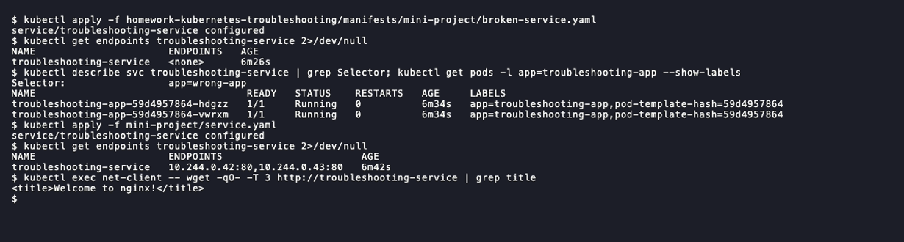

# Session 14: Kubernetes troubleshooting

- Name: Aditya Singhi
- Enrollment number: 24BCS10177

Run on a single node kind cluster (Kubernetes v1.37.0) with metrics-server
v0.9.0 for `kubectl top`. I used the instructor's manifests from the session
folder unedited. Where one was broken, and for issues with no instructor
example, my own manifests are in `manifests/`.

## Task 1: Kubernetes commands

### kubectl get and get -o wide

```bash
kubectl get pods -o wide
```

```
NAME            READY   STATUS    RESTARTS   AGE    IP            NODE                 NOMINATED NODE   READINESS GATES
describe-demo   1/1     Running   0          109s   10.244.0.8    hw14-control-plane   <none>           <none>
events-demo     1/1     Running   0          109s   10.244.0.10   hw14-control-plane   <none>           <none>
...
```

`READY`, `STATUS` and `RESTARTS` are the first columns to read. `-o wide` adds
the pod IP and node, and `NODE <none>` means a pod was never scheduled.

### kubectl describe

```bash
kubectl describe pod describe-demo
```

```
...
Events:
...
  Warning  Failed     38s    kubelet            spec.containers{nginx}: Failed to pull image "nginx:1.27": failed to pull and unpack image "docker.io/library/nginx:1.27": failed to resolve reference "docker.io/library/nginx:1.27": failed to do request: Head "https://registry-1.docker.io/v2/library/nginx/manifests/1.27": dial tcp: lookup registry-1.docker.io on 192.168.65.254:53: server misbehaving
  Warning  Failed     38s    kubelet            spec.containers{nginx}: Error: ErrImagePull
  Normal   Pulled     37s    kubelet            spec.containers{nginx}: Container image "nginx:1.27" already present on machine and can be accessed by the pod
  Normal   Started    37s    kubelet            spec.containers{nginx}: Container started
```

This pod showed `1/1 Running`, yet its events hold a failed pull from a brief
DNS error. Another pod pulled the same image a second later and this one used
it. Only `describe` shows that history.

### kubectl logs

```bash
kubectl logs logs-demo --tail=2 --timestamps
kubectl logs logs-demo --previous
```

```
2026-10-06T21:17:28.472744793Z Application is healthy
2026-10-06T21:17:33.473408379Z Application is healthy
Error from server (BadRequest): previous terminated container "app" in pod "logs-demo" not found
```

The 5 second gap matches the `sleep 5` loop. `--previous` only works after a
container has restarted.

### kubectl exec

```bash
kubectl exec exec-demo -- curl -s localhost | head -4
```

```
<!DOCTYPE html>
<html>
<head>
<title>Welcome to nginx!</title>
```

`curl localhost` from inside the pod proves nginx itself works, so a failure
seen through a Service must be outside the container.

### kubectl events

```bash
kubectl events --for pod/events-demo
```

```
LAST SEEN   TYPE     REASON      OBJECT            MESSAGE
2m39s       Normal   Scheduled   Pod/events-demo   Successfully assigned default/events-demo to hw14-control-plane
2m38s       Normal   Pulling     Pod/events-demo   Pulling image "nginx:1.27"
...
52s         Normal   Created     Pod/events-demo   Container created
52s         Normal   Started     Pod/events-demo   Container started
```

`kubectl events --types=Warning` filters a busy namespace down to failures.

### kubectl explain

```bash
kubectl explain pod.spec.containers.imagePullPolicy
```

```
FIELD: imagePullPolicy <string>
ENUM:
    Always
    IfNotPresent
    Never
```

`explain` reads the schema from the live API server, so it matches the cluster
version.

### kubectl top

```bash
kubectl top nodes
kubectl top pods
```

```
NAME                 CPU(cores)   CPU(%)   MEMORY(bytes)   MEMORY(%)
hw14-control-plane   260m         6%       743Mi           18%

NAME            CPU(cores)   MEMORY(bytes)
describe-demo   0m           4Mi
...
exec-demo       4m           11Mi
```


metrics-server needs `--kubelet-insecure-tls` on kind, because the kubelet's
self-signed certificate has no IP SAN.

## Task 2: Troubleshoot common issues

### CrashLoopBackOff

**Problem.** `06-crashloopbackoff/broken-pod.yaml` keeps restarting.

```bash
kubectl describe pod crash-demo
kubectl logs crash-demo --previous
```

```
    State:          Waiting
      Reason:       CrashLoopBackOff
    Last State:     Terminated
      Reason:       Error
      Exit Code:    1
...
    Restart Count:  6
Application starting...
Something went wrong!
```

- **Root cause.** The command ends with `exit 1`.
- **Fix.** The command is immutable (`kubectl apply` returns `spec: Forbidden`),
  so I deleted the pod and applied `fixed-pod.yaml`.
- **Verify.** `crash-demo   1/1     Running   0          21s`

### ImagePullBackOff

**Problem.** `07-imagepullbackoff/broken-pod.yaml` never starts.

```bash
kubectl describe pod image-demo
```

```
    Image:          nginx:this-image-does-not-exist
...
  Warning  Failed     23s (x3 over 69s)  kubelet            spec.containers{app}: Failed to pull image "nginx:this-image-does-not-exist": rpc error: code = NotFound desc = failed to pull and unpack image "docker.io/library/nginx:this-image-does-not-exist": failed to resolve reference "docker.io/library/nginx:this-image-does-not-exist": docker.io/library/nginx:this-image-does-not-exist: not found
...
  Warning  Failed     12s (x3 over 68s)  kubelet            spec.containers{app}: Error: ImagePullBackOff
```

- **Root cause.** The tag does not exist on Docker Hub (`NotFound`).
- **Fix.** `image` is one of the few mutable pod fields, so
  `kubectl apply -f 07-imagepullbackoff/fixed-pod.yaml` fixed it in place.
- **Verify.** `image-demo   1/1     Running   0          83s`

### ErrImagePull

`ErrImagePull` is the failed attempt and `ImagePullBackOff` is the wait after
it. For a different cause I wrote `manifests/errimagepull/broken-pod.yaml` with a
typo in the registry host, `regsitry.k8s.io/pause:3.10`.

```bash
kubectl describe pod registry-typo-demo
```

```
...
  Warning  Failed     29s (x2 over 42s)  kubelet            spec.containers{pause}: Failed to pull image "regsitry.k8s.io/pause:3.10": failed to pull and unpack image "regsitry.k8s.io/pause:3.10": failed to resolve reference "regsitry.k8s.io/pause:3.10": failed to do request: Head "https://regsitry.k8s.io/v2/pause/manifests/3.10": dial tcp: lookup regsitry.k8s.io on 192.168.65.254:53: no such host
  Warning  Failed     29s (x2 over 42s)  kubelet            spec.containers{pause}: Error: ErrImagePull
```

- **Root cause.** `no such host` means DNS failed before any registry answered,
  unlike the `not found` above.
- **Fix.** Apply `manifests/errimagepull/fixed-pod.yaml` with `registry.k8s.io`.
- **Verify.** `registry-typo-demo   1/1     Running   0          55s`

### Pending

**Problem.** `08-pending-pods/broken-pod.yaml` stays `Pending` with no node.

```bash
kubectl describe pod pending-demo
```

```
Node:             <none>
...
Node-Selectors:              kubernetes.io/hostname=node-that-does-not-exist
Events:
  Warning  FailedScheduling  10s   default-scheduler  0/1 nodes are available: 1 node(s) didn't match Pod's node affinity/selector. preemption: 0/1 nodes are available: 1 Preemption is not helpful for scheduling.
```

- **Root cause.** The `nodeSelector` names a node that does not exist.
- **Fix.** `nodeSelector` is immutable, so delete the pod and apply `fixed-pod.yaml`.
- **Verify.** `pending-demo   1/1     Running   0          5s    10.244.0.21   hw14-control-plane   <none>           <none>`

### ContainerCreating

**Problem.** `manifests/containercreating/broken-pod.yaml` mounts a ConfigMap
that does not exist. The pod sat in `ContainerCreating` for 46 seconds.

```bash
kubectl describe pod mount-demo
```

```
...
  Warning  FailedMount  13s (x7 over 45s)  kubelet            MountVolume.SetUp failed for volume "site" : configmap "site-content" not found
```

- **Root cause.** The kubelet must set up every volume before it creates the
  container, and this one points at a missing ConfigMap.
- **Fix.** `kubectl apply -f manifests/containercreating/site-content.yaml`. The pod
  needs no change.
- **Verify.** `mount-demo   1/1     Running   0          67s`, and `curl localhost`
  inside returns `<h1>mount-demo is serving from a ConfigMap</h1>`.

### Service connectivity issues

**Problem.** The instructor's `09-service-dns-troubleshooting/service.yaml`
does not work, although its README says it should.

```bash
kubectl exec net-client -- wget -qO- -T 3 http://web-service
kubectl describe svc web-service
kubectl get pods -l app --show-labels
```

```
wget: can't connect to remote host (10.96.92.187): Connection refused
...
Selector:                 app=web-ahsgdf
TargetPort:               80/TCP
Endpoints:
...
web-557577df75-5vplh   1/1     Running   0          13m   app=web,pod-template-hash=557577df75
web-557577df75-c74rp   1/1     Running   0          13m   app=web,pod-template-hash=557577df75
```

`net-client` is a busybox pod (`manifests/service-connectivity/net-client.yaml`)
I used for HTTP tests.

- **Root cause.** The selector `app=web-ahsgdf` matches no pods, which are
  labelled `app=web`, so the Service has no endpoints.
- **Fix.** Apply my copy `manifests/service-connectivity/service.yaml` with
  `app: web`.
- **Verify.** `Endpoints:                10.244.0.26:80,10.244.0.25:80`, and the
  same `wget` returns `<title>Welcome to nginx!</title>`.

### DNS issues

The instructor's `dns-test-pod.yaml` fails with `ImagePullBackOff`, so I used my
copy `manifests/dns/dns-test-pod.yaml` (see Notes).

**Problem.** To test a DNS outage I scaled CoreDNS to zero.

```bash
kubectl -n kube-system scale deploy coredns --replicas=0
kubectl exec dns-test -- nslookup -timeout=3 web-service
kubectl exec net-client -- wget -qO- -T 3 http://10.96.228.183 | grep title
kubectl -n kube-system get endpointslices -l kubernetes.io/service-name=kube-dns
```

```
deployment.apps/coredns scaled
;; connection timed out; no servers could be reached
command terminated with exit code 1
...
<title>Welcome to nginx!</title>
NAME             ADDRESSTYPE   PORTS     ENDPOINTS   AGE
kube-dns-qthhm   IPv4          <unset>   <unset>     119s
```

Names fail while the Service IP still works, so the problem is DNS only.

- **Root cause.** No CoreDNS pods, so the `kube-dns` Service has no endpoints.
- **Fix.** `kubectl -n kube-system scale deploy coredns --replicas=2`.
- **Verify.** `nslookup web-service` returns `Address: 10.96.228.183` again.

### Pod networking issues

**Problem.** `manifests/pod-networking/broken-pod.yaml` runs an HTTP server on
port 8080 that other pods cannot reach.

```bash
kubectl exec net-client -- wget -qO- -T 3 http://10.244.0.12:8080
kubectl exec net-client -- ping -c 2 -W 2 10.244.0.12
kubectl exec api-server -- netstat -tln
```

```
wget: can't connect to remote host (10.244.0.12): Connection refused
...
2 packets transmitted, 2 packets received, 0% packet loss
...
tcp        0      0 127.0.0.1:8080          0.0.0.0:*               LISTEN
```

Ping works, so the pod network routes packets between pods.

- **Root cause.** The server binds to `127.0.0.1`, which only exists inside its
  own pod.
- **Fix.** Replace the pod with `fixed-pod.yaml`, which binds to `0.0.0.0:8080`.
- **Verify.** `wget` from `net-client` returns `hello from api-server`.

### Configuration issues

**Problem.** `manifests/configuration/broken-pod.yaml` reads a ConfigMap key
and a Secret that do not exist.

```bash
kubectl describe pod config-demo
kubectl get secret app-db-secret
```

```
    State:          Waiting
      Reason:       CreateContainerConfigError
...
  Warning  Failed     14s (x2 over 15s)  kubelet            spec.containers{app}: Error: couldn't find key APP_MODE in ConfigMap default/app-config
...
Error from server (NotFound): secrets "app-db-secret" not found
```

- **Root cause.** Key `APP_MODE` is missing from `app-config` and Secret
  `app-db-secret` does not exist. The event names only the first error.
- **Fix.** `kubectl apply -f manifests/configuration/fixed-config.yaml`, which
  adds the key and the Secret.
- **Verify.** `config-demo   1/1     Running   0          65s`, logging
  `LOG_LEVEL=info APP_MODE=production DB_PASSWORD set: yes`.

### The five scenarios

```bash
bash scenarios/triage_all.sh
kubectl get pods -l tier=triage-gauntlet -o wide
```


My fixed manifests are in `manifests/scenarios-fixed/`.

| Scenario | Key evidence | Root cause | Fix |
|---|---|---|---|
| 1 CrashLoopBackOff | `kubectl logs`: `[FATAL ERROR]: DATABASE_URL environment variable is MISSING!` | Env var not set | `DATABASE_URL` from a Secret, plus `restartPolicy: OnFailure` |
| 2 ImagePullBackOff | `pull access denied, repository does not exist or may require authorization` | `docker.io/library/yatri-api-service` does not exist | A real image (`nginx:1.27-alpine` as a stand-in) |
| 3 Pending | `0/1 nodes are available: 1 Insufficient cpu, 1 Insufficient memory` | Requests of 500 CPUs and 1000Gi | `cpu: 100m`, `memory: 64Mi` |
| 4 DNS failure | `curl: (6) Could not resolve host: postgres-db-wrong-name.production.svc.cluster.local` | Wrong hostname and no `production` namespace | Deploy `postgres-db` in `production`, use the right name |
| 5 OOMKilled | `Reason: OOMKilled`, `Exit Code: 137`, limit `20Mi` | Script keeps 100 chunks of 10 MiB in memory | Process one chunk at a time, limit `64Mi` |

Pod 4 is the one `kubectl get` hides. It shows `1/1 Running` because the script
runs `curl -s ... || true`. Running the same curl with `-sS` showed the error.

Scenarios 1 and 5 exit when they finish. With only the env var added,
scenario 1 went back into `CrashLoopBackOff` on exit code 0, because the default
`restartPolicy: Always` restarts any exit. Both one-shot scripts therefore got
`restartPolicy: OnFailure`. The fixed scenario 5 processes the same 1000 MiB with a
peak of 17 MiB on the first run and 13 MiB on the second.

All five after the fixes:


Scenario 4 now logs `curl: (52) Empty reply from server`, which means curl
reached postgres. That is the result I wanted.

## Task 3: Mini project

**Deploy and check.**

```bash
kubectl apply -f mini-project/deployment.yaml -f mini-project/service.yaml
kubectl get endpoints troubleshooting-service
kubectl exec net-client -- wget -qO- -T 3 http://troubleshooting-service | grep title
```

```
NAME                      ENDPOINTS                       AGE
troubleshooting-service   10.244.0.42:80,10.244.0.43:80   16s
<title>Welcome to nginx!</title>
```

**Broken pod.**

```bash
kubectl apply -f mini-project/broken-pod.yaml
kubectl describe pod project-broken-pod
```

```
    Image:          nginx:this-tag-does-not-exist
    State:          Waiting
      Reason:       ErrImagePull
...
  Warning  Failed     24s (x2 over 38s)  kubelet            spec.containers{app}: Failed to pull image "nginx:this-tag-does-not-exist": rpc error: code = NotFound desc = failed to pull and unpack image "docker.io/library/nginx:this-tag-does-not-exist": failed to resolve reference "docker.io/library/nginx:this-tag-does-not-exist": docker.io/library/nginx:this-tag-does-not-exist: not found
```

1. Status: `ErrImagePull`, alternating with `ImagePullBackOff`, `0/1` ready.
2. Error: `docker.io/library/nginx:this-tag-does-not-exist: not found`.
3. Command: `kubectl describe pod project-broken-pod`, in the Events section.
4. Image: the `nginx` repository exists but the tag does not. Docker Hub
   returns 404 for it.
5. Fix: use a real tag. I applied `manifests/mini-project/fixed-pod.yaml`
   (`nginx:1.27`) in place, and the pod went to `1/1 Running`.

**Service selector challenge.** `manifests/mini-project/broken-service.yaml`
sets the selector to `app: wrong-app`.

```bash
kubectl apply -f homework-kubernetes-troubleshooting/manifests/mini-project/broken-service.yaml
kubectl get endpoints troubleshooting-service
kubectl get pods -l app=wrong-app
```

```
service/troubleshooting-service configured
...
troubleshooting-service   <none>      83s
...
No resources found in default namespace.
```

Running the selector by hand finds no pods, and the pods carry
`app=troubleshooting-app`. Re-applying `mini-project/service.yaml` restored
`Endpoints:                10.244.0.43:80,10.244.0.42:80`.



| Problem | What I saw | Command I used | Root cause | Fix |
| :--- | :--- | :--- | :--- | :--- |
| Broken pod | `0/1 ErrImagePull`, restarts 0 | `kubectl describe pod project-broken-pod` | Tag does not exist | Use `nginx:1.27` |
| Service problem | Endpoints `<none>`, `Connection refused` | `kubectl get endpoints`, `kubectl get pods --show-labels` | Selector `app=wrong-app` matches no pods | Selector `app: troubleshooting-app` |
| Image problem | `Failed to pull image ... not found` | Events in `kubectl describe pod` | Bad image tag | A tag that exists, applied in place |

## Notes

- `09-service-dns-troubleshooting/service.yaml` selects `app: web-ahsgdf`, so
  `web-service` never gets endpoints. Fixed copy in `manifests/service-connectivity/`.
- `09-service-dns-troubleshooting/dns-test-pod.yaml` uses
  `e2e-test-images/dnsutils:1.3`, which has no tags. The working image is
  `jessie-dnsutils:1.3` (`manifests/dns/`).
- `02-kubectl-describe/README.md` applies `pod.yaml`, but the file is `demo-pod.yaml`.
- Scenario 5's comment says 200 MB, but the loop allocates 1000 MiB.
