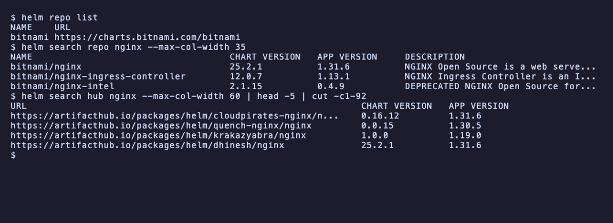
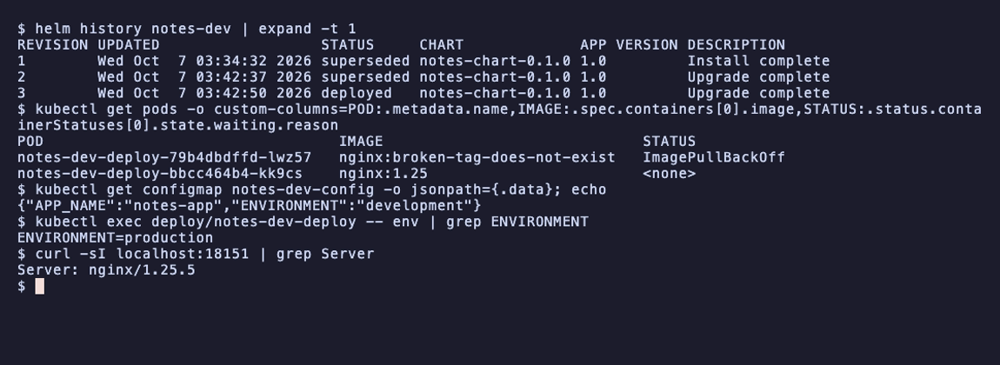

# Session 15: Helm

- Name: Aditya Singhi
- Enrollment number: 24BCS10177

Everything runs on a single node kind cluster called `hw15` (Kubernetes
v1.37.0) with Helm v4.2.2. The instructor's notes are written for Helm 3, so
wherever v4 behaves differently I show the real v4 output and say what changed.
The kind node maps NodePort 30080 to `localhost:18150` and NodePort 30090 to
`localhost:18151`, so I can curl the apps from the Mac and read the nginx
version straight from the `Server` header.

```yaml
kind: Cluster
apiVersion: kind.x-k8s.io/v1alpha4
nodes:
  - role: control-plane
    extraPortMappings:
      - containerPort: 30080
        hostPort: 18150
      - containerPort: 30090
        hostPort: 18151
```

```bash
kind create cluster --name hw15 --config kind.yaml
```

Files in this folder:

| Path | What it is |
|---|---|
| `web-chart/` | Chart made with `helm create`, used for Tasks 1 and 2 |
| `notes-chart/` | The mini project chart, built from the steps in `mini-project/README.md` |
| `screenshots/` | Terminal captures |

Docker Desktop was capped at 4 CPUs and 3.8 GB of memory while I worked, and
at one point the host load average was above 90. Two things in this
README went wrong because of that, not because of Helm, and I left them in
because they turned into the most useful part of the homework: a release
stuck in `pending-upgrade` (Task 2) and a controller manager that kept
crashing for several minutes (Task 3).

## Task 1: Helm commands

### helm version

```bash
helm version
```

```
version.BuildInfo{Version:"v4.2.2", GitCommit:"b05881cf967a5a09e19866799d0edfd40675803a", GitTreeState:"clean", GoVersion:"go1.26.4", KubeClientVersion:"v1.36"}
```

Helm is a single client binary. There is no server side component, it talks to
the API server with my kubeconfig, the same as kubectl. `KubeClientVersion`
v1.36 against a v1.37 cluster is fine, one minor version of skew is supported.

### helm create

```bash
helm create web-chart
find web-chart -type f | sort
```

```
Creating web-chart
web-chart/.helmignore
web-chart/Chart.yaml
web-chart/templates/_helpers.tpl
web-chart/templates/deployment.yaml
web-chart/templates/hpa.yaml
web-chart/templates/httproute.yaml
web-chart/templates/ingress.yaml
web-chart/templates/NOTES.txt
web-chart/templates/service.yaml
web-chart/templates/serviceaccount.yaml
web-chart/templates/tests/test-connection.yaml
web-chart/values.yaml
```


`helm create` writes a complete, working chart: a Deployment, Service,
ServiceAccount, optional Ingress, HPA and HTTPRoute, a test pod, and
`_helpers.tpl` with the naming and label functions the other templates call.

Two differences from the listing in `02-helm-charts/README.md`. The scaffold
now has `httproute.yaml` for the Gateway API, and there is an empty `charts/`
folder for dependencies. The instructor's committed copy has no `charts/`
because git does not track empty folders.

The surprise was the image. The scaffold leaves `image.tag` empty, so the tag
falls back to `appVersion`, which is `"1.16.0"`:

```bash
helm lint web-chart
helm template demo web-chart | grep image:
```

```
==> Linting web-chart
[INFO] Chart.yaml: icon is recommended

1 chart(s) linted, 0 chart(s) failed
          image: "nginx:1.16.0"
      image: busybox
```

The chart lints clean and would deploy nginx 1.16.0, a release from 2019.
`appVersion` is just a label in `Chart.yaml`, yet here it silently picks the
image. So I changed four things, everything else is the scaffold untouched:

```diff
 Chart.yaml
-appVersion: "1.16.0"
+appVersion: "1.27"
 values.yaml
-  tag: ""
+  tag: "1.27-alpine"
-  type: ClusterIP
+  type: NodePort
+  nodePort: 30080
 templates/service.yaml
+      {{- if and (eq .Values.service.type "NodePort") .Values.service.nodePort }}
+      nodePort: {{ .Values.service.nodePort }}
+      {{- end }}
```

The scaffold's Service template has no `nodePort` field, so without the
template change Kubernetes picks a random port and my kind port mapping would
miss it.

### helm repo

```bash
helm repo list
helm repo add bitnami https://charts.bitnami.com/bitnami
helm repo add prometheus-community https://prometheus-community.github.io/helm-charts
helm repo list
helm repo update
```

```
no repositories to show
"bitnami" has been added to your repositories
"prometheus-community" has been added to your repositories
NAME                	URL
bitnami             	https://charts.bitnami.com/bitnami
prometheus-community	https://prometheus-community.github.io/helm-charts
Hang tight while we grab the latest from your chart repositories...
...Successfully got an update from the "bitnami" chart repository
...Successfully got an update from the "prometheus-community" chart repository
Update Complete. ⎈Happy Helming!⎈
```

A repo is just an HTTP server with an `index.yaml` that lists every chart and
version. `repo add` downloads that index once and saves the name and URL
locally. `repo update` downloads the indexes again. Nothing touches the cluster.

```bash
helm repo remove prometheus-community
helm repo list
```

```
"prometheus-community" has been removed from your repositories
NAME   	URL
bitnami	https://charts.bitnami.com/bitnami
```

The cached Bitnami index is 27 MB on disk, which matters for the next command.

### helm search

```bash
helm search repo nginx
helm search repo bitnami/nginx --versions | head -5
```

```
NAME                                          	CHART VERSION	APP VERSION	DESCRIPTION
bitnami/nginx                                 	25.2.1       	1.31.6     	NGINX Open Source is a web server that can be a...
bitnami/nginx-ingress-controller              	12.0.7       	1.13.1     	NGINX Ingress Controller is an Ingress controll...
bitnami/nginx-intel                           	2.1.15       	0.4.9      	DEPRECATED NGINX Open Source for Intel is a lig...
prometheus-community/prometheus-nginx-exporter	1.23.1       	1.5.3      	A Helm chart for NGINX Prometheus Exporter
NAME                            	CHART VERSION	APP VERSION	DESCRIPTION
bitnami/nginx                   	25.2.1       	1.31.6     	NGINX Open Source is a web server that can be a...
bitnami/nginx                   	25.2.0       	1.31.6     	NGINX Open Source is a web server that can be a...
bitnami/nginx                   	25.1.15      	1.31.6     	NGINX Open Source is a web server that can be a...
bitnami/nginx                   	25.1.14      	1.31.6     	NGINX Open Source is a web server that can be a...
```

```bash
helm search hub nginx --max-col-width 60 | head -8
```

```
URL                                                         	CHART VERSION  	APP VERSION	DESCRIPTION
https://artifacthub.io/packages/helm/cloudpirates-nginx/n...	0.16.12        	1.31.6     	Nginx is a high-performance HTTP server and reverse proxy.
https://artifacthub.io/packages/helm/quench-nginx/nginx     	0.0.15         	1.30.5     	High-performance web server, reverse proxy, and load bala...
https://artifacthub.io/packages/helm/krakazyabra/nginx      	1.0.0          	1.19.0     	Nginx Helm chart for Kubernetes
https://artifacthub.io/packages/helm/dhinesh/nginx          	25.2.1         	1.31.6     	NGINX Open Source is a web server that can be also used a...
https://artifacthub.io/packages/helm/bitnami/nginx          	25.2.1         	1.31.6     	NGINX Open Source is a web server that can be also used a...
https://artifacthub.io/packages/helm/niceos/nginx           	1.31.1+niceos.2	1.31.1     	Bitnami-compatible NGINX Helm chart for NiceOS
https://artifacthub.io/packages/helm/bitnami-aks/nginx      	13.2.12        	1.23.2     	NGINX Open Source is a web server that can be also used a...
```



There are two kinds of search. `search repo` only reads the indexes I already
downloaded, so it works offline and only finds charts from repos I added. It
is not fast though: with the 27 MB Bitnami index it took 12 seconds, because
Helm loads the whole index file on every search. `search hub` asks Artifact Hub
over the network, so it finds charts from repos I never added, and answered in
under a second.

`CHART VERSION` and `APP VERSION` are separate numbers. Bitnami published
four chart releases (25.1.14 to 25.2.1) that all ship the same nginx 1.31.6.

### helm install

First my own chart:

```bash
helm install web ./web-chart --wait --timeout 2m
kubectl get deploy,pods,svc -l app.kubernetes.io/instance=web
curl -sI http://localhost:18150 | grep Server
```

```
NAME: web
LAST DEPLOYED: Wed Oct  7 02:47:33 2026
NAMESPACE: default
STATUS: deployed
REVISION: 1
DESCRIPTION: Install complete
NOTES:
1. Get the application URL by running these commands:
  export NODE_PORT=$(kubectl get --namespace default -o jsonpath="{.spec.ports[0].nodePort}" services web-web-chart)
  export NODE_IP=$(kubectl get nodes --namespace default -o jsonpath="{.items[0].status.addresses[0].address}")
  echo http://$NODE_IP:$NODE_PORT

NAME                            READY   UP-TO-DATE   AVAILABLE   AGE
deployment.apps/web-web-chart   1/1     1            1           1s

NAME                                 READY   STATUS    RESTARTS   AGE
pod/web-web-chart-755786fb86-s4pcn   1/1     Running   0          1s

NAME                    TYPE       CLUSTER-IP      EXTERNAL-IP   PORT(S)        AGE
service/web-web-chart   NodePort   10.96.250.158   <none>        80:30080/TCP   1s
Server: nginx/1.27.5
```

`helm install <release> <chart>` renders the templates with the values and
sends the result to the API server. The release name `web` becomes part of
every resource name through `_helpers.tpl`, so I got `web-web-chart`. The
fullname helper only skips the doubling when the release name already
contains the chart name, which is why people often name the release after the
chart.

Without `--wait` Helm returns as soon as the API server accepts the objects.
Helm 4's help says the default is now `--wait=hookOnly`, and plain `--wait`
means the new `watcher` strategy, which watches each resource until it is
ready.

Then a chart from the public repo, the same way the instructor does it in
`01-what-is-helm`:

```bash
helm install my-nginx bitnami/nginx --set service.type=ClusterIP --wait --timeout 4m
```

```
NAME: my-nginx
LAST DEPLOYED: Wed Oct  7 02:48:32 2026
NAMESPACE: default
STATUS: deployed
REVISION: 1
DESCRIPTION: Install complete
TEST SUITE: None
NOTES:
CHART NAME: nginx
CHART VERSION: 25.2.1
APP VERSION: 1.31.6
```

The pod came up with `registry-1.docker.io/bitnami/nginx:latest`, and the
chart's own notes carry this warning:

```
⚠ WARNING: Since August 28th, 2025, only a limited subset of images/charts are available for free.
    Subscribe to Bitnami Secure Images to receive continued support and security updates.
WARNING: Rolling tag detected (bitnami/nginx:latest), please note that it is strongly recommended to avoid using rolling tags in a production environment.
```

So `helm repo add bitnami` from the session notes still works, but the chart
now points at the rolling `latest` image tag. The same chart version can give
you a different nginx next week. I set `service.type=ClusterIP` only
because the chart defaults to LoadBalancer, which stays pending forever on kind.

```bash
helm uninstall my-nginx
```

```
release "my-nginx" uninstalled
```

### helm list

```bash
helm list
```

```
NAME	NAMESPACE	REVISION	UPDATED                             	STATUS  	CHART          	APP VERSION
web 	default  	1       	2026-10-07 02:47:33.256243 +0530 IST	deployed	web-chart-0.1.0	1.27
```

One row per release in the current namespace. `-A` lists every namespace.

There is a Helm 4 change here that I only found later, after
`helm uninstall --keep-history` (see below). Plain `helm list` now shows
releases in every status, including uninstalled ones, and the old `-a` flag is
gone:

```bash
helm list -a
```

```
Error: unknown shorthand flag: 'a' in -a
```

The help text says so directly: "By default, it lists all releases in any
status." In Helm 3 the default showed only deployed and failed releases.

### helm status

```bash
helm status web
```

```
NAME: web
LAST DEPLOYED: Wed Oct  7 02:47:33 2026
NAMESPACE: default
STATUS: deployed
REVISION: 1
DESCRIPTION: Install complete
RESOURCES:
==> v1/Service
NAME            TYPE       CLUSTER-IP      EXTERNAL-IP   PORT(S)        AGE
web-web-chart   NodePort   10.96.250.158   <none>        80:30080/TCP   9s

==> v1/Deployment
NAME            READY   UP-TO-DATE   AVAILABLE   AGE
web-web-chart   1/1     1            1           9s

==> v1/Pod(related)
NAME                             READY   STATUS    RESTARTS   AGE
web-web-chart-755786fb86-s4pcn   1/1     Running   0          9s

==> v1/ServiceAccount
NAME            AGE
web-web-chart   9s


NOTES:
1. Get the application URL by running these commands:
  export NODE_PORT=$(kubectl get --namespace default -o jsonpath="{.spec.ports[0].nodePort}" services web-web-chart)
  export NODE_IP=$(kubectl get nodes --namespace default -o jsonpath="{.items[0].status.addresses[0].address}")
  echo http://$NODE_IP:$NODE_PORT
```

Status reads the stored release record and then asks the cluster for the
current state of every object in it. In Helm 4 the `RESOURCES` block is printed
by default. I tried the Helm 3 flag for it first:

```
$ helm status web --show-resources
Error: unknown flag: --show-resources
```

### helm get

```bash
helm get values web
helm get values web --all | grep -A4 -E "^(image|service):"
helm get manifest web | grep -E "^# Source|^kind:|image:"
helm get hooks web | grep -E "^# Source|^kind:|helm.sh/hook"
helm get metadata web
```

```
USER-SUPPLIED VALUES:
null
image:
  pullPolicy: IfNotPresent
  repository: nginx
  tag: 1.27-alpine
imagePullSecrets: []
--
service:
  nodePort: 30080
  port: 80
  type: NodePort
serviceAccount:
# Source: web-chart/templates/serviceaccount.yaml
kind: ServiceAccount
# Source: web-chart/templates/service.yaml
kind: Service
# Source: web-chart/templates/deployment.yaml
kind: Deployment
          image: "nginx:1.27-alpine"
# Source: web-chart/templates/tests/test-connection.yaml
kind: Pod
    "helm.sh/hook": test
NAME: web
CHART: web-chart
VERSION: 0.1.0
APP_VERSION: 1.27
ANNOTATIONS:
LABELS: modifiedAt=1791321454,name=web,owner=helm,status=deployed,version=1
DEPENDENCIES:
NAMESPACE: default
REVISION: 1
STATUS: deployed
DEPLOYED_AT: 2026-10-07T02:47:33+05:30
APPLY_METHOD: server-side apply
```

`helm get` prints what Helm stored for a release, not what is live in the
cluster. `values` shows only what I passed on the command line, `null` here
because I passed nothing. `--all` merges in the chart defaults. `manifest` is
the exact YAML Helm sent. The test pod is not in the manifest, it is a hook,
so it only shows under `get hooks` and only runs on `helm test`. `get all`
prints everything at once. `get notes` prints the NOTES text.

`APPLY_METHOD: server-side apply` is new in Helm 4. Helm 3 computed a three way
merge patch on the client. Helm 4 uses Kubernetes server-side apply for new
releases, and the field owner on the Deployment confirms it:

```bash
kubectl get deploy web-web-chart -o jsonpath='{range .metadata.managedFields[*]}{.manager}{"  "}{.operation}{"\n"}{end}'
```

```
helm  Apply
kube-controller-manager  Update
```

Where all this is stored:

```bash
kubectl get secrets -l owner=helm
```

```
NAME                        TYPE                 DATA   AGE
sh.helm.release.v1.web.v1   helm.sh/release.v1   1      18s
```

One Secret per revision, in the release's namespace. That is the "release state
stored as Kubernetes Secrets" line from the Helm 2 vs 3 notes, and it is what
makes `history` and `rollback` work.

### helm upgrade

```bash
helm upgrade web ./web-chart --set replicaCount=2 --wait --timeout 2m
helm get values web
kubectl get pods -l app.kubernetes.io/instance=web
```

```
Release "web" has been upgraded. Happy Helming!
NAME: web
LAST DEPLOYED: Wed Oct  7 02:47:56 2026
NAMESPACE: default
STATUS: deployed
REVISION: 2
DESCRIPTION: Upgrade complete
USER-SUPPLIED VALUES:
replicaCount: 2
NAME                             READY   STATUS    RESTARTS   AGE
web-web-chart-755786fb86-pp5kr   1/1     Running   0          2s
web-web-chart-755786fb86-s4pcn   1/1     Running   0          25s
```

Revision 2. Both pods share the hash `755786fb86` and the first pod is 25
seconds old. Changing only `replicas` does not change the pod template, so
Kubernetes scaled the existing ReplicaSet and kept the old pod. A new image
would have replaced every pod (Task 2).

### helm history

```bash
helm history web
```

```
REVISION	UPDATED                 	STATUS    	CHART          	APP VERSION	DESCRIPTION
1       	Wed Oct  7 02:47:33 2026	superseded	web-chart-0.1.0	1.27       	Install complete
2       	Wed Oct  7 02:47:56 2026	deployed  	web-chart-0.1.0	1.27       	Upgrade complete
```

One line per stored Secret. Only one revision is `deployed` at a time, the rest
are `superseded`.

### helm rollback

```bash
helm rollback web 1 --wait --timeout 2m
helm history web
helm get values web
kubectl get pods -l app.kubernetes.io/instance=web
```

```
Rollback was a success! Happy Helming!
REVISION	UPDATED                 	STATUS    	CHART          	APP VERSION	DESCRIPTION
1       	Wed Oct  7 02:47:33 2026	superseded	web-chart-0.1.0	1.27       	Install complete
2       	Wed Oct  7 02:47:56 2026	superseded	web-chart-0.1.0	1.27       	Upgrade complete
3       	Wed Oct  7 02:48:02 2026	deployed  	web-chart-0.1.0	1.27       	Rollback to 1
USER-SUPPLIED VALUES:
null
NAME                             READY   STATUS      RESTARTS   AGE
web-web-chart-755786fb86-pp5kr   0/1     Completed   0          7s
web-web-chart-755786fb86-s4pcn   1/1     Running     0          30s
```

A rollback does not go back in time. It takes the manifest and values of
revision 1 and applies them as a new revision 3. The extra pod shows as
`Completed` while it shuts down, because nginx exits with code 0 when it is
told to stop.

### helm uninstall

```bash
helm uninstall web --keep-history
helm list
helm history web
kubectl get all,secrets -l app.kubernetes.io/instance=web
kubectl get secrets -l owner=helm
```

```
release "web" uninstalled
NAME	NAMESPACE	REVISION	UPDATED                             	STATUS     	CHART          	APP VERSION
web 	default  	3       	2026-10-07 02:48:02.759578 +0530 IST	uninstalled	web-chart-0.1.0	1.27
REVISION	UPDATED                 	STATUS     	CHART          	APP VERSION	DESCRIPTION
1       	Wed Oct  7 02:47:33 2026	superseded 	web-chart-0.1.0	1.27       	Install complete
2       	Wed Oct  7 02:47:56 2026	superseded 	web-chart-0.1.0	1.27       	Upgrade complete
3       	Wed Oct  7 02:48:02 2026	uninstalled	web-chart-0.1.0	1.27       	Uninstallation complete
NAME                                 READY   STATUS      RESTARTS   AGE
pod/web-web-chart-755786fb86-s4pcn   0/1     Completed   0          35s
NAME                        TYPE                 DATA   AGE
sh.helm.release.v1.web.v1   helm.sh/release.v1   1      36s
sh.helm.release.v1.web.v2   helm.sh/release.v1   1      13s
sh.helm.release.v1.web.v3   helm.sh/release.v1   1      7s
```

`--keep-history` deletes the Kubernetes objects (the last pod is just
finishing) but keeps the release Secrets. So the release can come back with a
rollback:

```bash
helm rollback web 2 --wait --timeout 2m
helm history web | tail -2
kubectl get pods -l app.kubernetes.io/instance=web
```

```
Rollback was a success! Happy Helming!
3       	Wed Oct  7 02:48:02 2026	uninstalled	web-chart-0.1.0	1.27       	Uninstallation complete
4       	Wed Oct  7 02:48:17 2026	deployed   	web-chart-0.1.0	1.27       	Rollback to 2
NAME                             READY   STATUS    RESTARTS   AGE
web-web-chart-755786fb86-bfc6k   1/1     Running   0          1s
web-web-chart-755786fb86-l6wbh   1/1     Running   0          1s
```

Two replicas again, from revision 2's values. A plain uninstall removes the
history as well:

```bash
helm uninstall web
helm history web
kubectl get secrets -l owner=helm
```

```
release "web" uninstalled
Error: release: not found
No resources found in default namespace.
```

After this Helm has no record that `web` ever existed.

## Task 2: Rollback workflow

Release `site`, chart `web-chart`. After every step I ran the same four checks
(saved as a small script so every step is checked the same way):

```bash
helm history site
kubectl get deploy site-web-chart -o custom-columns='IMAGE:.spec.template.spec.containers[0].image,REPLICAS:.spec.replicas,READY:.status.readyReplicas'
kubectl get pods -l app.kubernetes.io/instance=site -o custom-columns='POD:.metadata.name,IMAGE:.spec.containers[0].image,PHASE:.status.phase'
curl -sI localhost:18150 | grep Server
```

`helm history` is what Helm believes. The Deployment and pod listings are what
Kubernetes is running. The `Server` header is what nginx itself reports when I
hit the NodePort, so it proves which binary is answering, not just which tag is
in the spec.

### The first attempt got stuck in pending-upgrade

My first run of the upgrade step failed, and not because of the chart:

```bash
helm upgrade site ./web-chart --set image.tag=1.28-alpine --set replicaCount=3 --wait --timeout 2m
```

```
level=WARN msg="failed to update release" name=site revision=1 error="update: failed to update: Put \"https://127.0.0.1:51571/api/v1/namespaces/default/secrets/sh.helm.release.v1.site.v1\": http2: client connection lost"
level=WARN msg="upgrade failed" name=site error="resource Deployment/default/site-web-chart not ready. status: InProgress, message: Updated: 2/3\ncontext deadline exceeded"
level=WARN msg="failed to update release" name=site revision=2 error="update: failed to update: Put \"https://127.0.0.1:51571/api/v1/namespaces/default/secrets/sh.helm.release.v1.site.v2\": net/http: TLS handshake timeout"
Error: UPGRADE FAILED: resource Deployment/default/site-web-chart not ready. status: InProgress, message: Updated: 2/3
context deadline exceeded
```

The Docker VM was so overloaded that the API server stopped answering. The pods
were failing their liveness probes with `connection refused` and restarting,
so the rollout could not finish within 2 minutes. Then Helm tried to record the
failure and could not even write its own Secret. Once the API server came
back, this was the state:

```bash
helm history site
kubectl get secrets -l owner=helm -L status
```

```
REVISION	UPDATED                 	STATUS         	CHART          	APP VERSION	DESCRIPTION
1       	Wed Oct  7 03:05:06 2026	deployed       	web-chart-0.1.0	1.27       	Install complete
2       	Wed Oct  7 03:05:28 2026	pending-upgrade	web-chart-0.1.0	1.27       	Preparing upgrade
NAME                         TYPE                 DATA   AGE   STATUS
sh.helm.release.v1.site.v1   helm.sh/release.v1   1      13m   deployed
sh.helm.release.v1.site.v2   helm.sh/release.v1   1      13m   pending-upgrade
```

This is the exact scenario from the interview questions in the session README.
Revision 2 is stuck in `pending-upgrade`, and Helm treats that as a lock:

```bash
helm upgrade site ./web-chart --set image.tag=1.28-alpine --set replicaCount=3
helm status site | head -6
```

```
Error: UPGRADE FAILED: another operation (install/upgrade/rollback) is in progress
NAME: site
LAST DEPLOYED: Wed Oct  7 03:05:28 2026
NAMESPACE: default
STATUS: pending-upgrade
REVISION: 2
DESCRIPTION: Preparing upgrade
```

Meanwhile Kubernetes had finished the rollout on its own (3/3 ready on
`nginx:1.28-alpine`), so Helm's record and the cluster disagreed. The session
README says to delete the pending Secret and then roll back. In Helm 4.2.2 the
rollback alone was enough:

```bash
helm rollback site 1 --wait --timeout 5m
helm history site
```

```
Rollback was a success! Happy Helming!
REVISION	UPDATED                 	STATUS         	CHART          	APP VERSION	DESCRIPTION
1       	Wed Oct  7 03:05:06 2026	superseded     	web-chart-0.1.0	1.27       	Install complete
2       	Wed Oct  7 03:05:28 2026	pending-upgrade	web-chart-0.1.0	1.27       	Preparing upgrade
3       	Wed Oct  7 03:19:16 2026	deployed       	web-chart-0.1.0	1.27       	Rollback to 1
```

Revision 2 stays `pending-upgrade` in the history forever, but it no longer
blocks anything because revision 3 is now the deployed one. I uninstalled the
release and ran the whole workflow again from a clean start with
`--timeout 5m`.

### Step 1: install

```bash
helm install site ./web-chart --wait --timeout 5m
```

```
NAME: site
LAST DEPLOYED: Wed Oct  7 03:19:36 2026
NAMESPACE: default
STATUS: deployed
REVISION: 1
DESCRIPTION: Install complete
$ helm history site
REVISION	UPDATED                 	STATUS  	CHART          	APP VERSION	DESCRIPTION
1       	Wed Oct  7 03:19:36 2026	deployed	web-chart-0.1.0	1.27       	Install complete
$ kubectl get deploy site-web-chart -o custom-columns=...
IMAGE               REPLICAS   READY
nginx:1.27-alpine   1          1
$ kubectl get pods -l app.kubernetes.io/instance=site -o custom-columns=...
POD                              IMAGE               PHASE
site-web-chart-95d8657c7-q2dgj   nginx:1.27-alpine   Running
$ curl -sI localhost:18150 | grep Server
Server: nginx/1.27.5
```

Revision 1: one pod, nginx 1.27.5, from the chart defaults.

### Step 2: upgrade, then verify

```bash
helm upgrade site ./web-chart --set image.tag=1.28-alpine --set replicaCount=3 --wait --timeout 5m
```

```
Release "site" has been upgraded. Happy Helming!
NAME: site
LAST DEPLOYED: Wed Oct  7 03:19:45 2026
NAMESPACE: default
STATUS: deployed
REVISION: 2
DESCRIPTION: Upgrade complete
$ helm history site
REVISION	UPDATED                 	STATUS    	CHART          	APP VERSION	DESCRIPTION
1       	Wed Oct  7 03:19:36 2026	superseded	web-chart-0.1.0	1.27       	Install complete
2       	Wed Oct  7 03:19:45 2026	deployed  	web-chart-0.1.0	1.27       	Upgrade complete
$ kubectl get deploy site-web-chart -o custom-columns=...
IMAGE               REPLICAS   READY
nginx:1.28-alpine   3          3
$ kubectl get pods -l app.kubernetes.io/instance=site -o custom-columns=...
POD                               IMAGE               PHASE
site-web-chart-56c57469cd-79c96   nginx:1.28-alpine   Running
site-web-chart-56c57469cd-j2hbt   nginx:1.28-alpine   Running
site-web-chart-56c57469cd-vxl7n   nginx:1.28-alpine   Running
site-web-chart-95d8657c7-q2dgj    nginx:1.27-alpine   Running
$ curl -sI localhost:18150 | grep Server
Server: nginx/1.28.3
$ kubectl get rs -l app.kubernetes.io/instance=site
NAME                        DESIRED   CURRENT   READY   AGE
site-web-chart-56c57469cd   3         3         3       15s
site-web-chart-95d8657c7    0         0         0       23s
```

Three new pods on 1.28, and nginx now answers as 1.28.3. The 1.27 pod still in
the list belongs to a ReplicaSet scaled to 0. It is in its shutdown grace
period, and a terminating pod keeps the phase `Running` until it exits. The
old ReplicaSet `95d8657c7` is kept at 0 replicas on purpose, it is what a
`kubectl rollout undo` would scale back up.

### Step 3: upgrade again, then verify

This time I only changed the tag:

```bash
helm upgrade site ./web-chart --set image.tag=1.29-alpine --wait --timeout 5m
```

```
Release "site" has been upgraded. Happy Helming!
NAME: site
LAST DEPLOYED: Wed Oct  7 03:20:12 2026
NAMESPACE: default
STATUS: deployed
REVISION: 3
DESCRIPTION: Upgrade complete
$ helm history site
REVISION	UPDATED                 	STATUS    	CHART          	APP VERSION	DESCRIPTION
1       	Wed Oct  7 03:19:36 2026	superseded	web-chart-0.1.0	1.27       	Install complete
2       	Wed Oct  7 03:19:45 2026	superseded	web-chart-0.1.0	1.27       	Upgrade complete
3       	Wed Oct  7 03:20:12 2026	deployed  	web-chart-0.1.0	1.27       	Upgrade complete
$ kubectl get deploy site-web-chart -o custom-columns=...
IMAGE               REPLICAS   READY
nginx:1.29-alpine   1          1
$ kubectl get pods -l app.kubernetes.io/instance=site -o custom-columns=...
POD                               IMAGE               PHASE
site-web-chart-56c57469cd-79c96   nginx:1.28-alpine   Succeeded
site-web-chart-678cbb844c-qhj45   nginx:1.29-alpine   Running
$ curl -sI localhost:18150 | grep Server
$ helm get values site
USER-SUPPLIED VALUES:
image:
  tag: 1.29-alpine
```

The image moved to 1.29, but replicas dropped from 3 to 1, and I never asked
for that. `helm upgrade` starts from the chart's `values.yaml` and applies only
the flags on this command. It does not carry over the `--set replicaCount=3`
from the previous upgrade. `helm get values` confirms that only the tag is
stored for revision 3. To keep earlier values you need `--reuse-values`, or
better, keep every value in a file and pass `-f` each time.

The empty curl line is real. My guess is the request landed while the old
pods were leaving, before kube-proxy had switched to the new endpoint. A few
seconds later:

```
$ curl -sI localhost:18150 | grep Server
Server: nginx/1.29.8
```

### Step 4: rollback, then verify

```bash
helm rollback site 2 --wait --timeout 5m
```

```
Rollback was a success! Happy Helming!
$ helm history site
REVISION	UPDATED                 	STATUS    	CHART          	APP VERSION	DESCRIPTION
1       	Wed Oct  7 03:19:36 2026	superseded	web-chart-0.1.0	1.27       	Install complete
2       	Wed Oct  7 03:19:45 2026	superseded	web-chart-0.1.0	1.27       	Upgrade complete
3       	Wed Oct  7 03:20:12 2026	superseded	web-chart-0.1.0	1.27       	Upgrade complete
4       	Wed Oct  7 03:20:55 2026	deployed  	web-chart-0.1.0	1.27       	Rollback to 2
$ kubectl get deploy site-web-chart -o custom-columns=...
IMAGE               REPLICAS   READY
nginx:1.28-alpine   3          3
$ kubectl get pods -l app.kubernetes.io/instance=site -o custom-columns=...
POD                               IMAGE               PHASE
site-web-chart-56c57469cd-9hsln   nginx:1.28-alpine   Running
site-web-chart-56c57469cd-mfbzp   nginx:1.28-alpine   Running
site-web-chart-56c57469cd-qd2h6   nginx:1.28-alpine   Running
$ curl -sI localhost:18150 | grep Server
Server: nginx/1.28.3
$ helm get values site
USER-SUPPLIED VALUES:
image:
  tag: 1.28-alpine
replicaCount: 3
$ kubectl get rs -l app.kubernetes.io/instance=site
NAME                        DESIRED   CURRENT   READY   AGE
site-web-chart-56c57469cd   3         3         3       81s
site-web-chart-678cbb844c   0         0         0       52s
site-web-chart-95d8657c7    0         0         0       89s
$ kubectl rollout history deploy/site-web-chart
deployment.apps/site-web-chart
REVISION  CHANGE-CAUSE
1         <none>
3         <none>
4         <none>
```

The rollback restored both values from revision 2: tag 1.28 and 3 replicas,
and nginx answers as 1.28.3 again. The new pods have the hash `56c57469cd`,
the same as in step 2. The pod template is identical to revision 2's, so the
Deployment did not create a new ReplicaSet. It scaled the old one back up from
0 to 3.

There are two separate revision counters here. Helm's history says revision 4
is "Rollback to 2". The Deployment's own history has no revision 2 anymore,
because reusing that ReplicaSet renumbered it to 4. Helm revisions count
releases. Deployment revisions count pod templates.

### Automatic rollback: --atomic is now --rollback-on-failure

`08-rollback` uses `--atomic`. In Helm 4 it still works but prints a
deprecation notice, and I learned something from the run:

```bash
helm upgrade site ./web-chart --set image.tag=doesnotexist --atomic --timeout 60s
```

```
Flag --atomic has been deprecated, use --rollback-on-failure instead
level=WARN msg="upgrade failed" name=site error="resource Deployment/default/site-web-chart not ready. status: InProgress, message: Pending termination: 1\ncontext deadline exceeded"
Error: UPGRADE FAILED: an error occurred while rolling back the release. original upgrade error: resource Deployment/default/site-web-chart not ready. status: InProgress, message: Pending termination: 1
context deadline exceeded: release site failed: resource Deployment/default/site-web-chart not ready. status: InProgress, message: Updated: 2/3
context deadline exceeded
```

The upgrade failed as planned, and then the automatic rollback failed too.
Two mistakes stacked up. I forgot `--reuse-values`, so the bad upgrade also
reset replicas to 1, like step 3. That meant the rollback had to start two
fresh pods to get back to 3. The rollback also waits, and on this overloaded
node two pods could not become ready before the timeout. `--atomic` is only as
good as the timeout you give it.

The second try, with the Helm 4 flag name and `--reuse-values`:

```bash
helm upgrade site ./web-chart --reuse-values --set image.tag=doesnotexist --rollback-on-failure --timeout 60s
```

```
level=WARN msg="upgrade failed" name=site error="resource Deployment/default/site-web-chart not ready. status: InProgress, message: Updated: 2/3\ncontext deadline exceeded"
Error: UPGRADE FAILED: release site failed, and has been rolled back due to rollback-on-failure being set: resource Deployment/default/site-web-chart not ready. status: InProgress, message: Updated: 2/3
context deadline exceeded
```

This one rolled back cleanly in 1 minute 41 seconds. The full history after
both attempts:


| Revision | Status | What it was |
|---|---|---|
| 5 | failed | `--atomic` upgrade with the bad tag and 1 replica |
| 6 | failed | the automatic rollback from revision 5, which timed out |
| 7 | failed | `--rollback-on-failure` upgrade with the bad tag and 3 replicas |
| 8 | deployed | the automatic rollback, "Rollback to 4" |

After revision 8 all three pods are back on 1.28.3. ReplicaSet `764b64dc4d`
is the one with the broken tag, left at 0 replicas.

## Task 3: Mini project, the Notes app chart

### Building the chart

I created `notes-chart/` in this folder by following steps 1 to 7 of
`mini-project/README.md`, then compared it with the instructor's finished copy:

```bash
mkdir -p notes-chart/templates
diff -r notes-chart ../mini-project/notes-chart && echo "identical to mini-project/notes-chart"
```

```
identical to mini-project/notes-chart
```

| File | What it does |
|---|---|
| `Chart.yaml` | Name, chart version 0.1.0, app version 1.0 |
| `values.yaml` | Development defaults: 1 replica, `nginx:1.24`, `ENVIRONMENT=development` |
| `values-prod.yaml` | Production overrides: 3 replicas, `nginx:1.25`, `ENVIRONMENT=production` |
| `templates/configmap.yaml` | `APP_NAME` and `ENVIRONMENT`, quoted with `| quote` |
| `templates/deployment.yaml` | nginx pods that load the ConfigMap with `envFrom` |
| `templates/service.yaml` | NodePort 30090, which my kind config maps to `localhost:18151` |

Every name starts with `{{ .Release.Name }}`, so two releases of this chart
can live in one namespace without clashing. The one exception is the fixed
`nodePort: 30090`. A second release would fail because the port is taken.

### Step 8 and 9: lint and render

```bash
helm lint notes-chart
helm template notes-dev notes-chart
```

```
==> Linting notes-chart
[INFO] Chart.yaml: icon is recommended

1 chart(s) linted, 0 chart(s) failed
---
# Source: notes-chart/templates/configmap.yaml
apiVersion: v1
kind: ConfigMap
metadata:
  name: notes-dev-config
data:
  APP_NAME: "notes-app"
  ENVIRONMENT: "development"

---
# Source: notes-chart/templates/service.yaml
apiVersion: v1
kind: Service
metadata:
  name: notes-dev-svc
spec:
  type: NodePort
  selector:
    app: notes-dev
  ports:
    - port: 80
      targetPort: 80
      nodePort: 30090

---
# Source: notes-chart/templates/deployment.yaml
apiVersion: apps/v1
kind: Deployment
metadata:
  name: notes-dev-deploy
  labels:
    app: notes-dev
    environment: development
spec:
  replicas: 1
  selector:
    matchLabels:
      app: notes-dev
  template:
    metadata:
      labels:
        app: notes-dev
    spec:
      containers:
        - name: notes
          image: "nginx:1.24"
          ports:
            - containerPort: 80
          envFrom:
            - configMapRef:
                name: notes-dev-config
```

`helm template notes-dev notes-chart | grep -c '{{'` printed `0`, so every
placeholder was replaced. Helm sorts the output by kind: the ConfigMap comes
first, then the Service, then the Deployment, so the ConfigMap exists before
any pod needs it.

### Step 10: install (development)

```bash
helm install notes-dev notes-chart
```

```
NAME: notes-dev
LAST DEPLOYED: Wed Oct  7 03:34:32 2026
NAMESPACE: default
STATUS: deployed
REVISION: 1
DESCRIPTION: Install complete
TEST SUITE: None
```

Helm said `deployed` at 03:34:32. The pod did not exist until 03:42. During
those 8 minutes the Docker VM was so loaded that this cluster's
kube-controller-manager and kube-scheduler were in CrashLoopBackOff:

```bash
kubectl get deploy
kubectl -n kube-system get pods
kubectl -n kube-system logs kube-controller-manager-hw15-control-plane --previous --tail=3 | cut -c1-250
```

```
NAME                               READY   UP-TO-DATE   AVAILABLE   AGE
deployment.apps/notes-dev-deploy   0/1     0            0           4m25s
NAME                                         READY   STATUS             RESTARTS        AGE
coredns-559f6c778d-dp5kd                     1/1     Running            0               55m
coredns-559f6c778d-hwcmf                     1/1     Running            0               55m
etcd-hw15-control-plane                      1/1     Running            0               55m
kindnet-9tlc7                                1/1     Running            0               55m
kube-apiserver-hw15-control-plane            1/1     Running            2 (24m ago)     55m
kube-controller-manager-hw15-control-plane   0/1     CrashLoopBackOff   8 (2m28s ago)   55m
kube-proxy-hn7h2                             1/1     Running            0               55m
kube-scheduler-hw15-control-plane            0/1     CrashLoopBackOff   7 (2m50s ago)   55m
E1006 22:06:28.960007       1 leaderelection.go:473] "Error retrieving lease lock" err="Get \"https://172.26.0.4:6443/apis/coordination.k8s.io/v1/namespaces/kube-system/leases/kube-controller-manager?timeout=5s\": context deadline exceeded" lock="kub
I1006 22:06:28.990587       1 leaderelection.go:304] "Failed to renew lease" lock="kube-system/kube-controller-manager" err="context deadline exceeded"
E1006 22:06:29.243625       1 controllermanager.go:413] "leaderelection lost/stopped"
```

The controller manager has to renew a lease every few seconds. When the API
server takes longer than 5 seconds to answer, it loses the lease and exits on
purpose, so that two copies can never both act as leader. With the controller
manager down, nothing turns a Deployment into a ReplicaSet and pods. Garbage
collection stops too: the `site` pods from Task 2 kept running for several
minutes after `helm uninstall site` had deleted their Deployment.

So `STATUS: deployed` without `--wait` only means the API server stored the
objects. It does not mean anything is running. Once the load dropped, the
controller manager won its lease back and the pod started on its own:

```bash
kubectl get pods
kubectl get services
kubectl get configmaps
kubectl exec deploy/notes-dev-deploy -- env | grep -E "APP_NAME|ENVIRONMENT"
curl -sI localhost:18151 | grep Server
```

```
NAME                                READY   STATUS    RESTARTS   AGE
notes-dev-deploy-74956bd987-9kjrg   1/1     Running   0          22s
NAME            TYPE        CLUSTER-IP    EXTERNAL-IP   PORT(S)        AGE
kubernetes      ClusterIP   10.96.0.1     <none>        443/TCP        58m
notes-dev-svc   NodePort    10.96.52.62   <none>        80:30090/TCP   7m57s
NAME               DATA   AGE
kube-root-ca.crt   1      58m
notes-dev-config   2      7m57s
APP_NAME=notes-app
ENVIRONMENT=development
Server: nginx/1.24.0
```

One pod on nginx 1.24, with the ConfigMap values loaded as environment
variables.

### Step 11: upgrade to production values

```bash
helm upgrade notes-dev notes-chart -f notes-chart/values-prod.yaml
kubectl rollout status deploy/notes-dev-deploy
kubectl get pods
```

```
Release "notes-dev" has been upgraded. Happy Helming!
NAME: notes-dev
LAST DEPLOYED: Wed Oct  7 03:42:37 2026
NAMESPACE: default
STATUS: deployed
REVISION: 2
DESCRIPTION: Upgrade complete
TEST SUITE: None
Waiting for deployment "notes-dev-deploy" rollout to finish: 1 out of 3 new replicas have been updated...
Waiting for deployment "notes-dev-deploy" rollout to finish: 2 out of 3 new replicas have been updated...
Waiting for deployment "notes-dev-deploy" rollout to finish: 1 old replicas are pending termination...
deployment "notes-dev-deploy" successfully rolled out
NAME                                READY   STATUS        RESTARTS   AGE
notes-dev-deploy-74956bd987-9kjrg   1/1     Terminating   0          32s
notes-dev-deploy-bbcc464b4-9jmhq    1/1     Running       0          1s
notes-dev-deploy-bbcc464b4-kk9cs    1/1     Running       0          3s
notes-dev-deploy-bbcc464b4-tg872    1/1     Running       0          2s
```

(`rollout status` printed each waiting line several times. I kept one of each.)

```bash
kubectl get pods -o 'custom-columns=POD:.metadata.name,IMAGE:.spec.containers[0].image'
kubectl exec deploy/notes-dev-deploy -- env | grep ENVIRONMENT
curl -sI localhost:18151 | grep Server
```

```
POD                                IMAGE
notes-dev-deploy-bbcc464b4-9jmhq   nginx:1.25
notes-dev-deploy-bbcc464b4-kk9cs   nginx:1.25
notes-dev-deploy-bbcc464b4-tg872   nginx:1.25
ENVIRONMENT=production
Server: nginx/1.25.5
```

Three pods, nginx 1.25.5, and `ENVIRONMENT=production`. The new environment
value only reached the pods because the image changed in the same upgrade and
that replaced every pod. I come back to this below.

### Step 12: release history

```bash
helm history notes-dev
```

```
REVISION	UPDATED                 	STATUS    	CHART            	APP VERSION	DESCRIPTION
1       	Wed Oct  7 03:34:32 2026	superseded	notes-chart-0.1.0	1.0        	Install complete
2       	Wed Oct  7 03:42:37 2026	deployed  	notes-chart-0.1.0	1.0        	Upgrade complete
```

Matches the expected output in the mini project README.

### Step 13: a bad upgrade

```bash
helm upgrade notes-dev notes-chart --set image.tag=broken-tag-does-not-exist
kubectl get pods
kubectl get deploy notes-dev-deploy
kubectl get pods -o 'custom-columns=POD:.metadata.name,IMAGE:.spec.containers[0].image'
```

```
Release "notes-dev" has been upgraded. Happy Helming!
NAME: notes-dev
LAST DEPLOYED: Wed Oct  7 03:42:50 2026
NAMESPACE: default
STATUS: deployed
REVISION: 3
DESCRIPTION: Upgrade complete
TEST SUITE: None
NAME                                READY   STATUS             RESTARTS   AGE
notes-dev-deploy-79b4dbdffd-lwz57   0/1     ImagePullBackOff   0          24s
notes-dev-deploy-bbcc464b4-kk9cs    1/1     Running            0          38s
NAME               READY   UP-TO-DATE   AVAILABLE   AGE
notes-dev-deploy   1/1     1            1           8m42s
POD                                 IMAGE
notes-dev-deploy-79b4dbdffd-lwz57   nginx:broken-tag-does-not-exist
notes-dev-deploy-bbcc464b4-kk9cs    nginx:1.25
```

The pod events give the reason:

```bash
kubectl get events --field-selector involvedObject.name=notes-dev-deploy-79b4dbdffd-lwz57 \
  -o custom-columns=REASON:.reason,MESSAGE:.message | cut -c1-220
```

```
REASON      MESSAGE
Scheduled   Successfully assigned default/notes-dev-deploy-79b4dbdffd-lwz57 to hw15-control-plane
Pulling     Pulling image "nginx:broken-tag-does-not-exist"
Failed      Failed to pull image "nginx:broken-tag-does-not-exist": rpc error: code = NotFound desc = failed to pull and unpack image "docker.io/library/nginx:broken-tag-does-not-exist": failed to resolve reference "dock
Failed      Error: ErrImagePull
BackOff     Back-off pulling image "nginx:broken-tag-does-not-exist"
```



This differs from the README in three ways, and all three matter.

1. Helm reported success. `STATUS: deployed`, "Upgrade complete", and
   revision 3 shows `deployed` in the history. Without `--wait` Helm never
   looks at the pods.
2. The app did not go down. The README expects a single pod in
   `ImagePullBackOff`. In reality the rolling update keeps one old 1.25 pod
   running until a new pod is ready, and the new pod never becomes ready.
   With 1 replica the default `maxUnavailable` of 25% rounds down to 0, so
   the Deployment may not remove the last old pod first. The curl still
   answers `Server: nginx/1.25.5`.
3. The upgrade also changed things nobody asked for. The command passes only
   `--set image.tag=...`, with no `-f values-prod.yaml`. So Helm started from
   `values.yaml` again: replicas went from 3 to 1, which is why two of the
   three healthy pods were deleted, and the ConfigMap went back to
   `development`:

```bash
kubectl get configmap notes-dev-config -o jsonpath='{.data}'
kubectl exec deploy/notes-dev-deploy -- env | grep ENVIRONMENT
helm get values notes-dev
```

```
{"APP_NAME":"notes-app","ENVIRONMENT":"development"}
ENVIRONMENT=production
USER-SUPPLIED VALUES:
image:
  tag: broken-tag-does-not-exist
```

The ConfigMap says `development` while the one surviving pod still says
`production`. If that pod restarted for any reason, it would come back as a
development pod in a production release.

### Step 14: rollback to revision 2

```bash
helm rollback notes-dev 2
kubectl rollout status deploy/notes-dev-deploy
kubectl get pods
```

```
Rollback was a success! Happy Helming!
deployment "notes-dev-deploy" successfully rolled out
NAME                                READY   STATUS        RESTARTS   AGE
notes-dev-deploy-79b4dbdffd-bwlbr   0/1     Terminating   0          3s
notes-dev-deploy-79b4dbdffd-lwz57   0/1     Terminating   0          2m15s
notes-dev-deploy-bbcc464b4-ftb75    1/1     Running       0          3s
notes-dev-deploy-bbcc464b4-jpcpz    1/1     Running       0          2s
notes-dev-deploy-bbcc464b4-kk9cs    1/1     Running       0          2m29s
```

```bash
kubectl get configmap notes-dev-config -o jsonpath='{.data}'
kubectl exec deploy/notes-dev-deploy -- env | grep ENVIRONMENT
curl -sI localhost:18151 | grep Server
helm history notes-dev
helm get values notes-dev
```

```
{"APP_NAME":"notes-app","ENVIRONMENT":"production"}
ENVIRONMENT=production
Server: nginx/1.25.5
REVISION	UPDATED                 	STATUS    	CHART            	APP VERSION	DESCRIPTION
1       	Wed Oct  7 03:34:32 2026	superseded	notes-chart-0.1.0	1.0        	Install complete
2       	Wed Oct  7 03:42:37 2026	superseded	notes-chart-0.1.0	1.0        	Upgrade complete
3       	Wed Oct  7 03:42:50 2026	superseded	notes-chart-0.1.0	1.0        	Upgrade complete
4       	Wed Oct  7 03:45:03 2026	deployed  	notes-chart-0.1.0	1.0        	Rollback to 2
USER-SUPPLIED VALUES:
app:
  environment: production
  name: notes-app
image:
  repository: nginx
  tag: "1.25"
replicaCount: 3
service:
  nodePort: 30090
  port: 80
```


Back to three pods on 1.25 with the production ConfigMap. Two details in the
output. Pod `kk9cs` is 2 minutes 29 seconds old: it is the pod that survived
step 13, and it kept serving through the whole broken period. And
`helm get values` now lists every key from `values-prod.yaml`, because the
values I passed with `-f` in revision 2 are stored with that revision, and
the rollback copied them.

### The ConfigMap does not restart pods

Step 11 hid a problem, because the image changed at the same moment as the
config. Here I changed only the config:

```bash
kubectl get pods -o name
helm upgrade notes-dev notes-chart -f notes-chart/values-prod.yaml --set app.environment=staging --wait
kubectl get configmap notes-dev-config -o jsonpath='{.data}'
kubectl get pods -o name
kubectl exec deploy/notes-dev-deploy -- env | grep ENVIRONMENT
```

```
pod/notes-dev-deploy-bbcc464b4-ftb75
pod/notes-dev-deploy-bbcc464b4-jpcpz
pod/notes-dev-deploy-bbcc464b4-kk9cs
Release "notes-dev" has been upgraded. Happy Helming!
NAME: notes-dev
LAST DEPLOYED: Wed Oct  7 03:47:51 2026
NAMESPACE: default
STATUS: deployed
REVISION: 5
{"APP_NAME":"notes-app","ENVIRONMENT":"staging"}
pod/notes-dev-deploy-bbcc464b4-ftb75
pod/notes-dev-deploy-bbcc464b4-jpcpz
pod/notes-dev-deploy-bbcc464b4-kk9cs
ENVIRONMENT=production
```

Helm updated the ConfigMap, but the pod template did not change, so the
Deployment did nothing. The same three pods still run with `production`. This
is the session 12 lesson again: `envFrom` is read once when the container
starts.

The standard Helm fix is to put a hash of the rendered ConfigMap into the pod
template. When the config changes, the hash changes, the template changes, and
the Deployment rolls. This is the only change I made to the instructor's
chart, plus a chart version bump because the chart changed:

```bash
diff -r ../mini-project/notes-chart notes-chart
```

```
diff --color -r ../mini-project/notes-chart/Chart.yaml notes-chart/Chart.yaml
5c5
< version: 0.1.0
---
> version: 0.1.1
diff --color -r ../mini-project/notes-chart/templates/deployment.yaml notes-chart/templates/deployment.yaml
16a17,18
>       annotations:
>         checksum/config: {{ include (print $.Template.BasePath "/configmap.yaml") . | sha256sum }}
```

The same two upgrades with the fixed chart:

```bash
helm upgrade notes-dev notes-chart -f notes-chart/values-prod.yaml --set app.environment=staging --wait
kubectl get pods -o name
kubectl exec deploy/notes-dev-deploy -- env | grep ENVIRONMENT
helm upgrade notes-dev notes-chart -f notes-chart/values-prod.yaml --wait
kubectl get pods -o name
kubectl exec deploy/notes-dev-deploy -- env | grep ENVIRONMENT
helm history notes-dev
```

```
REVISION: 6
pod/notes-dev-deploy-b49f88dcb-479pg
pod/notes-dev-deploy-b49f88dcb-4zzjp
pod/notes-dev-deploy-b49f88dcb-dh2wv
pod/notes-dev-deploy-bbcc464b4-kk9cs
ENVIRONMENT=staging
REVISION: 7
pod/notes-dev-deploy-7d856b98b8-5sgnl
pod/notes-dev-deploy-7d856b98b8-6bpzm
pod/notes-dev-deploy-7d856b98b8-jntlp
pod/notes-dev-deploy-b49f88dcb-dh2wv
ENVIRONMENT=production
REVISION	UPDATED                 	STATUS    	CHART            	APP VERSION	DESCRIPTION
1       	Wed Oct  7 03:34:32 2026	superseded	notes-chart-0.1.0	1.0        	Install complete
2       	Wed Oct  7 03:42:37 2026	superseded	notes-chart-0.1.0	1.0        	Upgrade complete
3       	Wed Oct  7 03:42:50 2026	superseded	notes-chart-0.1.0	1.0        	Upgrade complete
4       	Wed Oct  7 03:45:03 2026	superseded	notes-chart-0.1.0	1.0        	Rollback to 2
5       	Wed Oct  7 03:47:51 2026	superseded	notes-chart-0.1.0	1.0        	Upgrade complete
6       	Wed Oct  7 03:48:11 2026	superseded	notes-chart-0.1.1	1.0        	Upgrade complete
7       	Wed Oct  7 03:48:19 2026	deployed  	notes-chart-0.1.1	1.0        	Upgrade complete
```

Each config change now produces a new ReplicaSet hash (`b49f88dcb`, then
`7d856b98b8`) and the new pods read the new value. The last old pod in each
listing is the one still shutting down. The `CHART` column shows the switch
from 0.1.0 to 0.1.1 at revision 6, which is why bumping `version` is worth
doing even for a one line change.

### One release per nodePort

When I built the chart I wrote that the fixed `nodePort: 30090` stops a
second release. I checked it:

```bash
helm install notes-two notes-chart
helm list
```

```
Error: INSTALLATION FAILED: server-side apply failed for object default/notes-two-svc /v1, Kind=Service: Service "notes-two-svc" is invalid: spec.ports[0].nodePort: Invalid value: 30090: provided port is already allocated
NAME     	NAMESPACE	REVISION	UPDATED                             	STATUS  	CHART            	APP VERSION
notes-dev	default  	4       	2026-10-07 03:45:03.457775 +0530 IST	deployed	notes-chart-0.1.0	1.0
notes-two	default  	1       	2026-10-07 03:47:40.435589 +0530 IST	failed  	notes-chart-0.1.0	1.0
```

The failure is only half clean. The ConfigMap and Deployment for `notes-two`
had already been created before the Service was rejected, and the release was
recorded as `failed`. `helm uninstall notes-two` removed both. Without
`--rollback-on-failure`, a failed install leaves its partial objects behind.

### Step 15: clean up

```bash
helm uninstall notes-dev --wait
kubectl get pods
kubectl get services
kubectl get configmaps
kubectl get secrets -l owner=helm
helm list
```

```
release "notes-dev" uninstalled
NAME                                READY   STATUS        RESTARTS   AGE
notes-dev-deploy-7d856b98b8-5sgnl   1/1     Terminating   0          10s
notes-dev-deploy-7d856b98b8-6bpzm   1/1     Terminating   0          11s
notes-dev-deploy-7d856b98b8-jntlp   1/1     Terminating   0          8s
NAME         TYPE        CLUSTER-IP   EXTERNAL-IP   PORT(S)   AGE
kubernetes   ClusterIP   10.96.0.1    <none>        443/TCP   64m
NAME               DATA   AGE
kube-root-ca.crt   1      64m
No resources found in default namespace.
NAME	NAMESPACE	REVISION	UPDATED	STATUS	CHART	APP VERSION
```

The Service, ConfigMap and all seven release Secrets are gone. The pods were
still terminating even with `--wait`, because Helm deletes the Deployment and
the garbage collector removes the pods after it. A few seconds later
`kubectl get pods` returned `No resources found in default namespace.`

## Summary

| Command | Touches the cluster | What it reads or writes |
|---|---|---|
| `helm create` | No | Writes a chart folder |
| `helm repo add/update/remove` | No | Local repo list and cached `index.yaml` |
| `helm search repo` | No | Cached indexes only |
| `helm search hub` | No | Artifact Hub over the network |
| `helm install` | Yes | Creates objects and release Secret v1 |
| `helm upgrade` | Yes | Applies the new render, adds a Secret |
| `helm rollback N` | Yes | Re-applies revision N as a new revision |
| `helm list`, `history`, `get` | Yes, read only | Release Secrets |
| `helm status` | Yes, read only | Release Secret plus live object state |
| `helm uninstall` | Yes | Deletes objects and Secrets, unless `--keep-history` |

Helm 4 differences I hit compared with the session notes:

| Helm 3 (notes) | Helm 4.2.2 (what I saw) |
|---|---|
| `--atomic` | Still works, prints a deprecation notice. New name `--rollback-on-failure` |
| `helm list` shows deployed and failed | Shows every status, `-a` was removed |
| `helm status --show-resources` | Resources shown by default, flag removed |
| Client side three way merge | Server-side apply, `APPLY_METHOD: server-side apply` |
| `--wait` polls until resources are ready | `--wait` alone uses the new `watcher` strategy. Without it the default is `hookOnly` |

Things that surprised me:

- `helm upgrade` without `-f` or `--reuse-values` silently resets every value
  you do not pass. It cut my replicas from 3 to 1 twice, and in the mini
  project it moved a production ConfigMap back to `development`.
- `deployed` in `helm history` means the API server accepted the objects. It
  does not mean the pods work. Only `--wait` makes Helm check.
- Changing only a ConfigMap does not restart pods. The `checksum/config`
  annotation fixes it.
- A Helm rollback can reuse an old ReplicaSet, so Helm revisions and
  Deployment revisions drift apart.

## Cleanup

```bash
kind delete cluster --name hw15
```
