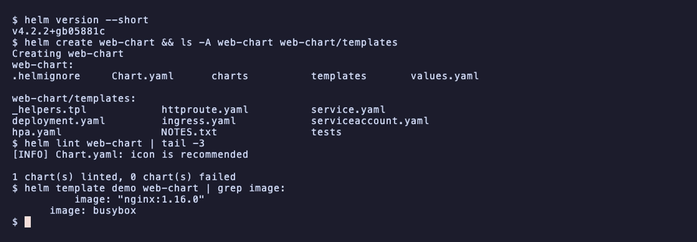
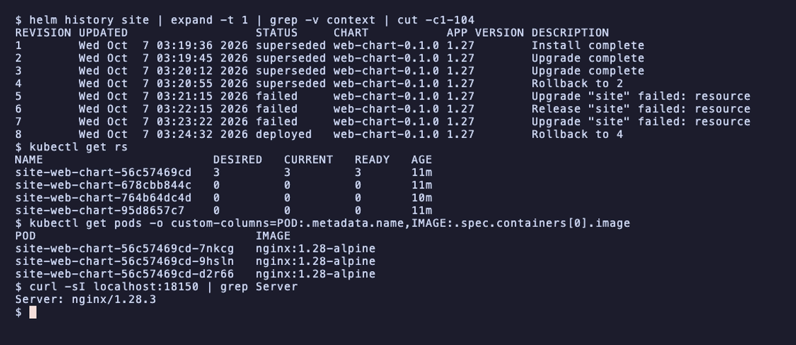
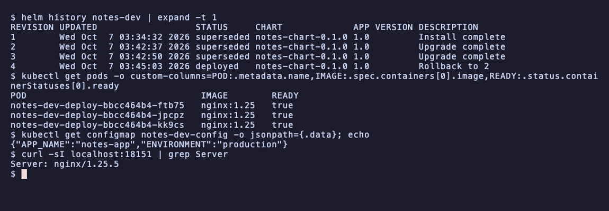

# Session 15: Helm

- Name: Aditya Singhi
- Enrollment number: 24BCS10177

Everything runs on a single node kind cluster (Kubernetes v1.37.0) with Helm
v4.2.2. The kind node maps NodePort 30080 to `localhost:18150` and 30090 to
`localhost:18151`, so curl shows the real nginx version in the `Server`
header. `web-chart/` is used for Tasks 1 and 2, `notes-chart/` for Task 3.

## Task 1: Helm commands

### helm create

```bash
helm create web-chart
helm template demo web-chart | grep image:
```

```
Creating web-chart
          image: "nginx:1.16.0"
      image: busybox
```



`helm create` writes a working chart with a Deployment, Service, test pod and
helpers. The empty tag falls back to `appVersion: "1.16.0"`, a 2019 nginx, so
I set `1.27-alpine` and a NodePort Service on 30080.

### helm repo

```bash
helm repo add bitnami https://charts.bitnami.com/bitnami
helm repo add prometheus-community https://prometheus-community.github.io/helm-charts
helm repo update
helm repo remove prometheus-community
helm repo list
```

```
"bitnami" has been added to your repositories
"prometheus-community" has been added to your repositories
Hang tight while we grab the latest from your chart repositories...
...Successfully got an update from the "bitnami" chart repository
...Successfully got an update from the "prometheus-community" chart repository
Update Complete. ⎈Happy Helming!⎈
"prometheus-community" has been removed from your repositories
NAME   	URL
bitnami	https://charts.bitnami.com/bitnami
```

A repo is an HTTP server with an `index.yaml` listing every chart version.
`add` and `update` download that index. Nothing touches the cluster.

### helm search

```bash
helm search repo nginx
helm search hub nginx --max-col-width 60 | head -8
```

```
NAME                                          	CHART VERSION	APP VERSION	DESCRIPTION
bitnami/nginx                                 	25.2.1       	1.31.6     	NGINX Open Source is a web server that can be a...
...
URL                                                         	CHART VERSION  	APP VERSION	DESCRIPTION
https://artifacthub.io/packages/helm/cloudpirates-nginx/n...	0.16.12        	1.31.6     	Nginx is a high-performance HTTP server and reverse proxy.
...
```

`search repo` reads only my downloaded indexes. `search hub` asks Artifact
Hub, so it also finds charts from repos I never added.

### helm install

```bash
helm install web ./web-chart --wait --timeout 2m
curl -sI http://localhost:18150 | grep Server
```

```
NAME: web
LAST DEPLOYED: Wed Oct  7 02:47:33 2026
NAMESPACE: default
STATUS: deployed
REVISION: 1
DESCRIPTION: Install complete
...
Server: nginx/1.27.5
```

Helm renders the templates and sends them to the API server. The release
name goes into every object name, so I got `web-web-chart`.

### helm list

```bash
helm list
```

```
NAME	NAMESPACE	REVISION	UPDATED                             	STATUS  	CHART          	APP VERSION
web 	default  	1       	2026-10-07 02:47:33.256243 +0530 IST	deployed	web-chart-0.1.0	1.27
```

One row per release. In Helm 4 this also lists uninstalled releases, and the
`-a` flag is gone.

### helm status

```bash
helm status web
```

```
NAME: web
...
STATUS: deployed
...
==> v1/Deployment
NAME            READY   UP-TO-DATE   AVAILABLE   AGE
web-web-chart   1/1     1            1           9s
...
```

Status joins the stored release record with the live state of its objects.
Helm 4 prints the resources by default.

### helm get

```bash
helm get values web
helm get metadata web
```

```
USER-SUPPLIED VALUES:
null
...
APPLY_METHOD: server-side apply
```

`get` prints what Helm stored: `values`, `manifest`, `notes`, `hooks`,
`metadata` or `all`. Each revision is a Secret `sh.helm.release.v1.web.v<N>`.

### helm upgrade

```bash
helm upgrade web ./web-chart --set replicaCount=2 --wait --timeout 2m
kubectl get pods -l app.kubernetes.io/instance=web
```

```
Release "web" has been upgraded. Happy Helming!
...
REVISION: 2
DESCRIPTION: Upgrade complete
NAME                             READY   STATUS    RESTARTS   AGE
web-web-chart-755786fb86-pp5kr   1/1     Running   0          2s
web-web-chart-755786fb86-s4pcn   1/1     Running   0          25s
```

Only replicas changed, so the old pod was kept and one was added.

### helm history

```bash
helm history web
```

```
REVISION	UPDATED                 	STATUS    	CHART          	APP VERSION	DESCRIPTION
1       	Wed Oct  7 02:47:33 2026	superseded	web-chart-0.1.0	1.27       	Install complete
2       	Wed Oct  7 02:47:56 2026	deployed  	web-chart-0.1.0	1.27       	Upgrade complete
```

One line per stored revision. Only one is `deployed` at a time.

### helm rollback

```bash
helm rollback web 1 --wait --timeout 2m
helm history web
```

```
Rollback was a success! Happy Helming!
...
3       	Wed Oct  7 02:48:02 2026	deployed  	web-chart-0.1.0	1.27       	Rollback to 1
```

A rollback re-applies revision 1 as a new revision 3.

### helm uninstall

```bash
helm uninstall web
helm history web
kubectl get secrets -l owner=helm
```

```
release "web" uninstalled
Error: release: not found
No resources found in default namespace.
```

Uninstall deletes the objects and all release Secrets, unless
`--keep-history` is passed.

## Task 2: Helm rollback

Release `site` from `web-chart`. After each step I ran `helm history site`,
`kubectl get pods` with an image column, and `curl -sI localhost:18150`.

### Install

```bash
helm install site ./web-chart --wait --timeout 5m
```

```
...
1       	Wed Oct  7 03:19:36 2026	deployed	web-chart-0.1.0	1.27       	Install complete
...
POD                              IMAGE               PHASE
site-web-chart-95d8657c7-q2dgj   nginx:1.27-alpine   Running
$ curl -sI localhost:18150 | grep Server
Server: nginx/1.27.5
```

Revision 1: one pod on nginx 1.27.5.

### Upgrade, then verify

```bash
helm upgrade site ./web-chart --set image.tag=1.28-alpine --set replicaCount=3 --wait --timeout 5m
```

```
...
1       	Wed Oct  7 03:19:36 2026	superseded	web-chart-0.1.0	1.27       	Install complete
2       	Wed Oct  7 03:19:45 2026	deployed  	web-chart-0.1.0	1.27       	Upgrade complete
...
POD                               IMAGE               PHASE
site-web-chart-56c57469cd-79c96   nginx:1.28-alpine   Running
site-web-chart-56c57469cd-j2hbt   nginx:1.28-alpine   Running
site-web-chart-56c57469cd-vxl7n   nginx:1.28-alpine   Running
site-web-chart-95d8657c7-q2dgj    nginx:1.27-alpine   Running
$ curl -sI localhost:18150 | grep Server
Server: nginx/1.28.3
```

Revision 2: three new pods on 1.28.3. The 1.27 pod is still shutting down.

### Upgrade again, then verify

```bash
helm upgrade site ./web-chart --set image.tag=1.29-alpine --wait --timeout 5m
```

```
...
3       	Wed Oct  7 03:20:12 2026	deployed  	web-chart-0.1.0	1.27       	Upgrade complete
...
POD                               IMAGE               PHASE
site-web-chart-56c57469cd-79c96   nginx:1.28-alpine   Succeeded
site-web-chart-678cbb844c-qhj45   nginx:1.29-alpine   Running
...
```

A few seconds later curl returned `Server: nginx/1.29.8`. Revision 3 runs
1.29, but with one pod, not three. `helm upgrade` starts from `values.yaml`
plus this command's flags, so `replicaCount=3` was dropped.

### Rollback, then verify

```bash
helm rollback site 2 --wait --timeout 5m
```

```
Rollback was a success! Happy Helming!
...
3       	Wed Oct  7 03:20:12 2026	superseded	web-chart-0.1.0	1.27       	Upgrade complete
4       	Wed Oct  7 03:20:55 2026	deployed  	web-chart-0.1.0	1.27       	Rollback to 2
...
POD                               IMAGE               PHASE
site-web-chart-56c57469cd-9hsln   nginx:1.28-alpine   Running
site-web-chart-56c57469cd-mfbzp   nginx:1.28-alpine   Running
site-web-chart-56c57469cd-qd2h6   nginx:1.28-alpine   Running
$ curl -sI localhost:18150 | grep Server
Server: nginx/1.28.3
```

Revision 4 restores revision 2: 1.28 and 3 replicas. The pod hash
`56c57469cd` is the same as in revision 2, because the Deployment scaled its
old ReplicaSet back up.

### Automatic rollback

The session's `--atomic` flag is deprecated in Helm 4 and renamed
`--rollback-on-failure`:

```bash
helm upgrade site ./web-chart --reuse-values --set image.tag=doesnotexist --rollback-on-failure --timeout 60s
```

```
...
Error: UPGRADE FAILED: release site failed, and has been rolled back due to rollback-on-failure being set: resource Deployment/default/site-web-chart not ready. status: InProgress, message: Updated: 2/3
context deadline exceeded
```



Revision 7 failed and 8 is the automatic "Rollback to 4". Revisions 5 and 6
are an earlier `--atomic` try without `--reuse-values`, whose rollback timed
out.

## Task 3: Mini project

I built `notes-chart/` by following steps 1 to 7 of `mini-project/README.md`.
It matched the instructor's copy until I made one change (see Notes).

### Lint and render

```bash
helm lint notes-chart
helm template notes-dev notes-chart | grep -c '{{'
```

```
==> Linting notes-chart
...
1 chart(s) linted, 0 chart(s) failed
0
```

No `{{` is left after rendering, so every value was filled.

### Install and upgrade to production

```bash
helm install notes-dev notes-chart
curl -sI localhost:18151 | grep Server
```

```
NAME: notes-dev
...
REVISION: 1
...
Server: nginx/1.24.0
```

```bash
helm upgrade notes-dev notes-chart -f notes-chart/values-prod.yaml
kubectl get pods -o 'custom-columns=POD:.metadata.name,IMAGE:.spec.containers[0].image'
kubectl exec deploy/notes-dev-deploy -- env | grep ENVIRONMENT
curl -sI localhost:18151 | grep Server
```

```
Release "notes-dev" has been upgraded. Happy Helming!
...
REVISION: 2
...
POD                                IMAGE
notes-dev-deploy-bbcc464b4-9jmhq   nginx:1.25
notes-dev-deploy-bbcc464b4-kk9cs   nginx:1.25
notes-dev-deploy-bbcc464b4-tg872   nginx:1.25
ENVIRONMENT=production
Server: nginx/1.25.5
```

Development is one pod on 1.24. Production gives three pods on 1.25.

### A bad upgrade

```bash
helm upgrade notes-dev notes-chart --set image.tag=broken-tag-does-not-exist
kubectl get pods
kubectl get configmap notes-dev-config -o jsonpath='{.data}'
```

```
Release "notes-dev" has been upgraded. Happy Helming!
...
STATUS: deployed
REVISION: 3
...
NAME                                READY   STATUS             RESTARTS   AGE
notes-dev-deploy-79b4dbdffd-lwz57   0/1     ImagePullBackOff   0          24s
notes-dev-deploy-bbcc464b4-kk9cs    1/1     Running            0          38s
{"APP_NAME":"notes-app","ENVIRONMENT":"development"}
```


Helm says `deployed` because it never checks the pods without `--wait`. The
app stays up: the rolling update keeps one old 1.25 pod until a new pod is
ready. The command has no `-f values-prod.yaml`, so it also went back to 1
replica and a `development` ConfigMap.

### Rollback to revision 2

```bash
helm rollback notes-dev 2
kubectl get pods -o 'custom-columns=POD:.metadata.name,IMAGE:.spec.containers[0].image'
kubectl get configmap notes-dev-config -o jsonpath='{.data}'
helm history notes-dev
```

```
Rollback was a success! Happy Helming!
...
notes-dev-deploy-bbcc464b4-ftb75    nginx:1.25
notes-dev-deploy-bbcc464b4-jpcpz    nginx:1.25
notes-dev-deploy-bbcc464b4-kk9cs    nginx:1.25
{"APP_NAME":"notes-app","ENVIRONMENT":"production"}
...
3       	Wed Oct  7 03:42:50 2026	superseded	notes-chart-0.1.0	1.0        	Upgrade complete
4       	Wed Oct  7 03:45:03 2026	deployed  	notes-chart-0.1.0	1.0        	Rollback to 2
```



Three pods on 1.25 and the production ConfigMap are back.

### Clean up

```bash
helm uninstall notes-dev --wait
kubectl get secrets -l owner=helm
```

```
release "notes-dev" uninstalled
...
No resources found in default namespace.
```

The release objects and all its Secrets are gone.

## Notes

- `notes-chart` has one change from the instructor's copy: a
  `checksum/config` annotation on the pod template, and the version bumped to
  0.1.1. Without it, an upgrade that changed only `app.environment` updated
  the ConfigMap but left the pods on the old value.
- `helm upgrade` without `-f` or `--reuse-values` resets every value you do
  not pass. It cut replicas to 1 in Task 2 and reset the ConfigMap in Task 3.
- Helm 4 differences from the session notes: `--atomic` is deprecated in
  favour of `--rollback-on-failure`, `helm list -a` and
  `helm status --show-resources` are gone, and releases use server-side apply.
- An upgrade once got stuck in `pending-upgrade` ("another operation is in
  progress"). In Helm 4.2.2 a plain `helm rollback site 1` cleared it.
