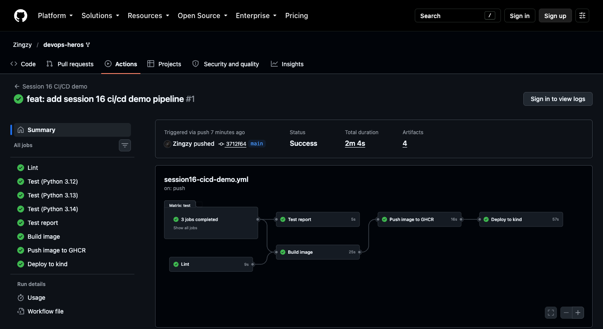
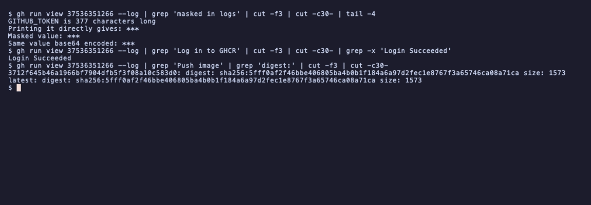
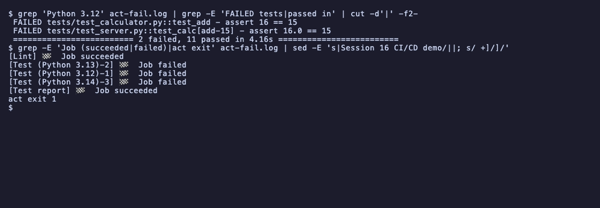

# Session 16: CI/CD and GitHub Actions

- Name: Aditya Singhi
- Enrollment number: 24BCS10177

A CI/CD demo built on the instructor's `10-final-cicd-pipeline` calculator, with a
small HTTP API added so the deploy can be smoke tested. One GitHub Actions workflow
lints, tests on three Python versions, builds a Docker image, pushes it to GHCR and
deploys it to a kind cluster inside the runner. Every job passed in run
[#37536351266](https://github.com/Zingzy/devops-heros/actions/runs/37536351266)
for commit `3712f64`.

GitHub only runs workflows from `.github/workflows/` at the repo root, so the
workflow lives there and not inside this folder. A second copy here would never run
and would drift.

## Task 1: CI vs CD

| | CI | CD |
|---|---|---|
| Question | Is this commit good? | Is this commit running? |
| My jobs | `lint`, `test` (x3), `test-report`, `build` | `publish`, `deploy` |
| Runs on | every push and pull request | push to `main` or a manual run |

CI checks the commit. CD ships it. `publish` has
`if: github.event_name != 'pull_request'`, so a pull request runs all of CI and
stops before anything leaves the runner. There is no approval step, so this is
continuous deployment to a throwaway cluster.

## Task 2: CI/CD pipeline

```
lint ──────────────────────────► build ────────► publish ──────► deploy
                                   ▲             push to GHCR    kind + smoke test
test 3.12, 3.13, 3.14 ─────────────┤
                                   ▼
                                 test-report
```



GitHub drew the same graph from the `needs:` keys. Nothing is built unless lint and
all three test jobs pass, and nothing is deployed unless the image was pushed.

## Task 3: GitHub Actions

GitHub Actions runs the jobs described in a YAML file on machines GitHub provides,
whenever a listed event happens. My triggers:

```yaml
on:
  push:
    branches: [main]
    paths:
      - "session-16-github-actions/homework-cicd-demo/**"
      - "!session-16-github-actions/homework-cicd-demo/README.md"
      - "!session-16-github-actions/homework-cicd-demo/screenshots/**"
      - ".github/workflows/session16-cicd-demo.yml"
  pull_request:
    paths: [same list]
  workflow_dispatch:
```

This repo holds every session's homework, so the `paths` filter keeps other
sessions' commits from redeploying my app. README and screenshot edits do not start
a run either. `workflow_dispatch` adds a manual "Run workflow" button.

## Task 4: Workflow

```yaml
permissions:
  contents: read

concurrency:
  group: session16-cicd-demo-${{ github.ref }}
  cancel-in-progress: true

defaults:
  run:
    working-directory: session-16-github-actions/homework-cicd-demo
```

The token is read only by default, and only `publish` raises it to
`packages: write`. `concurrency` cancels an older run on the same branch so two
deploys never race. `working-directory` makes every `run:` step start in my folder.

## Task 5: Jobs

```bash
gh run view 37536351266 --json jobs -q '.jobs[] | "\(.name)  \(.conclusion)  \(.startedAt) \(.completedAt)"'
```

```
Lint  success  2026-10-06T21:47:40Z 2026-10-06T21:47:49Z
Test (Python 3.13)  success  2026-10-06T21:47:39Z 2026-10-06T21:47:54Z
Test (Python 3.12)  success  2026-10-06T21:47:39Z 2026-10-06T21:47:51Z
Test (Python 3.14)  success  2026-10-06T21:47:39Z 2026-10-06T21:47:51Z
Build image  success  2026-10-06T21:47:56Z 2026-10-06T21:48:21Z
Test report  success  2026-10-06T21:47:56Z 2026-10-06T21:48:01Z
Push image to GHCR  success  2026-10-06T21:48:23Z 2026-10-06T21:48:39Z
Deploy to kind  success  2026-10-06T21:48:42Z 2026-10-06T21:49:39Z
```

Jobs without `needs` started together. `build` (`needs: [lint, test]`) waited for
the slowest test job and started two seconds after it. Each job gets a fresh VM,
so files only move between jobs as artifacts (Task 9).

## Task 6: Steps

```yaml
steps:
  - uses: actions/checkout@v7
  ...
  - name: Run pytest
    run: pytest -v --junitxml=reports/junit-py${{ matrix.python-version }}.xml
  - name: Upload test report
    if: always()
    uses: actions/upload-artifact@v7
    with:
      name: test-report-py${{ matrix.python-version }}
      path: ${{ env.APP_DIR }}/reports/
```

`uses:` runs a packaged action and `run:` runs shell commands. Steps share one
machine and run in order. `if: always()` uploads the report even when pytest fails.
`working-directory` only applies to `run:` steps, which is why the upload path
needs `${{ env.APP_DIR }}`.

## Task 7: Runners

All jobs use `runs-on: ubuntu-latest`, a VM GitHub creates per job and deletes
afterwards. The first step of each job prints what it got:

```
##[group]Runner Image
Image: ubuntu-24.04
Version: 20261002.596
```

The matrix turns one job definition into three jobs on three runners:

```yaml
strategy:
  fail-fast: false
  matrix:
    python-version: ["3.12", "3.13", "3.14"]
```

The three `setup-python` steps logged `Successfully set up CPython (3.12.14)`,
`(3.13.15)` and `(3.14.8)`. `fail-fast: false` keeps the other versions running when one fails, so a break on
one version shows up as exactly that.

## Task 8: Secrets

I used the automatic `GITHUB_TOKEN`. GitHub creates it per job, limits it to the
`permissions:` above and revokes it when the job ends. A step in `publish` tries to
print it:

```yaml
- name: Show that secrets are masked in logs
  env:
    TOKEN: ${{ secrets.GITHUB_TOKEN }}
  run: |
    echo "GITHUB_TOKEN is ${#TOKEN} characters long"
    echo "Printing it directly gives: $TOKEN"
    DEMO_VALUE="hw16-$(date +%s)-demo"
    echo "::add-mask::$DEMO_VALUE"
    echo "Masked value: $DEMO_VALUE"
    echo "Same value base64 encoded: $(printf %s "$DEMO_VALUE" | base64)"
```

```bash
gh run view 37536351266 --log | grep 'masked in logs' | cut -f3 | cut -c30- | tail -4
```

```
GITHUB_TOKEN is 377 characters long
Printing it directly gives: ***
Masked value: ***
Same value base64 encoded: ***
```



The token is real and the log shows `***`. `::add-mask::` hides a value computed at
runtime, and the runner even masked its base64 form. The same token logs in to GHCR
(`echo "$TOKEN" | docker login ghcr.io ... --password-stdin`) and becomes the
`ghcr-pull` image pull secret in the cluster.

## Task 9: Artifacts

Each test job uploads its JUnit report. The `test-report` job downloads all three
by pattern and writes a table to the run summary:

```yaml
- name: Download all test reports
  uses: actions/download-artifact@v8
  with:
    pattern: test-report-*
    path: reports
    merge-multiple: true
```

```
Found 3 artifact(s)
Filtering artifacts by pattern 'test-report-*'
...
Total of 3 artifact(s) downloaded
...
| Report | Tests | Failures | Errors | Time (s) |
|---|---|---|---|---|
| junit-py3.12.xml | 13 | 0 | 0 | 0.613 |
| junit-py3.13.xml | 13 | 0 | 0 | 0.610 |
| junit-py3.14.xml | 13 | 0 | 0 | 0.600 |
```


The `image` artifact carries the built image (`docker save`) from `build` to
`publish`, which runs `docker load`. The bytes that passed the smoke test are the
bytes that get pushed, instead of a fresh untested build.

## Task 10: Build

The `Dockerfile` starts from `python:3.14-slim`, copies `app/`, runs as user 10001
and has a `HEALTHCHECK` that calls `/healthz` with Python, since the slim image has
no `curl`. The app only uses the standard library, so nothing is installed. The
`build` job runs:

```bash
docker build --build-arg APP_VERSION=${{ github.sha }} \
  --label org.opencontainers.image.source=${{ github.server_url }}/${{ github.repository }} \
  -t $IMAGE:${{ github.sha }} .
```

`APP_VERSION` becomes the commit SHA, and `/healthz` returns it, which is how the
deploy proves which commit is running. The job then starts the container, waits
for Docker to report it healthy and runs the smoke test inside it:

```
health: starting
...
health: healthy
GET /healthz -> {'status': 'ok', 'version': '3712f645b46a1966bf7904dfb5f3f08a10c583d0'}
GET /calc/add?a=10&b=5 -> {'op': 'add', 'a': 10.0, 'b': 5.0, 'result': 15.0, 'version': '3712f645b46a1966bf7904dfb5f3f08a10c583d0'}
Smoke test passed
```

## Task 11: Test

`lint` runs `ruff check`. The instructor's code failed it on the first try:

```bash
ruff check .
```

```
app/calculator.py:1:1: I001 [*] Import block is un-sorted or un-formatted
app/calculator.py:53:16: BLE001 Do not catch blind exception: `Exception`
tests/test_calculator.py:1:1: I001 [*] Import block is un-sorted or un-formatted
tests/test_calculator.py:5:1: I001 [*] Import block is un-sorted or un-formatted
Found 4 errors.
[*] 3 fixable with the `--fix` option.
```

`ruff check --fix` sorted the imports. I removed the `except Exception` branch,
since the only errors that loop can raise are the `ValueError`s caught just above
it. Then `pytest -v` in the 3.14 job on GitHub:

```
platform linux -- Python 3.14.8, pytest-9.1.1, pluggy-1.6.0 -- /opt/hostedtoolcache/Python/3.14.8/x64/bin/python
...
collecting ... collected 13 items
...
============================== 13 passed in 0.60s ==============================
```

To check that a failing test blocks the build, I broke `add()` the way the
instructor's README does (`return a + b + 1`) and ran the workflow locally with
`act`, so no broken commit went to GitHub:

```bash
act pull_request -W .github/workflows/session16-cicd-demo.yml ...
```

```
 FAILED tests/test_calculator.py::test_add - assert 16 == 15
 FAILED tests/test_server.py::test_calc[add-15] - assert 16.0 == 15
 ========================= 2 failed, 11 passed in 4.16s =========================
```



All three test jobs failed and `Build image` never ran, so neither did `publish` or
`deploy`. `Test report` still ran because of `if: always()`. I restored the file
afterwards.

## Task 12: Pipeline execution

```bash
gh run view 37536351266 -R Zingzy/devops-heros
```

```
✓ main Session 16 CI/CD demo · 37536351266
Triggered via push about 14 minutes ago

JOBS
✓ Lint in 9s (ID 112518190058)
✓ Test (Python 3.13) in 15s (ID 112518190432)
✓ Test (Python 3.12) in 12s (ID 112518190460)
✓ Test (Python 3.14) in 12s (ID 112518190653)
✓ Build image in 25s (ID 112518307128)
✓ Test report in 5s (ID 112518307201)
✓ Push image to GHCR in 16s (ID 112518493665)
✓ Deploy to kind in 57s (ID 112518617887)
```

`publish` pushed the tested image under the commit SHA and `latest`:

```
3712f645b46a1966bf7904dfb5f3f08a10c583d0: digest: sha256:5fff0af2f46bbe406805ba4b0b1f184a6a97d2fec1e8767f3a65746ca08a71ca size: 1573
...
latest: digest: sha256:5fff0af2f46bbe406805ba4b0b1f184a6a97d2fec1e8767f3a65746ca08a71ca size: 1573
```

`deploy` created a kind cluster, applied the manifest with the SHA tag, waited for
the rollout, then smoke tested through the Service with `kubectl port-forward`:

```yaml
sed "s|image: IMAGE|image: $IMAGE:${{ github.sha }}|" k8s/calculator.yaml | kubectl apply -f -
kubectl rollout status deployment/calculator --timeout=120s
```

```
deployment.apps/calculator created
service/calculator created
...
deployment "calculator" successfully rolled out
...
GET /healthz -> {'status': 'ok', 'version': '3712f645b46a1966bf7904dfb5f3f08a10c583d0'}
GET /calc/add?a=10&b=5 -> {'op': 'add', 'a': 10.0, 'b': 5.0, 'result': 15.0, 'version': '3712f645b46a1966bf7904dfb5f3f08a10c583d0'}
Smoke test passed
calculator-56898f4f66-6ctf6  ghcr.io/zingzy/session16-calculator@sha256:5fff0af2f46bbe406805ba4b0b1f184a6a97d2fec1e8767f3a65746ca08a71ca
calculator-56898f4f66-gcwtw  ghcr.io/zingzy/session16-calculator@sha256:5fff0af2f46bbe406805ba4b0b1f184a6a97d2fec1e8767f3a65746ca08a71ca
```


The version in `/healthz` matches the commit that started the run, and both pods
run the digest that `publish` pushed. So the deployed pods run this run's image,
pulled from GHCR. The smoke test fails the job if the version does not match.

## Deliverables

| Deliverable | Where |
|---|---|
| Application source code | `app/`, `tests/` |
| Dockerfile | `Dockerfile` |
| GitHub Actions workflow | `.github/workflows/session16-cicd-demo.yml` |
| CI pipeline | `lint`, `test`, `test-report`, `build` |
| CD pipeline | `publish`, `deploy` |
| Screenshots of a successful run | `screenshots/01`, `02`, `03`, `05` |

## Notes

- The instructor's code passes ruff 0.15.0 but fails 0.16.10, which turned on many
  more rules by default. I pinned ruff in `requirements.txt`.
- The GHCR package came out public, taking the public repo's visibility. An
  anonymous manifest fetch returns 200. The pull secret is kept for a private repo.
- Every `actions/checkout` cleanup warns
  `No url found for submodule path 'session-16-github-actions/mini-project 10-33-34-265'`.
  That instructor folder was committed as a gitlink (mode `160000`) with no
  `.gitmodules`.
- In a local kind test, an apply with no tag set `imagePullPolicy: Always`, and a
  later apply with a tag kept it. The manifest now sets `IfNotPresent` itself.
