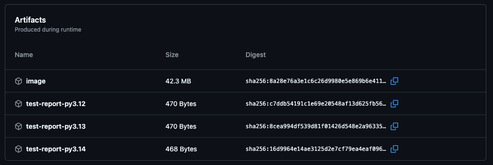
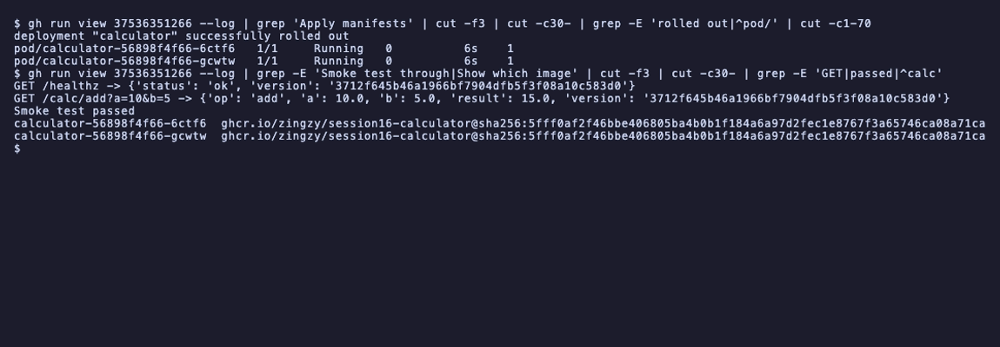
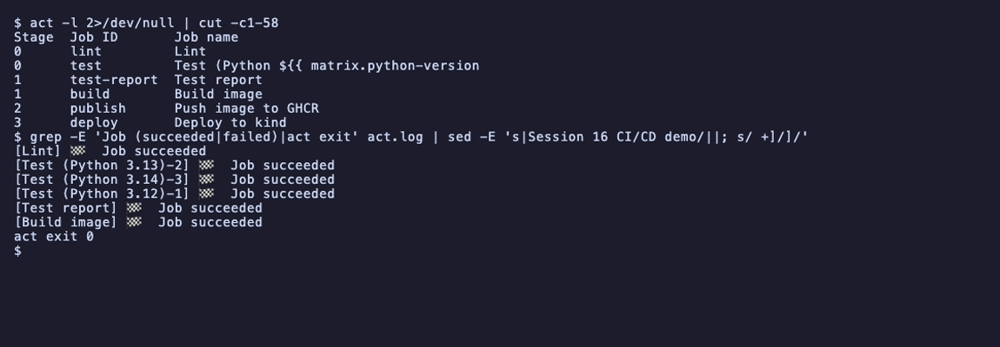

# Session 16: CI/CD and GitHub Actions

- Name: Aditya Singhi
- Enrollment number: 24BCS10177

This is a complete CI/CD demo built on the calculator app from the instructor's
`10-final-cicd-pipeline` folder. I added a small HTTP API on top of it so the
deploy step has something to smoke test, a Dockerfile, a Kubernetes manifest, and
one GitHub Actions workflow that lints, tests on three Python versions, builds the
image, pushes it to GHCR and deploys it to a kind cluster inside the runner.

The pipeline ran on GitHub-hosted `ubuntu-latest` runners (Ubuntu 24.04) in run
[#37536351266](https://github.com/Zingzy/devops-heros/actions/runs/37536351266)
for commit `3712f64`, and every job passed on the first push. Before pushing I ran
the CI part locally with `act` 0.2.89 and rehearsed the deploy on a local kind
v0.33.0 cluster (Kubernetes v1.37.0). Tools: Python 3.12, 3.13 and 3.14,
pytest 9.1.1, ruff 0.16.10, `python:3.14-slim` as the base image.

Output blocks are copied from the terminal or from `gh run view --log`.

## Project layout

```
.github/workflows/session16-cicd-demo.yml      the workflow (repo root, see below)
session-16-github-actions/homework-cicd-demo/
├── app/
│   ├── calculator.py        instructor's calculator, plus two lint fixes
│   └── server.py            HTTP API: /healthz and /calc/<op>?a=..&b=..
├── tests/
│   ├── test_calculator.py   instructor's 5 tests
│   └── test_server.py       8 tests that start the server on a random port
├── scripts/smoke_test.py    used by both the CI smoke test and the CD smoke test
├── k8s/calculator.yaml      Deployment (2 replicas) and ClusterIP Service
├── Dockerfile
├── pyproject.toml           pytest and ruff settings
├── requirements.txt         pytest and ruff, pinned
└── screenshots/
```

The assignment lists the workflow as part of the project. GitHub only reads
workflows from `.github/workflows/` at the root of the repository, so a copy inside
this folder would never run. The real file lives at the repo root and there is no
second copy here, because two copies would drift apart.

## Task 1: CI vs CD

| | Continuous integration | Continuous delivery / deployment |
|---|---|---|
| Question it answers | Is this commit good? | Is this commit running where users can reach it? |
| Runs on | Every push and every pull request | Only after CI passes, on a push to `main` or a manual run |
| My jobs | `lint`, `test` (x3), `test-report`, `build` | `publish`, `deploy` |
| Output | Pass or fail, a test report, an image tarball | An image in GHCR, pods running that image |
| If it fails | The commit is blocked | The old version keeps running |

Delivery and deployment differ in one step. Continuous delivery means every passing
commit produces a release that *could* go out, usually with a manual approval.
Continuous deployment drops the approval. My pipeline is continuous deployment to
a throwaway cluster: a push to `main` that passes CI is pushed to GHCR and deployed
with no human in the loop.

The split is enforced in the workflow, not just in the naming. `publish` has
`if: github.event_name != 'pull_request'`, so a pull request runs the whole CI half
and stops before anything leaves the runner. A pull request from a fork could
otherwise push an image to my registry.

## Task 2: the CI/CD pipeline

```bash
act -l -W .github/workflows/session16-cicd-demo.yml
```

```
Stage  Job ID       Job name                                    Workflow name          Workflow file            Events
0      lint         Lint                                        Session 16 CI/CD demo  session16-cicd-demo.yml  pull_request,workflow_dispatch,push
0      test         Test (Python ${{ matrix.python-version }})  Session 16 CI/CD demo  session16-cicd-demo.yml  push,pull_request,workflow_dispatch
1      test-report  Test report                                 Session 16 CI/CD demo  session16-cicd-demo.yml  push,pull_request,workflow_dispatch
1      build        Build image                                 Session 16 CI/CD demo  session16-cicd-demo.yml  push,pull_request,workflow_dispatch
2      publish      Push image to GHCR                          Session 16 CI/CD demo  session16-cicd-demo.yml  push,pull_request,workflow_dispatch
3      deploy       Deploy to kind                              Session 16 CI/CD demo  session16-cicd-demo.yml  push,pull_request,workflow_dispatch
```

`act` computes the stages from the `needs:` graph. Jobs in the same stage run in
parallel on separate runners:

```
stage 0                          stage 1         stage 2         stage 3

lint ──────────────────────────► build ────────► publish ──────► deploy
                                   ▲             push to GHCR    kind + smoke test
test 3.12, 3.13, 3.14 ─────────────┤
(matrix, 3 runners)                ▼
                                 test-report, downloads the 3 reports
```

GitHub drew the same graph for the real run:


The whole run took 2m 4s. `deploy` was the slowest job at 57s, and 20s of that was
kind starting a control plane.

## Task 3: GitHub Actions

GitHub Actions is the CI/CD system built into GitHub. A YAML file in
`.github/workflows/` says which events start it, and GitHub runs the jobs on
machines it provides. There is no CI server to install, and the results show up
next to the commit and the pull request.

My workflow listens to three events:

```yaml
on:
  push:
    branches: [main]
    paths:
      - "session-16-github-actions/homework-cicd-demo/**"
      - "!session-16-github-actions/homework-cicd-demo/README.md"
      - "!session-16-github-actions/homework-cicd-demo/screenshots/**"
      - ".github/workflows/session16-cicd-demo.yml"
  pull_request:
    paths: [same list]
  workflow_dispatch:
```

The `paths` filter matters in this repository because it holds every session's
homework. Without it, a commit to session 17 would rebuild and redeploy my
calculator. The two `!` lines are my own choice: editing this README or adding a
screenshot changes nothing that the pipeline tests or ships, so it should not start
a run. That also meant the commit that added this README did not start a second
pointless deploy.

`workflow_dispatch` adds a "Run workflow" button in the Actions tab, which is
useful to re-run the pipeline without a dummy commit.

## Task 4: workflow

A workflow is one YAML file. Apart from the triggers above, mine sets four things
at the top level:

```yaml
permissions:
  contents: read

concurrency:
  group: session16-cicd-demo-${{ github.ref }}
  cancel-in-progress: true

env:
  APP_DIR: session-16-github-actions/homework-cicd-demo
  IMAGE: ghcr.io/zingzy/session16-calculator

defaults:
  run:
    working-directory: session-16-github-actions/homework-cicd-demo
```

- `permissions` sets what the automatic `GITHUB_TOKEN` may do. Read only by default,
  and only `publish` raises it to `packages: write`. The runner prints the effective
  permissions at the start of each job, so this is checkable (Task 8).
- `concurrency` cancels an older run on the same branch when a newer one starts, so
  two deploys never race each other.
- `env` at the top is visible to every job and step.
- `defaults.run.working-directory` makes every `run:` step start inside my
  homework folder instead of the repo root.

## Task 5: jobs

| Job | `needs` | Condition | Runs |
|---|---|---|---|
| `lint` | | | always |
| `test` | | | 3 times, one per Python version |
| `test-report` | `test` | `if: always()` | even when tests fail |
| `build` | `lint`, `test` | | only when all 4 passed |
| `publish` | `build` | not a pull request | |
| `deploy` | `publish` | | |

Each job gets a fresh virtual machine. Nothing on disk carries over from one job
to the next, which is why the image has to travel from `build` to `publish` as an
artifact (Task 9).

`needs` is what turns a list of jobs into a pipeline. A job without `needs` starts
at once, so `lint` and the three `test` jobs all started within one second of each
other:

```bash
gh run view 37536351266 --json jobs -q '.jobs[] | "\(.name)  \(.conclusion)  \(.startedAt) \(.completedAt)"'
```

```
Lint  success  2026-10-06T21:47:40Z 2026-10-06T21:47:49Z
Test (Python 3.13)  success  2026-10-06T21:47:39Z 2026-10-06T21:47:54Z
Test (Python 3.12)  success  2026-10-06T21:47:39Z 2026-10-06T21:47:51Z
Test (Python 3.14)  success  2026-10-06T21:47:39Z 2026-10-06T21:47:51Z
Build image  success  2026-10-06T21:47:56Z 2026-10-06T21:48:21Z
Test report  success  2026-10-06T21:47:56Z 2026-10-06T21:48:01Z
Push image to GHCR  success  2026-10-06T21:48:23Z 2026-10-06T21:48:39Z
Deploy to kind  success  2026-10-06T21:48:42Z 2026-10-06T21:49:39Z
```

`build` waited for the slowest test job (3.13, finished 21:47:54) and started two
seconds later. What happens when a test fails is shown in Task 11.

## Task 6: steps

A step is either `uses:`, which runs a packaged action, or `run:`, which runs
shell commands. My `test` job has both kinds:

```yaml
steps:
  - uses: actions/checkout@v7
  - uses: actions/setup-python@v7
    with:
      python-version: ${{ matrix.python-version }}
  - name: Install dependencies
    run: pip install -r requirements.txt
  - name: Run pytest
    run: pytest -v --junitxml=reports/junit-py${{ matrix.python-version }}.xml
  - name: Upload test report
    if: always()
    uses: actions/upload-artifact@v7
    with:
      name: test-report-py${{ matrix.python-version }}
      path: ${{ env.APP_DIR }}/reports/
```

Steps in one job share the same machine and filesystem and run in order. A failing
step stops the job unless a later step has `if: always()`, which is why the upload
step still runs when pytest fails.

One thing that caught me: `defaults.run.working-directory` only applies to `run:`
steps. A `uses:` step still resolves paths from the repo root. That is why the
upload path is `${{ env.APP_DIR }}/reports/` while the pytest step writes to
plain `reports/`. Both point at the same folder.

I used plain `docker build` and `docker push` in `run:` steps instead of the
docker/build-push-action. The commands are visible in the log and they are the
same commands I ran locally.

## Task 7: runners

A runner is the machine that executes one job. All my jobs use
`runs-on: ubuntu-latest`, a VM that GitHub creates for the job and throws away
afterwards. The first step of every job prints what it got:

```
##[group]Operating System
Ubuntu
24.04.5
LTS
##[endgroup]
##[group]Runner Image
Image: ubuntu-24.04
Version: 20261002.596
```

The `test` job uses a matrix to run the same steps on three Python versions:

```yaml
strategy:
  fail-fast: false
  matrix:
    python-version: ["3.12", "3.13", "3.14"]
```

That one job definition became three jobs on three separate runners, each with its
own report. `fail-fast: false` keeps the other versions running when one fails, so
a failure on 3.12 alone is visible as a 3.12 problem instead of cancelling the rest.

What each runner actually installed:

```
Lint                 Successfully set up CPython (3.14.7)    runner image 20260901.588
Test (Python 3.12)   Successfully set up CPython (3.12.14)   runner image 20260901.588
Test (Python 3.13)   Successfully set up CPython (3.13.15)   runner image 20260901.588
Test (Python 3.14)   Successfully set up CPython (3.14.8)    runner image 20261002.596
```

This was a surprise. `lint` and `test (3.14)` both asked for `"3.14"` in the same
run and got different patch versions. They landed on two different runner image
versions, and `setup-python` uses whatever 3.14.x is already cached on the image
when it matches. A matrix entry of `"3.14"` pins the minor version only. If a
patch release ever mattered, I would need `"3.14.8"`.

Every job also carried this notice:

```
"The ubuntu-latest label will migrate to Ubuntu 26 beginning October 19, 2026."
```

`ubuntu-latest` is a moving label. In twelve days the same workflow will run on a
different OS without any change in my repo. Pinning `ubuntu-24.04` is the way to
avoid that.

GitHub also offers Windows and macOS runners, larger paid runners, and self-hosted
runners, which are your own machines running the runner agent. For local testing
I used `act`, which runs the jobs in Docker containers that imitate the hosted
runner (Task 13).

## Task 8: secrets

I used the automatic `GITHUB_TOKEN` instead of creating a repository secret. GitHub
creates it for each job, scopes it to this repository, limits it to the
`permissions:` I set, and revokes it when the job ends. It is the right secret for
pushing to GHCR, because GHCR accepts it and nothing long lived has to be stored.

The `publish` job has a step that tries to leak it:

```yaml
- name: Show that secrets are masked in logs
  env:
    TOKEN: ${{ secrets.GITHUB_TOKEN }}
  run: |
    echo "GITHUB_TOKEN is ${#TOKEN} characters long"
    echo "Printing it directly gives: $TOKEN"
    DEMO_VALUE="hw16-$(date +%s)-demo"
    echo "::add-mask::$DEMO_VALUE"
    echo "Masked value: $DEMO_VALUE"
    echo "Same value base64 encoded: $(printf %s "$DEMO_VALUE" | base64)"
```

```bash
gh run view 37536351266 --log | grep 'masked in logs' | cut -f3 | cut -c30- | tail -4
```

```
GITHUB_TOKEN is 377 characters long
Printing it directly gives: ***
Masked value: ***
Same value base64 encoded: ***
```


The token is real (377 characters) and the log shows `***`. `::add-mask::` lets a
step register its own value for masking, which is how you hide something computed
at runtime, like a password fetched from a vault.

I expected the base64 line to leak, because that is the usual warning about
masking. It did not. The runner masks a few encodings of each registered value,
base64 among them. That is still string matching on the log, not protection. A
script that splits the value or writes it to a file that ends up in an artifact
can still expose it. The real protection is the short lifetime and the narrow
permissions:

```
publish job                       deploy job
##[group]GITHUB_TOKEN Permissions ##[group]GITHUB_TOKEN Permissions
Contents: read                    Contents: read
Metadata: read                    Metadata: read
Packages: write                   Packages: read
```

Two more places the token is used, both through `env:` so the value never appears
inside the script text:

```yaml
run: echo "$TOKEN" | docker login ghcr.io -u ${{ github.actor }} --password-stdin
```

```yaml
run: |
  kubectl create secret docker-registry ghcr-pull \
    --docker-server=ghcr.io \
    --docker-username=${{ github.actor }} \
    --docker-password="$TOKEN"
```

`--password-stdin` keeps the token out of the process list. The second one turns
the GitHub secret into a Kubernetes Secret, which the Deployment uses as an
`imagePullSecret` so the kind node can log in to GHCR.

I added the pull secret because I assumed a new GHCR package is private. After the
run I checked with an anonymous token, no login at all:

```bash
T=$(curl -s "https://ghcr.io/token?scope=repository:zingzy/session16-calculator:pull" | python3 -c "import json,sys; print(json.load(sys.stdin).get('token',''))")
curl -s -o /dev/null -w 'anon manifest: %{http_code}\n' -H "Authorization: Bearer $T" \
  -H 'Accept: application/vnd.oci.image.index.v1+json,application/vnd.docker.distribution.manifest.v2+json' \
  https://ghcr.io/v2/zingzy/session16-calculator/manifests/latest
```

```
anon manifest: 200
```

The package is public. It was pushed from a public repository with that
repository's token and the `org.opencontainers.image.source` label, and it took the
repository's visibility. So for this repo the pull secret is not needed. I kept it,
because it costs one step and the deploy keeps working if the repository or the
package is ever made private.

The instructor's README uses a `DEMO_SECRET` repository secret. The mechanism is
the same, `secrets.NAME` in an `env:` block, but someone has to create it in
Settings first. `GITHUB_TOKEN` needed no setup.

## Task 9: artifacts

An artifact is a file a job uploads so it outlives the runner. The pipeline uses
two.

**Test reports.** Each `test` job writes JUnit XML and uploads it as
`test-report-py<version>`. The `test-report` job downloads all three by pattern
and turns them into a table on the run summary page:

```yaml
- name: Download all test reports
  uses: actions/download-artifact@v8
  with:
    pattern: test-report-*
    path: reports
    merge-multiple: true
```

```
Found 3 artifact(s)
Filtering artifacts by pattern 'test-report-*'
Preparing to download the following artifacts:
- test-report-py3.12 (ID: 11446757231, Size: 470, Expected Digest: sha256:c7ddb54191c1e69e20548af13d625fb56ae878b67e8bbf5bb3206ce7c32661fe)
- test-report-py3.14 (ID: 11445828654, Size: 468, Expected Digest: sha256:16d9964e14ae3125d2e7cf79ea4eaf09612022eeb8eb39b631ad2d5e87e4d5e8)
- test-report-py3.13 (ID: 11445598680, Size: 470, Expected Digest: sha256:8cea994df539d81f01426d548e2a96335d9dde0444640d5eeadcc2334d6c8926)
...
Total of 3 artifact(s) downloaded
```

```
total 12
-rw-r--r-- 1 runner runner 1317 Oct  6 21:47 junit-py3.12.xml
-rw-r--r-- 1 runner runner 1317 Oct  6 21:47 junit-py3.13.xml
-rw-r--r-- 1 runner runner 1317 Oct  6 21:47 junit-py3.14.xml
### Test results

| Report | Tests | Failures | Errors | Time (s) |
|---|---|---|---|---|
| junit-py3.12.xml | 13 | 0 | 0 | 0.613 |
| junit-py3.13.xml | 13 | 0 | 0 | 0.610 |
| junit-py3.14.xml | 13 | 0 | 0 | 0.600 |
```

The digests match between the upload log and the download log
(`16d9964e...` for 3.14 on both sides). Since download-artifact v8, a mismatch is
an error instead of a warning.

**The image.** `build` saves the image with `docker save` and uploads it as
`image`. `publish` downloads it and runs `docker load`, so the bytes that passed the
smoke test are the bytes that get pushed. Building again in `publish` would produce
a new, untested image.

```
Loaded image: ghcr.io/zingzy/session16-calculator:3712f645b46a1966bf7904dfb5f3f08a10c583d0
```



The image artifact is 42.3 MB and has `retention-days: 1`, since nobody needs it
after `publish`. The reports keep 7 days. Artifacts and Git hold different things:
Git keeps the source, artifacts keep what a run produced from it.

## Task 10: build

The Dockerfile:

```dockerfile
FROM python:3.14-slim

ARG APP_VERSION=dev
ENV APP_VERSION=${APP_VERSION} \
    PORT=8000 \
    PYTHONUNBUFFERED=1

WORKDIR /srv
COPY app/ app/

USER 10001
EXPOSE 8000

HEALTHCHECK --interval=5s --timeout=3s --retries=5 \
  CMD ["python", "-c", "import urllib.request; urllib.request.urlopen('http://127.0.0.1:8000/healthz')"]

CMD ["python", "-m", "app.server"]
```

The app only uses the standard library, so there is nothing to `pip install` in
the image and no need for a multi stage build. Tests and pytest stay out of it.
`APP_VERSION` is set to the commit SHA at build time, and `/healthz` returns it.
That is what lets the deploy prove which commit is running. `USER 10001` means the
container does not run as root, and the health check uses Python because the slim
image has no `curl`.

Locally, on a port from my range:

```bash
docker build --build-arg APP_VERSION=local-test -t ghcr.io/zingzy/session16-calculator:local-test .
docker run -d --rm --name hw16-local -p 18161:8000 ghcr.io/zingzy/session16-calculator:local-test
docker ps --filter name=hw16-local --format '{{.Names}}  {{.Status}}  {{.Ports}}'
curl -s localhost:18161/healthz
curl -s 'localhost:18161/calc/divide?a=10&b=0'
curl -s -o /dev/null -w '%{http_code}\n' 'localhost:18161/calc/power?a=2&b=3'
docker exec hw16-local id
docker image ls ghcr.io/zingzy/session16-calculator
```

```
hw16-local  Up 10 seconds (healthy)  0.0.0.0:18161->8000/tcp, [::]:18161->8000/tcp
{"status": "ok", "version": "local-test"}
{"error": "Cannot divide by zero"}
404
uid=10001 gid=0(root) groups=0(root)
```

```
IMAGE                                            ID             DISK USAGE   CONTENT SIZE   EXTRA
ghcr.io/zingzy/session16-calculator:local-test   22d09ee29d7f        204MB         43.8MB
```

In the pipeline, `build` builds with the real SHA, starts the container, waits for
Docker to report it healthy, then runs the same smoke test script inside it:

```yaml
docker run -d --name hw16-smoke $IMAGE:${{ github.sha }}
for i in $(seq 1 20); do
  status=$(docker inspect -f '{{.State.Health.Status}}' hw16-smoke)
  echo "health: $status"
  [ "$status" = healthy ] && break
  sleep 2
done
docker exec -i hw16-smoke python - http://127.0.0.1:8000 ${{ github.sha }} < scripts/smoke_test.py
```

```
health: starting
health: starting
health: starting
health: healthy
GET /healthz -> {'status': 'ok', 'version': '3712f645b46a1966bf7904dfb5f3f08a10c583d0'}
GET /calc/add?a=10&b=5 -> {'op': 'add', 'a': 10.0, 'b': 5.0, 'result': 15.0, 'version': '3712f645b46a1966bf7904dfb5f3f08a10c583d0'}
Smoke test passed
```

Running the check inside the container with `docker exec` instead of curling a
published port was deliberate. Under `act` the job runs in a container itself, so
`localhost` is not the Docker host and a published port is unreachable. The
`docker exec` version works the same way in both places.

## Task 11: test

Two kinds of checks run before anything is built.

### Lint

```bash
ruff check .
```

The instructor's code failed lint on the first try:

```
app/calculator.py:1:1: I001 [*] Import block is un-sorted or un-formatted
app/calculator.py:53:16: BLE001 Do not catch blind exception: `Exception`
tests/test_calculator.py:1:1: I001 [*] Import block is un-sorted or un-formatted
tests/test_calculator.py:5:1: I001 [*] Import block is un-sorted or un-formatted
Found 4 errors.
[*] 3 fixable with the `--fix` option.
```

I001 and BLE001 are not in the small rule set ruff used to enable by default. I
ran both versions on the instructor's untouched folder, with `--isolated` so no
config file is read:

```bash
cd session-16-github-actions/session-16-github-actions/10-final-cicd-pipeline
ruff --version && ruff check --no-cache --isolated .      # ruff from a scratch venv
ruff check --no-cache --isolated --output-format=concise . | tail -2   # ruff 0.16.10
```

```
ruff 0.15.0
All checks passed!
Found 4 errors.
[*] 3 fixable with the `--fix` option.
```

Ruff 0.16 turned on a much larger default set (isort, bugbear, pyupgrade, blind
except and more), so code that passed 0.15 fails 0.16 without any config change. That is a reason to pin the linter version in `requirements.txt`, which I
did. Otherwise a ruff release can break CI on a commit that changed nothing.

The fixes: `ruff check --fix` sorted the imports, I removed the `sys.path` hack in
the test file because `pyproject.toml` now sets `pythonpath = ["."]`, and I deleted
the `except Exception` branch in the CLI loop. The only errors that loop can raise
are the `ValueError`s already caught one line above, so the blind catch could only
hide a real bug.

```
All checks passed!
```

On GitHub the lint step prints nothing on success, because
`--output-format=github` only emits annotations for findings.

### Unit and HTTP tests

```bash
pytest -v
```

```
platform linux -- Python 3.14.8, pytest-9.1.1, pluggy-1.6.0 -- /opt/hostedtoolcache/Python/3.14.8/x64/bin/python
configfile: pyproject.toml
testpaths: tests
collecting ... collected 13 items

tests/test_calculator.py::test_add PASSED                                [  7%]
tests/test_calculator.py::test_subtract PASSED                           [ 15%]
tests/test_calculator.py::test_multiply PASSED                           [ 23%]
tests/test_calculator.py::test_divide PASSED                             [ 30%]
tests/test_calculator.py::test_divide_by_zero PASSED                     [ 38%]
tests/test_server.py::test_healthz PASSED                                [ 46%]
tests/test_server.py::test_calc[add-15] PASSED                           [ 53%]
tests/test_server.py::test_calc[subtract-5] PASSED                       [ 61%]
tests/test_server.py::test_calc[multiply-50] PASSED                      [ 69%]
tests/test_server.py::test_calc[divide-2] PASSED                         [ 76%]
tests/test_server.py::test_divide_by_zero_is_400 PASSED                  [ 84%]
tests/test_server.py::test_bad_number_is_400 PASSED                      [ 92%]
tests/test_server.py::test_unknown_route_is_404 PASSED                   [100%]

- generated xml file: /home/runner/work/devops-heros/devops-heros/session-16-github-actions/homework-cicd-demo/reports/junit-py3.14.xml -
============================== 13 passed in 0.60s ==============================
```

That is the 3.14 job on GitHub. The server tests start the real HTTP server on
port 0, so the OS picks a free port and the tests never clash with something
already listening on 8000.

### A failing test blocks the build

The instructor's failure scenario, `return a + b + 1`, run through the whole
workflow with `act` so no broken commit had to go to GitHub:

```bash
sed -i '' 's/    return a + b$/    return a + b + 1/' app/calculator.py
act pull_request -W .github/workflows/session16-cicd-demo.yml ...
```

```
 FAILED tests/test_calculator.py::test_add - assert 16 == 15
 FAILED tests/test_server.py::test_calc[add-15] - assert 16.0 == 15
 ========================= 2 failed, 11 passed in 4.16s =========================
```

```
[Lint] 🏁  Job succeeded
[Test (Python 3.13)-2] 🏁  Job failed
[Test (Python 3.12)-1] 🏁  Job failed
[Test (Python 3.14)-3] 🏁  Job failed
[Test report] 🏁  Job succeeded
act exit 1
```


`Build image` does not appear at all. Its `needs: [lint, test]` was not met, so it
was skipped, and with it `publish` and `deploy`. The broken code never became an
image. `Test report` still ran because of `if: always()`, and it reported the
damage:

```
| junit-py3.12.xml | 13 | 2 | 0 | 4.129 |
| junit-py3.13.xml | 13 | 2 | 0 | 6.506 |
| junit-py3.14.xml | 13 | 2 | 0 | 1.983 |
```

The HTTP test failed too, since `/calc/add` calls the same `add()`. I restored the
file afterwards and checked it with `diff`.

## Task 12: CD, push to GHCR and deploy to kind

### Push

`publish` loads the tested image, logs in with `GITHUB_TOKEN`, and pushes two tags,
the commit SHA and `latest`:

```
The push refers to repository [ghcr.io/zingzy/session16-calculator]
5f70bf18a086: Mounted from github/gh-aw-mcpg
056f347e757e: Pushed
22a6d2b1cc03: Pushed
fa3483dc8641: Pushed
2eb24f345599: Pushed
15f1c8eb1ab1: Pushed
3712f645b46a1966bf7904dfb5f3f08a10c583d0: digest: sha256:5fff0af2f46bbe406805ba4b0b1f184a6a97d2fec1e8767f3a65746ca08a71ca size: 1573
...
latest: digest: sha256:5fff0af2f46bbe406805ba4b0b1f184a6a97d2fec1e8767f3a65746ca08a71ca size: 1573
```

Both tags point at one digest, and the second push uploaded nothing
(`Layer already exists` for every layer). `Mounted from github/gh-aw-mcpg` means
GHCR already had that exact layer in another repository and linked it instead of
receiving it again. The SHA tag is the one that matters: `latest` moves on every
push, the SHA tag never does.

The build step adds the label
`org.opencontainers.image.source=https://github.com/Zingzy/devops-heros`. That
links the new package to this repository, so this repository's `GITHUB_TOKEN` can
read it in `deploy` and write it in later runs.

### Deploy

`deploy` creates a kind cluster on the runner with `helm/kind-action`, creates the
pull secret from Task 8, puts the SHA tag into the manifest and waits for the
rollout:

```yaml
sed "s|image: IMAGE|image: $IMAGE:${{ github.sha }}|" k8s/calculator.yaml | kubectl apply -f -
kubectl rollout status deployment/calculator --timeout=120s
kubectl get deploy,pods,svc -o wide
```

```
Creating cluster "hw16" ...
 ✓ Ensuring node image (kindest/node:v1.37.0) 🖼️
 ...
 • Ready after 20s 💚
```

```
secret/ghcr-pull created
```

```
deployment.apps/calculator created
service/calculator created
Waiting for deployment "calculator" rollout to finish: 0 of 2 updated replicas are available...
Waiting for deployment "calculator" rollout to finish: 1 of 2 updated replicas are available...
deployment "calculator" successfully rolled out
NAME                         READY   UP-TO-DATE   AVAILABLE   AGE   CONTAINERS   IMAGES                                                                         SELECTOR
deployment.apps/calculator   2/2     2            2           6s    calculator   ghcr.io/zingzy/session16-calculator:3712f645b46a1966bf7904dfb5f3f08a10c583d0   app=calculator

NAME                              READY   STATUS    RESTARTS   AGE   IP           NODE                 NOMINATED NODE   READINESS GATES
pod/calculator-56898f4f66-6ctf6   1/1     Running   0          6s    10.244.0.6   hw16-control-plane   <none>           <none>
pod/calculator-56898f4f66-gcwtw   1/1     Running   0          6s    10.244.0.5   hw16-control-plane   <none>           <none>

NAME                 TYPE        CLUSTER-IP     EXTERNAL-IP   PORT(S)   AGE   SELECTOR
service/calculator   ClusterIP   10.96.170.55   <none>        80/TCP    6s    app=calculator
```

Then the smoke test goes through the Service with `kubectl port-forward`, and the
last step asks the kubelet which image it actually pulled:

```
GET /healthz -> {'status': 'ok', 'version': '3712f645b46a1966bf7904dfb5f3f08a10c583d0'}
GET /calc/add?a=10&b=5 -> {'op': 'add', 'a': 10.0, 'b': 5.0, 'result': 15.0, 'version': '3712f645b46a1966bf7904dfb5f3f08a10c583d0'}
Smoke test passed
```

```
calculator-56898f4f66-6ctf6  ghcr.io/zingzy/session16-calculator@sha256:5fff0af2f46bbe406805ba4b0b1f184a6a97d2fec1e8767f3a65746ca08a71ca
calculator-56898f4f66-gcwtw  ghcr.io/zingzy/session16-calculator@sha256:5fff0af2f46bbe406805ba4b0b1f184a6a97d2fec1e8767f3a65746ca08a71ca
```



That closes the loop. The commit SHA in `/healthz` matches the commit that started
the run, and the digest the pods run matches the digest `publish` pushed. So the
pods run the image from this run, pulled from GHCR, not something cached. The smoke
test fails the job if the version does not match. I checked that case locally
(below).

The cluster is gone when the job ends, so this deploys to a throwaway target. A
real pipeline would point the same `kubectl` steps at a long lived cluster through
a kubeconfig stored as a secret, or let ArgoCD pull the new tag.

### Local rehearsal on kind, and two mistakes

Before the first push I ran the deploy steps against my own cluster, `hw16`, with
the image loaded by `kind load docker-image` instead of pulled from GHCR. The first
attempt hung:

```bash
IMAGE=ghcr.io/zingzy/session16-calculator
sed "s|image: IMAGE|image: $IMAGE:local-test|" k8s/calculator.yaml | kubectl apply -f -
```

```
Waiting for deployment "calculator" rollout to finish: 0 of 2 updated replicas are available...
error: timed out waiting for the condition
```

```
Back-off pulling image "ghcr.io/zingzy/session16-calculatorocal-test"
```

`calculatorocal-test`, not `calculator:local-test`. My local shell is zsh, and in
zsh `$IMAGE:l` is a modifier that lowercases the variable. It ate `:l` from
`:local-test`, leaving a tagless name. Bash on the runner has no such modifier,
so the workflow was fine. `${IMAGE}:local-test` fixed it locally.

The second attempt still would not start, and this one was more interesting:

```
Failed to pull image "ghcr.io/zingzy/session16-calculator:local-test": ... dial tcp: lookup ghcr.io on 192.168.65.254:53: server misbehaving
```

The image was on the node (`crictl images` listed it), yet the kubelet kept trying
to pull it:

```bash
kubectl get deploy calculator -o jsonpath='{.spec.template.spec.containers[0].imagePullPolicy}'
```

```
Always
```

The first, broken apply had no tag, which means `:latest`, and for `:latest` the API
server defaults `imagePullPolicy` to `Always`. That default was written into the
stored Deployment. When I re-applied with a proper tag, `kubectl apply` left the
field alone because my manifest did not mention it. A one off pod with the same
image and no policy started at once with `IfNotPresent`. I added
`imagePullPolicy: IfNotPresent` to the manifest so the field is always set by me
and never inherited from an old mistake.

After that:

```
deployment "calculator" successfully rolled out
```

```bash
kubectl port-forward svc/calculator 18160:80 &
python3 scripts/smoke_test.py http://127.0.0.1:18160 local-test
python3 scripts/smoke_test.py http://127.0.0.1:18160 wrong-sha
```

```
GET /healthz -> {'status': 'ok', 'version': 'local-test'}
GET /calc/add?a=10&b=5 -> {'op': 'add', 'a': 10.0, 'b': 5.0, 'result': 15.0, 'version': 'local-test'}
Smoke test passed
exit 0
GET /healthz -> {'status': 'ok', 'version': 'local-test'}
AssertionError: running local-test, expected wrong-sha
exit 1
```

The second call is the negative case. If the pipeline ever deployed a stale image,
the version check would fail the job.

## Task 13: pipeline execution

### Local dry run with act

```bash
act pull_request -W .github/workflows/session16-cicd-demo.yml \
  --container-architecture linux/amd64 \
  -P ubuntu-latest=catthehacker/ubuntu:act-latest \
  --artifact-server-path "$SCRATCH/artifacts" \
  --env PATH=/opt/acttoolcache/node/24.19.0/x64/bin:/usr/local/sbin:/usr/local/bin:/usr/sbin:/usr/bin:/sbin:/bin \
  --local-repository actions/upload-artifact@v7="$SCRATCH/upload-artifact-v4" \
  --local-repository actions/download-artifact@v8="$SCRATCH/download-artifact-v4"
```

```
[Lint] 🏁  Job succeeded
[Test (Python 3.13)-2] 🏁  Job succeeded
[Test (Python 3.14)-3] 🏁  Job succeeded
[Test (Python 3.12)-1] 🏁  Job succeeded
[Test report] 🏁  Job succeeded
[Build image] 🏁  Job succeeded
act exit 0
```



The event is `pull_request`, so `publish` and `deploy` skip themselves, exactly as
they would for a real pull request. That kept the local run away from GHCR.

`$SCRATCH` is a temp folder outside the repo, holding the artifact store and
clones of the v4 artifact actions (`git clone --depth 1 -b v4`). The `--env` and
`--local-repository` flags were not in the plan. Each one fixes a real failure.

The first act run failed every job after `setup-python`:

```
OCI runtime exec failed: exec failed: unable to start container process: exec: "node": executable file not found in $PATH
```

act read the runner image's environment to build `PATH`, and got nothing:

```bash
docker image inspect catthehacker/ubuntu:act-latest
```

```
"Config": {},
"Architecture": "",
"Os": "",
```

Docker Desktop here uses the containerd image store. The tag points to a
multi platform index, and inspecting it without `--platform` returns an empty
config on an arm64 Mac that only has the amd64 image. act fell back to a default
`PATH` without node, so the first `PATH` change by `setup-python` broke every
JavaScript action after it. Passing the image's real `PATH` with `--env` fixed it:

```bash
docker image inspect --platform linux/amd64 catthehacker/ubuntu:act-latest --format '{{range .Config.Env}}{{println .}}{{end}}' | grep PATH
```

```
PATH=/opt/acttoolcache/node/24.19.0/x64/bin:/usr/local/sbin:/usr/local/bin:/usr/sbin:/usr/bin:/sbin:/bin:/usr/games:/usr/local/games:/snap/bin
```

The second failure was artifacts:

```
Attempt 1 of 5 failed with error: Unexpected end of JSON input. Retrying request in 3000 ms...
::error::Failed to CreateArtifact: Failed to make request after 5 attempts: Unexpected end of JSON input
```

act's own log had the real reason:

```
level=error msg="Error decode request body: proto: (line 1:92): unknown field \"mime_type\""
```

upload-artifact v7 sends a `mime_type` field that act 0.2.89's artifact server does
not know. I tested v4, v6 and v7 in a scratch workflow: v4 worked, v6 failed with
`Error unauthorized` on the blob upload, and v7 failed as above. I kept v7 and v8 in
the real workflow, since GitHub runs them fine, and told act to use v4 in their
place with `--local-repository` only for local runs. A local tool should not force
an old action version into the real pipeline.

### The real run on GitHub

```bash
gh run list --workflow session16-cicd-demo.yml -R Zingzy/devops-heros
gh run view 37536351266 -R Zingzy/devops-heros
```

```
completed	success	feat: add session 16 ci/cd demo pipeline	Session 16 CI/CD demo	main	push	37536351266	2m4s	2026-10-06T21:47:36Z
```

```
✓ main Session 16 CI/CD demo · 37536351266
Triggered via push about 14 minutes ago

JOBS
✓ Lint in 9s (ID 112518190058)
✓ Test (Python 3.13) in 15s (ID 112518190432)
✓ Test (Python 3.12) in 12s (ID 112518190460)
✓ Test (Python 3.14) in 12s (ID 112518190653)
✓ Build image in 25s (ID 112518307128)
✓ Test report in 5s (ID 112518307201)
✓ Push image to GHCR in 16s (ID 112518493665)
✓ Deploy to kind in 57s (ID 112518617887)

ANNOTATIONS
! The process '/usr/bin/git' failed with exit code 128
Lint: .github#11
```

All eight jobs green, but six of them carry a warning. It comes from the
`actions/checkout` cleanup step at the end of each job:

```
[command]/usr/bin/git submodule foreach --recursive sh -c "git config --local --name-only --get-regexp 'core\.sshCommand' && git config --local --unset-all 'core.sshCommand' || :"
fatal: No url found for submodule path 'session-16-github-actions/mini-project 10-33-34-265' in .gitmodules
##[warning]The process '/usr/bin/git' failed with exit code 128
```

```bash
git ls-files -s | grep ^160000
```

```
160000 0660d8871acc697e1f620536563733ff5c1a4393 0	session-16-github-actions/mini-project 10-33-34-265
```

Mode `160000` is a gitlink, a submodule pointer. The instructor's
`mini-project 10-33-34-265` folder was committed while it had its own `.git`
inside, so Git stored a pointer to a commit in another repository instead of the
files, and there is no `.gitmodules` saying where that repository is. The folder is
empty in every clone, and any workflow in this repo that uses `actions/checkout`
will show this warning. The fix belongs upstream: `git rm --cached` the gitlink and
commit the real files. It does not affect my pipeline, so I left it alone.

The logs on github.com need a signed in viewer, so screenshots 05 and 06 render the
step logs from `gh run view --log` in a terminal instead.

## Summary

| Requirement | Where |
|---|---|
| Application source code | `app/calculator.py`, `app/server.py` |
| Dockerfile | `Dockerfile`, Task 10 |
| GitHub Actions workflow | `.github/workflows/session16-cicd-demo.yml` at the repo root |
| CI pipeline | `lint`, `test` matrix, `test-report`, `build` (Tasks 5, 10, 11) |
| CD pipeline | `publish` to GHCR, `deploy` to kind with a smoke test (Task 12) |
| Screenshots of a successful run | `screenshots/03` to `06` |
| CI vs CD, pipeline, Actions, workflow, jobs, steps | Tasks 1 to 6 |
| Runners with a matrix | Task 7 |
| Secrets, masked in logs | Task 8 |
| Artifacts uploaded and downloaded in a later job | Task 9 |
| Build, test, pipeline execution | Tasks 10, 11, 13 |

## Cleanup

```bash
kind delete cluster --name hw16
docker rmi ghcr.io/zingzy/session16-calculator:local-test ghcr.io/zingzy/session16-calculator:9db9c4da3ecb4a1bcdf8e2d74286e21a0655b39d
docker ps -a --format '{{.Names}}' | grep '^act-Session-16' | xargs docker rm -f
```

The last line was needed. act removed the containers of the jobs that passed,
but the three test containers from the failing run in Task 11 were still running
26 minutes later.

The kind cluster on GitHub is deleted with the runner. The GHCR package
`ghcr.io/zingzy/session16-calculator` stays, public and linked to this repository
(Task 8).
