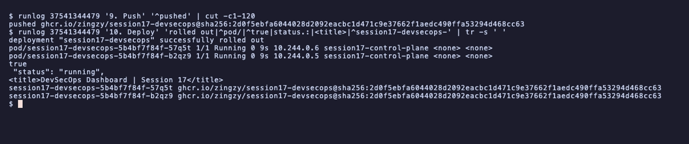

# Session 17: Complete CI/CD and DevSecOps

- Name: Aditya Singhi
- Enrollment number: 24BCS10177

The pipeline runs on GitHub Actions (`ubuntu-latest`) and deploys into a kind
cluster (Kubernetes v1.37.0) that it creates inside the runner, so the deploy is
a real rollout. Scanners: Bandit for SAST, pip-audit for SCA, gitleaks for
secrets and Trivy for the image. The app is the instructor's Flask demo from
`demo/`.

## Task 1: DevSecOps demo project

### Deliverables

| Deliverable | Where |
|---|---|
| Application | `app/`, `tests/`, `requirements.txt`, `requirements-dev.txt` |
| Dockerfile | `Dockerfile`, `.dockerignore` |
| GitHub Actions workflow | `.github/workflows/session17-devsecops.yml` at the repo root |
| Security tools configuration | `.gitleaks.toml`, `.gitleaksignore`, `# nosec B311` in `app/app.py`, scanner flags in the workflow |
| Kubernetes manifests | `k8s/deployment.yaml`, `k8s/service.yaml` |
| Successful pipeline output | [run 37541344479](https://github.com/Zingzy/devops-heros/actions/runs/37541344479), below |
| Screenshots | `screenshots/` |

GitHub only reads workflows from `.github/workflows/` at the repository root, so
the workflow lives there and not in this folder. It runs on pushes to `main` and
pull requests that touch this folder or the workflow, plus `workflow_dispatch`.

### Expected flow

```
Code -> Build -> Unit Test -> SAST -> SCA -> Secret Scan -> Docker Build
     -> Container Image Scan -> Security Gate -> Push Image -> Deploy to Kubernetes
```

Each stage is its own job, chained with `needs` in that order. Three design
choices:

- The scanners only report a count. The gate job reads all counts and decides.
  An empty count (scanner crashed or skipped) is treated as a block.
- The image is built once, saved with `docker save`, and passed as an artifact
  to the scan job and the push job. The pushed image is the scanned image.
- The deploy uses the digest returned by the push, not a tag.

To show the gate works I pushed the demo app exactly as the instructor gave it
(commit `e41da41`, plus one planted fake key), let the gate block it, then fixed
what it found (commit `10a99d9`). Outputs below come from those two runs through
`gh run view <id> --log`, filtered by a small `runlog` wrapper that keeps one
job's lines.

### 1. Code and build

Checks out the commit, installs the pinned dependencies, compiles the app and
checks the dependency tree. Catches syntax errors and broken pins.

```bash
runlog 37541344479 '1. Code' '^routes|No broken'
```

```
No broken requirements found.
routes: ['/', '/api/add', '/api/calculate', '/api/greet/<name>', '/api/pipeline/run', '/api/status', '/health', '/static/<path:filename>']
```

### 2. Unit test

```bash
runlog 37541344479 '2. Unit' 'passed|TOTAL'
```

```
TOTAL               102     32    69%
======================== 8 passed, 6 warnings in 0.28s =========================
```

The instructor's 8 tests pass. The warnings are `datetime.utcnow()`
deprecations in the demo code.

### 3. SAST (Bandit)

Bandit reads our own source for dangerous patterns. The gate blocks on any HIGH
severity finding. On the demo as given it found this:

```bash
cd session-17-devsecops/demo
bandit -q -r app -f custom --msg-template "{severity:<6} {test_id} {relpath}:{line}  {msg}"
```

```
LOW    B311 app/app.py:79  Standard pseudo-random generators are not suitable for security/cryptographic purposes.
...
HIGH   B201 app/app.py:234  A Flask app appears to be run with debug=True, which exposes the Werkzeug debugger and allows the execution of arbitrary code.
MEDIUM B104 app/app.py:234  Possible binding to all interfaces.
```

This is a real hole. The instructor's Dockerfile runs `python app/app.py`, so
the container serves the Werkzeug debugger on `0.0.0.0`, as root:

```bash
docker run --rm -d --name hw17-instr -p 18173:5001 hw17-instructor:demo
curl -s -X POST localhost:18173/api/pipeline/run -H 'Content-Type: application/json' \
  -d '{"fail_chance":"abc"}' | grep -oE '<title>[^<]*|EVALEX = true|console is locked'
docker exec hw17-instr id
```

```
<title>ValueError: could not convert string to float: &#39;abc&#39;
EVALEX = true
console is locked
uid=0(root) gid=0(root) groups=0(root)
```

A bad request returns the interactive debugger with the traceback and the Python
console enabled behind a PIN that is printed in the container logs. The fix: the
image now runs gunicorn, and the `__main__` block is `app.run(port=5001)`
(localhost, debug off). The five B311 lows are `random` used for greetings and
fake timings, not security, so they carry `# nosec B311`. Naming the test ID
keeps any other finding on those lines visible. After the fix:

```bash
runlog 37541344479 '3. SAST' 'totals'
```

```
totals: high=0 medium=0 low=0 skipped_by_nosec=5
```

### 4. SCA (pip-audit)

pip-audit checks every installed package, including transitive ones, against
the PyPI advisory database. The gate blocks on any known vulnerability. I audit
`requirements-dev.txt` because test tools also run on the CI runner.

```bash
pip-audit -r requirements-dev.txt
```

```
Found 2 known vulnerabilities in 1 package
Name   Version ID              Fix Versions
------ ------- --------------- ------------
pytest 8.4.2   PYSEC-2026-1845 9.0.3
pytest 8.4.2   PYSEC-2026-1845 9.0.3
```

The same advisory is listed twice, so the workflow counts unique package and ID
pairs. Fixed by pinning `pytest==9.0.3` and `pytest-cov==7.1.0`:

```bash
runlog 37541344479 '4. SCA' 'No known|audited'
```

```
No known vulnerabilities found
audited 14 packages, 0 known vulnerabilities
```

### 5. Secret scan (gitleaks)

gitleaks scans every commit that touched this folder
(`gitleaks git . --log-opts="-- ."`), not only the current files. The gate
blocks on any finding. Commit `e41da41` planted this obviously fake value. It has
no service prefix, but it matches gitleaks' generic API key rule:

```
# Not a real key. Planted to prove the secret gate blocks.
FAKE_DEMO_API_KEY = "9Kd2Lq8Wz4Xn7Rt5Vb3Hm6Pj1"
```

Deleting the file in the fix commit is not enough, because the key is still in
commit `e41da41`. With the ignore file moved away, the history scan still finds
it:

```bash
gitleaks git . --log-opts="-- ." --config .gitleaks.toml --redact --no-banner -v
```

```
Finding:     FAKE_DEMO_API_KEY = "REDACTED"
...
Commit:      e41da41fe1d186d5ee02ab0ea0f90f4b6d183cb6
...
Fingerprint: e41da41fe1d186d5ee02ab0ea0f90f4b6d183cb6:session-17-devsecops/homework-devsecops-pipeline/app/demo_settings.py:generic-api-key:2
...
4:17AM WRN leaks found: 1
```

A real leaked key would have to be revoked first. This one was never a
credential, so I accept that single finding by its fingerprint in
`.gitleaksignore`. The fingerprint names the commit, file, rule and line, so the
same value anywhere else still blocks.

For false positives, `.gitleaks.toml` extends the default rules with two narrow
allowlists, both limited to the `generic-api-key` rule. The first allows the fake
value only inside `README.md`, because this file quotes it. The second covers a
real false positive I hit. Python base images set `ENV GPG_KEY=` to the public
fingerprint of the CPython release signing key, and gitleaks flagged that line in
a Trivy JSON report. The allowlist matches only `GPG_KEY=` followed by exactly 40
hex characters. A broad skip, such as a whole file or a whole rule, would turn
the gate off without anyone noticing. In the green run:

```bash
runlog 37541344479 '5. Secret' 'commits scanned|leaks found'
```

```
10:34PM INF 2 commits scanned.
10:34PM INF no leaks found
```

### 6. Docker build

The job runs `docker build` on `Dockerfile`, labels the image with the commit
and saves it as an artifact for the next jobs.

```bash
runlog 37541344479 '6. Docker' '^ghcr.io'
```

```
ghcr.io/zingzy/session17-devsecops   10a99d96d5373d4fc8019f8fbbb69f8dae07ca5a   932a21b4943d   1 second ago   61.8MB
```

The instructor's image was 133 MB. Mine uses an alpine base, a non-root user
(UID 10001) and gunicorn instead of the Flask dev server. It also uninstalls
pip, because the app never uses pip at runtime and Trivy found six CVEs in the
base image's copy.

### 7. Container image scan (Trivy)

Trivy scans OS packages, Python packages and baked-in secrets in the built
image. The gate blocks on any HIGH or CRITICAL CVE and any secret. The
instructor's image:

```bash
trivy image --severity HIGH,CRITICAL hw17-instructor:demo
```

```
hw17-instructor:demo (debian 13.7)
==================================
Total: 44 (UNKNOWN: 0, LOW: 0, MEDIUM: 0, HIGH: 44, CRITICAL: 0)
```

The 44 rows are 8 CVEs (36 rows are four util-linux CVEs repeated across nine
packages), and none had a Debian fix yet, so rebuilding would not help. That is
why the base changed. My image in the green run:

```bash
runlog 37541344479 '7. Container' 'alpine 3.24.2\)'
```

```
│ /home/runner/work/_temp/image.tar (alpine 3.24.2)                            │   alpine   │        0        │    -    │
```

### 8. Security gate: blocked run vs green run

Run #1 on the unfixed demo
([37540934582](https://github.com/Zingzy/devops-heros/actions/runs/37540934582)):

```bash
runlog 37540934582 '3. SAST' '^HIGH'
runlog 37540934582 '4. SCA' '^pytest'
runlog 37540934582 '5. Secret' '^File:|^Commit: +e'
runlog 37540934582 '7. Container' '^Total:'
runlog 37540934582 '8. Security gate' '^\||error\]Security'
```

```
HIGH  B201  app/app.py:234  A Flask app appears to be run with debug=True, which exposes the Werkzeug debugger and allows the execution of arbitrary code.
pytest 8.4.2  PYSEC-2026-1845  fix: 9.0.3
File:        session-17-devsecops/homework-devsecops-pipeline/app/demo_settings.py
Commit:      e41da41fe1d186d5ee02ab0ea0f90f4b6d183cb6
Total: 44 (UNKNOWN: 0, LOW: 0, MEDIUM: 0, HIGH: 44, CRITICAL: 0)
| Check | Findings | Verdict |
|---|---|---|
| SAST, Bandit HIGH severity | 1 | BLOCK |
| SCA, pip-audit known vulnerabilities | 1 | BLOCK |
| Secrets, gitleaks in git history | 1 | BLOCK |
| Image, Trivy HIGH/CRITICAL vulnerabilities | 44 | BLOCK |
| Image, Trivy secrets | 0 | pass |
##[error]Security gate failed. The image will not be pushed or deployed.
```


All four gated checks fired. Every scanner job stayed green and only the gate
failed, so push and deploy were skipped and nothing reached GHCR.

Run #2 after the fixes
([37541344479](https://github.com/Zingzy/devops-heros/actions/runs/37541344479)):

```bash
runlog 37541344479 '8. Security gate' '^\||passed'
gh run view 37541344479 -R Zingzy/devops-heros --json jobs --jq '.jobs[] | "\(.name)\t\(.conclusion)"'
```

```
| Check | Findings | Verdict |
|---|---|---|
| SAST, Bandit HIGH severity | 0 | pass |
| SCA, pip-audit known vulnerabilities | 0 | pass |
| Secrets, gitleaks in git history | 0 | pass |
| Image, Trivy HIGH/CRITICAL vulnerabilities | 0 | pass |
| Image, Trivy secrets | 0 | pass |
Security gate passed.
```

```
1. Code and build	success
2. Unit test	success
3. SAST (Bandit)	success
4. SCA (pip-audit)	success
5. Secret scan (gitleaks)	success
6. Docker build	success
7. Container image scan (Trivy)	success
8. Security gate	success
9. Push image to GHCR	success
10. Deploy to Kubernetes	success
```

### 9. Push image to GHCR and 10. Deploy to Kubernetes

The push job logs in with `GITHUB_TOKEN` (`packages: write`), tags the scanned
image with the commit SHA and `latest`, and pushes. The deploy job creates a kind
cluster, adds a GHCR pull secret, puts the pushed digest into
`k8s/deployment.yaml`, waits for the rollout and calls the app through the
Service with `kubectl port-forward`.

```bash
runlog 37541344479 '9. Push' '^pushed'
runlog 37541344479 '10. Deploy' 'rolled out|^pod/|^true|status.:|<title>|^session17-devsecops-'
```

```
pushed ghcr.io/zingzy/session17-devsecops@sha256:2d0f5ebfa6044028d2092eacbc1d471c9e37662f1aedc490ffa53294d468cc63
deployment "session17-devsecops" successfully rolled out
pod/session17-devsecops-5b4bf7f84f-57q5t   1/1     Running   0          9s    10.244.0.6   session17-control-plane   <none>           <none>
pod/session17-devsecops-5b4bf7f84f-b2qz9   1/1     Running   0          9s    10.244.0.5   session17-control-plane   <none>           <none>
true
  "status": "running",
<title>DevSecOps Dashboard | Session 17</title>
session17-devsecops-5b4bf7f84f-57q5t  ghcr.io/zingzy/session17-devsecops@sha256:2d0f5ebfa6044028d2092eacbc1d471c9e37662f1aedc490ffa53294d468cc63
session17-devsecops-5b4bf7f84f-b2qz9  ghcr.io/zingzy/session17-devsecops@sha256:2d0f5ebfa6044028d2092eacbc1d471c9e37662f1aedc490ffa53294d468cc63
```



Both replicas rolled out. `/health` returned healthy (the `true` is `jq -e`
checking it), `/api/status` and `/` answered, and the image ID each pod pulled
matches the pushed digest exactly. So the image running in the cluster came from
GHCR and is the one that passed the gate.

The manifests differ from the instructor's (which pull `nensiravaliya28/hey-cicd`
from Docker Hub). The image is a `__IMAGE__` placeholder filled in by CI. There
are `/health` probes, small resource limits and a locked-down security context:
non-root, read-only root filesystem, no privilege escalation, all capabilities
dropped. The Service is `ClusterIP` since the smoke test uses `port-forward`.

## Notes

- The instructor's demo image runs Flask with `debug=True` on `0.0.0.0` as root,
  so the Werkzeug debugger is live in the container (section 3).
- The instructor's workflow never gates: its Trivy step has no `--exit-code 1`,
  and the push job rebuilds the image instead of pushing the scanned one.
- `ghcr.io/${{ github.repository }}` from `02-container-registry` fails on this
  fork because Docker rejects the capital letters in `Zingzy`, so the image name
  is the lowercase `ghcr.io/zingzy/session17-devsecops`.
