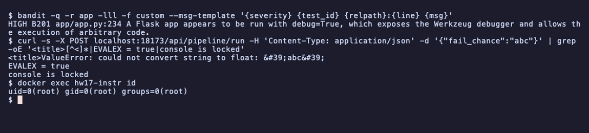
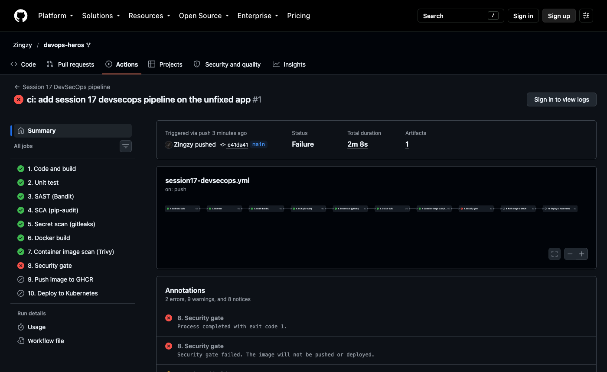
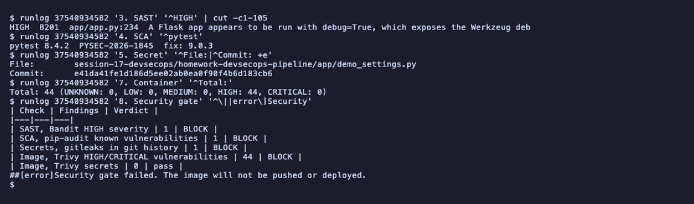
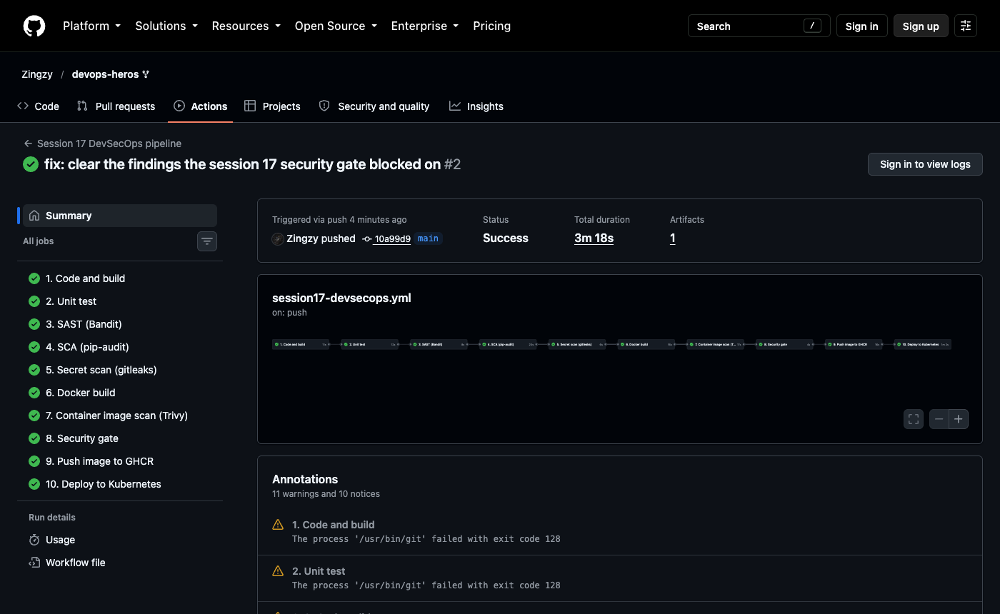
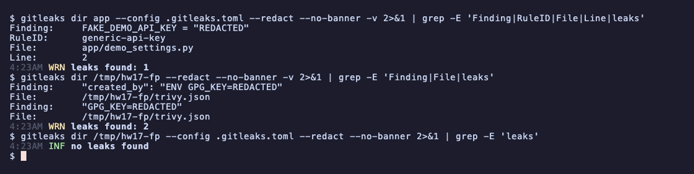

# Session 17: Complete CI/CD and DevSecOps

- Name: Aditya Singhi
- Enrollment number: 24BCS10177

The pipeline runs on GitHub Actions (`ubuntu-latest`, Ubuntu 24.04.5) and
deploys into a throwaway kind cluster (kind v0.33.0, Kubernetes v1.37.0) that
it creates inside the runner, so the deploy step is a real rollout and not a
dry run. The tools are pinned: Bandit 1.9.4 for SAST, pip-audit 2.10.1 for SCA,
gitleaks 8.30.1 for secrets and Trivy 0.75.0 for the image. I picked Bandit over
the CodeQL job from `04-sast` because it prints JSON with a severity on every
finding, which is what a gate needs to count, and it finishes in seconds.
Locally I used act 0.2.89, trivy, gitleaks and a kind cluster called `hw17` to
try everything before pushing.

The application is the instructor's Flask demo from `demo/`. I first ran every
scanner against it exactly as given, pushed that version on purpose so the gate
would block it, then fixed what the scanners found and pushed again.

| Path | What it is |
|---|---|
| `app/`, `tests/`, `pytest.ini` | The Flask app and its 8 unit tests, copied from `demo/` |
| `requirements.txt`, `requirements-dev.txt` | Runtime and test dependencies, pinned |
| `Dockerfile`, `.dockerignore` | The image: alpine, gunicorn, non-root, no pip |
| `.gitleaks.toml`, `.gitleaksignore` | Secret scanner config and the one accepted finding |
| `k8s/deployment.yaml`, `k8s/service.yaml` | Kubernetes manifests, `__IMAGE__` is filled in by CI |
| `../../.github/workflows/session17-devsecops.yml` | The workflow |
| `screenshots/` | Run pages and terminal captures |

The workflow is not inside this folder because GitHub only reads workflows from
`.github/workflows/` at the repository root. Keeping a second copy here would
drift, so there is only the one at the root. It triggers only on pushes to
`main` and pull requests that touch this folder or the workflow file, plus
manual `workflow_dispatch`, and every `run` step starts in this folder through
`defaults.run.working-directory`.

## The pipeline

```
Code -> Build -> Unit Test -> SAST -> SCA -> Secret Scan -> Docker Build
     -> Container Image Scan -> Security Gate -> Push Image -> Deploy to Kubernetes
```

Each stage is its own job, chained with `needs` in exactly that order, so the
run graph on GitHub reads left to right like the diagram.

| # | Job | Tool | What it catches | Blocks when |
|---|---|---|---|---|
| 1 | Code and build | checkout, pip, compileall | Syntax errors, broken or conflicting dependency pins, an app that will not import | Any step fails |
| 2 | Unit test | pytest + pytest-cov | Behaviour regressions in the routes | Any test fails |
| 3 | SAST | Bandit | Dangerous code patterns in our own source, like `debug=True`, `eval`, shell injection, weak crypto | Gate: any HIGH severity finding |
| 4 | SCA | pip-audit | Known advisories in the packages we install, including transitive ones | Gate: any known vulnerability |
| 5 | Secret scan | gitleaks | Keys and tokens in every commit that touched this folder, not just the current files | Gate: any finding |
| 6 | Docker build | docker | A Dockerfile that does not build | Build fails |
| 7 | Image scan | Trivy | CVEs in OS packages and Python packages inside the final image, and secrets baked into layers | Gate: any HIGH or CRITICAL CVE, any secret |
| 8 | Security gate | bash | Reads the counts from jobs 3, 4, 5 and 7 and decides | Any count above zero, or any scanner job that did not succeed |
| 9 | Push image | docker + GHCR | Registry login or push problems | Push fails. Skipped on pull requests |
| 10 | Deploy | kind, kubectl, curl | Manifests that do not apply, pods that never become ready, an app that does not answer | Rollout timeout or a failed smoke test |

A few decisions that matter more than they look:

- The scanners never fail their own job. They write a count to a job output and
  a line to the run summary, and the gate job makes the decision in one place.
  The gate also fails closed: if a scanner job crashed or was skipped, its count
  is empty, and an empty count is a BLOCK, not a pass.
- The image is built once. Job 6 saves it with `docker save` and hands the tar
  to job 7 (scan) and job 9 (push) as an artifact. The instructor's workflow
  rebuilt the image in the push job, which means the pushed image was never the
  one that was scanned.
- The deploy uses the digest the push returned
  (`ghcr.io/zingzy/session17-devsecops@sha256:...`), not a tag, so Kubernetes
  runs exactly the bytes that passed the gate.
- Trivy and gitleaks are downloaded as release binaries and checked against the
  release checksum file instead of going through third party wrapper actions.

## Task 1: Scanning the demo app as given

Before writing any pipeline I ran each scanner against the unmodified `demo/`
folder.

### SAST

```bash
cd session-17-devsecops/demo
bandit -q -r app -f custom --msg-template "{severity:<6} {test_id} {relpath}:{line}  {msg}"
```

```
LOW    B311 app/app.py:79  Standard pseudo-random generators are not suitable for security/cryptographic purposes.
LOW    B311 app/app.py:190  Standard pseudo-random generators are not suitable for security/cryptographic purposes.
LOW    B311 app/app.py:192  Standard pseudo-random generators are not suitable for security/cryptographic purposes.
LOW    B311 app/app.py:196  Standard pseudo-random generators are not suitable for security/cryptographic purposes.
LOW    B311 app/app.py:207  Standard pseudo-random generators are not suitable for security/cryptographic purposes.
HIGH   B201 app/app.py:234  A Flask app appears to be run with debug=True, which exposes the Werkzeug debugger and allows the execution of arbitrary code.
MEDIUM B104 app/app.py:234  Possible binding to all interfaces.
```

The HIGH finding is not theoretical. The instructor's Dockerfile starts the app
with `CMD ["python", "app/app.py"]`, which runs that exact `__main__` block, so
the container really serves the Werkzeug debugger on `0.0.0.0`. I built the
image and sent a request that makes the app throw:

```bash
docker build -t hw17-instructor:demo session-17-devsecops/demo
docker run --rm -d --name hw17-instr -p 18173:5001 hw17-instructor:demo
curl -s -X POST localhost:18173/api/pipeline/run -H 'Content-Type: application/json' \
  -d '{"fail_chance":"abc"}' | grep -oE '<title>[^<]*|EVALEX = true|console is locked'
docker exec hw17-instr id
```

```
<title>ValueError: could not convert string to float: &#39;abc&#39;
EVALEX = true
console is locked
uid=0(root) gid=0(root) groups=0(root)
```



`float("abc")` raised, and instead of the app's own JSON 500 handler the
response is the interactive debugger page with a full traceback and source.
`EVALEX = true` means the in-browser Python console is enabled. It is locked
behind a PIN, but the PIN is printed in the container logs and is derived from
machine details, and the process runs as root. Anyone who can reach the
NodePort from the instructor's `service.yaml` gets the traceback for free.

The five B311 lows are `random` used to pick greetings and fake pipeline
timings. Nothing there is security related, so those are false positives
(handled in Task 8).

### SCA

```bash
pip-audit -r requirements-dev.txt
```

```
Found 2 known vulnerabilities in 1 package
Name   Version ID              Fix Versions
------ ------- --------------- ------------
pytest 8.4.2   PYSEC-2026-1845 9.0.3
pytest 8.4.2   PYSEC-2026-1845 9.0.3
```

The runtime file (`requirements.txt`, just Flask) was clean. The test pin was
not: PYSEC-2026-1845 (CVE-2025-71176) is pytest using predictable
`/tmp/pytest-of-{user}` directories, which another local user can abuse. A test
dependency still runs on the CI runner next to `GITHUB_TOKEN`, so I audit the
dev file too. pip-audit lists the same advisory twice, so the workflow counts
unique package and ID pairs instead of rows.

### Image scan

```bash
trivy image --severity HIGH,CRITICAL hw17-instructor:demo
```

```
hw17-instructor:demo (debian 13.7)
==================================
Total: 44 (UNKNOWN: 0, LOW: 0, MEDIUM: 0, HIGH: 44, CRITICAL: 0)
```

The 44 rows are only 8 distinct CVEs. Four util-linux CVEs show up once for each
of the nine binary packages built from util-linux (`mount`, `login`,
`libblkid1` and so on), which is 36 of the 44. None of the 44 has a fixed
version in Debian yet (43 `affected`, 1 `fix_deferred`), so rebuilding the same
Dockerfile tomorrow would not help. The Python packages in the image were clean.

Three more problems in the instructor's material, found while reading it:

- The Trivy example in `07` and `08` has no `--exit-code 1` in the workflow
  version, so the scan prints findings and the job still passes. It never gates.
- The push job rebuilds the image instead of pushing the scanned one.
- `ghcr.io/${{ github.repository }}` from `02-container-registry` expands to
  `ghcr.io/Zingzy/devops-heros` on this fork, and Docker rejects it:

```bash
docker tag hw17-app:local ghcr.io/Zingzy/devops-heros:test
```

```
Error parsing reference: "ghcr.io/Zingzy/devops-heros:test" is not a valid repository/tag: invalid reference format: repository name (Zingzy/devops-heros) must be lowercase
```

So the image name in my workflow is the literal lowercase
`ghcr.io/zingzy/session17-devsecops`.

## Task 2: Local dry run with act

I ran the whole workflow on my Mac with act before pushing anything, first on
the unfixed app, then on the fixed one.

```bash
act pull_request -W .github/workflows/session17-devsecops.yml \
  --container-architecture linux/amd64 -P ubuntu-latest=catthehacker/ubuntu:act-latest \
  --bind --env PATH=/opt/acttoolcache/node/24.19.0/x64/bin:/usr/local/sbin:/usr/local/bin:/usr/sbin:/usr/bin:/sbin:/bin \
  --artifact-server-path "$SCRATCH/artifacts" --artifact-server-port 18172
```

`$SCRATCH` is a temp folder outside the repo.

Unfixed app:

```
[Session 17 DevSecOps pipeline/1. Code and build] 🏁  Job succeeded
[Session 17 DevSecOps pipeline/2. Unit test] 🏁  Job succeeded
[Session 17 DevSecOps pipeline/3. SAST (Bandit)] 🏁  Job succeeded
[Session 17 DevSecOps pipeline/4. SCA (pip-audit)] 🏁  Job succeeded
[Session 17 DevSecOps pipeline/5. Secret scan (gitleaks)] 🏁  Job succeeded
[Session 17 DevSecOps pipeline/6. Docker build] 🏁  Job succeeded
[Session 17 DevSecOps pipeline/7. Container image scan (Trivy)] 🏁  Job succeeded
[Session 17 DevSecOps pipeline/8. Security gate] 🏁  Job failed
```

```
| Check | Findings | Verdict |
|---|---|---|
| SAST, Bandit HIGH severity | 1 | BLOCK |
| SCA, pip-audit known vulnerabilities | 1 | BLOCK |
| Secrets, gitleaks in git history | 0 | pass |
| Image, Trivy HIGH/CRITICAL vulnerabilities | 44 | BLOCK |
| Image, Trivy secrets | 0 | pass |
::error::Security gate failed. The image will not be pushed or deployed.
```

With the fixed app (that run used `act push`) all eight jobs up to the gate
succeeded and the gate printed five `pass` rows. The secret scan shows `0 commits scanned` under act because
my files were not committed yet and gitleaks reads git history, so act could
not test that part. GitHub does (Task 3).

Getting act to this point took four workarounds, all act problems rather than
workflow problems:

- `actions/setup-python` failed in its post step with
  `exec: "node": executable file not found in $PATH`. The action's `add-path`
  drops act's node from the PATH used for post steps. Passing PATH explicitly
  with `--env` fixed it.
- `actions/upload-artifact@v7` failed with `Unexpected end of JSON input`
  against act's built in artifact server, and v6 failed too. v4 works, so the
  workflow uses `upload-artifact@v4` and `download-artifact@v4`. On GitHub
  that costs a "Node.js 20 is deprecated" warning, which I accepted to keep one
  workflow that runs in both places.
- act quietly uses `gh auth token` as `GITHUB_TOKEN` when no secret is given.
  On my first `act push` run the push job logged in to GHCR with my personal gh
  token and tried to push. GHCR refused it (`permission_denied: The token
  provided does not match expected scopes`), so nothing was published. Passing a
  fake token breaks act's own download of actions, so the dry runs use the
  `pull_request` event, where the push and deploy jobs are skipped by design.
- The repo is about 800 MB with the other sessions in it, so I used `--bind`
  instead of letting act copy it. That writes the scanner reports into the
  folder, which is why `.gitignore` lists them.

## Task 3: The blocked run on GitHub

Commit `e41da41` put the instructor's app in this folder unchanged, with the
original Dockerfile and pins, plus one planted file:

```
# Not a real key. Planted to prove the secret gate blocks.
FAKE_DEMO_API_KEY = "9Kd2Lq8Wz4Xn7Rt5Vb3Hm6Pj1"
```

It is a random string with no service prefix, so it cannot be mistaken for a
real credential of any provider, but it still matches gitleaks' generic API key
rule.

Run #1 ([37540934582](https://github.com/Zingzy/devops-heros/actions/runs/37540934582)):

```bash
gh run view 37540934582 -R Zingzy/devops-heros --json jobs \
  --jq '.jobs[] | "\(.name)\t\(.conclusion)"'
```

```
1. Code and build	success
2. Unit test	success
3. SAST (Bandit)	success
4. SCA (pip-audit)	success
5. Secret scan (gitleaks)	success
6. Docker build	success
7. Container image scan (Trivy)	success
8. Security gate	failure
9. Push image to GHCR	skipped
10. Deploy to Kubernetes	skipped
```



Step logs need a signed in browser, so here is the same run's log through
`gh run view --log`, filtered to the lines that matter. `runlog` is a small
script that strips timestamps and colour codes and keeps one job's lines.

```bash
runlog 37540934582 '3. SAST' '^HIGH'
runlog 37540934582 '4. SCA' '^pytest'
runlog 37540934582 '5. Secret' '^File:|^Commit: +e'
runlog 37540934582 '7. Container' '^Total:'
runlog 37540934582 '8. Security gate' '^\||error\]Security'
```

```
HIGH  B201  app/app.py:234  A Flask app appears to be run with debug=True, which exposes the Werkzeug debugger and allows the execution of arbitrary code.
pytest 8.4.2  PYSEC-2026-1845  fix: 9.0.3
File:        session-17-devsecops/homework-devsecops-pipeline/app/demo_settings.py
Commit:      e41da41fe1d186d5ee02ab0ea0f90f4b6d183cb6
Total: 44 (UNKNOWN: 0, LOW: 0, MEDIUM: 0, HIGH: 44, CRITICAL: 0)
| Check | Findings | Verdict |
|---|---|---|
| SAST, Bandit HIGH severity | 1 | BLOCK |
| SCA, pip-audit known vulnerabilities | 1 | BLOCK |
| Secrets, gitleaks in git history | 1 | BLOCK |
| Image, Trivy HIGH/CRITICAL vulnerabilities | 44 | BLOCK |
| Image, Trivy secrets | 0 | pass |
##[error]Security gate failed. The image will not be pushed or deployed.
```



All four gated checks fired, three of them on real problems in the demo and one
on the planted key. Every scanner job is green and only the gate is red, which
is the point of the design: the scans report, the gate enforces. Nothing reached
GHCR and no cluster was created.

## Task 4: The fixes

Each change answers one row of the gate table.

SAST. `app/app.py` keeps the instructor's code except the last line and five
comments:

```
-    app.run(host="0.0.0.0", port=5001, debug=True)
+    app.run(port=5001)
```

The container no longer runs this block at all. It runs gunicorn, and
`python app/app.py` is now only for local development on `127.0.0.1` with the
debugger off. That clears B201 and B104 together. The five B311 lines got
`# nosec B311` (Task 8).

SCA. `pytest==9.0.3` and `pytest-cov==7.1.0` in `requirements-dev.txt`, and
`gunicorn==26.2.0` added to `requirements.txt`. The tests pass unchanged on
pytest 9.

Image. The new Dockerfile:

```dockerfile
FROM python:3.12-alpine

ENV PYTHONDONTWRITEBYTECODE=1 \
    PYTHONUNBUFFERED=1

WORKDIR /app

COPY requirements.txt .
RUN pip install --no-cache-dir -r requirements.txt \
    && pip uninstall -y pip \
    && adduser -D -H -u 10001 app

COPY app ./app

USER 10001

EXPOSE 5001

CMD ["gunicorn", "--bind", "0.0.0.0:5001", "--workers", "2", "--worker-tmp-dir", "/dev/shm", "--no-control-socket", "app.app:app"]
```

I compared the two base images with Trivy before choosing:

```bash
trivy image -f json -o s.json python:3.12-alpine   # then counted by severity and fix status
trivy image -f json -o s.json python:3.12-slim
```

```
== python:3.12-alpine
{'Family': 'alpine', 'Name': '3.24.2'} [(('LOW', 'fixed'), 1), (('MEDIUM', 'fixed'), 5)]
== python:3.12-slim
{'Family': 'debian', 'Name': '13.7'} [(('HIGH', 'nofix'), 44), (('LOW', 'fixed'), 1), (('LOW', 'nofix'), 61), (('MEDIUM', 'fixed'), 5), (('MEDIUM', 'nofix'), 58), (('UNKNOWN', 'nofix'), 2)]
```

Alpine has no HIGH at all. The six fixable LOW and MEDIUM findings left on
alpine were all in the base image's own pip 25.0.1:

```
│ pip (METADATA) │ CVE-2025-8869  │ MEDIUM   │ fixed  │ 25.0.1            │ 25.3          │ pip: pip missing checks on symbolic link extraction          │
...
│                │ CVE-2026-1703  │ LOW      │        │                   │ 26.0          │ pip: pip: Information disclosure via path traversal when     │
```

The app never runs pip after the image is built, so the Dockerfile uninstalls
it in the same layer. After that:

```bash
trivy image hw17-app:local
```

```
│ hw17-app:local (alpine 3.24.2)                                               │   alpine   │        0        │    -    │
│ usr/local/lib/python3.12/site-packages/flask-3.1.3.dist-info/METADATA        │ python-pkg │        0        │    -    │
│ usr/local/lib/python3.12/site-packages/gunicorn-26.2.0.dist-info/METADATA    │ python-pkg │        0        │    -    │
│ usr/local/lib/python3.12/site-packages/werkzeug-3.1.9.dist-info/METADATA     │ python-pkg │        0        │    -    │
```

Zero findings at any severity, and the image went from 133 MB to 61.8 MB on
the runner.

Two gunicorn details I only found by running it. Gunicorn 26 opens a control
socket in the user's home directory, and my user has no home (`adduser -H`):

```
[2026-10-06 21:23:54 +0000] [1] [ERROR] Control server error: [Errno 13] Permission denied: '/home/app'
```

The app still served, but that admin socket is nothing a container needs, so
`--no-control-socket` turns it off. `--worker-tmp-dir /dev/shm` keeps the
worker heartbeat files off the root filesystem, which is what lets the
Deployment set `readOnlyRootFilesystem: true`. Checked locally:

```bash
docker run --rm -d --read-only --name hw17-app -p 18170:5001 hw17-app:local
curl -s localhost:18170/health
docker exec hw17-app id
```

```
{"status":"healthy","timestamp":"2026-10-06T21:26:06.731826Z","uptime_seconds":1.45}
uid=10001(app) gid=10001(app) groups=10001(app)
```

Secret. `app/demo_settings.py` is deleted. That is not enough on its own,
see Task 8.

## Task 5: The green run

Commit `10a99d9` holds the fixes. Run #2
([37541344479](https://github.com/Zingzy/devops-heros/actions/runs/37541344479))
passed every job in 3m 18s.

```bash
gh run view 37541344479 -R Zingzy/devops-heros --json jobs \
  --jq '.jobs[] | "\(.name)\t\(.conclusion)"'
```

```
1. Code and build	success
2. Unit test	success
3. SAST (Bandit)	success
4. SCA (pip-audit)	success
5. Secret scan (gitleaks)	success
6. Docker build	success
7. Container image scan (Trivy)	success
8. Security gate	success
9. Push image to GHCR	success
10. Deploy to Kubernetes	success
```



What each stage printed:

```bash
runlog 37541344479 '1. Code' '^routes|No broken'
runlog 37541344479 '2. Unit' 'passed|TOTAL'
runlog 37541344479 '3. SAST' 'totals'
runlog 37541344479 '4. SCA' 'No known|audited'
runlog 37541344479 '5. Secret' 'commits scanned|leaks found'
runlog 37541344479 '7. Container' 'alpine 3.24.2\)'
runlog 37541344479 '8. Security gate' '^\||passed'
```

```
No broken requirements found.
routes: ['/', '/api/add', '/api/calculate', '/api/greet/<name>', '/api/pipeline/run', '/api/status', '/health', '/static/<path:filename>']
TOTAL               102     32    69%
======================== 8 passed, 6 warnings in 0.28s =========================
totals: high=0 medium=0 low=0 skipped_by_nosec=5
No known vulnerabilities found
audited 14 packages, 0 known vulnerabilities
10:34PM INF 2 commits scanned.
10:34PM INF no leaks found
│ /home/runner/work/_temp/image.tar (alpine 3.24.2)                            │   alpine   │        0        │    -    │
| Check | Findings | Verdict |
|---|---|---|
| SAST, Bandit HIGH severity | 0 | pass |
| SCA, pip-audit known vulnerabilities | 0 | pass |
| Secrets, gitleaks in git history | 0 | pass |
| Image, Trivy HIGH/CRITICAL vulnerabilities | 0 | pass |
| Image, Trivy secrets | 0 | pass |
Security gate passed.
```

The 6 test warnings are `datetime.utcnow()` deprecation warnings from the
instructor's code. Coverage is 69% because the pipeline simulator route has no
test. `skipped_by_nosec=5` is the five B311 lines, still visible in the report
as suppressed rather than silently gone. gitleaks scanned 2 commits, the
planted one and the fix, and still found nothing, which Task 8 explains.

## Task 6: Push to GHCR and deploy to Kubernetes

```bash
runlog 37541344479 '9. Push' '^pushed'
runlog 37541344479 '10. Deploy' 'rolled out|^pod/|^true|status.:|<title>|^session17-devsecops-'
```

```
pushed ghcr.io/zingzy/session17-devsecops@sha256:2d0f5ebfa6044028d2092eacbc1d471c9e37662f1aedc490ffa53294d468cc63
deployment "session17-devsecops" successfully rolled out
pod/session17-devsecops-5b4bf7f84f-57q5t   1/1     Running   0          9s    10.244.0.6   session17-control-plane   <none>           <none>
pod/session17-devsecops-5b4bf7f84f-b2qz9   1/1     Running   0          9s    10.244.0.5   session17-control-plane   <none>           <none>
true
  "status": "running",
<title>DevSecOps Dashboard | Session 17</title>
session17-devsecops-5b4bf7f84f-57q5t  ghcr.io/zingzy/session17-devsecops@sha256:2d0f5ebfa6044028d2092eacbc1d471c9e37662f1aedc490ffa53294d468cc63
session17-devsecops-5b4bf7f84f-b2qz9  ghcr.io/zingzy/session17-devsecops@sha256:2d0f5ebfa6044028d2092eacbc1d471c9e37662f1aedc490ffa53294d468cc63
```


The push job tagged the image with the commit SHA and `latest` and printed the
digest. The deploy job created a kind cluster, put that digest into the
Deployment, waited for both replicas, then went through the Service with
`kubectl port-forward`: `/health` returned `"status": "healthy"` (the `true` is
`jq -e` confirming it), `/api/status` returned JSON, and `/` returned the
dashboard HTML. The last two lines are the image ID each pod actually pulled,
and it matches the pushed digest byte for byte. So the thing running in the
cluster came from GHCR and is the image that passed the gate.

The log also has one `curl: (7) Failed to connect to localhost port 8080`
line. That is the first try of the wait loop, before port-forward was ready.
The loop retries for 30 seconds and the next try worked.

The GHCR package came out public, I think because the repository is public. I
checked with an anonymous token:

```bash
T=$(curl -s "https://ghcr.io/token?scope=repository:zingzy/session17-devsecops:pull" | python3 -c 'import sys,json;print(json.load(sys.stdin)["token"])')
curl -s -o /dev/null -w "anonymous manifest GET: HTTP %{http_code}\n" -H "Authorization: Bearer $T" \
  -H "Accept: application/vnd.oci.image.index.v1+json,application/vnd.docker.distribution.manifest.v2+json,application/vnd.oci.image.manifest.v1+json" \
  https://ghcr.io/v2/zingzy/session17-devsecops/manifests/latest
```

```
anonymous manifest GET: HTTP 200
```

So the `ghcr-pull` image pull secret the deploy job creates from
`GITHUB_TOKEN` was not strictly needed this time. I kept it because it costs one
command and the deploy keeps working if the package is ever made private.

## Task 7: The Kubernetes manifests

The instructor's `k8s/deployment.yaml` points at `nensiravaliya28/hey-cicd` on
Docker Hub with `imagePullPolicy: Always`, so I wrote my own copy in `k8s/`.
Changes: the image is a `__IMAGE__` placeholder that CI replaces with the
digest, an `imagePullSecrets` entry for GHCR, readiness and liveness probes on
`/health`, small requests and limits, and a locked down security context
(`runAsNonRoot`, UID 10001, `RuntimeDefault` seccomp, no privilege escalation,
read only root filesystem, all capabilities dropped). The Service is
`ClusterIP` because the smoke test goes through `port-forward`, so the NodePort
was not needed.

I tested the manifests on a local kind cluster first, loading the locally built
image instead of pulling it:

```bash
kind create cluster --name hw17
kind load docker-image ghcr.io/zingzy/session17-devsecops:local --name hw17
sed "s|__IMAGE__|ghcr.io/zingzy/session17-devsecops:local|" k8s/deployment.yaml | kubectl --context kind-hw17 apply -f -
kubectl --context kind-hw17 apply -f k8s/service.yaml
kubectl --context kind-hw17 rollout status deployment/session17-devsecops --timeout=180s
kubectl --context kind-hw17 get pods -o wide
```

```
deployment.apps/session17-devsecops created
service/session17-devsecops created
Waiting for deployment "session17-devsecops" rollout to finish: 0 of 2 updated replicas are available...
Waiting for deployment "session17-devsecops" rollout to finish: 1 of 2 updated replicas are available...
deployment "session17-devsecops" successfully rolled out
NAME                                   READY   STATUS    RESTARTS   AGE   IP           NODE                 NOMINATED NODE   READINESS GATES
session17-devsecops-66c6b76b67-hbvm7   1/1     Running   0          28s   10.244.0.3   hw17-control-plane   <none>           <none>
session17-devsecops-66c6b76b67-x2zc5   1/1     Running   0          28s   10.244.0.2   hw17-control-plane   <none>           <none>
```

```bash
kubectl --context kind-hw17 port-forward service/session17-devsecops 18171:80 &
curl -fsS localhost:18171/health
curl -fsS localhost:18171/ | grep -o '<title>.*</title>'
```

```
{"status":"healthy","timestamp":"2026-10-06T21:32:04.670430Z","uptime_seconds":8.99}
<title>DevSecOps Dashboard | Session 17</title>
```

The missing `ghcr-pull` secret did not matter here because the image was
already on the node. This run is what told me the read only root filesystem
works with gunicorn before I pushed anything.

## Task 8: Secret scanning and allowlisting false positives

### The planted key

```bash
gitleaks dir app --config .gitleaks.toml --redact --no-banner -v
```

```
Finding:     FAKE_DEMO_API_KEY = "REDACTED"
Secret:      REDACTED
RuleID:      generic-api-key
Entropy:     4.643856
File:        app/demo_settings.py
Line:        2
Fingerprint: app/demo_settings.py:generic-api-key:2

4:01AM INF scanned ~38856 bytes (38.86 KB) in 11ms
4:01AM WRN leaks found: 1
```

`--redact` keeps the value out of logs, which matters because CI logs on a
public repo are public.

My first try at an "obviously fake" value had the word fake in it, and gitleaks
ignored it:

```
$ cat demo_settings.py
DEMO_API_KEY = "fakeKd2Lq8Wz4Xn7Rt5Vb3Hm6Pj1"
$ gitleaks dir . --no-banner --redact
4:01AM INF no leaks found
$ cat demo_settings.py
DEMO_API_KEY = "9Kd2Lq8Wz4Xn7Rt5Vb3Hm6Pj1"
$ gitleaks dir . --no-banner --redact
4:01AM WRN leaks found: 1
```

The generic rule has a stopword list (words like `fake`, `example`, `test`) to
cut down on noise. So the fake marker has to go in the variable name and the
comment, not inside the value.

### Deleting the file does not remove the secret

The secret job runs `gitleaks git . --log-opts="-- ."`, which reads every
commit that touched this folder. After the fix commit the file is gone from the
tree but still in commit `e41da41`. To show that, I moved the ignore file away
and scanned again:

```bash
mv .gitleaksignore "$SCRATCH/"
gitleaks git . --log-opts="-- ." --config .gitleaks.toml --redact --no-banner -v
mv "$SCRATCH/.gitleaksignore" .
```

```
Finding:     FAKE_DEMO_API_KEY = "REDACTED"
Secret:      REDACTED
RuleID:      generic-api-key
Entropy:     4.643856
File:        session-17-devsecops/homework-devsecops-pipeline/app/demo_settings.py
Line:        2
Commit:      e41da41fe1d186d5ee02ab0ea0f90f4b6d183cb6
...
Fingerprint: e41da41fe1d186d5ee02ab0ea0f90f4b6d183cb6:session-17-devsecops/homework-devsecops-pipeline/app/demo_settings.py:generic-api-key:2
...
4:17AM INF 2 commits scanned.
4:17AM INF scanned ~44814 bytes (44.81 KB) in 44ms
4:17AM WRN leaks found: 1
```

This is exactly what `06-secret-scanning` warns about. If this had been a real
key, the right order would be to revoke it first, then rewrite history if
needed, then check for use. Here the value was never a credential, so there is
nothing to revoke, and rewriting a public `main` would break everyone's clone.
I accept that one finding by its fingerprint in `.gitleaksignore`:

```
e41da41fe1d186d5ee02ab0ea0f90f4b6d183cb6:session-17-devsecops/homework-devsecops-pipeline/app/demo_settings.py:generic-api-key:2
```

The fingerprint names the commit, file, rule and line, so it accepts this one
finding and nothing else. The same string in any other commit or file would
still block.

One surprise: gitleaks reads `.gitleaksignore` from the scanned folder even when
`--gitleaks-ignore-path` points somewhere else. My first attempt pointed the
flag at an empty file and still got `no leaks found`. Only moving the file away
showed the finding.

### Allowlisting by rule, path and value

This README quotes the planted line in Task 3, so the README would trip the
scanner. `.gitleaks.toml` extends the default rules and adds two allowlists:

```toml
[extend]
useDefault = true

[[allowlists]]
description = "The README quotes the fake key that was planted to test the gate"
targetRules = ["generic-api-key"]
condition = "AND"
paths = ['''README\.md$''']
regexes = ['''9Kd2Lq8Wz4Xn7Rt5Vb3Hm6Pj1''']

[[allowlists]]
description = "Python base images set GPG_KEY to the public fingerprint of the CPython release signing key"
targetRules = ["generic-api-key"]
regexTarget = "line"
regexes = ['''GPG_KEY=[0-9A-F]{40}\b''']
```

The first one only skips that exact value inside `README.md`. I first wrote it
without `targetRules`, and gitleaks skipped the whole README instead. I tested
both versions in a scratch folder (`$HW` is this homework folder). `global.toml` is the first allowlist without
the `targetRules` line:

```bash
gitleaks dir README.md --config global.toml --no-banner -l debug 2>&1 | grep -E "skipping|leaks"
gitleaks dir README.md --config "$HW/.gitleaks.toml" --redact --no-banner -v 2>&1 | grep -E "Finding|Line|leaks"
```

```
4:01AM DBG using gitleaks config global.toml from `--config`
4:01AM DBG skipping file: global allowlist path=README.md
4:01AM INF no leaks found
Finding:     real_api_key = "REDACTED"
Line:        2
4:01AM WRN leaks found: 1
```

The test README had the documented fake key on line 1 and a different made up
key on line 2. A global allowlist with `paths` drops the file before any rule
runs, so `condition = "AND"` never gets a say and line 2 slips through. Adding
`targetRules` makes it a rule level allowlist, where the AND applies, and line
2 is caught again.

The second allowlist covers a false positive that turned up on its own. act
wrote Trivy's JSON report into the folder, and gitleaks flagged it. I copied the
report to a scratch folder and scanned it without and then with my config:

```bash
gitleaks dir /tmp/hw17-fp --redact --no-banner -v
gitleaks dir /tmp/hw17-fp --config .gitleaks.toml --redact --no-banner
```

```
Finding:     "created_by": "ENV GPG_KEY=REDACTED"
Secret:      REDACTED
RuleID:      generic-api-key
Entropy:     3.636280
File:        /tmp/hw17-fp/trivy.json
Line:        60
...
4:23AM WRN leaks found: 2

4:23AM INF scanned ~500095 bytes (500.10 KB) in 399ms
4:23AM INF no leaks found
```

The official Python images set `ENV GPG_KEY=` to the fingerprint of the CPython
release manager's public key, used to verify the Python download. It is public
by design. The second scan, with my config, is clean. The regex only matches
`GPG_KEY=` followed by exactly 40 hex characters, so any other value still gets
flagged.



### Allowlisting in the other scanners

- Bandit: `# nosec B311` on the five `random` lines. Naming the test ID
  matters. A bare `# nosec` would hide any future finding on that line too.
  Bandit still counts them (`skipped_by_nosec=5` in Task 5), so they stay
  visible.
- pip-audit: `--ignore-vuln PYSEC-...` for an advisory that does not apply,
  with the reason written next to it in the workflow.
- Trivy: a `.trivyignore` file with one CVE ID per line, or `.trivyignore.yaml`
  with an `expired_at` date so an accepted risk gets looked at again. I did not
  need either, the image has no findings.

Every allowlist should name the exact finding and say why. A broad skip (a whole
file, a whole rule, a severity) turns the gate off quietly, which is worse than
having no gate, because people still trust it.

### Practice questions from 06

1. Secrets in source code end up in every clone, fork, CI log and backup, and
   stay in git history after the line is deleted.
2. A GitHub Actions secret is stored encrypted by GitHub, masked in logs and
   only handed to a workflow at run time. A secret in source code is plain text
   for anyone who can read the repo.
3. Revoke or rotate the key first, because it is already compromised. Then
   remove it from the code and history if needed, check the provider's logs for
   use, and store the new key in a secret manager or Actions secrets.

## Findings

- The instructor's demo image runs Flask with `debug=True` on `0.0.0.0` as
  root, so the Werkzeug debugger with its Python console is live in the
  container. Bandit flags it as B201 HIGH.
- `python:3.12-slim` (Debian 13.7) carried 44 HIGH rows, 8 CVEs, none fixable.
  `python:3.12-alpine` with pip removed has zero findings and is half the size.
- `pytest==8.4.2` from the demo has PYSEC-2026-1845, fixed in 9.0.3.
- The instructor's Trivy step never fails the job, and the push job rebuilds
  instead of pushing the scanned image.
- `ghcr.io/${{ github.repository }}` breaks on any owner name with capitals.
- gitleaks ignores values containing stopwords like `fake`, reads
  `.gitleaksignore` from the scanned folder regardless of the flag, and a global
  `paths` allowlist skips the whole file even with `condition = "AND"`.
- act uses your gh login as `GITHUB_TOKEN` unless told otherwise, and its
  artifact server only works with `upload-artifact@v4`.
- Every checkout in this repo logs `fatal: No url found for submodule path
  'session-16-github-actions/mini-project 10-33-34-265' in .gitmodules`. There
  is a submodule entry with no `.gitmodules`, from outside my folder. It only
  produces a warning in the checkout cleanup step.
