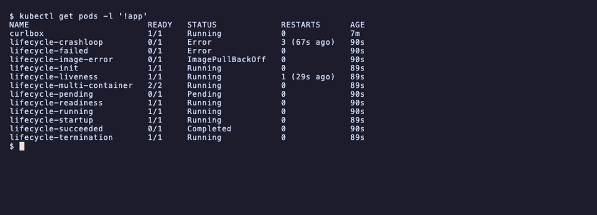
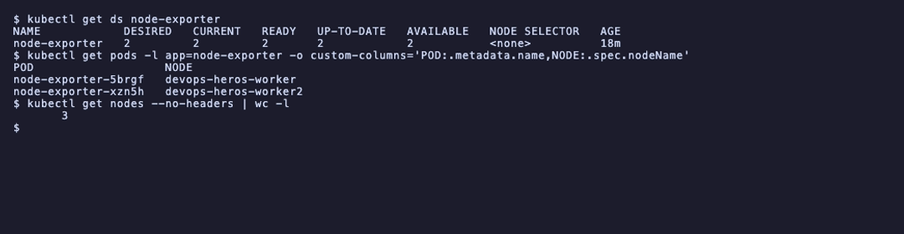
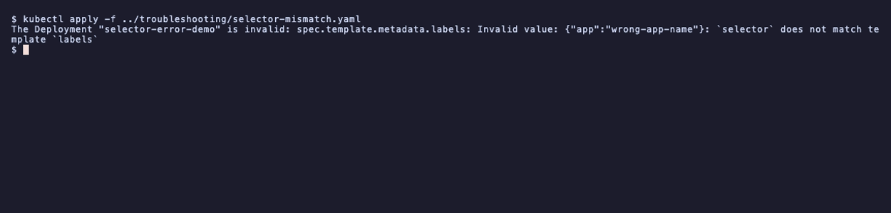

# Session 10: Pods, ReplicaSets, Deployments and Rollout Strategies

- Name: Aditya Singhi
- Enrollment number: 24BCS10177

Run on a 3 node kind cluster (1 control plane, 2 workers), Kubernetes v1.37.0,
containerd 2.3.4, on Docker Desktop for Mac (Apple Silicon). Task 1 of the
assignment allows minikube, kind or Docker Desktop, and kind was picked because
two worker nodes are needed to show DaemonSet placement and cross node
scheduling, which a single node cannot show.

Every manifest run here is the one already in `session10-k8s-core-objects/`. No
manifest file was edited. Where a file could not run as written on arm64, the
live object was patched instead and the reason is written up below.

Output blocks are copied from the terminal.

## Task 1: cluster health and baseline checks

```bash
kubectl cluster-info
kubectl get nodes -o wide
```

```
Kubernetes control plane is running at https://127.0.0.1:54082
CoreDNS is running at https://127.0.0.1:54082/api/v1/namespaces/kube-system/services/kube-dns:dns/proxy
```

```
NAME                         STATUS   ROLES           AGE    VERSION   INTERNAL-IP   CONTAINER-RUNTIME
devops-heros-control-plane   Ready    control-plane   2m2s   v1.37.0   172.26.0.3    containerd://2.3.4
devops-heros-worker          Ready    <none>          107s   v1.37.0   172.26.0.4    containerd://2.3.4
devops-heros-worker2         Ready    <none>          106s   v1.37.0   172.26.0.2    containerd://2.3.4
```

Client and server are both v1.37.0. Session 9 has the full control plane
component breakdown and the proof of which component runs on which node.

## Task 2: standalone pod from `pod.yml`

`pod.yml` has the four mandatory top level fields: `apiVersion`, `kind`,
`metadata`, `spec`.

```bash
kubectl apply -f pod.yml
kubectl get pods -o wide
kubectl logs nginx-pod
kubectl delete -f pod.yml
kubectl get pods
```

```
pod/nginx-pod created
```

```
NAME        READY   STATUS    RESTARTS   AGE   IP            NODE                   NOMINATED NODE   READINESS GATES
nginx-pod   1/1     Running   0          45s   10.244.2.15   devops-heros-worker2   <none>           <none>
```

```
2026/09/17 18:51:28 [notice] 1#1: start worker process 35
2026/09/17 18:51:28 [notice] 1#1: start worker process 36
```

```
pod "nginx-pod" deleted from default namespace
No resources found in default namespace.
```

`1/1` means one container of one is ready. The IP `10.244.2.15` comes from
worker2's slice of the pod CIDR, and nothing asked for that node, the scheduler
chose it. After deletion the pod is gone for good, because no controller owns it.

## Task 3: ErrImagePull and ImagePullBackOff

`pod-lifecycle/06-imagepullbackoff.yaml` points at `jakwehrgkaejw:kahsdfgkhj`,
which does not exist.

```bash
kubectl apply -f pod-lifecycle/06-imagepullbackoff.yaml
kubectl get pods
kubectl describe pod lifecycle-image-error | grep -A 8 'Events:'
```

```
NAME                    READY   STATUS         RESTARTS   AGE
lifecycle-image-error   0/1     ErrImagePull   0          12s
```

```
Events:
  Type     Reason     Age   From               Message
  ----     ------     ----  ----               -------
  Normal   Scheduled  12s   default-scheduler  Successfully assigned default/lifecycle-image-error to devops-heros-worker
  Normal   Pulling    11s   kubelet            Pulling image "jakwehrgkaejw:kahsdfgkhj"
  Warning  Failed     3s    kubelet            Failed to pull image "jakwehrgkaejw:kahsdfgkhj": failed to resolve reference "docker.io/library/jakwehrgkaejw:kahsdfgkhj"
  Warning  Failed     3s    kubelet            Error: ErrImagePull
  Normal   BackOff    2s    kubelet            Back-off pulling image "jakwehrgkaejw:kahsdfgkhj"
  Warning  Failed     2s    kubelet            Error: ImagePullBackOff
```

### Why the API object is fine while the container is not

The event list answers this directly. `Scheduled` succeeded, so kube-apiserver
validated the pod, wrote it to etcd, and kube-scheduler assigned it to
`devops-heros-worker`. Nothing in that path needs the image to exist, because the
API server only checks that the spec is well formed, and an image name is just a
string to it.

Only at step three does the kubelet on that node ask containerd to pull, and the
registry says no. So the object is healthy and the runtime is not. That is why
`kubectl get pods` shows the pod at all instead of the apply failing.

`ErrImagePull` is the single failed attempt. `ImagePullBackOff` is the state after
that, where the kubelet waits before retrying, doubling the delay each time up to
five minutes, so a bad tag does not hammer the registry.

## Task 4: catching the transient phases of `hello.yml`

`hello.yml` runs `echo Hello Kubernetes` in busybox with `restartPolicy: Never`,
which finishes in under a second. Watching by hand misses it, so I polled every
0.2s and printed only the changes:

```bash
kubectl apply -f hello.yml
# poll: kubectl get pod hello-pod --no-headers, print on change
```

```
T+s      STATUS
0        Pending
0        ContainerCreating
10       ErrImagePull
23       ImagePullBackOff
34       Running
35       Completed
```

```bash
kubectl logs hello-pod
kubectl get pod hello-pod -o jsonpath='{.status.phase}'
```

```
Hello Kubernetes
Succeeded
```

All three required stages are there, `ContainerCreating`, `Running`, then
`Completed`. The two extra rows in the middle were not planned. The busybox pull
genuinely failed once with `dial tcp: lookup registry-1.docker.io on
192.168.65.254:53: server misbehaving`, backed off, then succeeded on retry at
T+34s. Useful accident: it shows the same backoff machinery from Task 3 recovering
on its own once the cause clears, which is the difference between a transient
registry blip and a wrong tag.

Note the last two rows. `STATUS` in `kubectl get pods` reads `Completed`, but
`.status.phase` is `Succeeded`. The column is a friendlier rendering of the
container's terminated reason, not the phase itself. `Succeeded` is the phase
name to use in scripts.

## Task 5: the 12 pod lifecycle manifests

Applied `pod-lifecycle/` as a directory, which gives every state side by side:

```bash
kubectl apply -f pod-lifecycle/
kubectl get pods
```

```
NAME                        READY   STATUS             RESTARTS      AGE
lifecycle-crashloop         0/1     Error              3 (67s ago)   90s
lifecycle-failed            0/1     Error              0             90s
lifecycle-image-error       0/1     ImagePullBackOff   0             90s
lifecycle-init              1/1     Running            0             89s
lifecycle-liveness          1/1     Running            1 (29s ago)   89s
lifecycle-multi-container   2/2     Running            0             89s
lifecycle-pending           0/1     Pending            0             90s
lifecycle-readiness         1/1     Running            0             90s
lifecycle-running           1/1     Running            0             90s
lifecycle-startup           1/1     Running            0             89s
lifecycle-succeeded         0/1     Completed          0             90s
lifecycle-termination       1/1     Running            0             89s
```



### 02-pending: why it cannot be scheduled

The manifest requests `memory: "9Gi"`, more than any node has.

```bash
kubectl describe pod lifecycle-pending | grep -A 4 'Events:'
```

```
Events:
  Type     Reason            Age                From               Message
  ----     ------            ----               ----               -------
  Warning  FailedScheduling  12s (x2 over 26s)  default-scheduler  0/3 nodes are available: 1 node(s) had untolerated taint(s), 2 Insufficient memory. preemption: 0/3 nodes are available: 3 Preemption is not helpful for scheduling.
```

That one line accounts for all three nodes. The control plane is out because of
its `NoSchedule` taint, and both workers are out on memory. Pending is a
scheduler problem, unlike ImagePullBackOff which is a kubelet problem, so
`describe` on the pod is where the answer is either way.

### 03-succeeded vs 04-failed

Same image and same `restartPolicy: Never`, differing only in exit code.

```
lifecycle-succeeded   0/1   Completed   0
lifecycle-failed      0/1   Error       0
```

Exit 0 reads `Completed`, exit 1 reads `Error`, and neither restarts because the
policy forbids it. `RESTARTS` is 0 on both.

### 05-crashloopbackoff

The container prints, sleeps 3s, then exits 1, with the default
`restartPolicy: Always`.

```bash
kubectl logs lifecycle-crashloop
kubectl get pod lifecycle-crashloop -o jsonpath='{.status.containerStatuses[0].state.waiting.reason}'
```

```
Application started
Application crashed
```

```
waiting.reason=CrashLoopBackOff
lastState.exitCode=1
restartCount=5
```

The `STATUS` column flips between `Error` and `CrashLoopBackOff` depending on
whether the sample lands mid crash or mid wait, which makes it a poor thing to
assert on. The `waiting.reason` field is stable. `kubectl logs --previous` is the
documented way to read the dead container's output, but it returned `unable to
retrieve container logs` here because containerd had already reaped the old
container by the time I asked.

### 07-readiness: Running is not Ready

```
lifecycle-readiness   1/1   Running   0   90s
```

Caught at 90s it is already `1/1`. The probe has `initialDelaySeconds: 5`, so for
the first five seconds the pod is `0/1 Running`: the container is up and the
process is executing, but the readiness probe has not passed, so a Service would
not send it traffic. `READY` drives Service endpoints, `STATUS` does not.

### 08-liveness: self healing restart

The container creates `/tmp/healthy`, sleeps 20s, deletes it, then sleeps 300s.
The liveness probe tests for that file every 5s with `failureThreshold: 2`.

```bash
kubectl describe pod lifecycle-liveness | grep -E 'Unhealthy|Killing|Restart Count'
```

```
    Restart Count:  3
  Warning  Unhealthy  2s (x8 over 3m7s)    kubelet   Liveness probe failed:
  Normal   Killing    2s (x4 over 3m2s)    kubelet   Container app failed liveness probe, will be restarted
```

The pod reads `1/1 Running` while carrying 3 restarts. Each cycle is the same:
healthy for 20s, file removed, two probe failures 5s apart, kubelet kills and
restarts the container. This is a liveness probe doing real damage on a loop,
which is what happens in production when the probe tests something the app cannot
keep true.

### 09-startup: protecting a slow start

The app sleeps 30s before creating `/tmp/started`. The startup probe polls every
5s with `failureThreshold: 10`, allowing 50s.

```
lifecycle-startup   1/1   Running   0   89s
```

0 restarts. Without the startup probe, a liveness probe with a 5s period would
have killed this container four or five times before it ever finished booting.
The startup probe suspends liveness until it passes once.

### 10-init-container: ordering

```bash
kubectl get pod lifecycle-init -o jsonpath='{range .status.initContainerStatuses[*]}init/{.name}: ready={.ready} exit={.state.terminated.exitCode}{"\n"}{end}{range .status.containerStatuses[*]}app/{.name}: ready={.ready}{"\n"}{end}'
```

```
init/setup: ready=true exit=0
app/app: ready=true
```

The init container is `terminated` with exit 0, not running. The app container
only starts after that, and an init container exiting non-zero would block the
app container completely.

### 11-multi-container: app plus sidecar

```
lifecycle-multi-container   2/2   Running   0   89s
```

```bash
kubectl logs lifecycle-multi-container -c sidecar --tail=2
```

```
Sidecar is running
Sidecar is running
```

`2/2` is two containers in one pod, sharing one IP and one network namespace.
`kubectl logs` needs `-c` here, because with two containers it cannot guess.

### 12-termination: graceful shutdown

The container traps `TERM`, prints, sleeps 10s, then exits 0.
`terminationGracePeriodSeconds: 20`.

```bash
kubectl delete pod lifecycle-termination   # timed
kubectl logs lifecycle-termination         # during the shutdown
```

```
delete returned after 12s
```

```
Application running
SIGTERM received; cleaning up...
```

The delete blocked for 12 seconds instead of returning at once, which is the trap
doing its 10s of cleanup plus overhead. Because it finished inside the 20s grace
period it exited on its own terms and was never `SIGKILL`ed. Had cleanup taken
longer than 20s, the kubelet would have killed it mid work.

## Task 6: ReplicaSet and StatefulSet

### Part A: ReplicaSet self healing (`replicaset.yml`)

```bash
kubectl apply -f replicaset.yml
kubectl get rs nginx-rs
POD_NAME=$(kubectl get pods -l app=nginx -o jsonpath='{.items[0].metadata.name}')
kubectl delete pod $POD_NAME
kubectl get pods -l app=nginx
```

```
NAME       DESIRED   CURRENT   READY   AGE
nginx-rs   3         3         3       25s
```

```
pod "nginx-rs-2jmr2" deleted from default namespace
```

```
NAME             READY   STATUS    RESTARTS   AGE
nginx-rs-km5js   1/1     Running   0          44s
nginx-rs-scwzs   1/1     Running   0          44s
nginx-rs-sft54   1/1     Running   0          6s
```

Two pods are 44s old and one is 6s old. The ReplicaSet controller saw the count
drop to 2 and created a replacement within seconds. The replacement has a new
random name, so it is a new pod and not the old one coming back.

### Part B: StatefulSet (`k8s-core-objects/statefulset.yml`)

This one did not run as written, and the reason is worth recording.

```bash
kubectl apply -f k8s-core-objects/statefulset.yml
kubectl get pods -l app=mysql
```

```
NAME      READY   STATUS             RESTARTS   AGE
mysql-0   0/1     ImagePullBackOff   0          9m6s
```

```bash
kubectl describe pod mysql-0 | grep -i 'no match'
```

```
Failed to pull image "mysql:5.7": no match for platform in manifest: not found
```

```bash
docker manifest inspect mysql:5.7   # platforms it actually ships
```

```
platforms: linux/amd64, unknown/unknown
arm64 present: False
```

The manifest pins `mysql:5.7`, and that tag has no arm64 build. This is an Apple
Silicon Mac, so containerd cannot find a matching platform. Nothing is wrong with
the manifest, it just cannot run on this architecture.

Note that `mysql-1` and `mysql-2` were never created. A StatefulSet starts pods
in order and waits for each to be Ready, so ordinal 0 failing blocks the rest
permanently. A Deployment would have tried all three at once.

I fixed it on the live object rather than editing the file:

```bash
kubectl set image statefulset/mysql mysql=mysql:8.0
```

That alone changed nothing, and it took another 300s to work out why:

```
pod image now:        mysql:5.7
sts template image:   mysql:8.0
```

The default StatefulSet update strategy is RollingUpdate, which replaces pods
from the highest ordinal down and waits for each to become Ready first. `mysql-0`
was never Ready, so the controller refused to touch it and the new template sat
unused. Deleting the stuck pod let the controller recreate it from the new
template:

```bash
kubectl delete pod mysql-0
```

```
NAME      READY   STATUS    RESTARTS   AGE
mysql-0   1/1     Running   0          2m3s
mysql-1   1/1     Running   0          53s
mysql-2   1/1     Running   0          10s
```

```bash
kubectl get pvc
```

```
NAME                               STATUS   VOLUME                                     CAPACITY   ACCESS MODES   STORAGECLASS   AGE
mysql-persistent-storage-mysql-0   Bound    pvc-ced88615-4ec5-4269-b099-37773894eedf   5Gi        RWO            standard       11m
mysql-persistent-storage-mysql-1   Bound    pvc-0a3b22da-c550-446b-8a96-bde55fb7d2fb   5Gi        RWO            standard       53s
mysql-persistent-storage-mysql-2   Bound    pvc-db5611d0-c4e6-49b4-8493-82387b1ae058   5Gi        RWO            standard       10s
```

Both deliverables for this part are in those two outputs. The names are
deterministic ordinals, `mysql-0` through `mysql-2`, not random hashes. And the
ages, 2m3s, 53s, 10s, prove the sequential startup: each pod waited for the one
before it. Each ordinal got its own 5Gi PVC from `volumeClaimTemplates`, named
after the pod it belongs to, which is how a restarted `mysql-1` gets its own data
back rather than somebody else's.

## Task 7: DaemonSet (`k8s-core-objects/deamonset.yml`)

```bash
kubectl apply -f k8s-core-objects/deamonset.yml
kubectl get ds node-exporter
kubectl get pods -l app=node-exporter -o wide
```

```
NAME            DESIRED   CURRENT   READY   UP-TO-DATE   AVAILABLE   NODE SELECTOR   AGE
node-exporter   2         2         2       2            2           <none>          11m
```

```
POD                   NODE                   STATUS
node-exporter-5brgf   devops-heros-worker    Running
node-exporter-xzn5h   devops-heros-worker2   Running
```



`DESIRED` is 2 while the cluster has 3 nodes, and no node selector is set. The
missing node is the control plane:

```bash
kubectl get node devops-heros-control-plane -o jsonpath='{.spec.taints[*].key}'
```

```
node-role.kubernetes.io/control-plane
```

So a DaemonSet is one pod per *eligible* node, not per node. Nothing was scaled
by hand, and `DESIRED` is computed. Add a worker and a third pod appears on its
own. A real node agent such as node-exporter or Falco usually adds a toleration
for that taint, because you want host metrics from the control plane too.

## Task 8: rolling update and rollback

```bash
cd 01-rolling-update/
kubectl apply -f deployment-v1.yaml -f service.yaml
kubectl rollout status deployment/app-rolling
kubectl apply -f deployment-v2.yaml
```

With `maxSurge: 1` and `maxUnavailable: 0`, catching it mid update shows the
point of that pair:

```
POD                           IMAGE               READY   STATUS
web-deploy-5df88bb6cf-6pqhx   nginx:1.27-alpine   true    Running
web-deploy-5df88bb6cf-dxh9g   nginx:1.27-alpine   true    Running
web-deploy-5df88bb6cf-pkq68   nginx:1.27-alpine   true    Running
web-deploy-5df88bb6cf-x4tnw   nginx:1.27-alpine   true    Running
web-deploy-6d76cd5685-w7hmv   nginx:1.29-alpine   false   Pending
```

All four old pods are still Running and serving while the first new pod is only
Pending. Capacity never drops below four. With the default `maxUnavailable: 25%`
an old pod would have been killed before its replacement was ready.

```
Waiting for deployment rollout to finish: 1 out of 4 new replicas have been updated...
Waiting for deployment rollout to finish: 2 out of 4 new replicas have been updated...
Waiting for deployment rollout to finish: 3 out of 4 new replicas have been updated...
Waiting for deployment rollout to finish: 1 old replicas are pending termination...
deployment "web-deploy" successfully rolled out
```

```
NAME                    DESIRED   CURRENT   READY   AGE
web-deploy-5df88bb6cf   0         0         0       35s
web-deploy-6d76cd5685   4         4         4       34s
```

A Deployment never creates pods itself. It creates a ReplicaSet per pod template,
named with a hash of that template, and scales the old one to zero rather than
deleting it. That parked ReplicaSet is what makes rollback instant.

```bash
kubectl rollout history deployment/web-deploy
kubectl rollout undo deployment/web-deploy
```

```
REVISION  CHANGE-CAUSE
1         <none>
2         kubectl set image deploy/web-deploy web=nginx:1.29-alpine --record=true
```

```
POD                           IMAGE
web-deploy-5df88bb6cf-6lgh8   nginx:1.27-alpine
web-deploy-5df88bb6cf-dd2ds   nginx:1.27-alpine
web-deploy-5df88bb6cf-r7sq7   nginx:1.27-alpine
web-deploy-5df88bb6cf-t2sld   nginx:1.27-alpine
```

Back on 1.27, and the template hash `5df88bb6cf` is the same one from before the
update, so Kubernetes scaled the parked ReplicaSet back up instead of building a
new one.

Two things about `undo` that are easy to get wrong:

```
REVISION  CHANGE-CAUSE
2         kubectl set image deploy/web-deploy web=nginx:1.29-alpine --record=true
3         <none>
```

Revision 1 is gone and the rolled back template is now revision 3. A rollback is
recorded as a *new* revision, not a step backwards through the list, so running
`rollout undo` twice toggles between two images instead of walking further back.

`undo` also warns that it does not update the `last-applied-configuration`
annotation, so a later `kubectl apply -f deployment-v2.yaml` would quietly
reintroduce the image you just rolled away from.

Scaling, by contrast, creates no revision at all:

```
NAME         READY   UP-TO-DATE   AVAILABLE   AGE
web-deploy   6/6     6            6           63s
```

## Task 9: troubleshooting drills

### Drill 1: `troubleshooting/broken-image.yaml`

Applying it to an empty namespace only produces three broken pods, which does not
show the interesting behaviour. So I first made `yatri-backend` healthy on a real
image, then rolled to the broken tag, which is the situation the drill describes.

```bash
kubectl set image deploy/yatri-backend backend=nginx:1.27-alpine   # healthy baseline
kubectl apply -f troubleshooting/broken-image.yaml                  # roll to the bad tag
kubectl rollout status deploy/yatri-backend --timeout=30s
```

```
error: timed out waiting for the condition
```

```
POD                              IMAGE                                 READY   WAITING
yatri-backend-5d674ff48f-52cps   nginx:1.27-alpine                     true    <none>
yatri-backend-5d674ff48f-7lnmf   nginx:1.27-alpine                     true    <none>
yatri-backend-5d674ff48f-nmjlw   nginx:1.27-alpine                     true    <none>
yatri-backend-77dbb657cd-s76dk   yatri-backend:non-existent-tag-v999   false   ErrImagePull
```

```
NAME            READY   UP-TO-DATE   AVAILABLE   AGE
yatri-backend   3/3     1            3           92s
```

This is the good kind of failure. Three old pods are Ready and serving, one
surged pod cannot pull, and the deployment reports `READY 3/3` and `AVAILABLE 3`
with `UP-TO-DATE 1`. Users notice nothing.

`maxUnavailable: 0` is what bought that. The rollout is stuck rather than
destructive: it will not remove an old pod until a new one is Ready, and the new
one never will be. The tell is `UP-TO-DATE` sitting below `READY`, since
`READY 3/3` on its own looks fine.

```bash
kubectl rollout undo deploy/yatri-backend
```

```
deployment.apps/yatri-backend rolled back
deployment "yatri-backend" successfully rolled out
```

### Drill 2: `troubleshooting/selector-mismatch.yaml`

The manifest sets `spec.selector.matchLabels.app: correct-app-name` while the pod
template carries `app: wrong-app-name`.

```bash
kubectl apply -f troubleshooting/selector-mismatch.yaml
```

```
The Deployment "selector-error-demo" is invalid: spec.template.metadata.labels: Invalid value: {"app":"wrong-app-name"}: `selector` does not match template `labels`
```



Nothing was created. The API server rejected it during validation, which is a
different class of failure from the two above: no pod, no event, no scheduling,
just a refusal at the door.

The check exists because the selector is how a Deployment finds the pods it owns.
A selector that matches nothing would leave it managing zero pods while happily
creating them, so it could never scale down or update. The selector is also
immutable after creation, so this has to be caught up front.

The fix is to make the template label match the selector:

```yaml
spec:
  selector:
    matchLabels:
      app: correct-app-name
  template:
    metadata:
      labels:
        app: correct-app-name    # was wrong-app-name
```

## Task 10: concepts

### The four ports

```
Client ──► nodePort 30080 (every node's IP)
              │
              ▼
           port 8080 (Service cluster IP)
              │
              ▼
           targetPort 80 (pod)
              │
              ▼
           containerPort 80 (process in the container)
```

| Field | Lives on | What it means |
|---|---|---|
| `containerPort` | Pod spec | The port the process listens on. Documentation only, it opens nothing. Removing it does not stop traffic. |
| `targetPort` | Service spec | Where the Service sends traffic on the pod. Must match the real listening port. Can be a name. |
| `port` | Service spec | The port the Service itself exposes on its cluster IP, for in-cluster callers. |
| `nodePort` | Service spec | A port in 30000 to 32767 opened on *every* node. NodePort and LoadBalancer only. |

`containerPort` being informational is the one that catches people out. Session
11 has a Service working against pods whose `containerPort` says one thing while
`targetPort` does the real work.

### Labels vs selectors

A label is a key value pair stored on an object: `app: nginx`, `slot: blue`. A
selector is a query that matches labels. Labels are data, selectors are the
question asked of that data. Three places in this session show it: the ReplicaSet
uses one to decide which pods count toward its replica total, the blue-green
Service uses one to choose which deployment gets traffic, and Drill 2 fails
because a Deployment's selector and its own template labels disagree.

### The four deployment strategies

| Strategy | Downtime | Extra capacity | Rollback | Seen in |
|---|---|---|---|---|
| RollingUpdate | None | `maxSurge` worth | Scale the parked ReplicaSet back up | Task 8 |
| Recreate | Yes, measured at 1.2s here | None | Same, with downtime again | Task 13 |
| Blue-Green | None | 2x, both versions run | Flip the selector back, about a second | Task 11 |
| Canary | None | One extra pod | Scale the canary to 0 | Task 12 |

### maxSurge vs maxUnavailable

For `replicas: 4`, `maxSurge: 1`, `maxUnavailable: 0`:

- Ceiling during rollout: 4 + 1 = 5 pods
- Floor during rollout: 4 - 0 = 4 pods ready

Percentages are taken against the desired count, `maxSurge` rounded up and
`maxUnavailable` rounded down. At the default 25% each with 4 replicas, that is
`maxSurge 1` and `maxUnavailable 1`, so capacity can dip to 3 and a slow rollout
runs degraded. `maxUnavailable: 0` needs room for the extra pod, and Task 5's
Pending pod is what happens when a cluster has no room to surge into.

### Requests vs limits, and GB vs GiB

`requests` is what the scheduler reserves when placing a pod, and the only figure
it looks at. `limits` is the ceiling the kernel enforces through cgroups once the
container runs. Over the CPU limit a container is throttled and gets slower. Over
the memory limit it is OOM killed, because memory cannot be throttled.

`lifecycle-pending` is the requests side: `9Gi` requested, no node has it, so it
never schedules regardless of how idle the cluster is.

Units are decimal against binary. 1 GB is 10^9 bytes. 1 GiB is 2^30 bytes,
1,073,741,824, about 7% more. Kubernetes uses the binary suffixes `Ki`, `Mi`,
`Gi`, and a bare number means bytes. `memory: 512M` and `memory: 512Mi` are not
the same request, and `cpu: 100m` is 0.1 of a core.

## Task 11: blue-green cutover

```bash
cd 02-blue-green/
kubectl apply -f deployment-blue.yaml -f deployment-green.yaml -f service-blue.yaml
kubectl get pods -l app=myapp --show-labels
```

```
POD                         SLOT    IMAGE
app-blue-5c69d7785c-7dgqp   blue    nginx:1.24-alpine
app-blue-5c69d7785c-fdgh8   blue    nginx:1.24-alpine
app-blue-5c69d7785c-h2h5h   blue    nginx:1.24-alpine
app-green-84df7f978-6zhx7   green   nginx:1.25-alpine
app-green-84df7f978-prqvb   green   nginx:1.25-alpine
app-green-84df7f978-vwpf6   green   nginx:1.25-alpine
```

Six pods for three pods' worth of traffic. That 2x cost is the whole trade.

```
selector={"app":"myapp","slot":"blue"}
endpoints=["10.244.1.37"] ["10.244.2.29"] ["10.244.2.30"]
```

```
BLUE
BLUE
BLUE
BLUE
BLUE
```

### The switch

```bash
kubectl apply -f service-green.yaml
```

```
service/myapp-service configured
selector={"app":"myapp","slot":"green"}
endpoints=["10.244.2.28"] ["10.244.2.27"] ["10.244.1.35"]
```

```
GREEN
GREEN
GREEN
GREEN
GREEN
```

Those three endpoint IPs are exactly the green pod IPs:

```
green pod IPs: 10.244.1.35 10.244.2.27 10.244.2.28
```

Nothing was created, deleted or restarted. One label in the Service changed, the
endpoint controller rewrote the endpoint list, and traffic moved. No version ever
served a mixed response, because a given request hits one selector's endpoints.

### It is fast, but not instant

My first rollback attempt still answered `GREEN` three times, which looked like a
failure:

```
### ROLLBACK to blue
service/myapp-service configured
GREEN
GREEN
GREEN
```

The Service was correct, the reads were just too quick:

```
selector now: {"app":"myapp","slot":"blue"}
endpoints now: ["10.244.2.30"] ["10.244.2.29"] ["10.244.1.37"]
blue pod IPs:  10.244.2.29 10.244.1.37 10.244.2.30
```

```
BLUE
BLUE
BLUE
BLUE
BLUE
```

Timing a fresh switch, the first sample one second later already showed the new
version, so propagation is under a second. But it is not atomic: `kubectl apply`
returning only means the API server stored the object, and the endpoint
controller and kube-proxy still have to catch up on every node. Fine for a
cutover, worth knowing before asserting on it in a test.

## Task 12: canary traffic split

```bash
cd 03-canary/
kubectl apply -f deployment-stable.yaml -f service.yaml   # 9 pods, v1
kubectl apply -f deployment-canary.yaml                   # 1 pod, v2
```

```
NAME         READY   UP-TO-DATE   AVAILABLE   AGE
app-stable   9/9     9            9           15s
app-canary   1/1     1            1           7s
```

```
endpoint count: 10
```

One Service, ten endpoints. Both deployments share the label the Service selects
on, and differ on `version`, so the split is just the pod ratio.

40 requests at 9:1:

```
   3 CANARY v2
  37 STABLE v1
```

Shift to 30% by scaling both sides:

```bash
kubectl scale deployment app-canary --replicas=3
kubectl scale deployment app-stable --replicas=7
```

```
app-stable   7/7   7     7     35s
app-canary   3/3   3     3     27s
```

```
  10 CANARY v2
  30 STABLE v1
```

Abort:

```bash
kubectl scale deployment app-canary --replicas=0
kubectl scale deployment app-stable --replicas=9
```

```
  20 STABLE v1
```

7.5% measured against 10% expected, then 25% against 30%, then a clean 0%. The
ratio is right but noisy, because kube-proxy picks an endpoint at random per
connection rather than round robin, so small samples scatter.

The real limitation is granularity. Traffic share is `canary pods / total pods`,
so 1% canary needs 99 stable pods. That is why production canaries use an Ingress
or service mesh to weight traffic directly instead of counting pods.

## Task 13: Recreate strategy and its outage

```bash
cd 04-recreate/
kubectl apply -f deployment-v1.yaml -f service.yaml
# poll every 0.4s from a pod in the cluster, then:
kubectl apply -f deployment-v2.yaml
```

The polling loop, collapsed into runs:

```
    8 x  VERSION: v1
    3 x  [OUTAGE] no pod answering
   89 x  VERSION: v2 (UPGRADED)

  total samples: 100  (~0.4s apart)
  outage samples: 3  => roughly 1.2s with nothing serving
```

A real, measured outage of about 1.2 seconds. `strategy.type: Recreate` tells the
Deployment to scale the old ReplicaSet to zero and *wait for it to finish* before
scaling the new one up, so there is a window with no pods at all. Contrast Task
8, where the same kind of update on the same cluster never dropped below full
capacity.

1.2s is flattering here, because nginx starts in about a second from a cached
image. A JVM service taking 40s to boot would be down for 40s.

It is still the right choice sometimes. Two versions running at once is
unacceptable when they share a database schema being migrated, or when the app
takes a lock only one instance may hold. Recreate trades availability for the
guarantee that v1 and v2 never run together, which is exactly the guarantee
RollingUpdate cannot give.

## Summary

| Object | Replaces a dead pod | Updates pods on template change | Identity |
|---|---|---|---|
| Pod | No | No | One name, gone for good |
| ReplicaSet | Yes | No | New random name each time |
| Deployment | Yes, via its ReplicaSet | Yes | New random name each time |
| StatefulSet | Yes | Yes, highest ordinal first | Same ordinal, same PVC |
| DaemonSet | Yes | Yes | One per eligible node |

## Cleanup

```bash
kubectl delete -f pod-lifecycle/
kubectl delete -f replicaset.yml -f k8s-core-objects/deamonset.yml
kubectl delete sts mysql && kubectl delete pvc --all
kubectl delete -f 02-blue-green/ -f 03-canary/ -f 04-recreate/
kubectl delete deploy yatri-backend && kubectl delete pod curlbox
```
