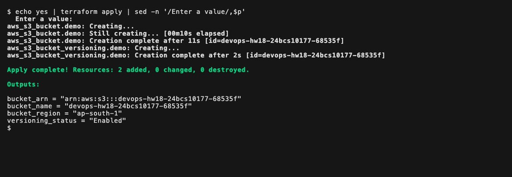
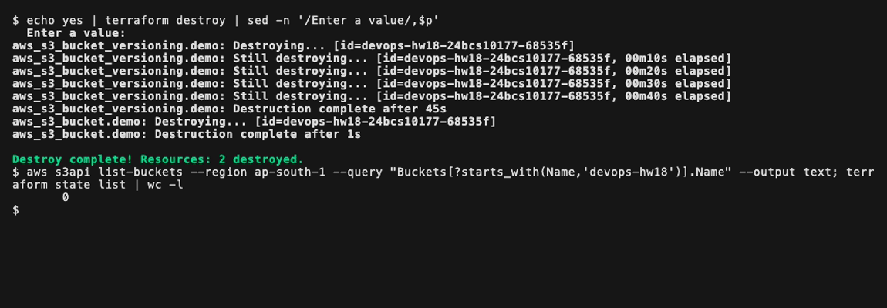

# Terraform S3 demo

Creates one versioned S3 bucket in `ap-south-1` and runs the full workflow:
`init`, `fmt`, `validate`, `plan`, `apply`, `show`, `output`, `destroy`. All output
is from my own AWS account. The bucket existed for a few minutes.

## Files

| File | What it holds |
|---|---|
| `provider.tf` | `terraform` block (Terraform `>= 1.15.0`, aws `~> 6.0`) and the provider with `default_tags` |
| `variables.tf` | `aws_region`, `bucket_name` (with a validation rule), `environment` |
| `terraform.tfvars` | `ap-south-1`, `devops-hw18-24bcs10177-68535f`, `dev` |
| `main.tf` | `aws_s3_bucket` with `force_destroy = true`, and `aws_s3_bucket_versioning` |
| `outputs.tf` | bucket name, ARN, region and versioning status, each with a `type` |

```hcl
provider "aws" {
  region = var.aws_region

  default_tags {
    tags = {
      Project = "devops-homework"
      Session = "18"
      Owner   = "24bcs10177"
    }
  }
}
```

No credentials are in the code. The provider reads them the same way the AWS
CLI does. `default_tags` adds the three tags to every resource without
repeating them in `main.tf`. `terraform.tfvars` is committed (no secrets),
through a `!terraform-s3-demo/terraform.tfvars` exception in this folder's
`.gitignore`, since the session `.gitignore` ignores that file.

## 1. terraform init

```bash
terraform init
```

```
Initializing the backend...

Initializing provider plugins...
- Finding hashicorp/aws versions matching "~> 6.0"...
- Installing hashicorp/aws v6.67.0...
- Installed hashicorp/aws v6.67.0 (signed by HashiCorp)
...
Terraform has been successfully initialized!
```

`init` downloaded the provider into `.terraform/` and wrote
`.terraform.lock.hcl`. With no backend block, state is a local
`terraform.tfstate` file, which is gitignored.

## 2. terraform fmt

```bash
terraform fmt -check -diff
```

It printed nothing and exited 0, so the files were already formatted. Without
`-check`, `fmt` rewrites files to two space indents with aligned `=` signs.
`-check` is the form to run in CI.

## 3. terraform validate

```bash
terraform validate
```

```
Success! The configuration is valid.
```

This checks syntax, references and types without calling AWS.

## 4. terraform plan

```bash
terraform plan -out=demo.tfplan
```

```
...
Terraform will perform the following actions:

  # aws_s3_bucket.demo will be created
  + resource "aws_s3_bucket" "demo" {
      + arn                         = (known after apply)
      + bucket                      = "devops-hw18-24bcs10177-68535f"
...
      + force_destroy               = true
...
      + region                      = "ap-south-1"
...
      + tags                        = {
          + "Environment" = "dev"
          + "ManagedBy"   = "Terraform"
          + "Name"        = "devops-hw18-24bcs10177-68535f"
        }
      + tags_all                    = {
          + "Environment" = "dev"
          + "ManagedBy"   = "Terraform"
          + "Name"        = "devops-hw18-24bcs10177-68535f"
          + "Owner"       = "24bcs10177"
          + "Project"     = "devops-homework"
          + "Session"     = "18"
        }
...
  # aws_s3_bucket_versioning.demo will be created
  + resource "aws_s3_bucket_versioning" "demo" {
      + bucket = (known after apply)
...
          + status     = "Enabled"
...
Plan: 2 to add, 0 to change, 0 to destroy.
```

`+` means create, and "(known after apply)" marks values only AWS can provide.
The versioning resource's `bucket` points at the bucket's ID, which is how
Terraform knows the order. `tags_all` is `tags` plus the provider's
`default_tags`.

## 5. terraform apply

```bash
echo yes | terraform apply
```

```
  Enter a value: 
aws_s3_bucket.demo: Creating...
aws_s3_bucket.demo: Still creating... [00m10s elapsed]
aws_s3_bucket.demo: Creation complete after 11s [id=devops-hw18-24bcs10177-68535f]
aws_s3_bucket_versioning.demo: Creating...
aws_s3_bucket_versioning.demo: Creation complete after 1s [id=devops-hw18-24bcs10177-68535f]

Apply complete! Resources: 2 added, 0 changed, 0 destroyed.

Outputs:

bucket_arn = "arn:aws:s3:::devops-hw18-24bcs10177-68535f"
bucket_name = "devops-hw18-24bcs10177-68535f"
bucket_region = "ap-south-1"
versioning_status = "Enabled"
```

The bucket was created first, then its versioning config.



Checking from outside Terraform:

```bash
aws s3api get-bucket-tagging --bucket devops-hw18-24bcs10177-68535f --region ap-south-1 --output text
aws s3api get-bucket-encryption --bucket devops-hw18-24bcs10177-68535f --region ap-south-1 \
  --query 'ServerSideEncryptionConfiguration.Rules[0].ApplyServerSideEncryptionByDefault.SSEAlgorithm' --output text
```

```
TAGSET	Project	devops-homework
TAGSET	Environment	dev
TAGSET	Owner	24bcs10177
TAGSET	ManagedBy	Terraform
TAGSET	Name	devops-hw18-24bcs10177-68535f
TAGSET	Session	18
AES256
```

All six tags are on the real bucket. `AES256` is SSE-S3, which S3 applies to
every new bucket without being asked.

A `plan` straight after `apply` should find nothing to do:

```bash
terraform plan -detailed-exitcode
```

```
...
No changes. Your infrastructure matches the configuration.
...
```

It exited 0. Exit code 2 would have meant drift between AWS and the config.

## 6. terraform show

```bash
terraform show
```

```
# aws_s3_bucket.demo:
resource "aws_s3_bucket" "demo" {
...
    arn                         = "arn:aws:s3:::devops-hw18-24bcs10177-68535f"
    bucket                      = "devops-hw18-24bcs10177-68535f"
...
                sse_algorithm     = "AES256"
...
# aws_s3_bucket_versioning.demo:
...
        status     = "Enabled"
...
```

`show` prints the state file without calling AWS. The SSE-S3 encryption block
is in state even though I never wrote it, because Terraform read it back from S3.

```bash
terraform state list
```

```
aws_s3_bucket.demo
aws_s3_bucket_versioning.demo
```

## 7. terraform output

```bash
terraform output
terraform output -raw bucket_name
```

```
bucket_arn = "arn:aws:s3:::devops-hw18-24bcs10177-68535f"
bucket_name = "devops-hw18-24bcs10177-68535f"
bucket_region = "ap-south-1"
versioning_status = "Enabled"
devops-hw18-24bcs10177-68535f
```

`-raw` prints the bare value with no quotes, for use in scripts such as
`aws s3 cp file s3://$(terraform output -raw bucket_name)/`.

## 8. terraform destroy

I uploaded a file twice first, so the bucket held two object versions:

```bash
aws s3api list-object-versions --region ap-south-1 --bucket devops-hw18-24bcs10177-68535f \
  --query 'Versions[].[Key,VersionId,Size]' --output text
echo yes | terraform destroy
```

```
notes/provider.tf	kpfWbB_8HxkBwZT7TMQbGGy29wadY4ae	367
notes/provider.tf	CQdivqF3KToKK.f_NFbSISgGIhj8CE7i	367
...
  Enter a value: 
aws_s3_bucket_versioning.demo: Destroying... [id=devops-hw18-24bcs10177-68535f]
aws_s3_bucket_versioning.demo: Destruction complete after 0s
aws_s3_bucket.demo: Destroying... [id=devops-hw18-24bcs10177-68535f]
aws_s3_bucket.demo: Destruction complete after 1s

Destroy complete! Resources: 2 destroyed.
```

Destroy runs in reverse order. The bucket was not empty and still deleted,
because `force_destroy` removes every object version first. Without it, S3
refuses to delete a non empty bucket.

```bash
aws s3api list-buckets --region ap-south-1 \
  --query "Buckets[?starts_with(Name,'devops-hw18')].Name" --output text
echo "state entries: $(terraform state list | wc -l)"
```

```

state entries:        0
```

No bucket left, and the state is empty.


