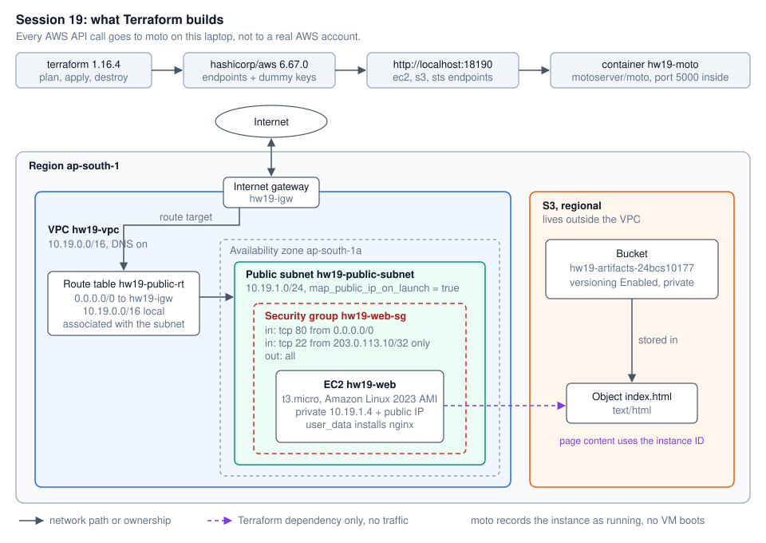
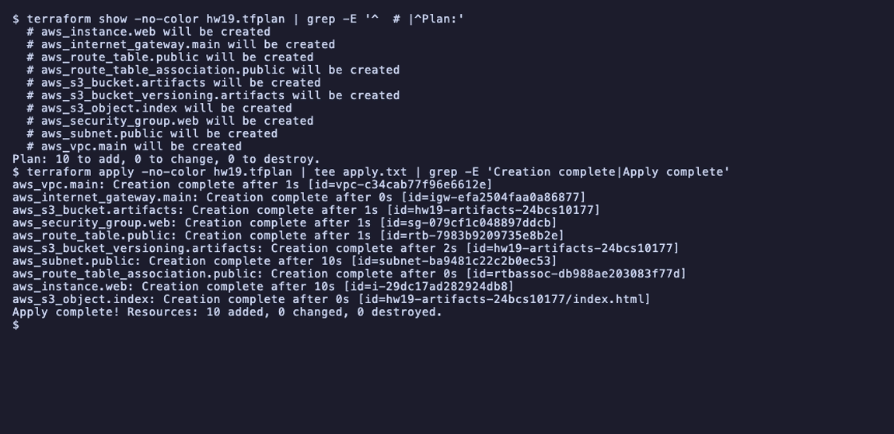
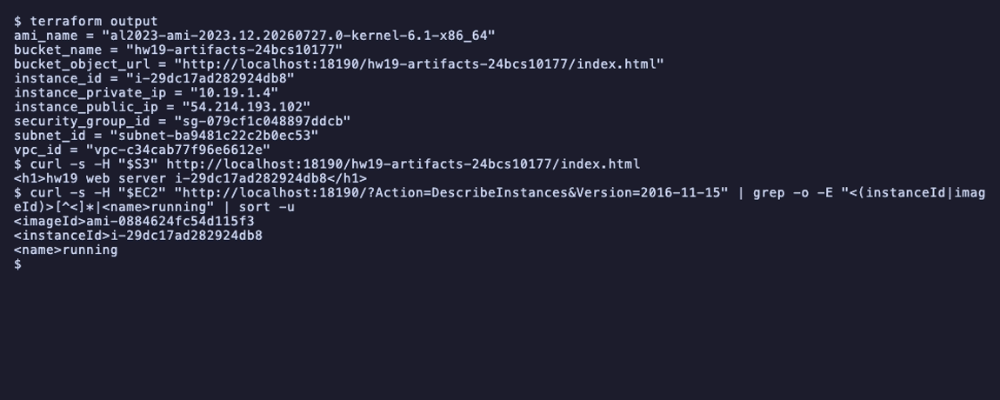
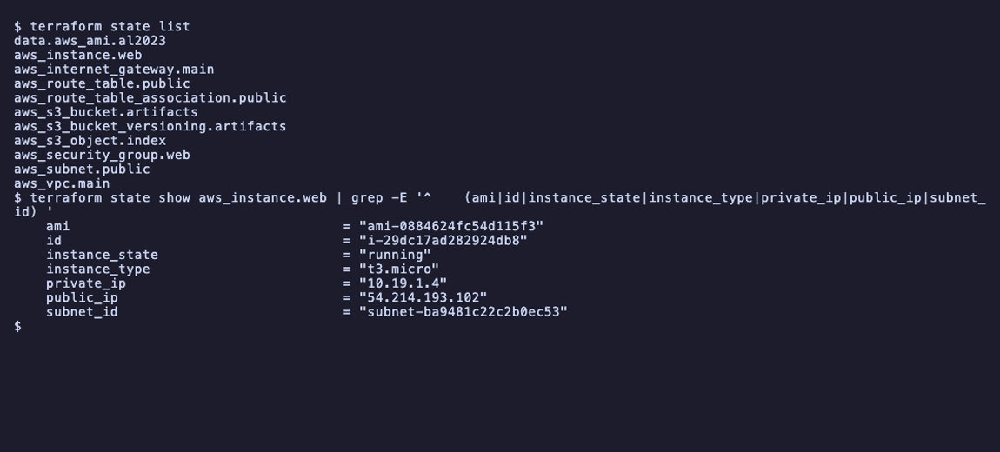
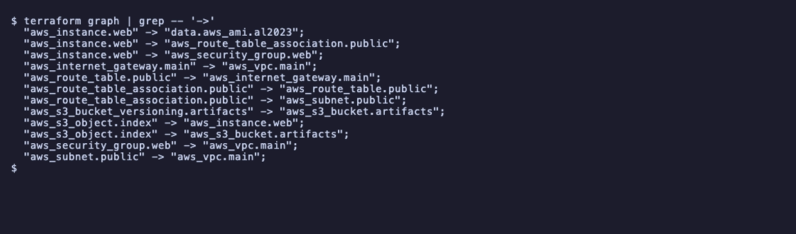
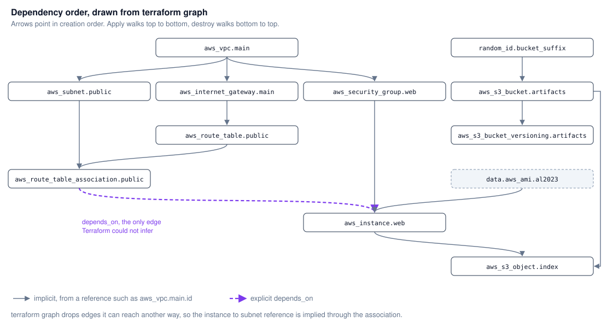
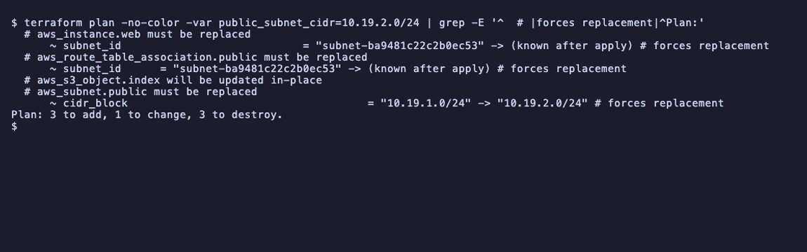
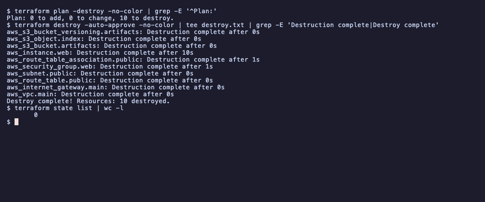

# Session 19: Cloud and Terraform in action

- Name: Aditya Singhi
- Enrollment number: 24BCS10177

I did not use a real AWS account for this. Everything ran against an AWS API
emulator in Docker on my laptop, at `http://localhost:18190`. I planned to use
LocalStack, but the current `localstack/localstack` image (2026.9.0) quits
without an auth token (Task 1), so I switched to moto (`motoserver/moto`, moto
5.2.3.dev0). Terraform itself is real: Terraform 1.16.4, the official
`hashicorp/aws` provider v6.67.0, a real state file, and real plan, apply and
destroy runs. The provider simply sends its API calls to moto instead of AWS.

The important limit: moto's EC2 is a record in memory. The instance goes to
`running`, gets IPs and shows up in `DescribeInstances`, but no VM boots, so the
`user_data` that installs nginx never runs. Task 7 shows this.

The Terraform code is in this folder. `.terraform/`, the lock file, plan files
and every `*.tfstate` file are ignored by `.gitignore`.

## Architecture



One VPC with one public subnet in `ap-south-1a`. The subnet is public because
its route table sends `0.0.0.0/0` to the internet gateway and it hands out
public IPs on launch. The EC2 instance sits in that subnet behind a security
group that allows HTTP from anywhere and SSH from one address only. S3 is a
regional service, so the bucket is drawn outside the VPC. The purple line is a
Terraform dependency, not network traffic: the uploaded `index.html` contains
the instance ID, so the object can only be written after the instance exists.

## Project layout

```
homework-cloud-terraform/
├── versions.tf               terraform block, aws provider pointed at moto
├── variables.tf              7 input variables with defaults
├── main.tf                   1 data source + 10 resources
├── outputs.tf                9 outputs
├── terraform.tfvars.example  sample overrides
├── .gitignore
├── architecture.svg
├── dependency-graph.svg
├── README.md
└── screenshots/
```

| Requirement | Where it shows up |
|---|---|
| Providers | `versions.tf`, Task 2 and Task 4 |
| Variables | `variables.tf`, Task 3 and Task 12 |
| Resources | `main.tf`, Task 5 and Task 6 |
| Outputs | `outputs.tf`, Task 7 |
| Dependencies | references in `main.tf` plus one `depends_on`, Task 9 |
| AWS infrastructure | VPC, subnet, IGW, route table, security group, EC2, S3 bucket and object |
| Terraform state | Task 8 and Task 13 |
| plan, apply, destroy | Task 5, Task 6, Task 13 |

## Task 1: LocalStack refuses to start, moto works

```bash
docker run -d --name hw19-localstack -p 18190:4566 localstack/localstack:latest
docker logs hw19-localstack
docker inspect hw19-localstack --format 'exit={{.State.ExitCode}}'
```

```
LocalStack version: 2026.9.0
LocalStack build date: 2026-10-02
LocalStack build git hash: cebac06b

Localstack returning with exit code 55. Reason: 
...
Reason: No credentials were found in the environment. Please set the LOCALSTACK_AUTH_TOKEN variable to a valid auth token. Alternatively, run `lstk login` and start LocalStack with the lstk CLI, which configures the credentials for you.

Due to this error, Localstack has quit. LocalStack pro features can only be used with a valid license.
```

```
exit=55
```

The `latest` tag now needs an account and a token even for the free services. It
exits right after printing this, so nothing ever listens on 4566. I removed the
container and ran moto on the same host port instead:

```bash
docker rm hw19-localstack
docker run -d --name hw19-moto -p 18190:5000 motoserver/moto:latest
docker exec hw19-moto pip show moto | sed -n 2p
```

```
Version: 5.2.3.dev0
```

moto listens on 5000 inside the container, not 4566, which is the only thing that
changes in the `docker run`. The Terraform code does not care which emulator
answers, because it only knows the URL `http://localhost:18190`.

## Task 2: the provider

`versions.tf` pins the provider and sends every call to moto:

```hcl
provider "aws" {
  region     = var.aws_region
  access_key = "test"
  secret_key = "test"

  skip_credentials_validation = true
  skip_metadata_api_check     = true
  skip_requesting_account_id  = true

  s3_use_path_style = true

  endpoints {
    ec2 = var.aws_endpoint
    s3  = var.aws_endpoint
    sts = var.aws_endpoint
  }

  default_tags { ... }
}
```

What each odd setting is for:

- The three `skip_*` flags stop the provider from calling STS and the EC2
  metadata service at startup to prove the keys are real. The keys are fake.
- `s3_use_path_style` makes the provider call `localhost:18190/<bucket>` instead
  of `<bucket>.localhost:18190`, a hostname that does not resolve on my Mac.
- `endpoints` only lists the three services this project uses. Anything not
  listed would go to real AWS and fail on the fake keys, which is a safe
  failure.
- `default_tags` puts `Project`, `Session` and `ManagedBy` on every resource
  without repeating them. They show up as `tags_all` in the plan.

## Task 3: variables

| Variable | Default | Used for |
|---|---|---|
| `aws_region` | `ap-south-1` | provider region and the AZ name `${var.aws_region}a` |
| `aws_endpoint` | `http://localhost:18190` | provider endpoints and the `bucket_object_url` output |
| `project` | `hw19` | prefix for every `Name` tag and the bucket name |
| `vpc_cidr` | `10.19.0.0/16` | VPC |
| `public_subnet_cidr` | `10.19.1.0/24` | subnet |
| `instance_type` | `t3.micro` | EC2 |
| `ssh_cidr` | `203.0.113.10/32` | the only source allowed on port 22 |

`203.0.113.10` is from a documentation range. In real use it would be my own
public IP. Leaving SSH open to `0.0.0.0/0` invites password guessing from the
whole internet within minutes of boot.

The AMI is not a variable. AMI IDs differ per region and per emulator, so
`main.tf` looks one up with a data source instead (Task 10 explains why).

## Task 4: init, fmt, validate

```bash
terraform init
```

The first try failed before downloading anything:

```
- Installing hashicorp/aws v6.67.0...

Error: Failed to install provider

Error while installing hashicorp/aws v6.67.0: releases.hashicorp.com: Error
parsing netrc file at "/Users/zingzy/.netrc": line 4: keyword expected; got
default-header
```

Terraform reads `~/.netrc` for download credentials, and its parser rejects a
`default-header` line that is in my file for another tool. I did not want to edit that file
for this, so I pointed Terraform at an empty one for the download:

```bash
NETRC=/dev/null terraform init
```

```
Initializing the backend...

Initializing provider plugins...
- Finding hashicorp/aws versions matching "~> 6.0"...
- Installing hashicorp/aws v6.67.0...
- Installed hashicorp/aws v6.67.0 (signed by HashiCorp)

Terraform has created a lock file .terraform.lock.hcl to record the provider
selections it made above. Include this file in your version control repository
so that Terraform can guarantee to make the same selections by default when
you run "terraform init" in the future.

Terraform has been successfully initialized!
```

```bash
terraform fmt -check -diff; echo "exit=$?"
terraform validate
terraform providers
```

```
exit=0
Success! The configuration is valid.

Providers required by configuration:
.
└── provider[registry.terraform.io/hashicorp/aws] ~> 6.0
```

`fmt -check` exiting 0 with no diff means the files were already formatted.
`validate` checks types and references without calling any API, so it passes
even with moto stopped.

A side note on the session's own files. I ran the same two checks on a copy of
`08-mini-project`:

```bash
terraform fmt -check -diff; echo "fmt exit=$?"
terraform validate
```

```
main.tf
--- old/main.tf
+++ new/main.tf
@@ -38,7 +38,7 @@
 
   route {
     cidr_block = "0.0.0.0/0"
-    gateway_id  = aws_internet_gateway.main.id
+    gateway_id = aws_internet_gateway.main.id
   }
 
   tags = {
fmt exit=3
Success! The configuration is valid.
```

The instructor's file has one extra space, so `fmt -check` fails while
`validate` passes. Formatting is not part of validation, so a CI pipeline
needs both checks.

## Task 5: plan

```bash
terraform plan -out=hw19.tfplan
```

```
data.aws_ami.al2023: Reading...
data.aws_ami.al2023: Read complete after 3s [id=ami-0884624fc54d115f3]

Terraform used the selected providers to generate the following execution
plan. Resource actions are indicated with the following symbols:
  + create

Terraform will perform the following actions:

  # aws_instance.web will be created
  + resource "aws_instance" "web" {
      + ami                                  = "ami-0884624fc54d115f3"
      + arn                                  = (known after apply)
      ...
      + instance_type                        = "t3.micro"
      ...

  # aws_vpc.main will be created
  + resource "aws_vpc" "main" {
      + cidr_block                           = "10.19.0.0/16"
      + enable_dns_hostnames                 = true
      + enable_dns_support                   = true
      + id                                   = (known after apply)
      ...
      + tags_all                             = {
          + "ManagedBy" = "Terraform"
          + "Name"      = "hw19-vpc"
          + "Project"   = "hw19"
          + "Session"   = "19"
        }
    }

Plan: 10 to add, 0 to change, 0 to destroy.

Changes to Outputs:
  + ami_name            = "al2023-ami-2023.12.20260727.0-kernel-6.1-x86_64"
  + bucket_name         = "hw19-artifacts-24bcs10177"
  + bucket_object_url   = "http://localhost:18190/hw19-artifacts-24bcs10177/index.html"
  + instance_id         = (known after apply)
  + instance_private_ip = (known after apply)
  + instance_public_ip  = (known after apply)
  + security_group_id   = (known after apply)
  + subnet_id           = (known after apply)
  + vpc_id              = (known after apply)

Saved the plan to: hw19.tfplan
```

The data source is read during plan, not apply, which is why the AMI ID is
already filled in. Every ID that AWS generates is `(known after apply)`. Three
outputs are already known because they only use variables.

I saved the plan with `-out`. Applying the saved file guarantees that apply does
exactly what I reviewed, and it does not ask for `yes` again.

## Task 6: apply

```bash
terraform apply hw19.tfplan
```

```
aws_s3_bucket.artifacts: Creating...
aws_vpc.main: Creating...
aws_vpc.main: Creation complete after 1s [id=vpc-c34cab77f96e6612e]
aws_subnet.public: Creating...
aws_internet_gateway.main: Creating...
aws_security_group.web: Creating...
aws_internet_gateway.main: Creation complete after 0s [id=igw-efa2504faa0a86877]
aws_route_table.public: Creating...
aws_s3_bucket.artifacts: Creation complete after 1s [id=hw19-artifacts-24bcs10177]
aws_s3_bucket_versioning.artifacts: Creating...
aws_security_group.web: Creation complete after 1s [id=sg-079cf1c048897ddcb]
aws_route_table.public: Creation complete after 1s [id=rtb-7983b9209735e8b2e]
aws_s3_bucket_versioning.artifacts: Creation complete after 2s [id=hw19-artifacts-24bcs10177]
aws_subnet.public: Still creating... [00m10s elapsed]
aws_subnet.public: Creation complete after 10s [id=subnet-ba9481c22c2b0ec53]
aws_route_table_association.public: Creating...
aws_route_table_association.public: Creation complete after 0s [id=rtbassoc-db988ae203083f77d]
aws_instance.web: Creating...
aws_instance.web: Still creating... [00m10s elapsed]
aws_instance.web: Creation complete after 10s [id=i-29dc17ad282924db8]
aws_s3_object.index: Creating...
aws_s3_object.index: Creation complete after 0s [id=hw19-artifacts-24bcs10177/index.html]

Apply complete! Resources: 10 added, 0 changed, 0 destroyed.
```



The order is the dependency graph at work. The VPC and the bucket start
together because neither needs anything. The IGW, subnet and security group
wait for the VPC ID. The instance waits for the route table association and
the object waits for the instance.

Most resources take 0 to 2 seconds. The subnet and the instance take about 10
because the provider polls until the resource reaches its final state. On an
earlier run, while Docker Desktop was short on memory, the same VPC and bucket
took 51 and 55 seconds, so a slow apply against an emulator says more about the
laptop than about Terraform.

## Task 7: outputs, and checking the resources exist

```bash
terraform output
```

```
ami_name = "al2023-ami-2023.12.20260727.0-kernel-6.1-x86_64"
bucket_name = "hw19-artifacts-24bcs10177"
bucket_object_url = "http://localhost:18190/hw19-artifacts-24bcs10177/index.html"
instance_id = "i-29dc17ad282924db8"
instance_private_ip = "10.19.1.4"
instance_public_ip = "54.214.193.102"
security_group_id = "sg-079cf1c048897ddcb"
subnet_id = "subnet-ba9481c22c2b0ec53"
vpc_id = "vpc-c34cab77f96e6612e"
```

Terraform saying "created" only means the API said OK. To check the other side
I asked moto directly. I had no AWS CLI installed, so I used curl. moto does
not verify signatures, it only reads the service and region out of the
`Authorization` header, so a fixed fake header is enough:

```bash
S3='Authorization: AWS4-HMAC-SHA256 Credential=test/20261007/ap-south-1/s3/aws4_request, SignedHeaders=host, Signature=x'
EC2='Authorization: AWS4-HMAC-SHA256 Credential=test/20261007/ap-south-1/ec2/aws4_request, SignedHeaders=host, Signature=x'
```

```
$ curl -s -o /dev/null -w "%{http_code}\n" http://localhost:18190/hw19-artifacts-24bcs10177/index.html
403
$ curl -s -H "$S3" http://localhost:18190/hw19-artifacts-24bcs10177/index.html
<h1>hw19 web server i-29dc17ad282924db8</h1>
$ curl -s -H "$S3" "http://localhost:18190/hw19-artifacts-24bcs10177?versioning" | grep -o "<Status>[^<]*</Status>"
<Status>Enabled</Status>
$ curl -s -H "$EC2" "http://localhost:18190/?Action=DescribeInstances&Version=2016-11-15&Filter.1.Name=tag:Name&Filter.1.Value.1=hw19-web" | grep -o -E "<(instanceId|imageId|subnetId|ipAddress)>[^<]*|<instanceState><code>[0-9]+</code><name>[^<]*" | sort -u
<imageId>ami-0884624fc54d115f3
<instanceId>i-29dc17ad282924db8
<instanceState><code>16</code><name>running
<ipAddress>54.214.193.102
<subnetId>subnet-ba9481c22c2b0ec53
$ curl -s -H "$EC2" "http://localhost:18190/?Action=DescribeSecurityGroups&Version=2016-11-15&Filter.1.Name=group-name&Filter.1.Value.1=hw19-web-sg" | grep -o -E "<description>[^<]*</description><cidrIp>[^<]*" | sed -E "s/<description>//; s#</description><cidrIp># #"
All outbound 0.0.0.0/0
SSH 203.0.113.10/32
HTTP 0.0.0.0/0
```



- The anonymous request gets `403`. The bucket is private by default, and moto
  enforces that. The page is only readable with credentials.
- The object body has the real instance ID in it. That value did not exist
  until the instance was created, which is the dependency from the diagram.
- The instance is `running` (code 16) in the subnet Terraform made, with the
  AMI from the data source. The security group has exactly the three rules
  from `main.tf`.

Now the honest part. Nothing actually runs:

```bash
docker top hw19-moto -o pid,args
```

```
PID                 COMMAND
238565              /usr/local/bin/python3.13 /usr/local/bin/moto_server -H 0.0.0.0
```

The only process is moto itself. There is no VM, so the public IP
`54.214.193.102` is a made up number that does not route to anything I own, and
nginx was never installed. Everything Terraform manages here is real API state,
but a real HTTP check of the web server needs a real AWS account.

## Task 8: Terraform state

```bash
terraform state list
```

```
data.aws_ami.al2023
aws_instance.web
aws_internet_gateway.main
aws_route_table.public
aws_route_table_association.public
aws_s3_bucket.artifacts
aws_s3_bucket_versioning.artifacts
aws_s3_object.index
aws_security_group.web
aws_subnet.public
aws_vpc.main
```

Eleven entries but the apply said "10 added". The data source is in state too,
because Terraform caches what it read, but it is not a resource Terraform
created or will destroy.

```bash
terraform state show aws_instance.web | grep -E '^    (ami|id|instance_state|instance_type|private_ip|public_ip|subnet_id) '
```

```
    ami                                  = "ami-0884624fc54d115f3"
    id                                   = "i-29dc17ad282924db8"
    instance_state                       = "running"
    instance_type                        = "t3.micro"
    private_ip                           = "10.19.1.4"
    public_ip                            = "54.214.193.102"
    subnet_id                            = "subnet-ba9481c22c2b0ec53"
```



The full `state show aws_instance.web` is 100 lines. One part worth seeing:

```
    user_data                            = <<-EOT
        #!/bin/bash
        dnf install -y nginx
        echo "hello from hw19" > /usr/share/nginx/html/index.html
        systemctl enable --now nginx
    EOT
```

State stores every attribute in plain text, including `user_data`. If that
script had a password in it, the password would be in `terraform.tfstate`. That
is the main reason state files stay out of Git, and why teams keep state in an
encrypted remote backend such as S3 with locking.

```bash
terraform state show aws_subnet.public
```

```
# aws_subnet.public:
resource "aws_subnet" "public" {
    arn                                            = "arn:aws:ec2:ap-south-1:123456789012:subnet/subnet-ba9481c22c2b0ec53"
    assign_ipv6_address_on_creation                = false
    availability_zone                              = "ap-south-1a"
    availability_zone_id                           = "aps1-az1"
    cidr_block                                     = "10.19.1.0/24"
    ...
    map_public_ip_on_launch                        = true
    owner_id                                       = "123456789012"
    region                                         = "ap-south-1"
    tags                                           = {
        "Name" = "hw19-public-subnet"
    }
    tags_all                                       = {
        "ManagedBy" = "Terraform"
        "Name"      = "hw19-public-subnet"
        "Project"   = "hw19"
        "Session"   = "19"
    }
    vpc_id                                         = "vpc-c34cab77f96e6612e"
}
```

`123456789012` is moto's fake account ID. `tags` holds what I wrote on the
resource, `tags_all` adds the provider's `default_tags`.

The state file itself is JSON:

```bash
python3 -c "import json;s=json.load(open('terraform.tfstate'));print('version',s['version'],'terraform_version',s['terraform_version'],'serial',s['serial'],'lineage',s['lineage']);print('resources in file:',len(s['resources']))"
```

```
version 4 terraform_version 1.16.4 serial 11 lineage d3f601b5-549e-dcbd-5554-b2a509064aae
resources in file: 11
```

`serial` goes up on every write. `lineage` is fixed for the life of this state
file, so Terraform can refuse to overwrite one state with an unrelated one.

## Task 9: dependencies and terraform graph

Almost every dependency in this project is implicit. Writing
`vpc_id = aws_vpc.main.id` in the subnet is enough for Terraform to know the
VPC comes first. There is exactly one `depends_on`:

```hcl
resource "aws_instance" "web" {
  ...
  subnet_id = aws_subnet.public.id

  # The instance only references the subnet, so Terraform cannot see that
  # user_data needs the internet route to exist before boot.
  depends_on = [aws_route_table_association.public]
}
```

Without it Terraform could launch the instance as soon as the subnet exists,
while the route table is still being attached. On real AWS the `dnf install`
in `user_data` would then run with no route to the internet and fail on first
boot. No attribute of the instance mentions the route table, so Terraform has
no way to infer this.

```bash
terraform graph | grep -- '->'
```

```
  "aws_instance.web" -> "data.aws_ami.al2023";
  "aws_instance.web" -> "aws_route_table_association.public";
  "aws_instance.web" -> "aws_security_group.web";
  "aws_internet_gateway.main" -> "aws_vpc.main";
  "aws_route_table.public" -> "aws_internet_gateway.main";
  "aws_route_table_association.public" -> "aws_route_table.public";
  "aws_route_table_association.public" -> "aws_subnet.public";
  "aws_s3_bucket_versioning.artifacts" -> "aws_s3_bucket.artifacts";
  "aws_s3_object.index" -> "aws_instance.web";
  "aws_s3_object.index" -> "aws_s3_bucket.artifacts";
  "aws_security_group.web" -> "aws_vpc.main";
  "aws_subnet.public" -> "aws_vpc.main";
```



`terraform graph` prints DOT, and its arrows point from a resource to what it
needs. I do not have Graphviz installed, so I drew the same 12 edges by hand,
flipped to creation order:



Two things surprised me here:

- There is no `aws_instance.web -> aws_subnet.public` edge, even though the
  instance references the subnet directly. Terraform 1.16 removes edges it can
  already reach another way, and the instance reaches the subnet through the
  route table association (my `depends_on`) anyway.
- The instance to IGW dependency also does not appear as its own edge. It
  exists only through the chain IGW, route table, association, instance. Before
  I added `depends_on` there was no path between them at all.

## Task 10: what I got wrong first, the AMI

My first version hardcoded `ami-df5de72bdb3b`, an ID from the LocalStack docs,
because the original plan was LocalStack. Against moto that apply succeeded:

```bash
terraform state show aws_instance.web | grep -E '^\s+(ami|instance_state|id) '
```

```
    ami                                  = "ami-df5de72bdb3b"
    id                                   = "i-bb67b7b387e9e9ca3"
    instance_state                       = "running"
```

But that image does not exist in moto:

```bash
curl -s -H "$EC2" "http://localhost:18190/?Action=DescribeImages&Version=2016-11-15&ImageId.1=ami-df5de72bdb3b"
```

```
<?xml version="1.0" encoding="utf-8"?>
<Response xmlns="http://ec2.amazonaws.com/doc/2016-11-15"><Errors><Error><Code>InvalidAMIID.NotFound</Code><Message>The image id '[ami-df5de72bdb3b]' does not exist</Message></Error></Errors><RequestID>request-id</RequestID></Response>
```

moto's `RunInstances` does not check the AMI by default, so a made up ID
"works". Real AWS would reject it, which makes it a bad thing to rely on. moto
does ship a copy of the public AMI list (1159 Amazon owned images for
ap-south-1), so I replaced the hardcoded ID with a lookup that works the same
way on moto and on real AWS:

```hcl
data "aws_ami" "al2023" {
  most_recent = true
  owners      = ["amazon"]

  filter {
    name   = "name"
    values = ["al2023-ami-2023.*-kernel-6.1-x86_64"]
  }
}
```

It resolves to `ami-0884624fc54d115f3`,
`al2023-ami-2023.12.20260727.0-kernel-6.1-x86_64`, as the plan in Task 5 shows.

## Task 11: the plan right after apply was not empty

A plan straight after an apply should say "No changes". Mine did not:

```bash
terraform plan -detailed-exitcode; echo "exit=$?"
```

```
  # aws_s3_bucket.artifacts will be updated in-place
  ~ resource "aws_s3_bucket" "artifacts" {
        id                          = "hw19-artifacts-24bcs10177"
      ~ tags                        = {
          + "Name" = "hw19-artifacts"
        }
      ~ tags_all                    = {
          + "ManagedBy" = "Terraform"
          + "Name"      = "hw19-artifacts"
          + "Project"   = "hw19"
          + "Session"   = "19"
        }
        # (14 unchanged attributes hidden)

        # (2 unchanged blocks hidden)
    }

Plan: 0 to add, 1 to change, 0 to destroy.
exit=2
```

```bash
curl -s -H "$S3" "http://localhost:18190/hw19-artifacts-24bcs10177?tagging" | grep -o '<Code>[^<]*</Code>'
```

```
<Code>NoSuchTagSet</Code>
```

The bucket had no tags at all. With `TF_LOG=DEBUG` I could see that provider
6.67 sends the tags inside the `CreateBucket` request body:

```
<CreateBucketConfiguration xmlns="http://s3.amazonaws.com/doc/2006-03-01/"><LocationConstraint>ap-south-1</LocationConstraint><Tags><Tag><Key>Project</Key><Value>hw19</Value></Tag><Tag><Key>Session</Key><Value>19</Value></Tag><Tag><Key>Name</Key><Value>hw19-artifacts</Value></Tag><Tag><Key>ManagedBy</Key><Value>Terraform</Value></Tag></Tags></CreateBucketConfiguration>
```

So Terraform sent them and moto lost them. It happened on 3 of the 9 times I
checked after creating this bucket, and I could not find a pattern for when. This is drift:
the real resource no longer matches state. Plan finds it on every refresh and
apply fixes it:

```bash
terraform apply -auto-approve
terraform plan -detailed-exitcode; echo "exit=$?"
```

```
aws_s3_bucket.artifacts: Modifying... [id=hw19-artifacts-24bcs10177]
aws_s3_bucket.artifacts: Modifications complete after 0s [id=hw19-artifacts-24bcs10177]

Apply complete! Resources: 0 added, 1 changed, 0 destroyed.

No changes. Your infrastructure matches the configuration.
exit=0
```

`-detailed-exitcode` is the useful flag here: 0 means no changes, 2 means
changes, 1 means error. A CI job can run it on a schedule to catch drift.

## Task 12: changing a variable, update versus replace

Variables let me try changes without editing any file. Two plans, neither
applied:

```bash
terraform plan -var instance_type=t3.small
```

```
  # aws_instance.web will be updated in-place
      ~ instance_type                        = "t3.micro" -> "t3.small"
Plan: 0 to add, 1 to change, 0 to destroy.
```

```bash
terraform plan -var public_subnet_cidr=10.19.2.0/24
```

```
  # aws_instance.web must be replaced
      ~ subnet_id                            = "subnet-ba9481c22c2b0ec53" -> (known after apply) # forces replacement
  # aws_route_table_association.public must be replaced
      ~ subnet_id      = "subnet-ba9481c22c2b0ec53" -> (known after apply) # forces replacement
  # aws_s3_object.index will be updated in-place
  # aws_subnet.public must be replaced
      ~ cidr_block                                     = "10.19.1.0/24" -> "10.19.2.0/24" # forces replacement
Plan: 3 to add, 1 to change, 3 to destroy.
```



Instance type can change in place. AWS stops the instance, resizes it and
starts it again, with the same ID. A subnet's CIDR cannot change at all, so the
subnet is destroyed and recreated. That gives it a new ID, and everything
holding the old ID follows: the association and the instance are replaced, and
the S3 object is rewritten because its content includes the instance ID.
Changing one variable plans the loss of the server. That is exactly what
reading the plan before `apply` is for.

## Task 13: destroy

```bash
terraform plan -destroy | grep -E '^Plan:'
terraform destroy -auto-approve
terraform state list | wc -l
```

```
Plan: 0 to add, 0 to change, 10 to destroy.
aws_s3_bucket_versioning.artifacts: Destroying... [id=hw19-artifacts-24bcs10177]
aws_s3_object.index: Destroying... [id=hw19-artifacts-24bcs10177/index.html]
aws_s3_bucket_versioning.artifacts: Destruction complete after 0s
aws_s3_object.index: Destruction complete after 0s
aws_s3_bucket.artifacts: Destroying... [id=hw19-artifacts-24bcs10177]
aws_instance.web: Destroying... [id=i-29dc17ad282924db8]
aws_s3_bucket.artifacts: Destruction complete after 0s
aws_instance.web: Destruction complete after 10s
aws_route_table_association.public: Destroying... [id=rtbassoc-db988ae203083f77d]
aws_security_group.web: Destroying... [id=sg-079cf1c048897ddcb]
aws_route_table_association.public: Destruction complete after 1s
aws_route_table.public: Destroying... [id=rtb-7983b9209735e8b2e]
aws_subnet.public: Destroying... [id=subnet-ba9481c22c2b0ec53]
aws_security_group.web: Destruction complete after 1s
aws_subnet.public: Destruction complete after 0s
aws_route_table.public: Destruction complete after 0s
aws_internet_gateway.main: Destroying... [id=igw-efa2504faa0a86877]
aws_internet_gateway.main: Destruction complete after 0s
aws_vpc.main: Destroying... [id=vpc-c34cab77f96e6612e]
aws_vpc.main: Destruction complete after 0s
Destroy complete! Resources: 10 destroyed.
       0
```



Destroy walks the same graph backwards. The object goes before the instance,
the instance before the route table association (the `depends_on` holds in
reverse too), and the VPC goes last because everything else lives in it. The
security group cannot be deleted while the instance uses it, so it waits for
the instance's 10 seconds.

`force_destroy = true` on the bucket is what lets destroy delete a bucket that
still has objects in it. Without it S3 refuses with `BucketNotEmpty`. I only set
it because this is a lab.

Checking moto afterwards:

```
$ curl -s -H "$S3" http://localhost:18190/ | grep -c "<Name>hw19-artifacts"
0
$ curl -s -H "$EC2" "http://localhost:18190/?Action=DescribeVpcs&Version=2016-11-15&Filter.1.Name=tag:Name&Filter.1.Value.1=hw19-vpc" | grep -c "<vpcId>"
0
$ curl -s -H "$EC2" "http://localhost:18190/?Action=DescribeInstances&Version=2016-11-15" | grep -o -E "<instanceId>[^<]*|<instanceState><code>[0-9]+</code><name>[^<]*" | sort -u
<instanceId>i-29dc17ad282924db8
<instanceState><code>48</code><name>terminated
```

The bucket and VPC are gone. The instance is still listed as `terminated`
(code 48), which matches real AWS: terminated instances stay visible for about
an hour before they disappear.

The state file outlives the resources. After destroy it still has the same
lineage, the serial went up to 25, and the resource list is empty. Deleting the
state file while resources still exist is the dangerous order: Terraform would
forget them and they would keep running and billing.

Finally I removed the container:

```bash
docker rm -f hw19-moto
```

## Terraform commands used

```bash
NETRC=/dev/null terraform init
terraform fmt -check -diff
terraform validate
terraform providers
terraform plan -out=hw19.tfplan
terraform show hw19.tfplan
terraform apply hw19.tfplan
terraform output
terraform state list
terraform state show aws_instance.web
terraform state show aws_subnet.public
terraform graph
terraform plan -detailed-exitcode
terraform apply -auto-approve
terraform plan -var instance_type=t3.small
terraform plan -var public_subnet_cidr=10.19.2.0/24
terraform plan -destroy
terraform destroy -auto-approve
```

## Running it again

```bash
docker run -d --name hw19-moto -p 18190:5000 motoserver/moto:latest
cd session19-cloud-terraform/homework-cloud-terraform
terraform init
terraform apply
terraform destroy
docker rm -f hw19-moto
```

To run it against real AWS instead, delete the `access_key`, `secret_key`,
`skip_*`, `s3_use_path_style` and `endpoints` lines from `versions.tf`, export
real credentials, and change `ssh_cidr` to your own IP. The bucket name has to
be globally unique there, which is why it ends in my enrollment number.
