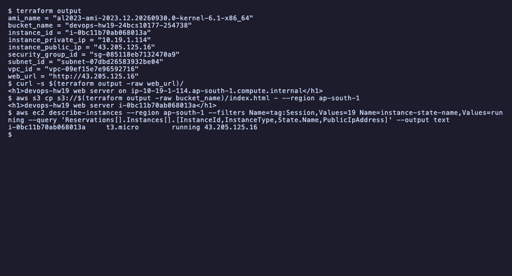
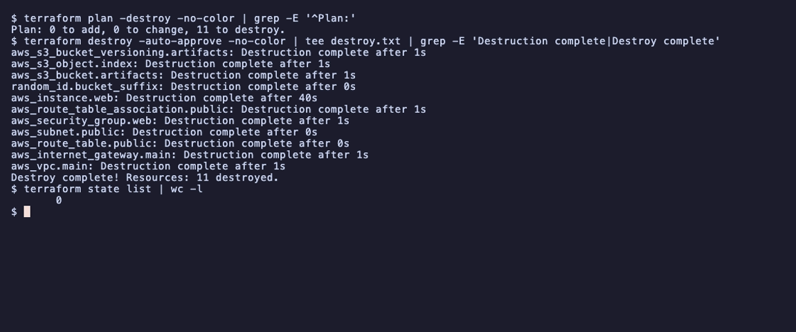

# Session 19: Cloud and Terraform in action

- Name: Aditya Singhi
- Enrollment number: 24BCS10177

Run on my AWS account in `ap-south-1` with Terraform 1.16.4, `hashicorp/aws`
v6.67.0 and `hashicorp/random` v3.9.1. I applied, checked and destroyed
everything in one sitting, and the EC2 instance existed for about 14 minutes.
State, plan files and `.terraform/` are ignored by `.gitignore`.

## Architecture


A public subnet routes `0.0.0.0/0` to the internet gateway. The instance runs
nginx behind a security group that allows HTTP only, with no SSH. The S3
bucket is regional, so it sits outside the VPC.

## Task 1: Terraform providers

```hcl
provider "aws" {
  region = var.aws_region

  default_tags {
    tags = {
      Project = "devops-homework"
      Session = "19"
      Owner   = "24bcs10177"
    }
  }
}
```

```bash
NETRC=/dev/null terraform init
```

```
Initializing the backend...

Initializing provider plugins...
...
- Installed hashicorp/aws v6.67.0 (signed by HashiCorp)
...
- Installed hashicorp/random v3.9.1 (signed by HashiCorp)
...
Terraform has been successfully initialized!
```

`aws` calls the AWS APIs using my CLI login, so no keys are in the code.
`random` never leaves the laptop. It makes the 3-byte suffix that keeps the
bucket name globally unique. `default_tags` puts the same three tags on every
resource, which made the final clean-up check one filter on `Session=19`.

## Task 2: Variables

| Variable | Default | Used for |
|---|---|---|
| `aws_region` | `ap-south-1` | provider region and AZ name |
| `project` | `devops-hw19` | prefix for every name |
| `vpc_cidr` | `10.19.0.0/16` | VPC |
| `public_subnet_cidr` | `10.19.1.0/24` | subnet |
| `instance_type` | `t3.micro` | EC2 |

`aws_region` has a validation block that only accepts `ap-south-1`.

Overriding a variable shows what a change would do before any apply:

```bash
terraform plan -var public_subnet_cidr=10.19.2.0/24
```

```
  # aws_instance.web must be replaced
      ~ subnet_id                            = "subnet-07dbd26583932be04" -> (known after apply) # forces replacement
  # aws_route_table_association.public must be replaced
      ~ subnet_id      = "subnet-07dbd26583932be04" -> (known after apply) # forces replacement
  # aws_s3_object.index will be updated in-place
  # aws_subnet.public must be replaced
      ~ cidr_block                                     = "10.19.1.0/24" -> "10.19.2.0/24" # forces replacement
Plan: 3 to add, 1 to change, 3 to destroy.
```

A subnet CIDR cannot change in place, so the subnet is recreated with a new
ID and everything holding the old ID follows, including the server.

## Task 3: Resources

`main.tf` creates 11 resources and reads one data source:

| Resource | What it is |
|---|---|
| `aws_vpc.main` | `devops-hw19-vpc`, 10.19.0.0/16 |
| `aws_subnet.public` | 10.19.1.0/24, public IPs on launch |
| `aws_internet_gateway.main` | route to the internet |
| `aws_route_table.public` + `_association` | `0.0.0.0/0` to the IGW, attached to the subnet |
| `aws_security_group.web` | tcp 80 in, all out |
| `aws_instance.web` | t3.micro, IMDSv2 required, `user_data` installs nginx |
| `random_id.bucket_suffix` | 3 random bytes |
| `aws_s3_bucket.artifacts` | `devops-hw19-24bcs10177-<hex>`, `force_destroy` |
| `aws_s3_bucket_versioning.artifacts` | versioning on |
| `aws_s3_object.index` | `index.html` containing the instance ID |
| `data.aws_ami.al2023` | newest Amazon Linux 2023 AMI owned by `amazon` |

## Task 4: Outputs

```bash
terraform output
```

```
ami_name = "al2023-ami-2023.12.20260930.0-kernel-6.1-x86_64"
bucket_name = "devops-hw19-24bcs10177-254738"
instance_id = "i-0bc11b70ab068013a"
instance_private_ip = "10.19.1.114"
instance_public_ip = "43.205.125.16"
security_group_id = "sg-085118eb7132470a9"
subnet_id = "subnet-07dbd26583932be04"
vpc_id = "vpc-09ef15e7e96592716"
web_url = "http://43.205.125.16"
```

`terraform output -raw` prints a value without quotes, which Task 6 uses.

## Task 5: Dependencies

Most dependencies are implicit: `vpc_id = aws_vpc.main.id` tells Terraform the
VPC comes first. There is one explicit `depends_on`:

```hcl
resource "aws_instance" "web" {
  ...
  # The instance only references the subnet, so Terraform cannot see that
  # user_data needs the internet route to exist before boot.
  depends_on = [aws_route_table_association.public]
}
```

Without it the instance could boot before the route exists, and `dnf install
nginx` would fail.

```bash
terraform graph | grep -- '->'
```

```
  "aws_instance.web" -> "data.aws_ami.al2023";
  "aws_instance.web" -> "aws_route_table_association.public";
  "aws_instance.web" -> "aws_security_group.web";
  "aws_internet_gateway.main" -> "aws_vpc.main";
  "aws_route_table.public" -> "aws_internet_gateway.main";
  "aws_route_table_association.public" -> "aws_route_table.public";
  "aws_route_table_association.public" -> "aws_subnet.public";
  "aws_s3_bucket.artifacts" -> "random_id.bucket_suffix";
  "aws_s3_bucket_versioning.artifacts" -> "aws_s3_bucket.artifacts";
  "aws_s3_object.index" -> "aws_instance.web";
  "aws_s3_object.index" -> "aws_s3_bucket.artifacts";
  "aws_security_group.web" -> "aws_vpc.main";
  "aws_subnet.public" -> "aws_vpc.main";
```

The same 13 edges, drawn in creation order:


There is no instance to subnet edge, although the instance references the
subnet. Terraform drops edges it can already reach another way, here through
the route table association.

## Task 6: AWS infrastructure

```bash
curl -s $(terraform output -raw web_url)/
aws s3 cp s3://$(terraform output -raw bucket_name)/index.html - --region ap-south-1
aws ec2 describe-instances --region ap-south-1 --filters Name=tag:Session,Values=19 Name=instance-state-name,Values=running --query 'Reservations[].Instances[].[InstanceId,InstanceType,State.Name,PublicIpAddress]' --output text
```

```
<h1>devops-hw19 web server on ip-10-19-1-114.ap-south-1.compute.internal</h1>
<h1>devops-hw19 web server i-0bc11b70ab068013a</h1>
i-0bc11b70ab068013a	t3.micro	running	43.205.125.16
```



The first line is nginx answering on the instance's public IP, with the
hostname that `user_data` wrote. The second is the S3 object, which has the
instance ID in it.

## Task 7: Terraform state

```bash
terraform state list
terraform state show aws_instance.web | grep -E '^    (ami|id|instance_state|instance_type|private_ip|public_ip|subnet_id) '
```

```
data.aws_ami.al2023
aws_instance.web
aws_internet_gateway.main
aws_route_table.public
aws_route_table_association.public
aws_s3_bucket.artifacts
aws_s3_bucket_versioning.artifacts
aws_s3_object.index
aws_security_group.web
aws_subnet.public
aws_vpc.main
random_id.bucket_suffix
    ami                                  = "ami-03054015e26069645"
    id                                   = "i-0bc11b70ab068013a"
    instance_state                       = "running"
    instance_type                        = "t3.micro"
    private_ip                           = "10.19.1.114"
    public_ip                            = "43.205.125.16"
    subnet_id                            = "subnet-07dbd26583932be04"
```


Twelve entries, because the data source is cached in state too. The full
`state show` includes `user_data` in plain text, so a secret in that script
would land in `terraform.tfstate`. That is why state never goes into Git.

## Task 8: terraform plan

```bash
terraform plan -out=hw19.tfplan
```

```
data.aws_ami.al2023: Reading...
data.aws_ami.al2023: Read complete after 1s [id=ami-03054015e26069645]
...
  # aws_vpc.main will be created
  + resource "aws_vpc" "main" {
...
      + cidr_block                           = "10.19.0.0/16"
...
      + tags_all                             = {
          + "Name"    = "devops-hw19-vpc"
          + "Owner"   = "24bcs10177"
          + "Project" = "devops-homework"
          + "Session" = "19"
        }
    }
...
Plan: 11 to add, 0 to change, 0 to destroy.
...
Saved the plan to: hw19.tfplan
```

`tags_all` is my `Name` tag merged with `default_tags`. Applying the saved
file runs exactly the reviewed plan.

## Task 9: terraform apply

```bash
terraform apply hw19.tfplan
```

```
random_id.bucket_suffix: Creating...
random_id.bucket_suffix: Creation complete after 0s [id=JUc4]
...
aws_vpc.main: Creation complete after 2s [id=vpc-09ef15e7e96592716]
...
aws_s3_bucket.artifacts: Creation complete after 10s [id=devops-hw19-24bcs10177-254738]
...
aws_subnet.public: Creation complete after 11s [id=subnet-07dbd26583932be04]
...
aws_instance.web: Creation complete after 12s [id=i-0bc11b70ab068013a]
...
aws_s3_object.index: Creation complete after 0s [id=devops-hw19-24bcs10177-254738/index.html]

Apply complete! Resources: 11 added, 0 changed, 0 destroyed.
```


About 25 seconds in total, in dependency order, with the S3 object last.
"Created" for the instance only means `running`, not that nginx is up yet.

## Task 10: terraform destroy

```bash
terraform plan -destroy | grep -E '^Plan:'
terraform destroy -auto-approve
terraform state list | wc -l
```

```
Plan: 0 to add, 0 to change, 11 to destroy.
...
aws_s3_object.index: Destruction complete after 1s
...
aws_instance.web: Destruction complete after 40s
...
aws_security_group.web: Destruction complete after 1s
aws_subnet.public: Destruction complete after 0s
...
aws_vpc.main: Destruction complete after 1s
Destroy complete! Resources: 11 destroyed.
       0
```



Destroy walks the graph backwards. The instance took 40 seconds to terminate,
and the security group and subnet waited for its network interface to go.

## Terraform commands used

```bash
NETRC=/dev/null terraform init
terraform fmt -check -diff
terraform validate
terraform plan -out=hw19.tfplan
terraform apply hw19.tfplan
terraform output
terraform state list
terraform state show aws_instance.web
terraform graph
terraform plan -var public_subnet_cidr=10.19.2.0/24
terraform plan -destroy
terraform destroy -auto-approve
```

## Notes

- `terraform init` failed here because Terraform's parser rejects a `default-header` line in my `~/.netrc`. `NETRC=/dev/null` works around it.
- The instructor's `08-mini-project/main.tf` fails `terraform fmt -check` because of one extra space before `=` in `gateway_id`, but passes `validate`. CI needs both checks.
- The instance's console log (`aws ec2 get-console-output`) showed `user_data` starting 8.7 seconds after boot and `dnf install nginx` taking about 23 seconds, so the page was live 39 seconds after launch.
- After destroy, the Resource Groups tagging API still listed the terminated instance and its root volume for several minutes, even though EC2 said the volume no longer existed. Clean-up checks should ask each service directly.
