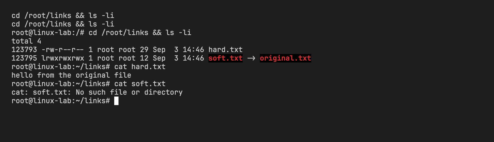
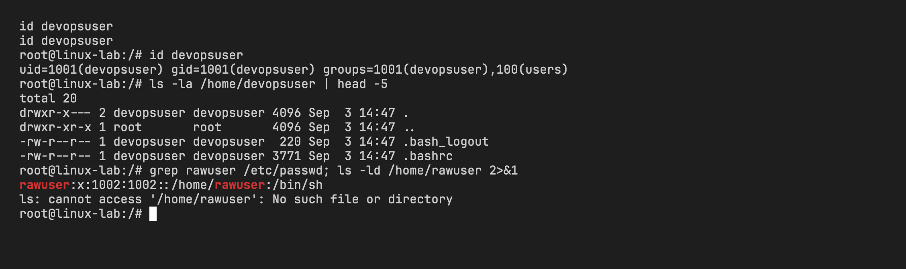
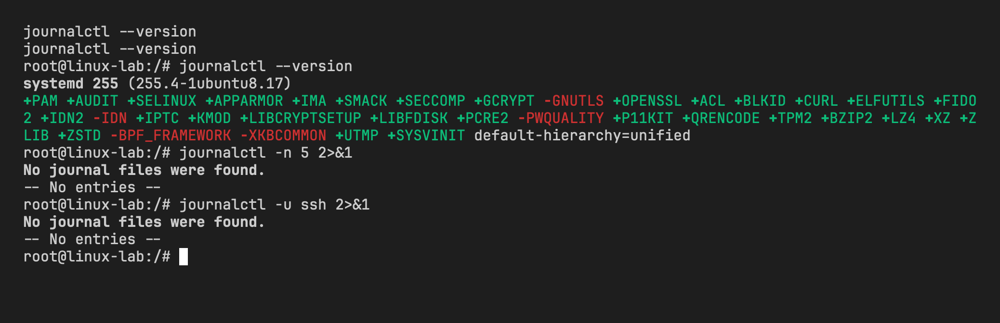
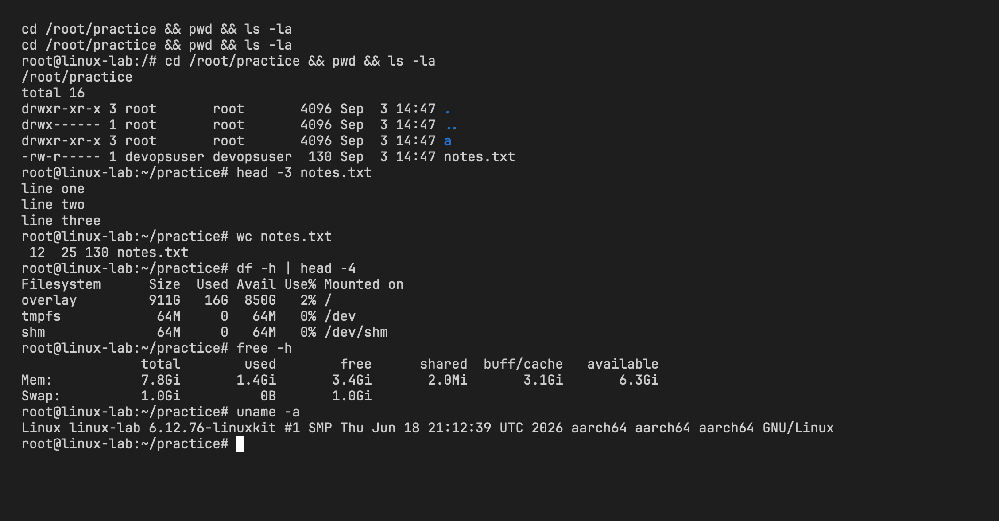

# Linux Fundamentals Homework

- Name: Aditya Singhi
- Enrollment number: 24BCS10177

## Setup

My laptop runs macOS, so commands like `adduser`, `journalctl` and `free` are either missing or behave differently. To get a real Linux environment I ran everything inside an Ubuntu 24.04 container.

```bash
docker run -d --name linuxlab --hostname linux-lab ubuntu:24.04 sleep infinity
docker exec linuxlab bash -c "apt-get update -qq && DEBIAN_FRONTEND=noninteractive apt-get install -y -qq systemd passwd adduser tree procps >/dev/null"
```

The base image is minimal, so I installed `systemd` (for `journalctl`), `passwd` and `adduser` (user tools), `tree` and `procps` (for `ps`, `top` and `free`). Every command below was run with `docker exec linuxlab bash -c '...'` and the output is pasted as it came back.

## Task 1: soft link and hard link

A hard link is a second name for the same inode. The inode is the actual record on disk that holds the file's data and metadata. When I create a hard link, the link count on that inode goes up by one. Both names are equal, neither is "the real one". If I delete one name, the data stays as long as at least one other name points to the inode. Hard links cannot cross filesystems because inode numbers are only unique inside one filesystem, and on Linux you cannot hard link a directory.

A soft link (symbolic link) is a small separate file with its own inode. Its content is just a path string. When I open it the kernel follows the path. If the target file is deleted the soft link stays behind, still pointing at a path that no longer exists. That is a dangling link. Soft links can point across filesystems and can point at directories, which is why they are used far more often in practice.

### Practice

Create a file, then a hard link and a soft link to it.

```bash
$ mkdir -p /root/links && cd /root/links
$ echo "hello from the original file" > original.txt
$ ln original.txt hard.txt
$ ln -s original.txt soft.txt
$ ls -li
total 8
123793 -rw-r--r-- 2 root root 29 Sep  3 14:46 hard.txt
123793 -rw-r--r-- 2 root root 29 Sep  3 14:46 original.txt
123795 lrwxrwxrwx 1 root root 12 Sep  3 14:46 soft.txt -> original.txt
```

The first column is the inode number. `hard.txt` and `original.txt` share inode 123793 and the link count (third column) is 2. `soft.txt` has its own inode, 123795, its type is `l`, and its size is 12 bytes, which is the length of the string `original.txt`.

Both links read the same content.

```bash
$ cat hard.txt
hello from the original file
$ cat soft.txt
hello from the original file
```

Now delete the original.

```bash
$ rm original.txt
$ ls -li
total 4
123793 -rw-r--r-- 1 root root 29 Sep  3 14:46 hard.txt
123795 lrwxrwxrwx 1 root root 12 Sep  3 14:46 soft.txt -> original.txt
$ cat hard.txt
hello from the original file
$ cat soft.txt
cat: soft.txt: No such file or directory
```

The link count on inode 123793 dropped from 2 to 1 and `hard.txt` still reads fine. `ls -l` still shows `soft.txt -> original.txt`, but that target is gone, so `cat` fails. Nothing in the soft link itself changed, the path it stores just stopped resolving.



### Interview answer

A hard link is another directory entry for the same inode, so both names share the same data and the link count goes up. Deleting one name does not delete the data until the count reaches zero. A soft link is a separate small file that stores a path, so it can cross filesystems and point at directories, but it breaks if the target is removed. Hard links cannot cross filesystems and cannot point at directories. In day to day work I would reach for soft links almost always, and use hard links only when I want the same data to survive under two names on one filesystem.

## Task 2: adduser vs useradd

`useradd` is the low-level binary from the shadow utilities package. It does exactly what you tell it and nothing more. By default it does not create a home directory, does not copy the skeleton files, and on Ubuntu it gives the user `/bin/sh` as the shell. You have to pass `-m`, `-s /bin/bash` and so on yourself.

`adduser` is a Perl script that Debian and Ubuntu ship on top of `useradd`. It picks a free UID from the normal user range, creates a matching group, creates the home directory, copies the files from `/etc/skel`, sets `/bin/bash` as the shell, adds the user to the `users` group and then asks for a password and the full name interactively. On Ubuntu it is the recommended command because it applies the distribution defaults and you cannot forget a flag. `useradd` is what you use in scripts or on distributions that do not have `adduser`, like Fedora or Arch.

### Practice

I used `--disabled-password` and `--gecos ""` so the script does not stop to ask questions.

```bash
$ adduser --disabled-password --gecos "" devopsuser
info: Adding user `devopsuser' ...
info: Selecting UID/GID from range 1000 to 59999 ...
info: Adding new group `devopsuser' (1001) ...
info: Adding new user `devopsuser' (1001) with group `devopsuser (1001)' ...
info: Creating home directory `/home/devopsuser' ...
info: Copying files from `/etc/skel' ...
info: Adding new user `devopsuser' to supplemental / extra groups `users' ...
info: Adding user `devopsuser' to group `users' ...
```

The output already lists every step the script took for me. Now check the result.

```bash
$ id devopsuser
uid=1001(devopsuser) gid=1001(devopsuser) groups=1001(devopsuser),100(users)
$ grep devopsuser /etc/passwd
devopsuser:x:1001:1001:,,,:/home/devopsuser:/bin/bash
$ ls -la /home/devopsuser
total 20
drwxr-x--- 2 devopsuser devopsuser 4096 Sep  3 14:47 .
drwxr-xr-x 1 root       root       4096 Sep  3 14:47 ..
-rw-r--r-- 1 devopsuser devopsuser  220 Sep  3 14:47 .bash_logout
-rw-r--r-- 1 devopsuser devopsuser  807 Sep  3 14:47 .bashrc
-rw-r--r-- 1 devopsuser devopsuser 3771 Sep  3 14:47 .profile
```

The user got UID 1001 (the image already has an `ubuntu` user at 1000), a home directory owned by the user, the three dotfiles from `/etc/skel`, and `/bin/bash` as the login shell.

Now the same thing with plain `useradd` and no flags.

```bash
$ useradd rawuser
$ grep rawuser /etc/passwd
rawuser:x:1002:1002::/home/rawuser:/bin/sh
$ ls /home
devopsuser
ubuntu
$ ls -ld /home/rawuser
ls: cannot access '/home/rawuser': No such file or directory
```

`/etc/passwd` says the home is `/home/rawuser`, but the directory was never created. The shell is `/bin/sh`, not bash, and the comment field is empty. To get what `adduser` gave me I would have had to run `useradd -m -s /bin/bash -G users rawuser` and then `passwd rawuser`.



## Task 3: journalctl

`journalctl` reads the systemd journal. On a systemd based system every service's stdout and stderr, kernel messages and login events go into one binary log that `systemd-journald` keeps under `/run/log/journal` (volatile) or `/var/log/journal` (persistent). `journalctl` is the only sane way to read it, and it lets you filter instead of grepping through `/var/log/syslog`.

The flags I use most:

| Flag | Meaning |
|---|---|
| `-u <unit>` | Only messages from one service, for example `-u ssh` or `-u nginx` |
| `-f` | Follow, keep printing new lines like `tail -f` |
| `-b` | Only messages from the current boot. `-b -1` is the previous boot |
| `-p <prio>` | Filter by priority. `err` shows err, crit, alert and emerg. Others are `warning`, `info`, `debug` |
| `--since` / `--until` | Time window. Accepts `"1 hour ago"`, `today`, `"2026-09-03 10:00"` |
| `-n <N>` | Show the last N lines instead of the whole journal |
| `-k` | Kernel messages only, same as `dmesg` |

### Practice

A container does not boot with systemd. PID 1 here is `sleep`, so `systemd-journald` never started and there is no journal to read. The binary is installed though, so the commands run and tell me exactly that.

```bash
$ journalctl --version
systemd 255 (255.4-1ubuntu8.17)
+PAM +AUDIT +SELINUX +APPARMOR +IMA +SMACK +SECCOMP +GCRYPT -GNUTLS +OPENSSL +ACL +BLKID +CURL +ELFUTILS +FIDO2 +IDN2 -IDN +IPTC +KMOD +LIBCRYPTSETUP +LIBFDISK +PCRE2 -PWQUALITY +P11KIT +QRENCODE +TPM2 +BZIP2 +LZ4 +XZ +ZLIB +ZSTD -BPF_FRAMEWORK -XKBCOMMON +UTMP +SYSVINIT default-hierarchy=unified
$ journalctl -n 5
No journal files were found.
-- No entries --
$ journalctl -u ssh
No journal files were found.
-- No entries --
$ ps -p 1 -o pid,comm
  PID COMMAND
    1 sleep
$ ls /run/log/journal /var/log/journal
ls: cannot access '/run/log/journal': No such file or directory
/var/log/journal:
```

"No journal files were found" is the correct answer here, not an error. The journal directory exists but is empty because journald never ran to write into it. On a real server or VM where systemd is PID 1, the same commands print log lines.



### Commands for a real Ubuntu server

These are what I would type on an actual machine running ssh and nginx.

```bash
journalctl -u ssh --since "1 hour ago"    # ssh logins, failures and restarts from the last hour
journalctl -u ssh -n 50                    # the last 50 lines from the ssh service
journalctl -u nginx -f                     # live stream of nginx service messages while testing
journalctl -u nginx -b                     # everything nginx logged since this boot
journalctl -p err -b                       # every error and worse from any service since boot
journalctl -k -n 20                        # the last 20 kernel messages, useful after a driver or OOM issue
journalctl --since today --until "12:00"   # everything from midnight until noon
```

## Task 4: Linux command cheat sheet

| Command | Purpose | Example |
|---|---|---|
| `pwd` | Print the current directory | `pwd` |
| `ls` | List files. `-l` long, `-a` hidden, `-i` inodes | `ls -la /etc` |
| `cd` | Change directory. `cd -` goes back, `cd` alone goes home | `cd /var/log` |
| `mkdir` | Make a directory. `-p` creates parents and does not complain if it exists | `mkdir -p app/src/lib` |
| `touch` | Create an empty file or update its timestamp | `touch notes.txt` |
| `cp` | Copy. `-r` for directories | `cp -r src backup/` |
| `mv` | Move or rename | `mv old.txt new.txt` |
| `rm` | Delete. `-r` recursive, `-f` no prompt. No undo | `rm -rf build/` |
| `cat` | Print a whole file | `cat /etc/hostname` |
| `head` / `tail` | First or last lines. `tail -f` follows | `tail -f /var/log/syslog` |
| `grep` | Search text. `-n` line numbers, `-r` recursive, `-i` ignore case | `grep -rn "TODO" src/` |
| `find` | Search for files by name, type, size or age | `find / -name "*.log" -size +10M` |
| `wc` | Count lines, words and bytes | `wc -l access.log` |
| `chmod` | Change permissions | `chmod 640 secret.txt` |
| `chown` | Change owner and group | `chown www-data:www-data /var/www` |
| `ps` | List processes. `aux` shows all with owner and usage | `ps aux \| grep nginx` |
| `top` | Live process view. `-b -n 1` prints once for scripts | `top -b -n 1 \| head` |
| `df` | Disk space per filesystem | `df -h` |
| `du` | Disk usage of a path | `du -sh /var/log` |
| `free` | Memory and swap usage | `free -h` |
| `uname` | Kernel and machine info | `uname -a` |
| `whoami` / `id` | Current user, and its UID, GID and groups | `id devopsuser` |
| `history` | Previous commands of this shell | `history \| tail` |
| `echo $PATH` | Directories the shell searches for commands | `echo $PATH` |
| `which` | Where a command lives in PATH | `which python3` |
| `tar` | Archive. `-c` create, `-x` extract, `-t` list, `-z` gzip, `-f` file | `tar -czf site.tar.gz site/` |
| `man` / `whatis` | Manual page, or its one line summary | `man ls` |
| `ln` | Hard link, or soft link with `-s` | `ln -s /opt/app/current /usr/local/bin/app` |
| `adduser` | Create a user with Ubuntu defaults | `adduser deploy` |
| `journalctl` | Read the systemd journal | `journalctl -u nginx -f` |
| `sudo` | Run a command as root | `sudo systemctl restart nginx` |
| `systemctl` | Start, stop, enable and inspect services | `systemctl status ssh` |

### Practice

Everything below ran as root inside the container. Long outputs are cut with `head`.

```bash
$ cd /root && pwd
/root

$ ls -la
total 24
drwx------ 1 root root 4096 Sep  3 14:46 .
drwxr-xr-x 1 root root 4096 Sep  3 14:46 ..
-rw-r--r-- 1 root root 3106 Apr 22  2024 .bashrc
-rw-r--r-- 1 root root  161 Apr 22  2024 .profile
drwx------ 2 root root 4096 Sep  3 14:46 .ssh
drwxr-xr-x 2 root root 4096 Sep  3 14:46 links

$ cd /tmp && pwd && cd /root/links && pwd
/tmp
/root/links

$ mkdir -p /root/practice/a/b/c && tree /root/practice
/root/practice
`-- a
    `-- b
        `-- c

4 directories, 0 files

$ cd /root/practice && touch notes.txt && ls -l notes.txt
-rw-r--r-- 1 root root 0 Sep  3 14:47 notes.txt
```

I filled `notes.txt` with twelve lines, one of them containing the word `error`, then practised the file commands on it.

```bash
$ cp notes.txt copy.txt && ls -l
total 12
drwxr-xr-x 3 root root 4096 Sep  3 14:47 a
-rw-r--r-- 1 root root  130 Sep  3 14:47 copy.txt
-rw-r--r-- 1 root root  130 Sep  3 14:47 notes.txt

$ mv copy.txt renamed.txt && ls
a
notes.txt
renamed.txt

$ rm renamed.txt && ls
a
notes.txt

$ cat notes.txt | head -4
line one
line two
line three
error: disk full

$ head -3 notes.txt
line one
line two
line three

$ tail -3 notes.txt
line ten
line eleven
line twelve

$ grep -n error notes.txt
4:error: disk full

$ find /root/practice -name "*.txt"
/root/practice/notes.txt

$ wc notes.txt
 12  25 130 notes.txt
```

`wc` prints lines, words and bytes in that order.

```bash
$ chmod 640 notes.txt && ls -l notes.txt
-rw-r----- 1 root root 130 Sep  3 14:47 notes.txt

$ chown devopsuser:devopsuser notes.txt && ls -l notes.txt
-rw-r----- 1 devopsuser devopsuser 130 Sep  3 14:47 notes.txt
```

Processes, disk and memory.

```bash
$ ps aux | head -5
USER       PID %CPU %MEM    VSZ   RSS TTY      STAT START   TIME COMMAND
root         1  0.0  0.0   2272  1224 ?        Ss   14:45   0:00 sleep infinity
root      3293  0.0  0.0   4036  3024 ?        Ss   14:47   0:00 bash -c ps aux | head -5
root      3299  0.0  0.0   7632  3648 ?        R    14:47   0:00 ps aux
root      3300  0.0  0.0   2284  1236 ?        S    14:47   0:00 head -5

$ top -b -n 1 | head -9
top - 14:47:42 up  1:49,  0 user,  load average: 1.56, 1.53, 1.47
Tasks:   4 total,   1 running,   3 sleeping,   0 stopped,   0 zombie
%Cpu(s):  1.0 us,  1.0 sy,  0.0 ni, 98.1 id,  0.0 wa,  0.0 hi,  0.0 si,  0.0 st
MiB Mem :   7936.0 total,   3555.4 free,   1398.0 used,   3183.1 buff/cache
MiB Swap:   1024.0 total,   1024.0 free,      0.0 used.   6538.0 avail Mem

  PID USER      PR  NI    VIRT    RES    SHR S  %CPU  %MEM     TIME+ COMMAND
    1 root      20   0    2272   1224   1140 S   0.0   0.0   0:00.01 sleep
 3385 root      20   0    4036   3020   2784 S   0.0   0.0   0:00.01 bash

$ df -h | head -4
Filesystem      Size  Used Avail Use% Mounted on
overlay         911G   16G  850G   2% /
tmpfs            64M     0   64M   0% /dev
shm              64M     0   64M   0% /dev/shm

$ du -sh /root/practice /usr/bin
20K	/root/practice
39M	/usr/bin

$ free -h
               total        used        free      shared  buff/cache   available
Mem:           7.8Gi       1.4Gi       3.5Gi       1.9Mi       3.1Gi       6.4Gi
Swap:          1.0Gi          0B       1.0Gi
```

The 7.8 GiB of memory and the `overlay` root filesystem belong to the Docker VM, not to my Mac. The container sees the VM's kernel.

```bash
$ uname -a
Linux linux-lab 6.12.76-linuxkit #1 SMP Thu Jun 18 21:12:39 UTC 2026 aarch64 aarch64 aarch64 GNU/Linux

$ whoami
root

$ id
uid=0(root) gid=0(root) groups=0(root)

$ history | tail -3
```

`history` printed nothing. Each `docker exec` starts a fresh non interactive bash, and bash only records history in interactive shells, so there is nothing to show. On a normal terminal it would list the last three commands.

```bash
$ echo $PATH
/usr/local/sbin:/usr/local/bin:/usr/sbin:/usr/bin:/sbin:/bin

$ which ls bash journalctl
/usr/bin/ls
/usr/bin/bash
/usr/bin/journalctl

$ cd /root && tar -czf practice.tar.gz practice && ls -l practice.tar.gz
-rw-r--r-- 1 root root 283 Sep  3 14:47 practice.tar.gz

$ tar -tzf practice.tar.gz
practice/
practice/notes.txt
practice/a/
practice/a/b/
practice/a/b/c/

$ whatis ls
bash: line 1: whatis: command not found

$ man -f ls
This system has been minimized by removing packages and content that are
not required on a system that users do not log into.

To restore this content, including manpages, you can run the 'unminimize'
command. You will still need to ensure the 'man-db' package is installed.
```

The Ubuntu Docker image strips out man pages to stay small, so `whatis` and `man -f` are not available. On a desktop or server install `whatis ls` prints `ls (1) - list directory contents`, and `man -f ls` is the same thing.


