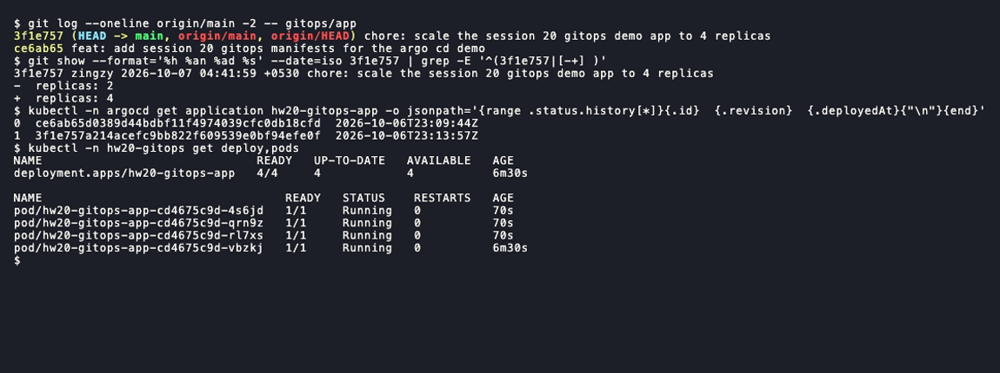

# Session 20: Monitoring, observability and GitOps

- Name: Aditya Singhi
- Enrollment number: 24BCS10177

Task 1 and the traces part of Task 2 run on Docker Compose: Prometheus v3.5.0
and Grafana 12.1.1 (the same versions as `03-prometheus` and `04-grafana`),
node-exporter v1.9.1, Jaeger 2.10.0 and a small Python app I wrote. Task 3 and
the Kubernetes part of Task 2 run on a single-node kind cluster named `hw20`
(kind v0.33.0, Kubernetes v1.37.0) with Argo CD v3.5.4 from the `stable`
manifest the instructor uses. Docker Desktop has only 3.8 GiB of memory, so I
ran the two halves one after the other and set memory limits on every
container.

I did not run the instructor's compose files as they are. They publish 9090
and 3000 and only scrape Prometheus itself, which gives no CPU, memory or app
health to look at. My compose file is the same Prometheus and Grafana with more
targets and different host ports.

Files in this folder:

```
monitoring/docker-compose.yml          Prometheus, Grafana, node-exporter, Jaeger, demo app, load generator
monitoring/prometheus.yml              scrape config, three jobs
monitoring/alert-rules.yml             four alert rules
monitoring/app/app.py                  demo app: /metrics, /health, /work, traces to Jaeger
monitoring/grafana/                    provisioned data source and dashboard JSON
gitops/app/deployment.yaml             what Argo CD syncs from GitHub
gitops/app/service.yaml
gitops/argocd-application.yaml         applied once by hand, outside the synced path
```

## Task 1: Monitoring

### Start the stack

```bash
cd monitoring
docker compose up -d
```

```
 Container hw20-jaeger Started
 Container hw20-demo-app Started
 Container hw20-prometheus Started
Error response from daemon: path / is mounted on / but it is not a shared or slave mount
```

node-exporter failed. I had copied the volume line from the node-exporter docs,
`/:/host:ro,rslave`. Docker Desktop runs containers inside a small Linux VM and
its root mount is not shared, so `rslave` propagation is refused. Dropping
`rslave` fixed it. The only cost is that filesystems mounted on the host after
the container starts would not show up, which does not matter here.

```bash
docker compose up -d
docker compose ps
```

```
NAME                 IMAGE                         STATUS
hw20-demo-app        python:3.12-alpine            Up 8 minutes
hw20-grafana         grafana/grafana:12.1.1        Up 8 minutes
hw20-jaeger          jaegertracing/jaeger:2.10.0   Up 8 minutes
hw20-loadgen         python:3.12-alpine            Up 8 minutes
hw20-node-exporter   prom/node-exporter:v1.9.1     Up 8 minutes
hw20-prometheus      prom/prometheus:v3.5.0        Up 8 minutes
```

The whole stack used about 190 MiB (`docker stats`): Grafana 103 MiB,
Prometheus 30 MiB, the app 28 MiB, Jaeger 14 MiB, node-exporter 13 MiB.

The demo app is one Python file with no dependencies, so it runs on the stock
`python:3.12-alpine` image with the folder mounted in. No image build needed.
`loadgen` calls `/work` twice a second so the graphs have traffic.

### Prometheus scrapes three real targets

```bash
curl -s localhost:18200/api/v1/targets   # piped through a small JSON printer
```

```
demo-app up
node up
prometheus up
```

```
{'instance': 'demo-app:8000', 'job': 'demo-app'} 1.0
{'instance': 'prometheus:9090', 'job': 'prometheus'} 1.0
{'instance': 'node-exporter:9100', 'job': 'node'} 1.0
```

The second block is the PromQL query `up`. `1` means the last scrape worked.
Targets use compose service names (`demo-app:8000`), the same idea as
`http://prometheus:9090` in `04-grafana`.

### The app exposes metrics and a health endpoint

```bash
curl -s localhost:18202/metrics
curl -s localhost:18202/health
```

```
# HELP demo_http_requests_total HTTP requests handled, by path and status code.
# TYPE demo_http_requests_total counter
demo_http_requests_total{path="/health",code="200"} 1
demo_http_requests_total{path="/work",code="200"} 44
# HELP demo_request_duration_seconds Time spent handling /work requests.
# TYPE demo_request_duration_seconds summary
demo_request_duration_seconds_sum 9.894813776016235
demo_request_duration_seconds_count 44
# HELP demo_app_healthy 1 when /health returns 200, 0 when it returns 503.
# TYPE demo_app_healthy gauge
demo_app_healthy 1
# HELP process_cpu_seconds_total User and system CPU time used by the app.
# TYPE process_cpu_seconds_total counter
process_cpu_seconds_total 1.291338
# HELP process_resident_memory_bytes Resident memory of the app.
# TYPE process_resident_memory_bytes gauge
process_resident_memory_bytes 24735744
# HELP process_start_time_seconds Unix time the app started.
# TYPE process_start_time_seconds gauge
process_start_time_seconds 1791327302.2446775
```

```
{"status":"ok"}
```

This is the whole Prometheus text format: a `HELP` line, a `TYPE` line, then
`name{labels} value`. A counter only goes up, so you graph its `rate()`. A
gauge goes up and down. The `process_*` names follow the convention the
official client libraries use, which is why the same PromQL works for any app.

`/health` and `demo_app_healthy` report the same flag in two forms. `/health`
is for anything that asks "are you OK right now" (a load balancer, a
Kubernetes probe, me with curl). The gauge is for Prometheus, which only reads
`/metrics` and never calls `/health` on its own. If I wanted Prometheus to
probe `/health` from outside, that is a separate tool, the blackbox exporter.

### CPU and memory utilization

```bash
# PromQL, run through the /api/v1/query endpoint
100 * (1 - avg(rate(node_cpu_seconds_total{mode="idle"}[30s])))
100 * (1 - node_memory_MemAvailable_bytes / node_memory_MemTotal_bytes)
node_memory_MemTotal_bytes / 1024^3
count(node_cpu_seconds_total{mode="idle"})
100 * rate(process_cpu_seconds_total{job="demo-app"}[30s])
process_resident_memory_bytes{job="demo-app"} / 1024^2
```

```
{} 13.54
{'instance': 'node-exporter:9100', 'job': 'node'} 22.34
{'instance': 'node-exporter:9100', 'job': 'node'} 3.827
{} 4.0
{'instance': 'demo-app:8000', 'job': 'demo-app'} 0.748
{'instance': 'demo-app:8000', 'job': 'demo-app'} 23.602
```

So the host was at 13.5% CPU and 22.3% memory, the app at 0.7% of one core
and 23.6 MiB.

The "host" is not my Mac. Total memory is 3.827 GiB and there are 4 CPUs,
which is the Docker Desktop VM, not the laptop. node-exporter in a container
sees whatever kernel it runs on. On Docker Desktop that is the VM, and it
includes every other container running on it.

There is no CPU percentage metric anywhere. CPU usage comes from a counter of
seconds spent in each mode, so "utilization" is one minus the rate of idle
time, averaged over cores.

To see the graph move, the app has a `/burn` endpoint that spins one core:

```bash
curl -s 'localhost:18202/burn?seconds=150'
# 45 seconds later
100 * (1 - avg(rate(node_cpu_seconds_total{mode="idle"}[30s])))
100 * rate(process_cpu_seconds_total{job="demo-app"}[30s])
docker stats --no-stream hw20-demo-app
```

```
{"burning_cpu_for": 150}
{} 58.45
{'instance': 'demo-app:8000', 'job': 'demo-app'} 97.007
hw20-demo-app 108.45% 17.29MiB / 64MiB
```

The app reports 97% of one core and `docker stats` agrees at 108% (its 100%
also means one core). The host went from 13.5% to 58.5%. One busy core out
of four should add about 25 points, and the extra came from the other
sessions sharing the VM. A host-level number is a mix of everything on the
machine, which is why per-process metrics matter.

Grafana loads the data source and dashboard from files in
`monitoring/grafana/provisioning`, so nothing is clicked by hand and the
dashboard comes back after `docker compose down`. Anonymous viewer access is
on so the page opens without a login. That is fine on localhost and wrong for
anything real.


This was taken during the alert test below. Health is red, one alert is
firing, the CPU burn shows as the plateau in both CPU panels, and memory stays
flat at 24 MiB. The time axis is in IST (UTC+5:30). The terminal output on
this page is in UTC.

### An alert that fires and resolves

`monitoring/alert-rules.yml` has four rules. The one I triggered:

```yaml
- alert: DemoAppUnhealthy
  expr: demo_app_healthy == 0
  for: 15s
```

`/admin/fail` makes `/health` return 503 and sets the gauge to 0.
`/admin/recover` puts it back. The script below prints the `/health` status
code and the rule state every 5 seconds:

```bash
curl -s localhost:18202/admin/fail
# poll /health and /api/v1/rules every 5s until firing
curl -s localhost:18202/admin/recover
# poll until inactive
```

```
23:01:50 before:  health=200  DemoAppUnhealthy state=inactive active_since=-
23:01:51 curl /admin/fail -> {"healthy":false}
23:01:52 health=503  DemoAppUnhealthy state=inactive active_since=-
23:01:57 health=503  DemoAppUnhealthy state=pending active_since=23:01:52
23:02:03 health=503  DemoAppUnhealthy state=pending active_since=23:01:52
23:02:09 health=503  DemoAppUnhealthy state=pending active_since=23:01:52
23:02:16 health=503  DemoAppUnhealthy state=firing active_since=23:01:52
23:02:16 curl /admin/recover -> {"healthy":true}
23:02:16 health=200  DemoAppUnhealthy state=firing active_since=23:01:52
23:02:22 health=200  DemoAppUnhealthy state=inactive active_since=-
```


From breaking the app to `firing` took 25 seconds. That is up to 5 s for the
next scrape, up to 5 s for the next rule evaluation, then the 15 s `for:`
window in `pending`. `for:` is there so one bad scrape does not wake anyone
up. Going back to `inactive` has no wait and took one evaluation.

There is no Alertmanager in this stack, so "firing" means the alert shows on
this page and in the `ALERTS` series, nothing more. Sending it to Slack or
email, grouping and silencing are Alertmanager's job.

### Logs

```bash
docker logs hw20-demo-app | grep -v 'INFO GET /work'
```

```
2026-10-06T22:55:02Z INFO demo-app listening on :8000
2026-10-06T22:55:48Z WARN burning one CPU core for 150s
2026-10-06T22:57:49Z WARN health switched to FAILING
2026-10-06T22:57:49Z ERROR health check failed, returning 503
2026-10-06T22:59:30Z INFO health switched to OK
2026-10-06T23:01:51Z WARN health switched to FAILING
2026-10-06T23:01:52Z ERROR health check failed, returning 503
2026-10-06T23:01:57Z ERROR health check failed, returning 503
2026-10-06T23:02:03Z ERROR health check failed, returning 503
2026-10-06T23:02:09Z ERROR health check failed, returning 503
2026-10-06T23:02:16Z ERROR health check failed, returning 503
2026-10-06T23:02:16Z INFO health switched to OK
```

```bash
docker logs --tail 3 hw20-demo-app
```

```
2026-10-06T23:02:29Z INFO GET /work 200 0.218s db=0.203s trace_id=7eafb01a9efde9a0ed0377cea1df8ab7
2026-10-06T23:02:30Z INFO GET /work 200 0.253s db=0.207s trace_id=7ca4a269ddf43484b01626b73fe82529
2026-10-06T23:02:31Z INFO GET /work 200 0.243s db=0.203s trace_id=b2eb2276b4fc1fce585146744c738cab
```

The 503 lines are one per poll of my script. Prometheus never called
`/health`, which matches what I said above. The first FAILING at 22:57:49 is
an earlier attempt where my polling script had a quoting bug and printed
nothing, so I recovered and ran the clean cycle shown above.

Each `/work` line carries a `trace_id`. That is the link from a log line to
the trace in Task 2.

## Task 2: Observability

Monitoring tells me something is wrong: the alert above. Observability is
having enough data to work out why, including for problems nobody wrote an
alert for. In practice that data is three kinds of signal, and I collected
all three from the same app.

### Metrics

Numbers sampled over time, with labels. Task 1 is all metrics:
`demo_http_requests_total{path="/work",code="200"}`, CPU seconds, resident
memory. They are cheap to store, because a counter that grows by a million
requests is still one number per scrape, so you can keep months of them and
alert on them. The limit is that they are aggregates. A latency average says
requests got slow, not which request or why.

### Logs

Timestamped text events, one per thing that happened. The log lines above
told me the exact second health flipped, which no metric does at that
precision. Logs cost more per event and are hard to graph, so they suit
"what happened at 23:01:51" better than "what is the trend".

### Traces

A trace follows one request through every step it takes. Each step is a span
with a start time and a duration, and child spans point at their parent. My
app builds two spans per `/work` request, the request itself and a fake
`SELECT orders` database call, and sends them to Jaeger as OTLP JSON over
HTTP. The trace id is the one from the log line.

```bash
curl -s localhost:18203/api/traces/91469dd1e2378df2d87ff80242d498c1   # printed with a short script
```

```
traceID 91469dd1e2378df2d87ff80242d498c1 spans 2 service demo-app
  GET /work      spanID=b37b0cb95ebfa5c2 start=+0.0ms duration=125.3ms root
  SELECT orders  spanID=6c156373b5c1bea3 start=+31.8ms duration=93.5ms child of b37b0cb95ebfa5c2
```

```
629 traces stored for demo-app
```


Of a 125 ms request, 93.5 ms was the database span. The metrics only had the
average latency. The trace says where the time went. With one service this
is a toy, but the same trace id passed in a `traceparent` header to the next
service is how a request gets followed across ten of them.

I sent the spans by hand instead of using the OpenTelemetry SDK so the app
stays one file with no `pip install`. In a real app the SDK creates the
spans, passes the ids along and batches exports.

### Why observability is needed

The alert only told me `/health` was 503. Working out why took the other
signals. The logs gave the exact time and the cause (`health switched to
FAILING`). For a slow request, the trace showed the database call taking 75%
of the time. Without logs and traces I would know something broke and then
guess. With many services and pods that come and go, guessing does not work:
the pod that misbehaved may already be gone, and its logs with it unless
something collected them.

### Common tools

| Signal | Collect | Store and query | Look at it |
|---|---|---|---|
| Metrics | node-exporter, cAdvisor, kube-state-metrics, client libraries | Prometheus (used here), Thanos, Mimir | Grafana (used here) |
| Logs | Fluent Bit, Promtail, Vector, `kubectl logs` | Loki, Elasticsearch / OpenSearch | Grafana, Kibana |
| Traces | OpenTelemetry SDK and Collector | Jaeger (used here), Tempo, Zipkin | Jaeger UI, Grafana |
| Alerts | Prometheus rules (used here) | Alertmanager | Slack, PagerDuty, email |

OpenTelemetry is the vendor-neutral standard for producing all three, and
OTLP, the format I posted to Jaeger, is its wire protocol. Hosted products
(Datadog, New Relic, Grafana Cloud) do the same jobs as a service.

### Kubernetes observability

These ran on the `hw20` cluster, using the instructor's `02-metrics-logs-traces`
demo unedited.

```bash
kubectl apply -f ../02-metrics-logs-traces/k8s-demo/
kubectl logs deployment/session20-demo | head -3
kubectl logs deployment/session20-demo --timestamps --tail 4
```

```
deployment.apps/session20-demo created
service/session20-demo created
```

```
Session 20 observability demo started
Request received
Health check OK
```

```
2026-10-06T23:08:50.980068839Z Request received
2026-10-06T23:08:50.980195798Z Health check OK
2026-10-06T23:09:00.981533594Z Request received
2026-10-06T23:09:00.981664094Z Health check OK
```

The app prints no timestamps. `--timestamps` adds the time the container
runtime received each line, which is the first thing to reach for when
logs come from an app like this.

The demo is a bit misleading, though. "Health check OK" is a string in an
`echo` loop, not a health check. The Service sends port 8080 to a pod that
listens on nothing:

```bash
kubectl get endpointslices -l kubernetes.io/service-name=session20-demo
kubectl run probe --rm -i --restart=Never --image=busybox:1.36 -- wget -T 3 -qO- http://session20-demo:8080
kubectl get pod -l app=session20-demo -o jsonpath='{.items[0].spec.containers[0].readinessProbe}{"|"}{.items[0].status.conditions[?(@.type=="Ready")].status}'
```

```
NAME                   ADDRESSTYPE   PORTS   ENDPOINTS     AGE
session20-demo-jkvb7   IPv4          8080    10.244.0.12   10s
wget: can't connect to remote host (10.96.93.199): Connection refused
pod "probe" deleted from default namespace
pod default/probe terminated (Error)
```

```
|True
```

The pod is `Ready` and listed as an endpoint while every connection is
refused. There is no readiness probe (empty before the `|`), so Kubernetes
counts the pod as ready the moment it starts. A log line saying "OK" is not
health. A probe that makes a real request is. The Deployment Argo CD runs in
Task 3 has both probes:

```
    Liveness:     http-get http://:80/ delay=0s timeout=1s period=10s successThreshold=1 failureThreshold=3
    Readiness:    http-get http://:80/ delay=0s timeout=1s period=5s successThreshold=1 failureThreshold=3
```

For CPU and memory per pod, the cluster needs metrics-server:

```bash
kubectl apply -f https://github.com/kubernetes-sigs/metrics-server/releases/latest/download/components.yaml
kubectl -n kube-system patch deploy metrics-server --type json \
  -p '[{"op":"add","path":"/spec/template/spec/containers/0/args/-","value":"--kubelet-insecure-tls"}]'
kubectl top nodes
kubectl top pods -A --sort-by=memory | head -12
kubectl get events -A --sort-by=.lastTimestamp | tail -8
```

```
NAME                 CPU(cores)   CPU(%)   MEMORY(bytes)   MEMORY(%)
hw20-control-plane   366m         9%       1419Mi          36%
```

```
NAMESPACE            NAME                                         CPU(cores)   MEMORY(bytes)
kube-system          kube-apiserver-hw20-control-plane            79m          403Mi
kube-system          kube-controller-manager-hw20-control-plane   19m          62Mi
kube-system          etcd-hw20-control-plane                      24m          43Mi
argocd               argocd-server-776b7cdd4d-kmb2r               2m           39Mi
kube-system          kube-scheduler-hw20-control-plane            11m          26Mi
argocd               argocd-application-controller-0              2m           23Mi
argocd               argocd-repo-server-d89c7967d-b7k6z           1m           22Mi
kube-system          metrics-server-84c99cb944-lpglb              3m           15Mi
kube-system          coredns-559f6c778d-9c48g                     6m           14Mi
kube-system          coredns-559f6c778d-98bhj                     4m           14Mi
kube-system          kube-proxy-24wzz                             3m           13Mi
```

```
kube-system          5s          Normal    Killing                   pod/metrics-server-6bcd67b6cf-dc4qh                      Stopping container metrics-server
kube-system          5s          Normal    ScalingReplicaSet         deployment/metrics-server                                Scaled down replica set metrics-server-6bcd67b6cf from 1 to 0
kube-system          5s          Warning   Unhealthy                 pod/metrics-server-6bcd67b6cf-dc4qh                      Readiness probe failed: HTTP probe failed with statuscode: 500
```

The patch is needed on kind. The kubelet's serving certificate is
self-signed and metrics-server refuses to scrape it. The events show that: `Readiness probe failed ... 500` on the
unpatched pod as the patched one replaced it. `kubectl get events` is where
Kubernetes reports what it did and what failed (scheduling, image pulls,
probe failures, OOM kills), and it keeps them for only one hour by default.

`kubectl top` is a live snapshot with no history. For history, the usual
setup is Prometheus scraping the kubelet's cAdvisor endpoint plus
kube-state-metrics (for example the kube-prometheus-stack Helm chart), with
logs shipped to Loki by Fluent Bit or Promtail so they survive pod deletion.
The API server is the biggest pod here at 403 MiB, more than all of Argo CD
together.

## Task 3: GitOps

### The ideas

GitOps means the desired state of the cluster lives in a Git repository, and
an agent inside the cluster keeps the cluster matching it.

- **Git as the source of truth.** The Deployment I care about is
  `gitops/app/deployment.yaml` on `main` in my public fork. What is running is
  correct only if it matches that file. Every change is a commit with an
  author, a time and a diff, and a rollback is a revert.
- **Declarative configuration.** The YAML says "4 replicas of nginx", not
  "run these commands". The tool works out the steps from whatever state the
  cluster is in.
- **Continuous reconciliation.** Argo CD compares Git with the live cluster
  in a loop, not once per deploy. It notices both a new commit and a manual
  change to the cluster, and fixes either one.
- **Workflow.** Edit YAML, commit, push (normally through a pull request).
  Argo CD pulls the change. Nobody runs `kubectl apply` against production
  and CI never holds cluster credentials, because the cluster pulls from Git.
- **Kubernetes and GitOps.** This fits Kubernetes well because Kubernetes is
  already declarative. Controllers reconcile Pods towards a Deployment's
  spec. Argo CD adds one more loop on top: from Git to the Deployment.

### Install Argo CD on kind

```bash
export KUBECONFIG=<a file used only for this cluster>
kind create cluster --name hw20 --wait 90s
kubectl get nodes -o wide
kubectl create namespace argocd
kubectl apply -n argocd --server-side --force-conflicts -f https://raw.githubusercontent.com/argoproj/argo-cd/stable/manifests/install.yaml
kubectl -n argocd scale deploy argocd-dex-server argocd-notifications-controller argocd-applicationset-controller --replicas=0
kubectl -n argocd get deploy argocd-server -o jsonpath='{.spec.template.spec.containers[0].image}'
kubectl -n argocd get pods
```

```
NAME                 STATUS   ROLES           AGE   VERSION   INTERNAL-IP   EXTERNAL-IP   OS-IMAGE                       KERNEL-VERSION             CONTAINER-RUNTIME
hw20-control-plane   Ready    control-plane   23s   v1.37.0   172.26.0.2    <none>        Debian GNU/Linux 13 (trixie)   6.12.76-linuxkit (arm64)   containerd://2.3.4
```

```
deployment.apps/argocd-dex-server scaled
deployment.apps/argocd-notifications-controller scaled
deployment.apps/argocd-applicationset-controller scaled
quay.io/argoproj/argocd:v3.5.4
```

```
NAME                                 READY   STATUS    RESTARTS   AGE
argocd-application-controller-0      1/1     Running   0          3m12s
argocd-redis-bdbdffcb4-7qgz5         1/1     Running   0          3m13s
argocd-repo-server-d89c7967d-b7k6z   1/1     Running   0          3m13s
argocd-server-776b7cdd4d-kmb2r       1/1     Running   0          3m12s
```

I scaled three components to zero to save memory. Dex is for SSO login (I
use the built-in admin), notifications sends Slack or email messages, and the
ApplicationSet controller generates many Applications from a template. None
of them is needed for one Application. The four that are left are the whole
GitOps loop: the repo server clones Git and renders YAML, the application
controller compares and syncs, Redis caches, and the server is the API and UI.

The UI was reached with `kubectl -n argocd port-forward svc/argocd-server
18205:443`, logging in as `admin` with the password from the
`argocd-initial-admin-secret` Secret.

### The Application

The instructor's `07-argocd` Application points at
`Nency-Ravaliya/gitops-demo`, which I cannot push to. Mine points at a folder
in my own fork:

```yaml
source:
  repoURL: https://github.com/Zingzy/devops-heros.git
  targetRevision: main
  path: session20-monitoring-observability-gitops/homework-monitoring-gitops/gitops/app
destination:
  server: https://kubernetes.default.svc
  namespace: hw20-gitops
syncPolicy:
  automated:
    prune: true
    selfHeal: true
  syncOptions:
    - CreateNamespace=true
```

`argocd-application.yaml` sits one level above `app/` on purpose, as the
instructor's comment says. If it were inside the synced path, Argo CD would
manage its own Application, and deleting the file from Git would delete the
app.

The first commit with these files was `ce6ab65`, pushed to `main` with
`replicas: 2`.

### Initial sync

```bash
kubectl apply -f gitops/argocd-application.yaml
# then print sync status, health and revision every 3 seconds
kubectl -n argocd get applications
kubectl -n hw20-gitops get deploy,pods,svc
```

```
23:09:38
application.argoproj.io/hw20-gitops-app created
23:09:38
23:09:41
23:09:44 OutOfSync Missing ce6ab65d0389d44bdbf11f4974039cfc0db18cfd
23:09:47 Synced Progressing ce6ab65d0389d44bdbf11f4974039cfc0db18cfd
23:09:50 Synced Progressing ce6ab65d0389d44bdbf11f4974039cfc0db18cfd
23:09:53 Synced Progressing ce6ab65d0389d44bdbf11f4974039cfc0db18cfd
23:09:56 Synced Progressing ce6ab65d0389d44bdbf11f4974039cfc0db18cfd
23:10:00 Synced Progressing ce6ab65d0389d44bdbf11f4974039cfc0db18cfd
23:10:03 Synced Progressing ce6ab65d0389d44bdbf11f4974039cfc0db18cfd
23:10:06 Synced Healthy ce6ab65d0389d44bdbf11f4974039cfc0db18cfd
NAME              SYNC STATUS   HEALTH STATUS
hw20-gitops-app   Synced        Healthy
NAME                              READY   UP-TO-DATE   AVAILABLE   AGE
deployment.apps/hw20-gitops-app   2/2     2            2           22s

NAME                                  READY   STATUS    RESTARTS   AGE
pod/hw20-gitops-app-cd4675c9d-52m7c   1/1     Running   0          22s
pod/hw20-gitops-app-cd4675c9d-vbzkj   1/1     Running   0          22s

NAME                      TYPE        CLUSTER-IP    EXTERNAL-IP   PORT(S)   AGE
service/hw20-gitops-app   ClusterIP   10.96.93.30   <none>        80/TCP    22s
```

The first 6 seconds are empty while the repo server clones the repository.
The controller log for that reconcile says `git_ms: 5787`. Then
`OutOfSync Missing`, meaning Git has objects the cluster does not. One
automated sync later it is `Synced`, and `Healthy` once both pods pass their
readiness probe. Sync and health are two separate questions: "does the
cluster match Git" and "is what is running working".

### A change made only in Git

I changed one line in `gitops/app/deployment.yaml`, `replicas: 2` to
`replicas: 4`, and it was pushed as `3f1e757` at 23:12:03 UTC. I did not run
kubectl and did not press Refresh. A loop recorded the state every 5 seconds (repeated lines removed):

```
23:12:03 rev=ce6ab65 sync=Synced/Healthy ready=2/2
23:13:53 rev=ce6ab65 sync=Synced/Healthy ready=2/2
23:13:59 rev=3f1e757 sync=Synced/Progressing ready=3/4
23:14:05 rev=3f1e757 sync=Synced/Healthy ready=4/4
```

The application controller log for the same minutes:

```
23:13:52 Refreshing app status (comparison expired, requesting refresh. reconciledAt: 2026-10-06 23:10:23 +0000 UTC, expiry: 2m0s
23:13:55 Initiated automated sync to '3f1e757a214acefc9bb822f609539e0bf94efe0f'
23:13:55 Updated sync status: Synced -> OutOfSync
23:13:57 Adding resource result, status: 'Synced', phase: 'Running', message: 'deployment.apps/hw20-gitops-app configured'
23:13:58 Updated sync status: OutOfSync -> Synced
```



Push to four ready pods took 2 minutes. Argo CD does not watch GitHub. It
polls. The log shows the previous comparison at 23:10:23 with a `2m0s`
expiry, yet the refresh only came at 23:13:52, 3.5 minutes later. Argo CD
adds random jitter (up to 1 minute by default) so many apps do not all hit
Git at once. So after a push the wait is anywhere from a few seconds to about
3.5 minutes, depending on where the timer is. Mine landed at 2 minutes. The instructor's README says
"within ~30 seconds" in step 7 and "polls every 3 minutes" in its diagram.
What I measured fits the second. To make it near instant you add a GitHub
webhook pointing at the Argo CD server, which needs the server reachable from
the internet. A kind cluster on a laptop is not.

The sync history now has two entries, one per commit. Each one records the
exact revision, so rolling back means syncing an older entry, or better,
`git revert` so Git stays the truth.


### Self-heal

Scaling by hand is a change that is not in Git, so Argo CD should undo it.
First run, scaling 2 up to 5:

```bash
kubectl -n hw20-gitops scale deploy hw20-gitops-app --replicas=5
# then print the Deployment and spec.replicas every second
```

```
23:10:19
deployment.apps/hw20-gitops-app scaled
23:10:20 hw20-gitops-app   2/5   2     2     36s spec.replicas=5
23:10:21 hw20-gitops-app   2/5   5     2     37s spec.replicas=5
23:10:22 hw20-gitops-app   3/2   5     3     39s spec.replicas=2
23:10:24 hw20-gitops-app   2/2   2     2     40s spec.replicas=2
23:10:25 hw20-gitops-app   2/2   2     2     41s spec.replicas=2
```

```
23:10:20 Initiated automated sync to 'ce6ab65d0389d44bdbf11f4974039cfc0db18cfd'
23:10:20 Updated sync status: Synced -> OutOfSync
23:10:22 Adding resource result, status: 'Synced', phase: 'Running', message: 'deployment.apps/hw20-gitops-app configured'
23:10:23 Updated sync status: OutOfSync -> Synced
```

Second run after the Git change, scaling 4 down to 1:


Self-heal is much faster than picking up a commit, about 2 seconds against 2
minutes. The application controller watches the live objects through the
Kubernetes API, so a manual edit shows up as a watch event at once. Git has
no such event and has to be polled.

Two details I did not expect. In the first run the Deployment briefly showed
`3/2`: Kubernetes had already started a third pod for the 5-replica spec
before Argo CD set it back to 2, and that pod was then removed. In the second
run, scaling to 1 really did kill three pods before Argo CD restored the
count, and the new pods needed a few seconds to pass readiness. Self-heal
undoes a manual change. It does not stop the change from happening. Stopping
it is RBAC's job: in a real GitOps setup people do not get write access to
the cluster at all.

Self-heal syncs also do not add to the sync history. After two self-heals
the history still has only the two commit entries.

## Clean up

```bash
docker compose down
kind delete cluster --name hw20
```

```
 Container hw20-demo-app Removed
 Network hw20-monitoring_default Removing
 Network hw20-monitoring_default Removed
```

```
Deleting cluster "hw20" ...
Deleted nodes: ["hw20-control-plane"]
```
