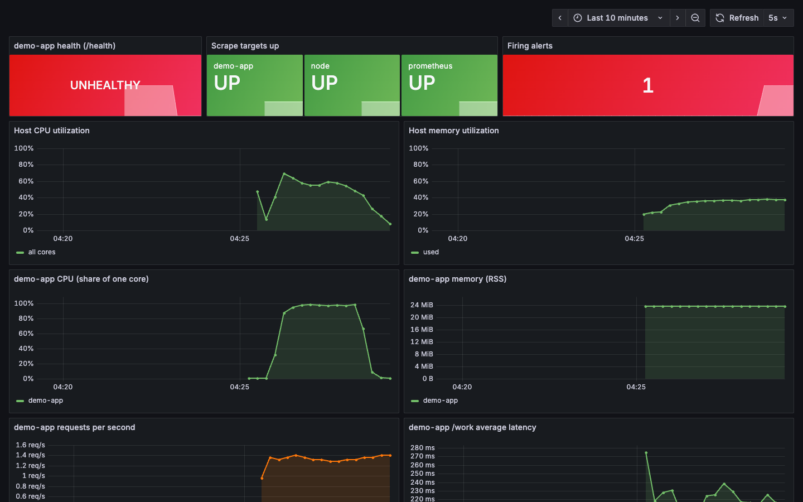
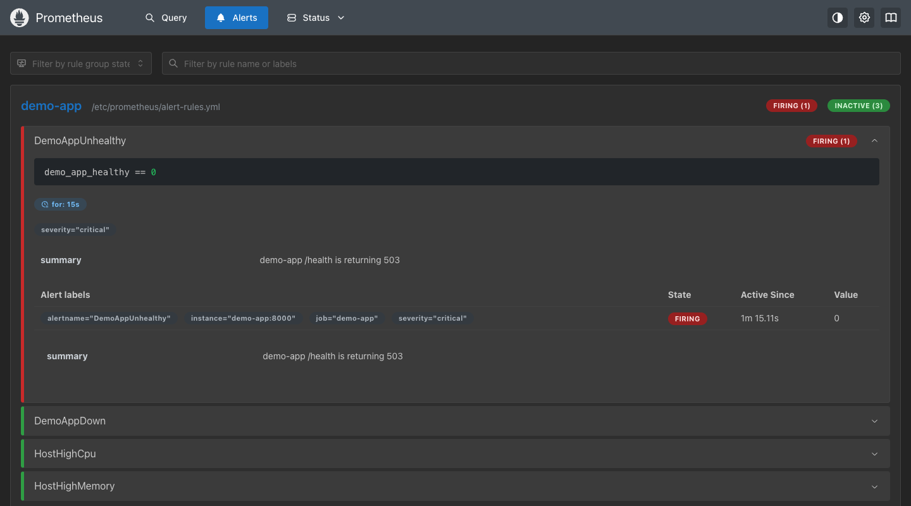
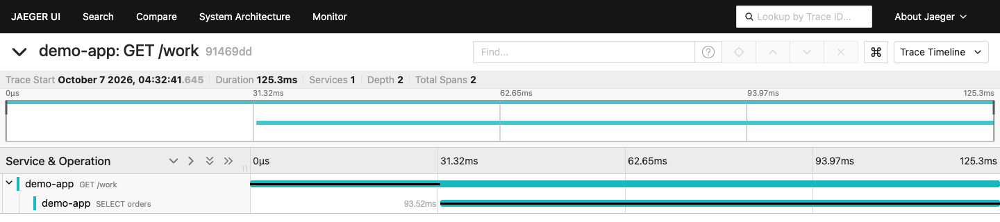
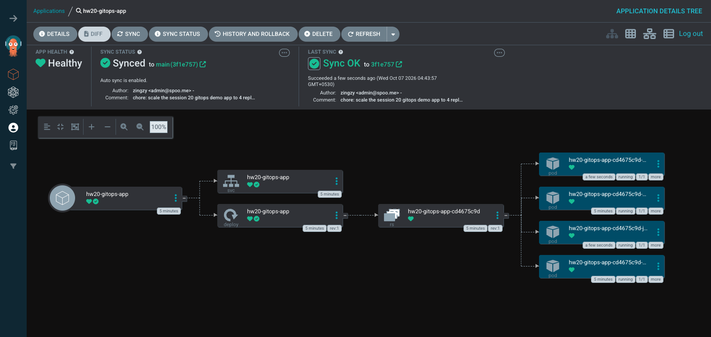
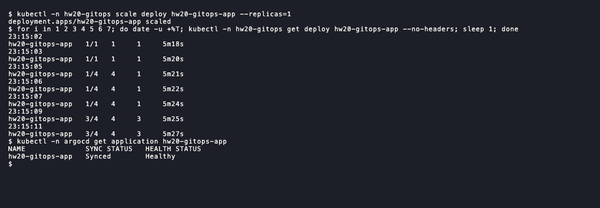

# Session 20: Monitoring, observability and GitOps

- Name: Aditya Singhi
- Enrollment number: 24BCS10177

Task 1 and the traces in Task 2 run on Docker Compose (`monitoring/`). It has
Prometheus and Grafana at the instructor's versions, plus node-exporter, Jaeger
and a small Python app I wrote with `/metrics` and `/health`. Task 3 and the
Kubernetes part of Task 2 run on a single-node kind cluster named `hw20`, with
Argo CD from the instructor's `stable` manifest. The cluster syncs `gitops/app/`
from this repo on GitHub.

## Task 1: Monitoring

### Metrics: Prometheus scrapes three real targets

```bash
cd monitoring
docker compose up -d
curl -s localhost:18200/api/v1/targets   # piped through a small JSON printer
```

```
demo-app up
node up
prometheus up
```

Prometheus scrapes itself, node-exporter (CPU and memory of the host) and the
demo app. A load generator calls the app's `/work` twice a second.

```bash
curl -s localhost:18202/metrics
```

```
# HELP demo_http_requests_total HTTP requests handled, by path and status code.
# TYPE demo_http_requests_total counter
demo_http_requests_total{path="/health",code="200"} 1
demo_http_requests_total{path="/work",code="200"} 44
...
# TYPE demo_app_healthy gauge
demo_app_healthy 1
...
process_cpu_seconds_total 1.291338
...
process_resident_memory_bytes 24735744
...
```

That is the Prometheus text format. A counter only goes up, so you graph its
`rate()`. A gauge goes up and down.

### CPU and memory utilization

```bash
# PromQL, run through /api/v1/query
100 * (1 - avg(rate(node_cpu_seconds_total{mode="idle"}[30s])))
100 * (1 - node_memory_MemAvailable_bytes / node_memory_MemTotal_bytes)
node_memory_MemTotal_bytes / 1024^3
count(node_cpu_seconds_total{mode="idle"})
100 * rate(process_cpu_seconds_total{job="demo-app"}[30s])
process_resident_memory_bytes{job="demo-app"} / 1024^2
```

```
{} 13.54
{'instance': 'node-exporter:9100', 'job': 'node'} 22.34
{'instance': 'node-exporter:9100', 'job': 'node'} 3.827
{} 4.0
{'instance': 'demo-app:8000', 'job': 'demo-app'} 0.748
{'instance': 'demo-app:8000', 'job': 'demo-app'} 23.602
```

The host was at 13.5% CPU and 22.3% memory, and the app at 0.7% of one core
and 23.6 MiB. The host is the Docker Desktop VM (3.8 GiB, 4 CPUs), not the
Mac. CPU utilization is one minus the rate of idle seconds. To make it move,
the app's `/burn` endpoint keeps one core busy:

```bash
curl -s 'localhost:18202/burn?seconds=150'
# 45 seconds later, same two CPU queries
```

```
{"burning_cpu_for": 150}
{} 58.45
{'instance': 'demo-app:8000', 'job': 'demo-app'} 97.007
```



The app went to 97% of one core and the host to 58.5%. The Grafana dashboard
(provisioned from `monitoring/grafana/`) was captured during the alert test
below: health red, one alert firing, the CPU burn as the plateau.

### Application health and alerts

`/health` returns 200 or 503. The same flag is exported as the
`demo_app_healthy` gauge, because Prometheus only reads `/metrics` and never
calls `/health`. The alert rule in `monitoring/alert-rules.yml`:

```yaml
- alert: DemoAppUnhealthy
  expr: demo_app_healthy == 0
  for: 15s
```

`/admin/fail` breaks health and `/admin/recover` fixes it:

```bash
curl -s localhost:18202/admin/fail
# poll /health and /api/v1/rules every 5s until firing
curl -s localhost:18202/admin/recover
# poll until inactive
```

```
23:01:50 before:  health=200  DemoAppUnhealthy state=inactive active_since=-
23:01:51 curl /admin/fail -> {"healthy":false}
23:01:52 health=503  DemoAppUnhealthy state=inactive active_since=-
23:01:57 health=503  DemoAppUnhealthy state=pending active_since=23:01:52
...
23:02:16 health=503  DemoAppUnhealthy state=firing active_since=23:01:52
23:02:16 curl /admin/recover -> {"healthy":true}
23:02:16 health=200  DemoAppUnhealthy state=firing active_since=23:01:52
23:02:22 health=200  DemoAppUnhealthy state=inactive active_since=-
```



Firing took 25 seconds: up to 5 s for the next scrape and 5 s for the next rule
evaluation, then 15 s in `pending` for the `for:` window. There is no
Alertmanager, so the alert is not sent anywhere.

### Logs

```bash
docker logs hw20-demo-app | grep -v 'INFO GET /work'
docker logs --tail 1 hw20-demo-app
```

```
2026-10-06T22:55:02Z INFO demo-app listening on :8000
2026-10-06T22:55:48Z WARN burning one CPU core for 150s
...
2026-10-06T23:01:51Z WARN health switched to FAILING
2026-10-06T23:01:52Z ERROR health check failed, returning 503
...
2026-10-06T23:02:16Z INFO health switched to OK
```

```
2026-10-06T23:02:41Z INFO GET /work 200 0.125s db=0.094s trace_id=91469dd1e2378df2d87ff80242d498c1
```

The logs give the exact second health flipped, which the metrics do not. Each
`/work` line carries a `trace_id` that links it to a trace in Task 2.

## Task 2: Observability

Monitoring tells you something is wrong, like the alert above. Observability is
having enough data to find out why, even for problems nobody wrote an alert
for. That data comes in three forms, and the demo app produces all three.

### Metrics, logs and traces

- **Metrics** are numbers over time with labels, like
  `demo_http_requests_total{code="200"}`. They are cheap to keep and easy to
  alert on. But they are aggregates: an average latency does not say which
  request was slow.
- **Logs** are timestamped events, one per thing that happened. They answer
  "what happened at 23:01:51" but are expensive to store and hard to graph.
- **Traces** follow one request through every step. Each step is a span with a
  start time, a duration and a parent. The app sends two spans per `/work`
  request to Jaeger: the request and a fake `SELECT orders` database call.

```bash
curl -s localhost:18203/api/traces/91469dd1e2378df2d87ff80242d498c1   # printed with a short script
```

```
traceID 91469dd1e2378df2d87ff80242d498c1 spans 2 service demo-app
  GET /work      spanID=b37b0cb95ebfa5c2 start=+0.0ms duration=125.3ms root
  SELECT orders  spanID=6c156373b5c1bea3 start=+31.8ms duration=93.5ms child of b37b0cb95ebfa5c2
```



This is the trace from the last log line above. Of the 125 ms request, 93.5 ms
was the database span. The metrics only had the average.

### Why observability is needed

The alert said `/health` was 503 and nothing more. The logs gave the time and
the cause, and the trace showed where a slow request spent its time. With many
services and short-lived pods you cannot SSH in and look around. A pod that
crashed is gone, and so are its logs unless something collected them.

### Common tools

- Metrics: Prometheus with node-exporter, cAdvisor and kube-state-metrics.
  Grafana for dashboards, Alertmanager for routing alerts.
- Logs: Fluent Bit or Promtail to collect, Loki or Elasticsearch to store.
- Traces: the OpenTelemetry SDK and Collector to produce them (the app sends
  OTLP, the OpenTelemetry format), Jaeger or Tempo to store them.

### Kubernetes observability

This ran on the `hw20` cluster with the instructor's `02-metrics-logs-traces`
demo, unedited.

```bash
kubectl apply -f ../02-metrics-logs-traces/k8s-demo/
kubectl logs deployment/session20-demo --timestamps --tail 4
```

```
...
2026-10-06T23:09:00.981533594Z Request received
2026-10-06T23:09:00.981664094Z Health check OK
```

`--timestamps` adds the time each line arrived, since the app prints none.
"Health check OK" is only an `echo`, and the Service's port 8080 has nothing
listening behind it:

```bash
kubectl run probe --rm -i --restart=Never --image=busybox:1.36 -- wget -T 3 -qO- http://session20-demo:8080
```

```
wget: can't connect to remote host (10.96.93.199): Connection refused
...
```

The pod still shows `Ready` because it has no readiness probe. For CPU and
memory per pod, the cluster needs metrics-server:

```bash
kubectl apply -f https://github.com/kubernetes-sigs/metrics-server/releases/latest/download/components.yaml
kubectl -n kube-system patch deploy metrics-server --type json \
  -p '[{"op":"add","path":"/spec/template/spec/containers/0/args/-","value":"--kubelet-insecure-tls"}]'
kubectl top pods -A --sort-by=memory | head -12
kubectl get events -A --sort-by=.lastTimestamp | tail -8
```

```
NAMESPACE            NAME                                         CPU(cores)   MEMORY(bytes)
kube-system          kube-apiserver-hw20-control-plane            79m          403Mi
kube-system          kube-controller-manager-hw20-control-plane   19m          62Mi
kube-system          etcd-hw20-control-plane                      24m          43Mi
...
```

```
...
kube-system          5s          Warning   Unhealthy                 pod/metrics-server-6bcd67b6cf-dc4qh                      Readiness probe failed: HTTP probe failed with statuscode: 500
```

The event is the pod from before the patch: kind's kubelet certificate is
self-signed. `kubectl top` has no history. For that, Prometheus scrapes the
kubelet and kube-state-metrics, and Loki keeps logs after pods are deleted.

## Task 3: GitOps

GitOps means the desired state of the cluster lives in Git, and an agent in the
cluster keeps the cluster matching it.

- **Git as the source of truth.** `gitops/app/deployment.yaml` on `main` is the
  correct state. Every change is a commit with an author and a diff, and a
  rollback is a revert.
- **Declarative configuration.** The YAML says "4 replicas of nginx", not which
  commands to run. The tool works out the steps.
- **Continuous reconciliation.** Argo CD compares Git with the cluster in a
  loop. It catches both a new commit and a manual change, and fixes either.
- **GitOps workflow.** Edit YAML, commit, push. Argo CD pulls the change. Nobody
  runs `kubectl apply` by hand, and CI never needs cluster credentials.
- **Kubernetes and GitOps.** Kubernetes controllers already reconcile Pods to a
  Deployment's spec. Argo CD adds one more loop, from Git to the Deployment.

### Install Argo CD

```bash
kind create cluster --name hw20 --wait 90s
kubectl create namespace argocd
kubectl apply -n argocd --server-side --force-conflicts -f https://raw.githubusercontent.com/argoproj/argo-cd/stable/manifests/install.yaml
kubectl -n argocd scale deploy argocd-dex-server argocd-notifications-controller argocd-applicationset-controller --replicas=0
kubectl -n argocd get pods
```

```
NAME                                 READY   STATUS    RESTARTS   AGE
argocd-application-controller-0      1/1     Running   0          3m12s
argocd-redis-bdbdffcb4-7qgz5         1/1     Running   0          3m13s
argocd-repo-server-d89c7967d-b7k6z   1/1     Running   0          3m13s
argocd-server-776b7cdd4d-kmb2r       1/1     Running   0          3m12s
```

SSO, notifications and ApplicationSets are not needed for one Application.

### Initial sync

The instructor's Application points at a repo I cannot push to, so
`gitops/argocd-application.yaml` points at my fork, path
`session20-monitoring-observability-gitops/homework-monitoring-gitops/gitops/app`,
with `automated: {prune: true, selfHeal: true}`. That file sits outside `app/`
so Argo CD does not manage its own Application. The manifests were pushed as
`ce6ab65` with `replicas: 2`.

```bash
kubectl apply -f gitops/argocd-application.yaml
# then print sync status, health and revision every 3 seconds
```

```
23:09:38
application.argoproj.io/hw20-gitops-app created
...
23:09:44 OutOfSync Missing ce6ab65d0389d44bdbf11f4974039cfc0db18cfd
23:09:47 Synced Progressing ce6ab65d0389d44bdbf11f4974039cfc0db18cfd
...
23:10:06 Synced Healthy ce6ab65d0389d44bdbf11f4974039cfc0db18cfd
```

`OutOfSync Missing` means Git has objects the cluster does not. After one sync
it is `Synced`, then `Healthy` once both pods pass their readiness probe.

### A change made only in Git

I changed `replicas: 2` to `replicas: 4` in `gitops/app/deployment.yaml`, and
it was pushed as `3f1e757` at 23:12:03 UTC. I ran no kubectl command and did
not press Refresh. A loop recorded the state every 5 seconds:

```
23:12:03 rev=ce6ab65 sync=Synced/Healthy ready=2/2
...
23:13:53 rev=ce6ab65 sync=Synced/Healthy ready=2/2
23:13:59 rev=3f1e757 sync=Synced/Progressing ready=3/4
23:14:05 rev=3f1e757 sync=Synced/Healthy ready=4/4
```



Push to four ready pods took 2 minutes, because Argo CD polls Git on a 2 minute
timer plus jitter. A GitHub webhook would make it instant.

### Self-heal

Scaling by hand creates a difference from Git, so Argo CD should undo it.

```bash
kubectl -n hw20-gitops scale deploy hw20-gitops-app --replicas=5
# then print the Deployment and spec.replicas every second
```

```
23:10:19
deployment.apps/hw20-gitops-app scaled
23:10:20 hw20-gitops-app   2/5   2     2     36s spec.replicas=5
23:10:21 hw20-gitops-app   2/5   5     2     37s spec.replicas=5
23:10:22 hw20-gitops-app   3/2   5     3     39s spec.replicas=2
23:10:24 hw20-gitops-app   2/2   2     2     40s spec.replicas=2
...
```

The screenshot is a second run after the Git change, scaling 4 down to 1:



Self-heal took about 2 seconds, because the controller watches live objects
through the Kubernetes API while Git has to be polled. It undoes a change but
does not prevent it: scaling to 1 killed three pods first.

## Notes

- The instructor's `k8s-demo` Service targets port 8080, but the busybox pod
  listens on nothing, so connections are refused while the pod shows Ready.
- `07-argocd/README.md` says a push syncs "within ~30 seconds". I measured
  2 minutes, which matches Argo CD's 2 minute Git polling interval plus jitter.
- node-exporter's usual `/:/host:ro,rslave` mount fails on Docker Desktop with
  "not a shared or slave mount". `monitoring/docker-compose.yml` drops `rslave`.
- metrics-server needs `--kubelet-insecure-tls` on kind, or its readiness
  probe fails with a 500.
