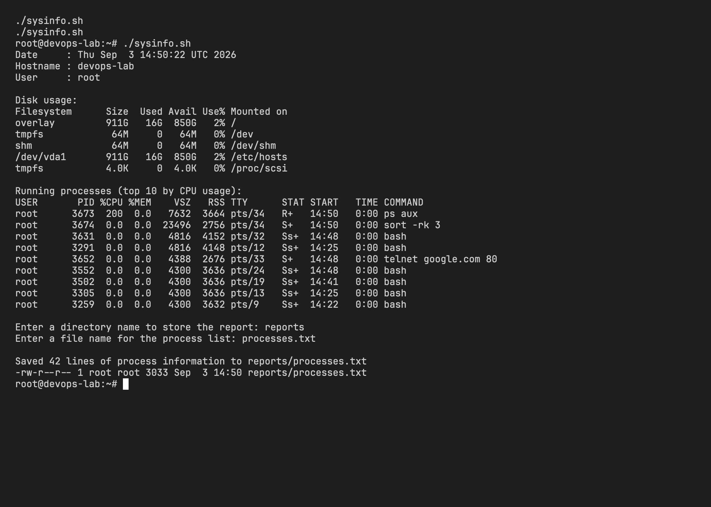
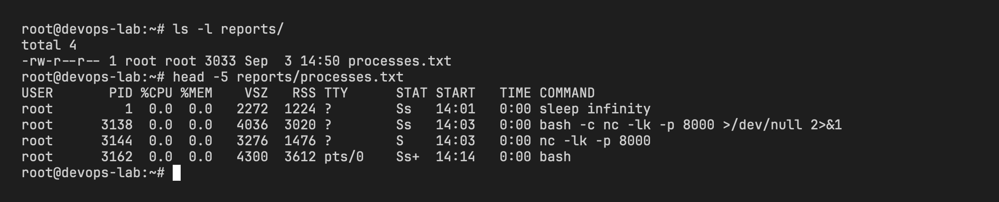

# System Information Script

- Name: Aditya Singhi
- Enrollment number: 24BCS10177

## What the script does

[`sysinfo.sh`](sysinfo.sh) prints the current date, hostname, username, disk usage and the top processes, then asks for a directory name and a file name, creates both and saves the full `ps aux` output into the file.

| Requirement | Where it is used |
|---|---|
| Variables | `current_date`, `host`, `user`, `dir_name`, `file_name`, `report` |
| `echo` | every printed line |
| `df` | `df -h` for disk usage |
| `ps` | `ps aux` for the process list, twice |
| `read -p` | asks for the directory and file names |
| `mkdir` | `mkdir -p "$dir_name"` |
| `touch` | `touch "$report"` |
| `>` redirection | `ps aux > "$report"` |

## Running it

```bash
chmod +x sysinfo.sh
./sysinfo.sh
```

The script was run inside an Ubuntu 24.04 container. Input given at the prompts: `reports` for the directory and `processes.txt` for the file.

## Output

```
Date     : Thu Sep  3 14:33:27 UTC 2026
Hostname : devops-lab
User     : root

Disk usage:
Filesystem      Size  Used Avail Use% Mounted on
overlay         911G   15G  850G   2% /
tmpfs            64M     0   64M   0% /dev
shm              64M     0   64M   0% /dev/shm
/dev/vda1       911G   15G  850G   2% /etc/hosts
tmpfs           4.0K     0  4.0K   0% /proc/scsi

Running processes (top 10 by CPU usage):
USER       PID %CPU %MEM    VSZ   RSS TTY      STAT START   TIME COMMAND
root      3361  0.2  0.0   4036  3028 ?        Ss   14:33   0:00 bash -c ... bash sysinfo.sh
root      3444  0.0  0.0  23496  2748 ?        S    14:33   0:00 sort -rk 3
root      3443  0.0  0.0   7632  3656 ?        R    14:33   0:00 ps aux
root      3291  0.0  0.0   4816  4148 pts/12   Ss+  14:25   0:00 bash
root      3305  0.0  0.0   4300  3636 pts/13   Ss+  14:25   0:00 bash
root      3259  0.0  0.0   4300  3632 pts/9    Ss+  14:22   0:00 bash
root      3237  0.0  0.0   4300  3632 pts/7    Ss+  14:20   0:00 bash
root      3194  0.0  0.0   4300  3632 pts/3    Ss+  14:16   0:00 bash
root      3173  0.0  0.0   4300  3632 pts/1    Ss+  14:16   0:00 bash

Enter a directory name to store the report: reports
Enter a file name for the process list: processes.txt

Saved 22 lines of process information to reports/processes.txt
-rw-r--r-- 1 root root 1755 Sep  3 14:33 reports/processes.txt
```



The saved file, checked afterwards with `head`:

```
$ head -5 reports/processes.txt
USER         PID %CPU %MEM    VSZ   RSS TTY      STAT START   TIME COMMAND
root           1  0.0  0.0   2696  1508 ?        Ss   13:58   0:00 sleep infinity
root          14  0.0  0.0   4300  3632 pts/0    Ss+  13:59   0:00 bash
root          77  0.0  0.0   4300  3632 pts/1    Ss+  14:00   0:00 bash
```



## Notes

- `read -p "prompt" var` prints the prompt and stores the typed line in `var` in one step.
- `mkdir -p` does not fail if the directory already exists, so the script can be run twice.
- `ps aux > file` overwrites the file each run. `>>` would append instead.
- `$(...)` runs a command and stores its output in a variable, which is how `current_date`, `host` and `user` are filled.
