# Networking Commands Homework

- Name: Aditya Singhi
- Enrollment number: 24BCS10177

## Setup

All commands below were run inside an Ubuntu 24.04 container so the Linux tools (`ip`, `ss`, `netstat`, `tcpdump`) behave the way they do on a real server. The container was started with the capabilities `tcpdump` and `traceroute` need, and the tools were installed with apt:

```bash
docker run -d --name nettools --hostname devops-lab \
  --cap-add NET_ADMIN --cap-add NET_RAW ubuntu:24.04 sleep infinity
docker exec nettools apt-get update
docker exec nettools apt-get install -y iproute2 net-tools iputils-ping \
  traceroute dnsutils tcpdump telnet curl netcat-openbsd
docker exec -it nettools bash
```

One exception: `traceroute` was run on the macOS host. Docker Desktop's VM answers every hop itself, so from inside the container the trace shows only two hops and hides the real path.

## 1. hostname

```bash
hostname
hostname -I
```

```
devops-lab
172.17.0.6
```

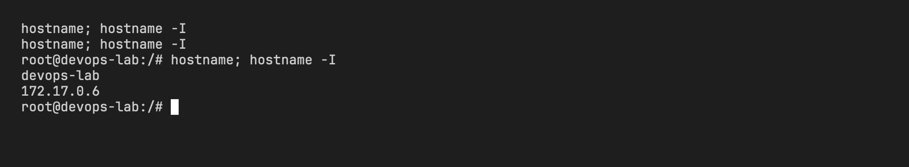

`hostname` prints the machine's name and `-I` prints every IP address assigned to it. Here the container is `devops-lab` at 172.17.0.6, which is inside Docker's default bridge network 172.17.0.0/16.

## 2. ip addr

```bash
ip -brief addr
ip addr show eth0
```

```
lo               UNKNOWN        127.0.0.1/8 ::1/128
eth0@if41        UP             172.17.0.6/16
11: eth0@if41: <BROADCAST,MULTICAST,UP,LOWER_UP> mtu 65535 qdisc noqueue state UP group default
    link/ether 32:54:23:d4:87:31 brd ff:ff:ff:ff:ff:ff link-netnsid 0
    inet 172.17.0.6/16 brd 172.17.255.255 scope global eth0
       valid_lft forever preferred_lft forever
```

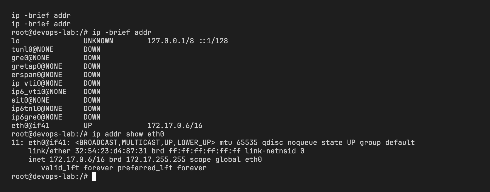

`ip addr` lists every network interface with its MAC address, IP address and state. `lo` is the loopback interface that only the machine itself can reach. `eth0` is the real interface. The `/16` means the first 16 bits are the network part, so this container can talk directly to any address in 172.17.x.x. `ip -brief` is the one-line-per-interface version, handy when a machine has many interfaces.

## 3. ip route

```bash
ip route
```

```
default via 172.17.0.1 dev eth0
172.17.0.0/16 dev eth0 proto kernel scope link src 172.17.0.6
```

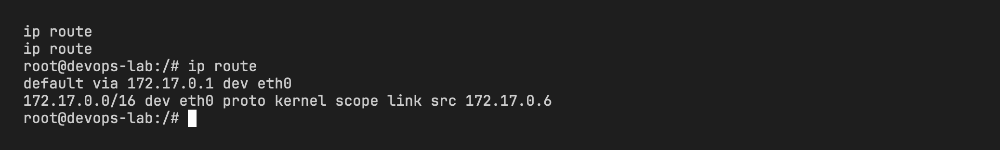

The routing table decides where a packet goes. Anything for 172.17.0.0/16 is sent straight out of `eth0` because it is on the same network. Everything else matches the `default` route and is handed to the gateway 172.17.0.1, which is Docker's bridge and the container's door to the internet.

## 4. ip neigh and arp

```bash
ip neigh
arp -a
```

```
172.17.0.1 dev eth0 lladdr ae:b7:46:26:7b:ac STALE
? (172.17.0.1) at ae:b7:46:26:7b:ac [ether] on eth0
```

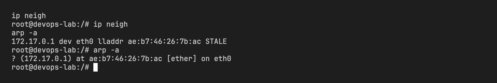

Both commands show the ARP table, which maps IP addresses to MAC addresses on the local network. Only the gateway is listed because it is the only neighbour this container has talked to. `arp` is the older net-tools command and `ip neigh` is its iproute2 replacement. `STALE` means the entry has not been confirmed recently and will be re-checked the next time it is used.

## 5. ping

```bash
ping -c 4 google.com
```

```
PING google.com (142.250.207.174) 56(84) bytes of data.
64 bytes from pnbomb-bl-in-f14.1e100.net (142.250.207.174): icmp_seq=1 ttl=63 time=25.5 ms
64 bytes from pnbomb-bl-in-f14.1e100.net (142.250.207.174): icmp_seq=2 ttl=63 time=22.3 ms
64 bytes from pnbomb-bl-in-f14.1e100.net (142.250.207.174): icmp_seq=3 ttl=63 time=22.4 ms
64 bytes from pnbomb-bl-in-f14.1e100.net (142.250.207.174): icmp_seq=4 ttl=63 time=21.4 ms

--- google.com ping statistics ---
4 packets transmitted, 4 received, 0% packet loss, time 3020ms
rtt min/avg/max/mdev = 21.403/22.894/25.459/1.531 ms
```

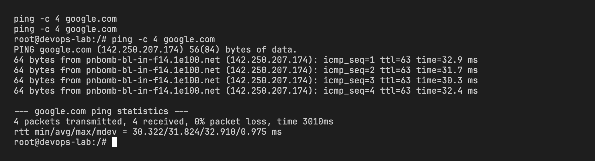

`ping` sends ICMP echo requests and waits for replies. It answers the first question in any network problem: can I reach the host at all? The `time` value is the round trip latency, about 22 ms to Google's Mumbai server here, and 0% packet loss means the path is healthy. `-c 4` stops after four packets instead of running forever.

## 6. traceroute

```bash
traceroute -m 15 -w 2 -q 1 google.com
```

```
traceroute to google.com (142.250.207.174), 15 hops max, 40 byte packets
 1  wifi.height8tech.com (100.129.160.1)  10.554 ms
 2  202.131.133.5.convergentindia.com (202.131.133.5)  7.027 ms
 3  115.117.125.189.static-mumbai.vsnl.net.in (115.117.125.189)  8.342 ms
 4  172.28.117.90 (172.28.117.90)  14.017 ms
 5  115.112.15.114.static-chennai.vsnl.net.in (115.112.15.114)  11.597 ms
 6  *
 7  142.250.236.156 (142.250.236.156)  14.176 ms
 8  142.251.50.58 (142.251.50.58)  11.694 ms
 9  216.239.49.131 (216.239.49.131)  61.890 ms
10  192.178.254.230 (192.178.254.230)  46.581 ms
11  142.250.213.101 (142.250.213.101)  30.882 ms
12  142.250.214.113 (142.250.214.113)  29.523 ms
13  pnbomb-bl-in-f14.1e100.net (142.250.207.174)  23.701 ms
```


`traceroute` shows every router (hop) between me and the destination. It works by sending packets with an increasing TTL so each router along the way gives itself away when the TTL runs out. Hop 1 is the WiFi router, hops 2 to 5 are the ISP (Tata/VSNL in Mumbai and Chennai), and from hop 7 onwards the packets are inside Google's network. The `*` at hop 6 is a router that does not reply to traceroute probes, which is common and not an error. If a site is slow, this is how you find which hop the delay starts at.

## 7. nslookup

```bash
nslookup google.com
```

```
Server:		192.168.65.7
Address:	192.168.65.7#53

Non-authoritative answer:
Name:	google.com
Address: 142.250.207.174
```

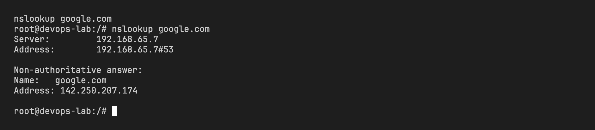

`nslookup` asks the DNS server for the IP behind a name. The first two lines show which DNS server answered (Docker's internal resolver on port 53). "Non-authoritative" means the answer came from a cache rather than from Google's own name servers. If `ping google.com` fails but `ping 142.250.207.174` works, the problem is DNS, and this command is how you confirm it.

## 8. dig

```bash
dig google.com
```

```
;; ->>HEADER<<- opcode: QUERY, status: NOERROR, id: 63776
;; flags: qr rd ra; QUERY: 1, ANSWER: 1, AUTHORITY: 0, ADDITIONAL: 0

;; QUESTION SECTION:
;google.com.			IN	A

;; ANSWER SECTION:
google.com.		85	IN	A	142.250.207.174

;; Query time: 4 msec
;; SERVER: 192.168.65.7#53(192.168.65.7) (UDP)
;; WHEN: Thu Sep 03 14:02:34 UTC 2026
;; MSG SIZE  rcvd: 54
```

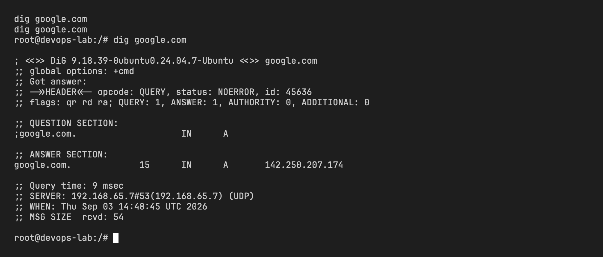

`dig` does the same lookup as `nslookup` but shows the raw DNS response. `status: NOERROR` means the query succeeded. The answer section says `google.com` has an `A` record (IPv4 address) of 142.250.207.174 with a TTL of 85 seconds, so the cache will refetch it after that. Query time of 4 ms tells me the DNS server is fast and nearby.

## 9. netstat

```bash
netstat -tuln
```

```
Active Internet connections (only servers)
Proto Recv-Q Send-Q Local Address           Foreign Address         State
tcp        0      0 0.0.0.0:8000            0.0.0.0:*               LISTEN
```

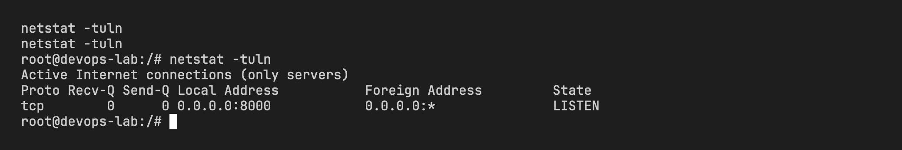

`netstat -tuln` lists the ports this machine is listening on: `-t` TCP, `-u` UDP, `-l` listening only, `-n` show numbers instead of names. I started a small listener with `nc -lk -p 8000` beforehand, and it shows up bound to 0.0.0.0, meaning it accepts connections from any interface. This is the command to run when a service "won't start" because the port is already taken, or when checking that a server actually came up.

## 10. ss

```bash
ss -tuln
```

```
Netid State  Recv-Q Send-Q Local Address:Port Peer Address:PortProcess
tcp   LISTEN 0      1            0.0.0.0:8000      0.0.0.0:*
```

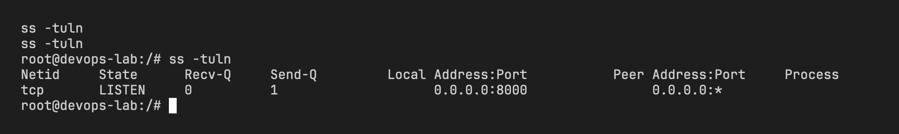

`ss` is the modern replacement for `netstat` and takes the same flags. It shows the same port 8000 listener. It is faster on machines with thousands of connections because it reads socket data straight from the kernel instead of parsing `/proc`. Newer distributions ship `ss` by default and `netstat` has to be installed separately.

## 11. telnet

```bash
telnet google.com 80
```

```
Trying 142.250.207.174...
Connected to google.com.
Escape character is '^]'.
```

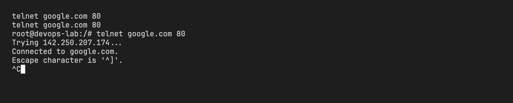

`telnet host port` opens a raw TCP connection to one specific port. "Connected" proves that port 80 on Google is open and nothing between us blocks it. `ping` only tests that the host is reachable, but a firewall can allow ping and still block port 80 or 443, so this is the next check. Ctrl+] then `quit` exits.

## 12. curl

```bash
curl -sI https://www.google.com | head -8
```

```
HTTP/2 200
content-type: text/html; charset=ISO-8859-1
content-security-policy-report-only: object-src 'none';base-uri 'self';script-src 'nonce-...'
accept-ch: Sec-CH-Prefers-Color-Scheme
p3p: CP="This is not a P3P policy! See g.co/p3phelp for more info."
date: Thu, 03 Sep 2026 14:32:46 GMT
server: gws
x-xss-protection: 0
```

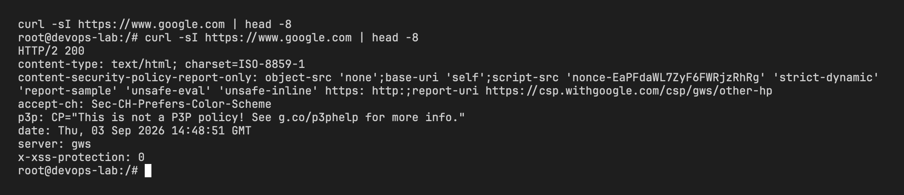

`curl -I` sends an HTTP HEAD request and prints only the response headers. `HTTP/2 200` confirms the whole chain works: DNS resolved, TCP connected, TLS handshake succeeded and the web server answered OK. This is the last step in troubleshooting because it tests the application layer, not just the network.

## 13. tcpdump

```bash
(sleep 1; curl -s http://google.com >/dev/null) & tcpdump -ni eth0 -c 6 host google.com
```

```
listening on eth0, link-type EN10MB (Ethernet), snapshot length 262144 bytes
14:25:34.939492 IP 172.17.0.6.45714 > 142.250.207.174.80: Flags [S], seq 3312045232, ... length 0
14:25:34.968069 IP 142.250.207.174.80 > 172.17.0.6.45714: Flags [S.], seq 233867928, ack 3312045233, ... length 0
14:25:34.968269 IP 172.17.0.6.45714 > 142.250.207.174.80: Flags [.], ack 1, ... length 0
14:25:34.968437 IP 172.17.0.6.45714 > 142.250.207.174.80: Flags [P.], seq 1:74, ack 1, ... length 73: HTTP: GET / HTTP/1.1
14:25:34.969129 IP 142.250.207.174.80 > 172.17.0.6.45714: Flags [.], ack 74, ... length 0
14:25:35.061262 IP 142.250.207.174.80 > 172.17.0.6.45714: Flags [P.], seq 1:774, ack 74, ... length 773: HTTP: HTTP/1.1 301 Moved Permanently
6 packets captured
```

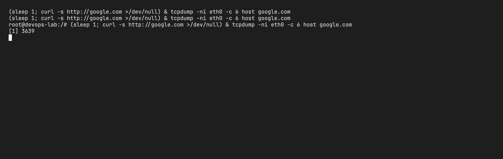

`tcpdump` captures the actual packets on an interface. `-i eth0` picks the interface, `-n` keeps IPs numeric, `-c 6` stops after six packets and `host google.com` filters to one destination. I fired a `curl` in the background so there was traffic to see. The capture shows the TCP three-way handshake exactly as taught: `[S]` SYN from me, `[S.]` SYN-ACK from Google, `[.]` ACK back. Then `[P.]` carries the HTTP GET and Google's 301 redirect to https. This is the tool for when every other command says "fine" but the application still misbehaves.

## 14. systemctl

```bash
systemctl status NetworkManager
```

Not run. Containers do not run systemd, and macOS does not have it either, so there was no environment where this command applies. On a normal Linux server it reports whether the NetworkManager service is loaded and active. If an interface has no IP at all, this is the first thing to check, because a stopped network service means nothing above it can work.

## What I took away

The commands form a ladder, and troubleshooting means climbing it from the bottom:

1. `ip addr` and `ip route`: do I have an address and a gateway?
2. `ping`: can I reach the destination at all?
3. `traceroute`: if not, where along the path does it stop?
4. `nslookup` and `dig`: is the name resolving, or is it a DNS problem?
5. `telnet` and `ss`/`netstat`: is the specific port open on their side and on mine?
6. `curl`: does the application itself answer?
7. `tcpdump`: when nothing else explains it, look at the packets.
