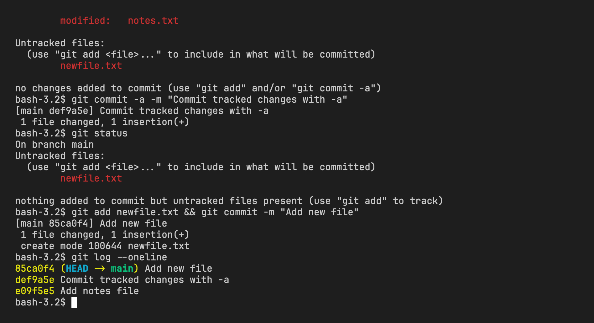
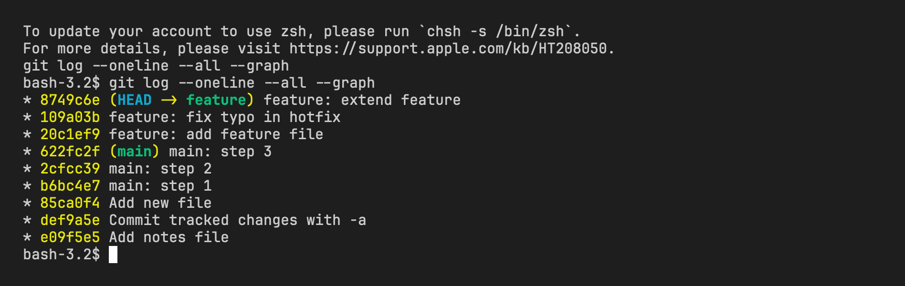
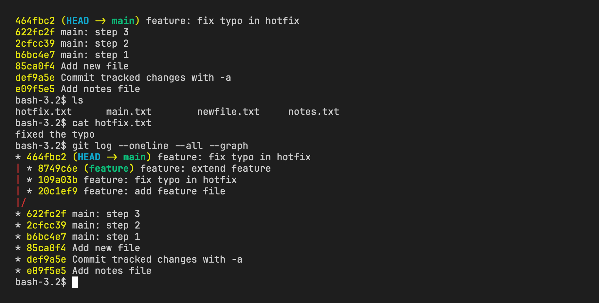

# Git Homework

- Name: Aditya Singhi
- Enrollment number: 24BCS10177

All commands were run in a fresh repo at `/tmp/git-homework`. The output below is copied from the terminal as it appeared.

## Task 1: git commit -a -m vs git commit -m

### Setup

Create a repo, add one tracked file and commit it.

```bash
$ git init -b main
Initialized empty Git repository in /private/tmp/git-homework/.git/

$ git config user.name "Aditya Singhi"
$ git config user.email "aditya@example.com"

$ echo "first line of notes" > notes.txt
$ git add notes.txt
$ git commit -m "Add notes file"
[main (root-commit) e09f5e5] Add notes file
 1 file changed, 1 insertion(+)
 create mode 100644 notes.txt
```

Now make two kinds of change. Edit `notes.txt`, which git already tracks, and create `newfile.txt`, which git has never seen.

```bash
$ echo "second line of notes" >> notes.txt
$ echo "this file is brand new" > newfile.txt

$ git status
On branch main
Changes not staged for commit:
  (use "git add <file>..." to update what will be committed)
  (use "git restore <file>..." to discard changes in working directory)
	modified:   notes.txt

Untracked files:
  (use "git add <file>..." to include in what will be committed)
	newfile.txt

no changes added to commit (use "git add" and/or "git commit -a")
```

### Plain git commit -m without staging

Nothing is staged, so the commit does not happen. Git prints the status again and exits with an error.

```bash
$ git commit -m "Try plain commit"
On branch main
Changes not staged for commit:
  (use "git add <file>..." to update what will be committed)
  (use "git restore <file>..." to discard changes in working directory)
	modified:   notes.txt

Untracked files:
  (use "git add <file>..." to include in what will be committed)
	newfile.txt

no changes added to commit (use "git add" and/or "git commit -a")
```

### git commit -a -m

With `-a` the change to `notes.txt` gets committed. `newfile.txt` is still untracked afterwards.

```bash
$ git commit -a -m "Commit tracked changes with -a"
[main def9a5e] Commit tracked changes with -a
 1 file changed, 1 insertion(+)

$ git status
On branch main
Untracked files:
  (use "git add <file>..." to include in what will be committed)
	newfile.txt

nothing added to commit but untracked files present (use "git add" to track)
```

The new file needs an explicit `git add` before it can be committed.

```bash
$ git add newfile.txt
$ git commit -m "Add new file"
[main 85ca0f4] Add new file
 1 file changed, 1 insertion(+)
 create mode 100644 newfile.txt

$ git log --oneline
85ca0f4 Add new file
def9a5e Commit tracked changes with -a
e09f5e5 Add notes file
```



### Explanation

`-m` only sets the commit message. It does not change what gets committed. If the staging area is empty, `git commit -m` does nothing and prints the status instead.

`-a` tells git to stage every tracked file that was modified or deleted, and then commit. It saves the `git add` step for files git already knows about. It never touches untracked files. That is why `newfile.txt` stayed untracked after the `-a` commit and needed its own `git add`.

So `git commit -a -m "msg"` is a shortcut for `git add -u` followed by `git commit -m "msg"`. A brand new file always needs `git add` first.

## Task 2: cherry-pick

### Three commits on main

```bash
$ echo "main step 1" > main.txt
$ git add main.txt
$ git commit -m "main: step 1"
[main b6bc4e7] main: step 1
 1 file changed, 1 insertion(+)
 create mode 100644 main.txt

$ echo "main step 2" >> main.txt
$ git commit -a -m "main: step 2"
[main 2cfcc39] main: step 2
 1 file changed, 1 insertion(+)

$ echo "main step 3" >> main.txt
$ git commit -a -m "main: step 3"
[main 622fc2f] main: step 3
 1 file changed, 1 insertion(+)

$ git log --oneline
622fc2f main: step 3
2cfcc39 main: step 2
b6bc4e7 main: step 1
85ca0f4 Add new file
def9a5e Commit tracked changes with -a
e09f5e5 Add notes file
```

### Three commits on feature

The middle commit touches only `hotfix.txt`. That is the one I want to bring over to main.

```bash
$ git switch -c feature
Switched to a new branch 'feature'

$ echo "feature work" > feature.txt
$ git add feature.txt
$ git commit -m "feature: add feature file"
[feature 20c1ef9] feature: add feature file
 1 file changed, 1 insertion(+)
 create mode 100644 feature.txt

$ echo "fixed the typo" > hotfix.txt
$ git add hotfix.txt
$ git commit -m "feature: fix typo in hotfix"
[feature 109a03b] feature: fix typo in hotfix
 1 file changed, 1 insertion(+)
 create mode 100644 hotfix.txt

$ echo "more feature work" >> feature.txt
$ git commit -a -m "feature: extend feature"
[feature 8749c6e] feature: extend feature
 1 file changed, 1 insertion(+)

$ git log --oneline
8749c6e feature: extend feature
109a03b feature: fix typo in hotfix
20c1ef9 feature: add feature file
622fc2f main: step 3
2cfcc39 main: step 2
b6bc4e7 main: step 1
85ca0f4 Add new file
def9a5e Commit tracked changes with -a
e09f5e5 Add notes file
```

The hotfix commit is `109a03b`.

```bash
$ git log --oneline --all --graph
* 8749c6e feature: extend feature
* 109a03b feature: fix typo in hotfix
* 20c1ef9 feature: add feature file
* 622fc2f main: step 3
* 2cfcc39 main: step 2
* b6bc4e7 main: step 1
* 85ca0f4 Add new file
* def9a5e Commit tracked changes with -a
* e09f5e5 Add notes file
```

The graph is a straight line here because main has not moved since feature branched off it. `feature` is simply three commits ahead of `main` at `622fc2f`.



### Cherry-pick the hotfix onto main

```bash
$ git switch main
Switched to branch 'main'

$ git cherry-pick 109a03b
[main 464fbc2] feature: fix typo in hotfix
 Date: Thu Sep 3 20:27:03 2026 +0530
 1 file changed, 1 insertion(+)
 create mode 100644 hotfix.txt
```

### Verify

The commit on main has the same message and the same file change, but a new hash, `464fbc2` instead of `109a03b`.

```bash
$ git log --oneline
464fbc2 feature: fix typo in hotfix
622fc2f main: step 3
2cfcc39 main: step 2
b6bc4e7 main: step 1
85ca0f4 Add new file
def9a5e Commit tracked changes with -a
e09f5e5 Add notes file
```

`hotfix.txt` is on main now. `feature.txt` is not, because the two commits that touched it stayed on the feature branch.

```bash
$ ls
hotfix.txt
main.txt
newfile.txt
notes.txt

$ cat hotfix.txt
fixed the typo
```

Now the graph shows both branches. The same fix exists twice, once on each branch, as two different commits.

```bash
$ git log --oneline --all --graph
* 8749c6e feature: extend feature
* 109a03b feature: fix typo in hotfix
* 20c1ef9 feature: add feature file
| * 464fbc2 feature: fix typo in hotfix
|/
* 622fc2f main: step 3
* 2cfcc39 main: step 2
* b6bc4e7 main: step 1
* 85ca0f4 Add new file
* def9a5e Commit tracked changes with -a
* e09f5e5 Add notes file
```



### Explanation

`git cherry-pick <hash>` takes the changes introduced by one commit and applies them on top of the current branch as a new commit. The message and the diff are copied. The hash is new because the parent commit is different. The original commit on the other branch is left alone.

This is useful when a branch has one fix you need right now but the rest of the branch is not ready. A merge would bring in every commit. Cherry-pick brings in just the one. The downside is that the same change now lives in two commits, which can cause a small conflict later if the feature branch is merged into main.
