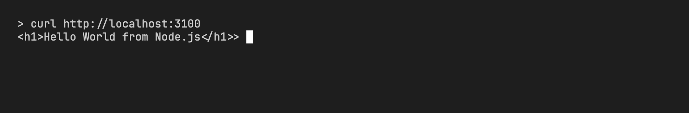
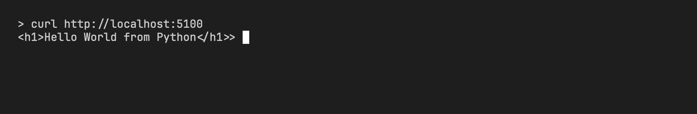
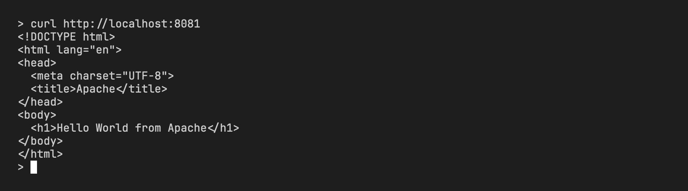
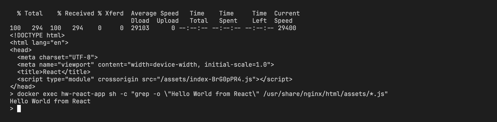
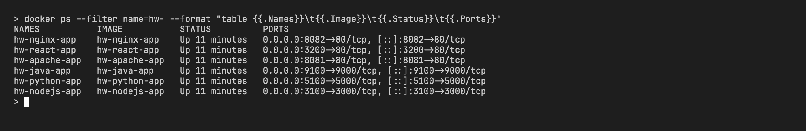

# Docker Hello World apps homework

- Name: Aditya Singhi
- Enrollment number: 24BCS10177

Six small web apps, each in its own folder with its own Dockerfile. Every one of them serves a page that says "Hello World from <technology>". All six were built, started, and checked with curl on the same machine.

## Summary

| App | Folder | Base image | Container port | Host port | Image size |
|---|---|---|---|---|---|
| Node.js (Express) | `nodejs-app` | `node:24-alpine` | 3000 | 3100 | 250MB |
| Python (Flask) | `python-app` | `python:3.12-slim` | 5000 | 5100 | 234MB |
| Java (HttpServer) | `java-app` | `eclipse-temurin:21-jdk-alpine` to build, `eclipse-temurin:21-jre-alpine` to run | 9000 | 9100 | 286MB |
| Apache | `Apache-app` | `httpd:2.4-alpine` | 80 | 8081 | 105MB |
| React (Vite) | `React-app` | `node:24-alpine` to build, `nginx:alpine` to run | 80 | 3200 | 102MB |
| Nginx | `nginx-app` | `nginx:alpine` | 80 | 8082 | 102MB |

Image sizes come from `docker images --filter reference='hw-*'`.

All commands below are run from this folder:

```bash
cd devops-heros/session6-7-docker/homework-hello-world-apps
```

## Node.js app

An Express server in `server.js` answers `GET /` with the greeting. The Dockerfile copies `package.json` first and runs `npm install --omit=dev`, so the dependency layer is cached until the dependency list changes.

```bash
docker build -t hw-nodejs-app ./nodejs-app
docker run -d --name hw-nodejs-app -p 3100:3000 hw-nodejs-app
curl http://localhost:3100
```

```
<h1>Hello World from Node.js</h1>
```



## Python app

A Flask app in `app.py` listens on `0.0.0.0:5000`. Flask is pinned to `3.1.0` in `requirements.txt` so the build gives the same result every time.

```bash
docker build -t hw-python-app ./python-app
docker run -d --name hw-python-app -p 5100:5000 hw-python-app
curl http://localhost:5100
```

```
<h1>Hello World from Python</h1>
```



## Java app

`App.java` uses the JDK's built in `com.sun.net.httpserver.HttpServer`, so there are no dependencies and no build tool. The first stage compiles with `javac` on the JDK image. The second stage copies only `App.class` onto the JRE image.

```bash
docker build -t hw-java-app ./java-app
docker run -d --name hw-java-app -p 9100:9000 hw-java-app
curl http://localhost:9100
```

```
<h1>Hello World from Java</h1>
```


## Apache app

A static `index.html` copied into Apache's document root at `/usr/local/apache2/htdocs/`. The `httpd:2.4-alpine` image already starts the server in the foreground, so there is no `CMD`.

```bash
docker build -t hw-apache-app ./Apache-app
docker run -d --name hw-apache-app -p 8081:80 hw-apache-app
curl http://localhost:8081
```

```
<!DOCTYPE html>
<html lang="en">
<head>
  <meta charset="UTF-8">
  <title>Apache</title>
</head>
<body>
  <h1>Hello World from Apache</h1>
</body>
</html>
```



## React app

A Vite and React project. `src/App.jsx` renders `<h1>Hello World from React</h1>`. The first stage runs `npm install` and `npm run build` on `node:24-alpine`. The second stage copies the `dist` folder into `nginx:alpine`. `node_modules` and `dist` are listed in `.dockerignore` and `.gitignore`, so they never reach the image context or the repository.

```bash
docker build -t hw-react-app ./React-app
docker run -d --name hw-react-app -p 3200:80 hw-react-app
curl http://localhost:3200
```

```
<!DOCTYPE html>
<html lang="en">
<head>
  <meta charset="UTF-8">
  <meta name="viewport" content="width=device-width, initial-scale=1.0">
  <title>React</title>
  <script type="module" crossorigin src="/assets/index-BrG0pPR4.js"></script>
</head>
<body>
  <div id="root"></div>
</body>
</html>
```

React renders in the browser, so curl only shows the empty `root` div. The greeting is inside the built bundle, which the browser runs. To check it without a browser:

```bash
docker exec hw-react-app sh -c 'grep -o "Hello World from React" /usr/share/nginx/html/assets/*.js'
```

```
Hello World from React
```



## Nginx app

A static `index.html` copied into `/usr/share/nginx/html/`, the default document root of the `nginx:alpine` image.

```bash
docker build -t hw-nginx-app ./nginx-app
docker run -d --name hw-nginx-app -p 8082:80 hw-nginx-app
curl http://localhost:8082
```

```
<!DOCTYPE html>
<html lang="en">
<head>
  <meta charset="UTF-8">
  <title>Nginx</title>
</head>
<body>
  <h1>Hello World from Nginx</h1>
</body>
</html>
```


## All containers running

```bash
docker ps --filter name=hw- --format 'table {{.Names}}\t{{.Image}}\t{{.Status}}\t{{.Ports}}'
```

```
NAMES           IMAGE           STATUS         PORTS
hw-nginx-app    hw-nginx-app    Up 4 seconds   0.0.0.0:8082->80/tcp, [::]:8082->80/tcp
hw-react-app    hw-react-app    Up 4 seconds   0.0.0.0:3200->80/tcp, [::]:3200->80/tcp
hw-apache-app   hw-apache-app   Up 4 seconds   0.0.0.0:8081->80/tcp, [::]:8081->80/tcp
hw-java-app     hw-java-app     Up 4 seconds   0.0.0.0:9100->9000/tcp, [::]:9100->9000/tcp
hw-python-app   hw-python-app   Up 4 seconds   0.0.0.0:5100->5000/tcp, [::]:5100->5000/tcp
hw-nodejs-app   hw-nodejs-app   Up 4 seconds   0.0.0.0:3100->3000/tcp, [::]:3100->3000/tcp
```



## Why the Java and React images use two stages

The Java image needs `javac` to compile but only needs a JRE to run, and the JRE image is much smaller than the JDK image. The React image needs Node, npm, and about a hundred megabytes of `node_modules` to build, but the output is one HTML file and one JS file that nginx can serve with nothing else installed. Keeping the build tools in a throwaway first stage means the final image ships only what runs, so it is smaller to pull and has fewer packages to patch.
