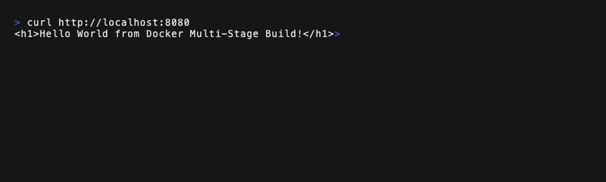
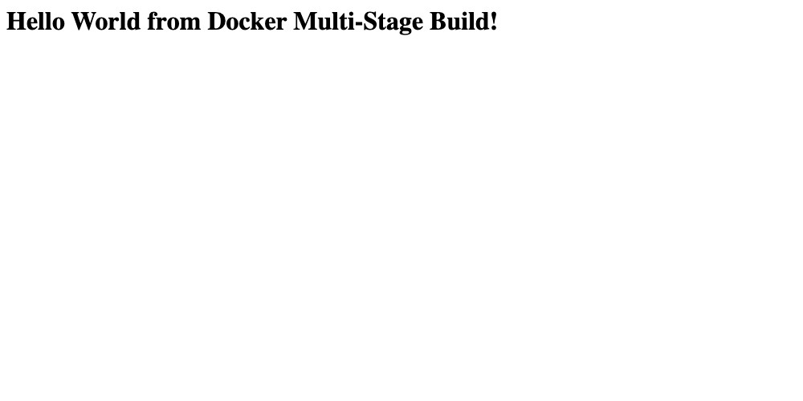
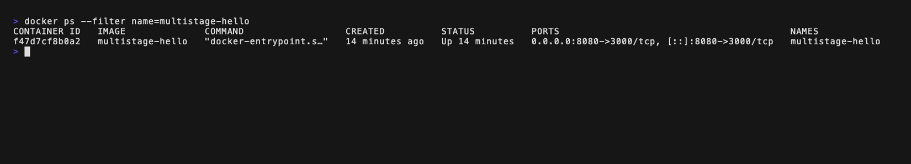
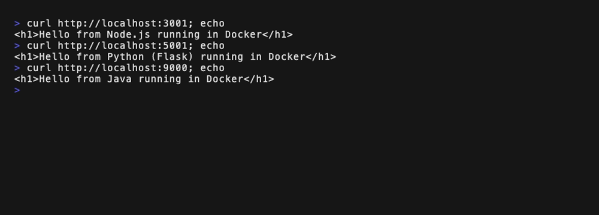
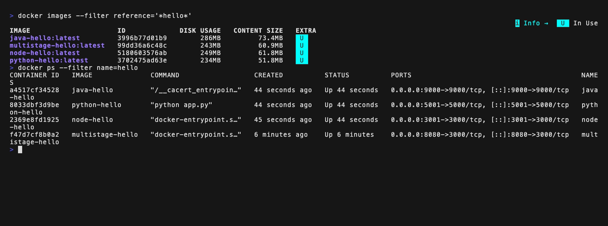

# Docker Multi-Stage Build Homework

- Name: Aditya Singhi
- Enrollment number: 24BCS10177

## Task 1: Run the multi-stage Dockerfile

The Dockerfile lives in [`../multi-stage-dockerfile/Dockerfile`](../multi-stage-dockerfile/Dockerfile). Stage 1 (`builder`) installs all npm dependencies and copies the source. Stage 2 (`production`) starts from a fresh `node:24-alpine`, installs only production dependencies and copies just `server.js` from the builder, so build tooling never reaches the final image.

The Express server inside the container listens on port 3000, so the container port 3000 is published on host port 8080.

### Commands

```bash
git clone git@github.com:Zingzy/devops-heros.git
cd devops-heros/session6-7-docker/multi-stage-dockerfile

docker build -t multistage-hello .
docker run -d --name multistage-hello -p 8080:3000 multistage-hello

curl http://localhost:8080
docker ps --filter name=multistage-hello
```

### Build output (tail)

```
#12 [production 5/5] COPY --from=builder /app/server.js ./
#12 DONE 0.0s
#13 exporting to image
#13 exporting layers 0.1s done
#13 naming to docker.io/library/multistage-hello:latest done
#13 unpacking to docker.io/library/multistage-hello:latest 0.1s done
#13 DONE 0.2s
```

### Application running

`curl http://localhost:8080` returns the expected page:

```
<h1>Hello World from Docker Multi-Stage Build!</h1>
```



The same page opened in a browser at `http://localhost:8080`:



### docker ps

```
CONTAINER ID   IMAGE              COMMAND                  CREATED         STATUS         PORTS                                         NAMES
f47d7cf8b0a2   multistage-hello   "docker-entrypoint.s…"   5 minutes ago   Up 5 minutes   0.0.0.0:8080->3000/tcp, [::]:8080->3000/tcp   multistage-hello
```



The `PORTS` column shows host port 8080 forwarded to container port 3000.

## Task 2: Documentation

This file is the documentation. Name, enrollment number and evidence for both checks are above.

## Task 3: Deploying three application types

Three small HTTP servers, one per runtime, each with its own Dockerfile in this folder.

| App | Folder | Base image | Container port | Host port | Image size |
|---|---|---|---|---|---|
| Node.js (Express) | [`node-app/`](node-app/) | `node:24-alpine` | 3000 | 3001 | 249MB |
| Python (Flask) | [`python-app/`](python-app/) | `python:3.12-slim` | 5000 | 5001 | 234MB |
| Java (built-in HttpServer) | [`java-app/`](java-app/) | `eclipse-temurin:21-jdk-alpine` to build, `eclipse-temurin:21-jre-alpine` to run | 9000 | 9000 | 286MB |

The Java image is itself a multi-stage build. The JDK stage compiles `App.java`, and only the resulting `App.class` is copied into the smaller JRE image.

### Commands

```bash
cd devops-heros/session6-7-docker/homework-multistage-build

docker build -t node-hello   ./node-app
docker build -t python-hello ./python-app
docker build -t java-hello   ./java-app

docker run -d --name node-hello   -p 3001:3000 node-hello
docker run -d --name python-hello -p 5001:5000 python-hello
docker run -d --name java-hello   -p 9000:9000 java-hello

curl http://localhost:3001
curl http://localhost:5001
curl http://localhost:9000
```

### Output

```
$ curl http://localhost:3001
<h1>Hello from Node.js running in Docker</h1>
$ curl http://localhost:5001
<h1>Hello from Python (Flask) running in Docker</h1>
$ curl http://localhost:9000
<h1>Hello from Java running in Docker</h1>
```



```
$ docker ps --filter name=hello
CONTAINER ID   IMAGE              COMMAND                  CREATED          STATUS          PORTS                                         NAMES
a4517cf34528   java-hello         "/__cacert_entrypoin…"   44 seconds ago   Up 44 seconds   0.0.0.0:9000->9000/tcp, [::]:9000->9000/tcp   java-hello
8033dbf3d9be   python-hello       "python app.py"          44 seconds ago   Up 44 seconds   0.0.0.0:5001->5000/tcp, [::]:5001->5000/tcp   python-hello
2369e8fd1925   node-hello         "docker-entrypoint.s…"   45 seconds ago   Up 44 seconds   0.0.0.0:3001->3000/tcp, [::]:3001->3000/tcp   node-hello
f47d7cf8b0a2   multistage-hello   "docker-entrypoint.s…"   6 minutes ago    Up 6 minutes    0.0.0.0:8080->3000/tcp, [::]:8080->3000/tcp   multistage-hello
```



### Cleanup

```bash
docker rm -f multistage-hello node-hello python-hello java-hello
```
