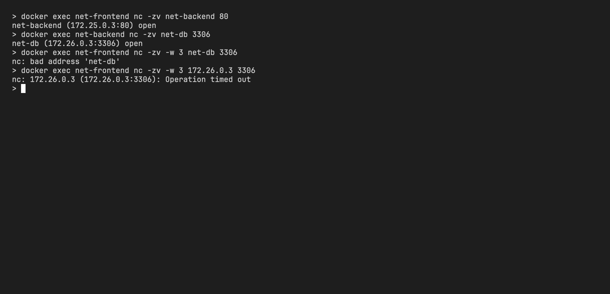
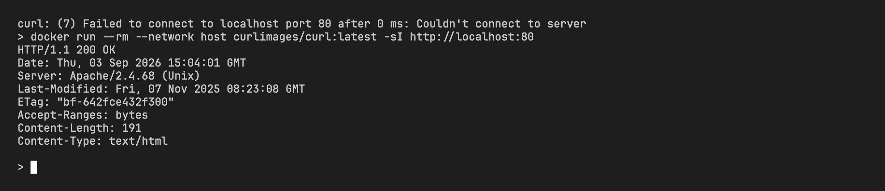
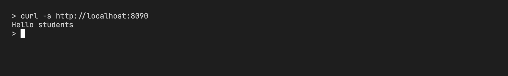
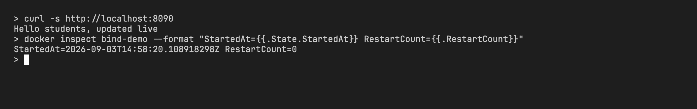
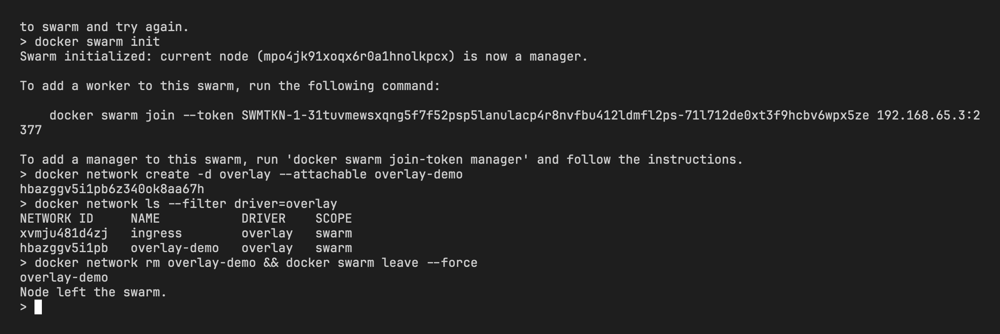

# Docker Networking and Volume Homework

- Name: Aditya Singhi
- Enrollment number: 24BCS10177

All commands below were run on Docker Desktop for Mac (engine 29.6.1). The output blocks are copied from the terminal as they came out.

## Task 1: container networking

The setup is three containers on three user defined bridge networks. The backend sits on two networks so it can talk to both sides. The frontend and the database share no network.

| Container | Image | Networks |
|---|---|---|
| net-frontend | nginx:alpine | net-a |
| net-backend | nginx:alpine | net-a, net-b |
| net-db | mysql:8 | net-b |

net-c is created but left empty, to show that a network with no members does nothing on its own.

### Commands

```bash
docker network create net-a
docker network create net-b
docker network create net-c

docker run -d --name net-frontend --network net-a nginx:alpine
docker run -d --name net-backend  --network net-a nginx:alpine
docker network connect net-b net-backend
docker run -d --name net-db --network net-b -e MYSQL_ROOT_PASSWORD=homeworkpass mysql:8
```

Output:

```
e55a862c869599913b847f37d07e1c9b17cacec877996a0fb0cb0fac43464d3c
37258276ca48a49aa6acfa5f03029ee4559605a014d0853a80fead27e6be5437
f53fdb3d9cbe3019e536615eb8ef0af5f893adc5b22782bcbf24df3070610c37
e5888d940af3baf5baf88357e9edd7192d73b43f3f1c8f0213d853ce5809d525
b4280d25be6406bd048cb643c53e10faa19bfbda017d4cd69b0b37ccce143003
46a8a37591b5a93bcb958eeed33573974346eda28a7da9c8e738e856f3a09d66
```

Checking who is on which network:

```bash
docker network ls --filter name=net-
docker ps --filter name=net- --format 'table {{.Names}}\t{{.Image}}\t{{.Status}}'
for n in net-a net-b net-c; do echo "$n: $(docker network inspect $n --format '{{range .Containers}}{{.Name}} {{end}}')"; done
docker inspect net-frontend --format '{{range $k,$v := .NetworkSettings.Networks}}{{$k}}={{$v.IPAddress}} {{end}}'
docker inspect net-backend  --format '{{range $k,$v := .NetworkSettings.Networks}}{{$k}}={{$v.IPAddress}} {{end}}'
docker inspect net-db       --format '{{range $k,$v := .NetworkSettings.Networks}}{{$k}}={{$v.IPAddress}} {{end}}'
```

```
NETWORK ID     NAME      DRIVER    SCOPE
e55a862c8695   net-a     bridge    local
37258276ca48   net-b     bridge    local
f53fdb3d9cbe   net-c     bridge    local

NAMES          IMAGE          STATUS
net-db         mysql:8        Up Less than a second
net-backend    nginx:alpine   Up 42 seconds
net-frontend   nginx:alpine   Up 42 seconds

net-a: net-backend net-frontend
net-b: net-db net-backend
net-c:

net-a=172.25.0.2
net-a=172.25.0.3 net-b=172.26.0.2
net-b=172.26.0.3
```

The backend has two IP addresses, one per network. That is the whole trick behind this task.

### Connectivity checks

The nginx:alpine image ships with busybox, so `getent`, `nc` and `ping` are all available without installing anything.

Frontend to backend (both on net-a):

```bash
docker exec net-frontend getent hosts net-backend
docker exec net-frontend nc -zv net-backend 80
docker exec net-frontend ping -c 2 net-backend
```

```
172.25.0.3        net-backend  net-backend
net-backend (172.25.0.3:80) open
PING net-backend (172.25.0.3): 56 data bytes
64 bytes from 172.25.0.3: seq=0 ttl=64 time=0.362 ms
64 bytes from 172.25.0.3: seq=1 ttl=64 time=0.451 ms

--- net-backend ping statistics ---
2 packets transmitted, 2 packets received, 0% packet loss
round-trip min/avg/max = 0.362/0.406/0.451 ms
```

Backend to database (both on net-b). The nginx image has no mysql client, so I used `nc` against port 3306:

```bash
docker exec net-backend getent hosts net-db
docker exec net-backend nc -zv net-db 3306
```

```
172.26.0.3        net-db  net-db
net-db (172.26.0.3:3306) open
```

Frontend to database (no shared network). First by name:

```bash
docker exec net-frontend getent hosts net-db; echo "exit=$?"
docker exec net-frontend nc -zv -w 3 net-db 3306; echo "exit=$?"
docker exec net-frontend ping -c 2 -W 2 net-db; echo "exit=$?"
```

```
exit=2
nc: bad address 'net-db'
exit=1
ping: bad address 'net-db'
exit=1
```

The name does not even resolve. To rule out "it is only a DNS problem", I tried the database's real IP on net-b (172.26.0.3) directly:

```bash
docker exec net-frontend nc -zv -w 3 172.26.0.3 3306; echo "exit=$?"
docker exec net-frontend ping -c 2 -W 2 172.26.0.3; echo "exit=$?"
```

```
nc: 172.26.0.3 (172.26.0.3:3306): Operation timed out
exit=1
PING 172.26.0.3 (172.26.0.3): 56 data bytes

--- 172.26.0.3 ping statistics ---
2 packets transmitted, 0 packets received, 100% packet loss
exit=1
```



### Why each pair can or cannot talk

Every user defined bridge network is its own Linux bridge with its own subnet (net-a got 172.25.0.0/16, net-b got 172.26.0.0/16). Docker only routes traffic between containers that have an interface on the same bridge, and the embedded DNS server only answers for names on networks the asking container belongs to.

- Frontend and backend share net-a, so the frontend resolves `net-backend` to 172.25.0.3 and reaches port 80.
- Backend and database share net-b, so the backend resolves `net-db` to 172.26.0.3 and reaches port 3306.
- Frontend and database share nothing. DNS returns nothing for `net-db` from the frontend, and packets sent straight to 172.26.0.3 time out because the frontend has no interface on the 172.26.0.0/16 bridge and the Docker host does not forward between bridges.

The backend can reach both because `docker network connect` gave it a second interface. It works like a small router that only the application layer uses, which is the usual pattern for a three tier app: the frontend never gets a path to the database.

## Task 2: host network

`httpd` is the official Apache image on Docker Hub. There is no image literally named `apache2`.

```bash
docker pull httpd
docker run -d --name apache-host --network host httpd
docker ps --filter name=apache-host --format 'table {{.Names}}\t{{.Image}}\t{{.Ports}}\t{{.Status}}'
docker inspect apache-host --format 'NetworkMode={{.HostConfig.NetworkMode}} PortBindings={{.HostConfig.PortBindings}} Networks={{range $k,$v := .NetworkSettings.Networks}}{{$k}} {{end}}'
```

```
Status: Downloaded newer image for httpd:latest
43c61cd9f46d8104498428859846f4ac3c58be08e794eac3f08e3d9ef8415e32

NAMES         IMAGE     PORTS     STATUS
apache-host   httpd               Up 3 seconds

NetworkMode=host PortBindings=map[] Networks=host
```

The PORTS column is empty and there are no port bindings. With `--network host` there is nothing to map, the container shares the host's network stack and Apache listens on port 80 directly.

### What did not work: curl from the Mac terminal

```bash
curl -sS -m 5 http://localhost:80
```

```
curl: (7) Failed to connect to localhost port 80 after 0 ms: Couldn't connect to server
```

This is expected on Docker Desktop for Mac. Containers do not run on macOS itself. They run inside a small Linux virtual machine, and `--network host` means "the host network of that VM", not the Mac. Port 80 inside the VM is not port 80 on my Mac, so the Mac side curl gets connection refused. On a Linux machine with Docker Engine installed directly, the same curl would work because the container and the terminal share one kernel and one network stack.

### Verification that worked

The httpd image does not include curl either (`docker exec apache-host curl ...` failed with "executable file not found"), so I started a second throwaway container on the same host network and curled from there. Both containers see the same VM network stack, so `localhost:80` inside the helper is Apache.

```bash
docker run --rm --network host curlimages/curl:latest -sI http://localhost:80
docker run --rm --network host curlimages/curl:latest -s  http://localhost:80
```

```
HTTP/1.1 200 OK
Date: Thu, 03 Sep 2026 14:58:00 GMT
Server: Apache/2.4.68 (Unix)
Last-Modified: Fri, 07 Nov 2025 08:23:08 GMT
ETag: "bf-642fce432f300"
Accept-Ranges: bytes
Content-Length: 191
Content-Type: text/html

<!DOCTYPE HTML PUBLIC "-//W3C//DTD HTML 4.01//EN" "http://www.w3.org/TR/html4/strict.dtd">
<html>
<head>
<title>It works! Apache httpd</title>
</head>
<body>
<p>It works!</p>
</body>
</html>
```



Host networking removes the network namespace isolation. There is no NAT and no port mapping, which gives the lowest latency, but two containers cannot both listen on port 80 and the container can see every interface the host has. The Mac caveat is the practical lesson here: the "host" in `--network host` is whatever machine the Docker daemon runs on, and on Docker Desktop that is the Linux VM.

## Task 3: bind mount

The idea is to serve a folder from my laptop through nginx and edit it while the container is running.

```bash
cd /Users/zingzy/Documents/code/devops-heros/session8-docker-networking-volume/homework-networking-volume
mkdir -p bind-mount-demo/site
printf 'Hello students\n' > bind-mount-demo/site/index.html
cat bind-mount-demo/site/index.html

docker run -d --name bind-demo -p 8090:80 \
  -v "$(pwd)/bind-mount-demo/site:/usr/share/nginx/html:ro" nginx:alpine

docker inspect bind-demo --format '{{range .Mounts}}Type={{.Type}} Source={{.Source}} Destination={{.Destination}} RW={{.RW}}{{end}}'
```

```
Hello students
82c19a3fe2dec5b8f90cbd85b05dbef761ee6b12ce7c87a460b5c2df55c7f0f5
Type=bind Source=/Users/zingzy/Documents/code/devops-heros/session8-docker-networking-volume/homework-networking-volume/bind-mount-demo/site Destination=/usr/share/nginx/html RW=false
```

Before editing:

```bash
curl -s http://localhost:8090
```

```
Hello students
```



Now edit the file on the host. No docker command in between, the container keeps running.

```bash
printf 'Hello students, updated live\n' > bind-mount-demo/site/index.html
curl -s http://localhost:8090
docker ps --filter name=bind-demo --format 'table {{.Names}}\t{{.Status}}\t{{.Ports}}'
docker inspect bind-demo --format 'StartedAt={{.State.StartedAt}} RestartCount={{.RestartCount}}'
```

```
Hello students, updated live

NAMES       STATUS         PORTS
bind-demo   Up 2 seconds   0.0.0.0:8090->80/tcp, [::]:8090->80/tcp
StartedAt=2026-09-03T14:58:20.108918298Z RestartCount=0
```



A bind mount is not a copy. The container's `/usr/share/nginx/html` is the same directory as `bind-mount-demo/site` on my disk, so nginx reads the new bytes on the next request. `RestartCount=0` and the unchanged `StartedAt` show the container was never restarted between the two curls. The `:ro` flag means the container cannot write back into my folder, which is a good default for static content.

This is different from a named volume. A named volume lives under Docker's own storage and is managed by Docker. A bind mount points at a path I choose, which is what you want for local development where the editor and the server should see the same files.

## Task 4: overlay network research

### What it is

An overlay network is a virtual network that spans more than one Docker host. Containers on different physical machines get IP addresses in the same subnet and talk to each other as if they were on one switch. Docker builds it by wrapping container packets in VXLAN (UDP port 4789) and sending them over the real network between the hosts, where the other side unwraps them.

### How it differs from a bridge network

A bridge network (like net-a in Task 1) is a Linux bridge on a single host. Containers on it can only reach other containers on that same host and bridge. If you want two containers on two machines to talk, you have to publish ports and route through host IPs.

An overlay network has `Scope=swarm` instead of `Scope=local`. It hides the fact that there are many hosts. Service discovery, the embedded DNS, and the built in load balancer all work across the whole cluster, so a container on host A can `curl http://api` and land on a replica running on host B.

### What it needs

Overlay networks need a control plane that every host agrees on. In Docker this means Swarm mode. `docker swarm init` turns the daemon into a manager, and the managers keep the cluster state in an embedded Raft store. Node membership and network state spread with a gossip protocol, and the data path is VXLAN. Older setups used an external key value store (Consul, etcd, ZooKeeper); modern Docker does this internally and no external store is needed. Kubernetes solves the same problem with a CNI plugin (Flannel, Calico, Cilium) instead of Swarm.

Ports that have to be open between hosts: 2377/tcp (cluster management), 7946 tcp and udp (gossip), 4789/udp (VXLAN data).

### Typical use cases

- Containers on several hosts that need to talk without publishing ports on every machine.
- Service discovery and load balancing across a Swarm cluster, using service names instead of host IPs.
- Spreading one application across data centres or availability zones while keeping one flat container network.
- The `ingress` overlay that Swarm creates by default, which routes a published port on any node to the right replica.

### Small demonstration

I tried creating an overlay network outside Swarm first, then inside, then left the Swarm so it does not affect the other homework folders.

```bash
docker network create -d overlay overlay-demo
docker swarm init
docker network create -d overlay --attachable overlay-demo
docker network ls --filter driver=overlay
docker network inspect overlay-demo --format 'Name={{.Name}} Driver={{.Driver}} Scope={{.Scope}} Subnet={{range .IPAM.Config}}{{.Subnet}}{{end}} VXLAN_ID={{index .Options "com.docker.network.driver.overlay.vxlanid_list"}}'
docker network rm overlay-demo
docker swarm leave --force
docker info --format 'Swarm={{.Swarm.LocalNodeState}}'
```

```
Error response from daemon: This node is not a swarm manager. Use "docker swarm init" or "docker swarm join" to connect this node to swarm and try again.

Swarm initialized: current node (aaqup6u3aua1ss353gdm6yiy7) is now a manager.

cdd8f6ctz1pc1cl3epvv8vjsy

NETWORK ID     NAME           DRIVER    SCOPE
vu7m4g09jwn4   ingress        overlay   swarm
cdd8f6ctz1pc   overlay-demo   overlay   swarm

Name=overlay-demo Driver=overlay Scope=swarm Subnet=10.0.1.0/24 VXLAN_ID=4097

overlay-demo
Node left the swarm.
Swarm=inactive
```



Two things stood out. The plain daemon refuses to create an overlay at all, so the driver really is tied to Swarm. And once Swarm is on, Docker creates an `ingress` overlay network on its own and gives my network a VXLAN ID (4097), which is the tag it would use to separate my traffic from other overlays on the wire. On a single laptop this is only a shell, there is no second host to reach, which is why the rest of this task is research rather than a live test.

## State left behind

Still running after this homework:

```
net-frontend, net-backend, net-db   (Task 1)
apache-host                         (Task 2)
bind-demo                           (Task 3, port 8090)
```

Networks net-a, net-b and net-c still exist. Swarm mode was turned off again with `docker swarm leave --force`.
