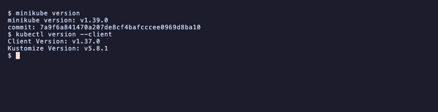
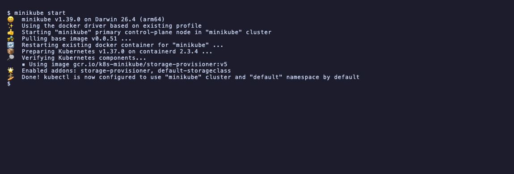
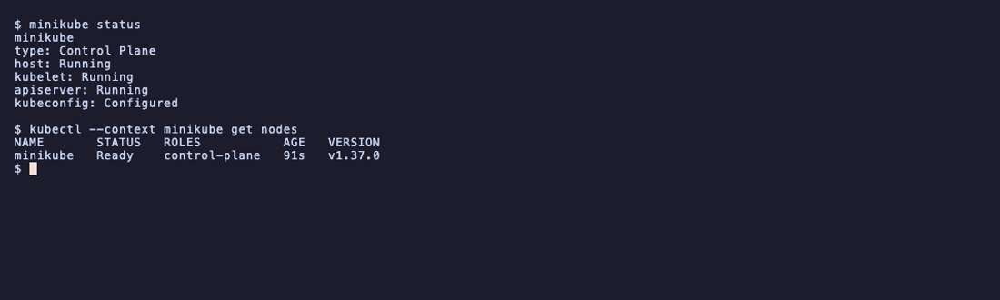
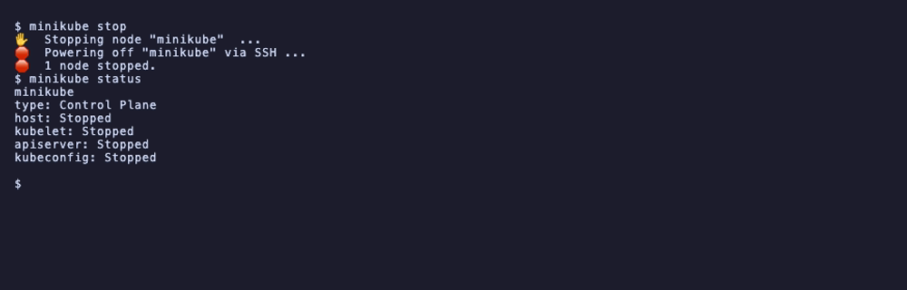
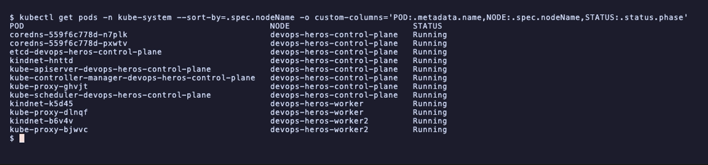
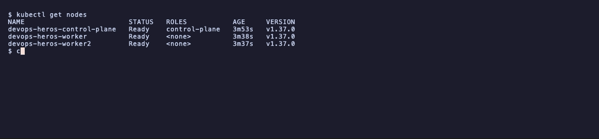

# Session 9: Kubernetes Fundamentals and Cluster Architecture

- Name: Aditya Singhi
- Enrollment number: 24BCS10177
- Course: SST DevOps and Cloud [SWE]

Tasks 1 to 4 run on minikube with the Docker driver, as set in the assignment.
Task 5 uses a 3 node kind cluster, because minikube runs a single node and a one
node cluster cannot show which components sit on the control plane and which sit
on workers. That cluster is defined in `kind-cluster.yaml` here, and sessions 10
to 12 reuse it.

Every output block is copied from the terminal as it came out.

## Task 1: minikube and kubectl installation check

Confirm both binaries are installed and report their versions.

```bash
minikube version
kubectl version --client
```

```
minikube version: v1.39.0
commit: 7a9f6a841470a207de8cf4bafcccee0969d8ba10

Client Version: v1.37.0
Kustomize Version: v5.8.1
```



Installed with `brew install minikube`. The client is v1.37.0, which matters for
Task 3, where the server reports the same version.

## Task 2: starting the minikube cluster

Bring up the single node local cluster on the Docker driver.

```bash
minikube start
```

```
* minikube v1.39.0 on Darwin 26.4 (arm64)
* Using the docker driver based on existing profile
* Starting "minikube" primary control-plane node in "minikube" cluster
* Pulling base image v0.0.51 ...
* Restarting existing docker container for "minikube" ...
* Preparing Kubernetes v1.37.0 on containerd 2.3.4 ...
* Verifying Kubernetes components...
  - Using image gcr.io/k8s-minikube/storage-provisioner:v5
* Enabled addons: storage-provisioner, default-storageclass
* Done! kubectl is now configured to use "minikube" cluster and "default" namespace by default
```



This output is from a restart, which is why it says "existing profile" and
"Restarting existing docker container". The first `minikube start` instead
downloaded the 470 MiB kicbase image and the Kubernetes preload, and printed
"Automatically selected the docker driver" and "Creating docker container".

Two lines worth noting. The runtime is containerd 2.3.4, not Docker, even though
the driver is Docker. Docker here only provides the container that acts as the
node, and inside that node containerd runs the pods. The last line means minikube
rewrote `~/.kube/config` and switched the current context, so plain `kubectl`
now points at minikube rather than any other cluster.

## Task 3: verifying cluster status and node health

Check that the control plane, kubelet and API server are up, and that the node
reports Ready.

```bash
minikube status
kubectl get nodes -o wide
```

```
minikube
type: Control Plane
host: Running
kubelet: Running
apiserver: Running
kubeconfig: Configured
```

```
NAME       STATUS   ROLES           AGE   VERSION   INTERNAL-IP    EXTERNAL-IP   OS-IMAGE                         KERNEL-VERSION             CONTAINER-RUNTIME
minikube   Ready    control-plane   13s   v1.37.0   192.168.49.2   <none>        Debian GNU/Linux 12 (bookworm)   6.12.76-linuxkit (arm64)   containerd://2.3.4
```



The node is both control plane and worker, which is why `ROLES` says
`control-plane` while pods still schedule on it. On a real cluster the control
plane node carries a `NoSchedule` taint and your pods land elsewhere.

Checked immediately after `minikube start`, the node reported `NotReady` for
about 15 seconds while the CNI came up. Ready is not instant, and scripting
against it needs `kubectl wait --for=condition=Ready`.

`192.168.49.2` is on a Docker bridge network private to the host. Session 11
Task 12 comes back to this address, because it is the reason `curl` to a NodePort
on the node IP fails on macOS.

## Task 4: stopping the minikube cluster

Shut the cluster down cleanly and confirm every component reports stopped.

```bash
minikube stop
minikube status
```

```
*  Stopping node "minikube"  ...
*  Powering off "minikube" via SSH ...
*  1 node stopped.
```

```
minikube
type: Control Plane
host: Stopped
kubelet: Stopped
apiserver: Stopped
kubeconfig: Stopped
```



`stop` powers the node off but keeps it on disk, so the next `start` restarts the
same container and the cluster state survives. `minikube delete` is the one that
throws the state away.

## Task 5: cluster architecture and core components

Based on the [Kubernetes architecture docs](https://kubernetes.io/docs/concepts/architecture/)
and checked against a live 3 node cluster.

```
+-------------------------------------------------------------------------------+
|                          CONTROL PLANE (MASTER NODE)                          |
|                                                                               |
|   +-------------------+       +--------------------+      +----------------+   |
|   |       etcd        |<----->|  kube-apiserver    |<---->| kube-scheduler |   |
|   | (cluster state)   |       |   (the only door)  |      +----------------+   |
|   +-------------------+       +---------+----------+                           |
|                                         |                                     |
|                                         v                                     |
|                            +-------------------------+                        |
|                            | kube-controller-manager |                        |
|                            +-------------------------+                        |
+-----------------------------------------+-------------------------------------+
                                          |
                        +-----------------+-----------------+
                        v                                   v
+------------------------------------+ +------------------------------------+
|            WORKER NODE 1           | |            WORKER NODE 2           |
|   +------------+  +------------+    | |   +------------+  +------------+   |
|   |  kubelet   |  | kube-proxy |    | |   |  kubelet   |  | kube-proxy |   |
|   +-----+------+  +------------+    | |   +-----+------+  +------------+   |
|         v                           | |         v                          |
|   +----------------------------+    | |   +----------------------------+   |
|   |  containerd (CRI runtime)  |    | |   |  containerd (CRI runtime)  |   |
|   +----------------------------+    | |   +----------------------------+   |
|         v                           | |         v                          |
|   +------------+  +------------+    | |   +------------+  +------------+   |
|   |   Pod 1    |  |   Pod 2    |    | |   |   Pod 3    |  |   Pod 4    |   |
|   +------------+  +------------+    | |   +------------+  +------------+   |
+------------------------------------+ +------------------------------------+
```

### Proving the split on a real cluster

Sorting kube-system by node shows exactly which component runs where:

```bash
kubectl get pods -n kube-system --sort-by=.spec.nodeName \
  -o custom-columns='POD:.metadata.name,NODE:.spec.nodeName,STATUS:.status.phase'
```

```
POD                                                  NODE                         STATUS
coredns-559f6c778d-n7plk                             devops-heros-control-plane   Running
coredns-559f6c778d-pxwtv                             devops-heros-control-plane   Running
etcd-devops-heros-control-plane                      devops-heros-control-plane   Running
kindnet-hnttd                                        devops-heros-control-plane   Running
kube-apiserver-devops-heros-control-plane            devops-heros-control-plane   Running
kube-controller-manager-devops-heros-control-plane   devops-heros-control-plane   Running
kube-proxy-ghvjt                                     devops-heros-control-plane   Running
kube-scheduler-devops-heros-control-plane            devops-heros-control-plane   Running
kindnet-k5d45                                        devops-heros-worker          Running
kube-proxy-dlnqf                                     devops-heros-worker          Running
kindnet-b6v4v                                        devops-heros-worker2         Running
kube-proxy-bjwvc                                     devops-heros-worker2         Running
```



etcd, the API server, the scheduler and the controller manager appear once, all
on the control plane node. Only kube-proxy and the CNI (kindnet here) appear
three times, once per node, because pod networking has to work everywhere.

`kubelet` is in the diagram but not in that list, because it runs as a systemd
unit on the node rather than as a pod. It is the one component that cannot be a
pod, since something has to start the pods.

```bash
kubectl get nodes
```

```
NAME                         STATUS   ROLES           AGE    VERSION
devops-heros-control-plane   Ready    control-plane   2m2s   v1.37.0
devops-heros-worker          Ready    <none>          107s   v1.37.0
devops-heros-worker2         Ready    <none>          106s   v1.37.0
```



### 1. Control plane components

**kube-apiserver.** The single entry point. It exposes the REST API, and every
request, whether from kubectl, the dashboard, or an internal controller, is
authenticated and authorised here. No other component talks to etcd directly,
which is what makes the API server the place to enforce access control and
validation.

**etcd.** A distributed key value store holding the whole cluster state, every
object spec and status. Lose etcd and you lose the cluster, which is why
production clusters back it up and run three or five members. Everything in
Kubernetes is an API object and its desired state is persisted here.

**kube-scheduler.** Watches for pods with no `spec.nodeName` set and picks a node
for each. It filters on resource requests, node selectors, affinity rules, taints
and tolerations, then scores what is left. In session 10 a pod with an impossible
memory request stays Pending because this stage finds no node that fits.

**kube-controller-manager.** Runs the control loops that compare desired state
against actual state and act on the difference. It bundles many controllers,
including the node controller (marks nodes unreachable and evicts pods), the
ReplicaSet controller (holds the replica count, demonstrated in session 10), and
the endpoints controller (keeps Service endpoint lists in step with pod IPs,
demonstrated in session 11).

### 2. Worker node components

**kubelet.** The agent on every node. It takes PodSpecs from the API server,
tells the container runtime to pull images and start containers, runs the
liveness, readiness and startup probes, and reports status and heartbeats back.

**kube-proxy.** Maintains the packet rules (iptables or IPVS) that make a Service
cluster IP work. Nothing actually listens on a cluster IP, so session 11 shows
traffic to `10.96.139.202` being rewritten to a pod IP by these rules.

**Container runtime (CRI).** The software that actually runs containers, reached
through the Container Runtime Interface. This cluster uses containerd 2.3.4.
Older Kubernetes talked to the Docker daemon through a shim, which was removed in
v1.24, so containerd and CRI-O are the normal choices now.

**Pod.** The smallest deployable unit. One or more containers that share a
network namespace, so they get one IP between them and can reach each other on
localhost, plus any shared volumes. Session 10 Task 5 uses this to run an app
container next to a logging sidecar in a single pod.

### How a pod actually gets created

1. `kubectl apply` sends the object to kube-apiserver, which validates it and
   writes it to etcd. At this point the pod exists as a record with no node.
2. kube-scheduler notices the unassigned pod, picks a node, and writes the
   binding back through the API server.
3. The kubelet on that node sees a pod assigned to it, asks containerd to pull
   the image and start the container.
4. The kubelet reports status back, and kube-proxy adds the pod's IP to the rules
   of any Service whose selector it matches.

Step 1 succeeding while step 3 fails is exactly the ImagePullBackOff case in
session 10 Task 3. The API object is valid and stored, the container just cannot
start.
